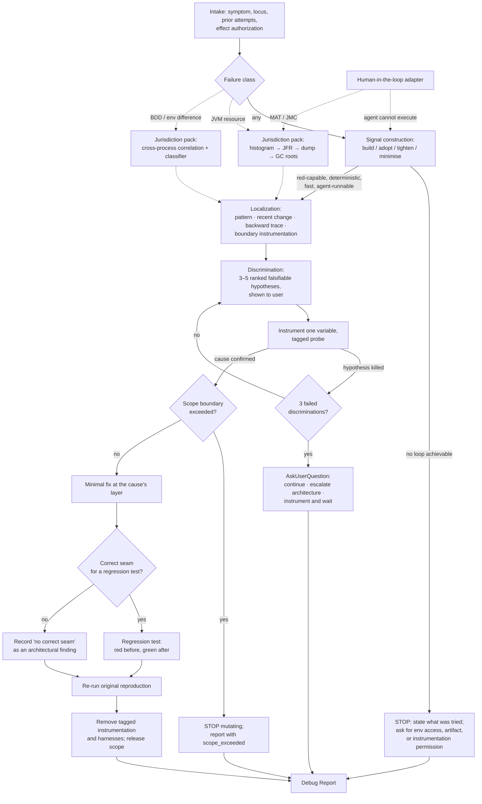

# Astra Debug — phase-0 design

**Date:** 2026-08-04 · **Superseded:** 2026-08-11 · **Status:** `superseded historical`

> **Six-skill disposition.** The public `astra-debug` interface is retired from the proposed
> roster before implementation. Causal finding authority moves to `astra-critique`'s `diagnose`
> mode; change selection moves to `astra-spec`; mutation and atomic commits move to
> `astra-implement`; independent verification remains with `astra-test`. This file is retained as
> source-accounting and preservation evidence. It changes no source claim or retirement state.

> **Authority.** `docs/design-requirements.md` governs this document; `docs/phase-0.md` owns phase
> scope and the global ledgers; `docs/design-roadmap.md` supplies the provisional roster and the
> Debug & incident neighborhood in section 5.8. This is one per-skill design. It is not an
> implemented skill, changes no ledger, installs or removes nothing, and authorizes no source
> retirement.
>
> **Conformance.** Sections 1–10 preserve the original proposed design against
> `docs/design-requirements.md` sections 7.1–7.10. Section 11 records its supersession under
> requirements section 7.11 and has normative precedence over every active-roster, repair, or
> mutation claim in the historical body. Section 9's comparison gates and source-specific
> retirement gates remain evidence obligations.
>
> **Peer reconciliation.** Debug is the last member of the initial public tranche to be designed and
> the only peer that every other completed contract still describes one-sidedly. Seven designs are
> complete: [`astra-critique`](astra-critique.md), [`astra-understand-code`](astra-understand-code.md),
> [`astra-spec`](astra-spec.md), [`astra-plan`](astra-plan.md), [`astra-implement`](astra-implement.md),
> [`astra-test`](astra-test.md), and [`astra-ship`](astra-ship.md). **Six of them carry a provisional
> Debug relation row** written with no Debug contract to reconcile against; the seventh, Critique,
> routes "Why is this failing?" out to this neighborhood in its non-trigger table. Section 7.2
> answers all six rows and states exactly which peer sentences this design accepts or narrows;
> section 7.6 records what the coordinator must change outside this file.
>
> **Blocking obligation discharged.** `astra-plan` open question 9 asks "what exact accepted
> diagnosis artifact will the future Debug design expose?" Section 2.4 defines that artifact and
> section 7.2 maps it field for field onto Plan's, Implement's, Test's, and Spec's inbound rows.
>
> **Certainty labels.** **O** = observed in an inspected artifact; **I** = inferred and still needing
> confirmation; **U** = unavailable.
>
> **Coordinator gap.** Six of the nine Debug & incident collision rows are assigned to this design.
> Three (`cm-debug-and-incident-01`, `-02`, `-03`) are `unclaimed` / `unassigned` with evidence
> "Pending source inspection"; the other three (`-06`, `-07`, `-08`) are in the same state (**O**,
> `docs/phase-0-ledgers.md` lines 151–158). Section 3.4 proposes the exact reconciliations, including
> one that **moves an allocation out of this design**. Only the phase-0 coordinator may apply them.

---

## 1. Identity and status

| Field | Value |
|---|---|
| Provisional Astra name | `astra-debug` |
| Status | `superseded historical` — source-accounting record, not a public roster member |
| Priority | `now` |
| Candidate neighborhoods | Debug & incident (primary); Testing and Ship & VCS inspected as evidence, no primary claimed |
| User job | **When I want an observed failure explained by proven cause and then closed by the smallest change that demonstrably removes it.** |
| Critique handoff acceptance | Historical only; causal authority is now internal to `astra-critique` and crosses downstream through `C` consultation |

**The job expresses one outcome.** A closed failure is a single result with an indivisible internal
dependency: the fix is *of the proven cause*, and the proof that it is gone is the same evidence
loop that proved the cause. All three general sources encode exactly this as a hard law —
`investigate` and `superpowers:systematic-debugging` state it identically as "NO FIXES WITHOUT ROOT
CAUSE INVESTIGATION FIRST" (**O**), and `diagnosing-bugs` refuses to advance past Phase 1 without a
red-capable command (**O**). Splitting diagnosis from repair would produce a skill whose deliverable
is a hypothesis nobody is obliged to confirm, which is the failure mode all three sources exist to
prevent.

**Where the outcome stops.** Debug closes the failure it was given. It does not take on the
adjacent work the fix suggests. Section 6.5 defines the scope boundary in effect terms, and section
7.2 routes everything past it to `astra-plan` and `astra-implement`. This is the mirror image of the
narrowing `astra-implement` section 3.3 already accepted — Implement repairs when cause and fix are
both inside an approved task and otherwise routes to Debug; Debug repairs when the fix is inside the
failure's own scope and otherwise routes to Plan and Implement. The two rules meet without a gap and
without an overlap.

**Name and promise.** `astra-debug` is the causal loop. `astra-test` produces evidence that
something is or is not true; `astra-understand-code` explains what exists; `astra-critique` judges;
`astra-implement` executes approved change; the deferred `astra-incident` stabilizes a live outage.
Debug is the only peer whose deliverable is a **causal claim backed by a reproduction that goes red
before the fix and green after it**.

The initial public tranche remains exactly `astra-critique`, `astra-understand-code`, `astra-spec`,
`astra-plan`, `astra-implement`, `astra-test`, `astra-debug`, and `astra-ship`.

**Personal value: explicit, with one honest qualification.** The user selected `astra-debug` as one
of exactly eight skills in the initial public tranche, and every one of the other seven completed
designs names it as a required destination — the strongest cross-design demand recorded for any peer
in the roster. That is the load-bearing evidence.

The qualification is that `README.md` records **0 invocations** across all nine Debug & incident
entries in the July 2026 transcripts (**O**). Under `docs/design-requirements.md` section 3, usage
informs priority and never decides usefulness, so zero usage does not weaken the claim — but it does
mean no behavioral preference between the six sources can be inferred from how the user has actually
worked. Section 4.5's three-way policy conflict therefore cannot be settled by observed practice and
must be settled by the section 9 comparison or by the user. This design does not disguise a
roadmap-derived default as a user preference.

---

## 2. Interface and scope

### 2.1 Requests that should trigger it

- "Why is this failing?", "debug this", "find the root cause", "this used to work" — a named failure
  with an unknown cause.
- "This test fails and I don't know why" — a red result whose cause has not been established.
- "It works locally but fails in staging" — an environment-difference failure.
- "Memory keeps climbing / we're getting OOM" — a resource-exhaustion failure with an unknown owner.
- "This is intermittent, it fails maybe one run in five" — a non-deterministic failure.
- "This got slower and I don't know what changed" — a performance regression, which every general
  source claims and only one has a method for (section 5.6).
- "Three attempts have not fixed it" — an explicit re-entry after failed repair attempts.

### 2.2 Nearby requests that should not

| Request | Correct owner or prerequisite | Why it is outside Debug |
|---|---|---|
| "Explain how this subsystem works" | `astra-understand-code` | Comprehension has no failure and no causal claim; Debug consumes a map, it does not produce one |
| "Is this code any good?" / "review this diff" | `astra-critique` | Judgment against a standard is not causal explanation of an observed failure |
| "Write tests for this module" | `astra-test` | Debug builds a reproduction to *catch one bug*; a test suite is a different artifact with a different owner |
| "Run the suite and tell me if it's green" | `astra-test` | Execution and evidence reporting are Test's job; Debug enters only when a result is red and unexplained |
| "Implement this plan" / "build this feature" | `astra-plan`, `astra-implement` | Debug's only authorized mutation is the minimal fix its own proven cause implies |
| "Refactor this so it stops breaking" | `astra-plan` then `astra-implement` | Structural change exceeds the failure's scope; see section 6.5 |
| "Production is down right now" | deferred `astra-incident` | Stabilization precedes and outranks explanation; roadmap section 5.8 keeps these distinct — see section 4.4 |
| "Deploy the fix to staging and verify it there" | deferred `astra-deploy` | Build, push, and cluster mutation are publication effects; see section 3.4's `staging-debug` proposal |
| "Open the PR for this fix" | `astra-ship` | Publication is a separate authorization surface |
| "What should this feature do?" | `astra-spec` | A cause never redefines intent; `sdd`'s principle, adopted by `astra-spec` section 6.5 |
| "Make the flaky test less flaky by adding a retry" | `astra-test`, or Debug only if the flake is the failure under investigation | Suppressing a signal is not explaining it |

### 2.3 Required intake contract

An invocation must supply or make resolvable:

1. the **observed symptom** in the user's own terms — what happened, what was expected, and how the
   difference was noticed;
2. the **locus**: repository and revision, service or component, environment (local, staging, CI,
   production-observed), and whether the checkout is dirty;
3. **any reproduction that already exists** — a command, a failing test, a request, a log excerpt, a
   captured artifact — and its reliability, if known;
4. the **change context**: whether this ever worked, and if so the last known-good state;
5. the **effect authorization**: whether Debug may instrument, may write a fix, may run project
   commands, and which paths are in scope; and
6. **prior attempts**: what has already been tried and what happened, because the 3-strike rule in
   section 6.4 counts against the whole failure, not against one session.

Missing items are recorded as gaps, not guessed. Item 3 absent is normal — constructing it is the
first phase, not a precondition. Item 5 absent means Debug runs in read-only evidence mode and stops
before any fix.

### 2.4 User-visible result

One artifact, the **Debug Report**, with a fixed spine. This is the exact artifact `astra-plan` open
question 9 asks for, and the payload every peer row in section 7.2 draws from:

| Field | Content | Certainty rule |
|---|---|---|
| `symptom` | The failure as the user described it, not as Debug reinterpreted it | Quoted from intake |
| `reproduction` | The exact command or procedure, its reliability, and its output | **Observed only.** A reproduction that was never run is recorded as absent |
| `cause` | The single causal claim, at the layer where it originates | Labeled `proven`, `probable`, or `unestablished` |
| `evidence` | The instrumented or measured facts that discriminate this cause from the rejected ones | Each item observed, with its anchor |
| `rejected_hypotheses` | Every hypothesis tested and the evidence that killed it | Observed |
| `fix` | What changed, with `file:line` anchors, or `none` | Observed |
| `verification` | Reproduction re-run after the fix, with output — red-before / green-after | **Observed only.** Never "should now work" |
| `regression_guard` | The regression test and its location, **or** the explicit finding that no correct seam exists | Observed, including the negative form |
| `residue` | Instrumentation added, prototypes created, state mutated, and whether each was removed | Observed |
| `scope_exceeded` | What the cause implies that Debug did not do, and which peer owns it | Inferred, named |
| `acceptance_ref` | An identifier for the user's acceptance of this diagnosis, or `null` when the user has not accepted it | **Recorded only when it happened.** Never inferred from conversation, and never written by Debug on its own authority |
| `status` | `CLOSED`, `CLOSED_WITH_CONCERNS`, `BLOCKED`, or `ESCALATED_ARCHITECTURE` | — |

`cause: unestablished` with `status: BLOCKED` is a complete, successful, deliverable result. Three of
the six sources say so explicitly (**O**), and section 5.8 records the language each uses.

**Why `acceptance_ref` exists.** `astra-plan` section 7.1 names six required inbound fields and
section 2.5 makes the sixth load-bearing: accepted Debug evidence "must identify the diagnosed
cause, evidence, affected contract, remediation constraint, and **user acceptance of the
diagnosis**." Acceptance is a user act in conversation — this design keeps it that way, since
section 2.6 item 2 reserves the decision to the user — but without a field carrying its *record*,
a faithful Plan implementation handed a Debug Report must either block or infer acceptance from
conversation, and inferring is precisely what Plan forbids itself elsewhere. The field mirrors
`astra-spec`'s `approval.decision_ref` pattern: the artifact carries the record, not the decision.
Plan validates it at intake. `null` is the honest default and blocks nothing that was not already
blocked. Added by roadmap amendment 6; it closes the one real payload mismatch the tranche
reconciliation found on this seam.

### 2.5 Effect authority and non-goals

Debug is the only tranche peer whose home jurisdiction *requires* it to mutate the project before it
knows the answer — instrumentation is evidence-gathering, not repair. That makes the effect boundary
the design's central authority problem rather than a footnote.

**Authorized, when the user grants it:** adding and removing tagged instrumentation; running project
commands and test invocations; writing throwaway reproduction harnesses; and the minimal fix its own
proven cause implies, inside the declared scope.

**Explicitly not goals:**

- diagnosing from symptoms without a reproduction, when one was achievable;
- structural or architectural change — that is `ESCALATED_ARCHITECTURE`, not a Debug deliverable;
- authoring a test suite, or judging code quality;
- any irreversible shared-environment effect: image build and push, cluster deployment, environment
  restore, PR creation, branch publication (section 3.4);
- writing another peer's state — including `astra-guard`'s freeze file, which one source does today
  (section 4.6);
- claiming a fix works without re-running the reproduction; and
- leaving instrumentation, harnesses, or scope locks behind silently.

### 2.6 Decisions that remain with the user

1. Whether Debug may mutate anything at all, and within which paths.
2. Whether a `probable` cause is accepted, or more evidence is required.
3. Which hypothesis to test first, when the ranked list is presented and the user has domain
   knowledge that re-ranks it.
4. What happens at the 3-strike boundary: continue, escalate to architecture, or instrument and wait.
5. Whether a fix whose blast radius exceeds the failure's scope proceeds as a Plan, is split, or is
   abandoned.
6. Whether an unavailable prerequisite is installed, worked around, or accepted as a degradation.
7. Whether the failure is a Debug problem at all, or an incident requiring stabilization first.

---

## 3. Source evidence and proposed ledger changes

### 3.1 Occurrence inspection record

All six occurrences were inspected on 2026-08-04 from their bodies, frontmatter, registrations,
bundled components (following symlinks, per roadmap section 6.1's fourth question), consumed
resolvers, declared prerequisites, and failure paths. Section 10.2 holds the immutable index.

| Occurrence | Source | Component type | Location and availability | Invocation | Declaration highlights |
|---|---|---|---|---|---|
| `cm-debug-and-incident-01` | `investigate` | skill (gstack, **generated**) | `~/.claude/skills/investigate/` — a plain directory whose `SKILL.md` is **byte-identical** to `~/.claude/skills/gstack/investigate/SKILL.md`; authored template at `gstack/investigate/SKILL.md.tmpl`. Live | `/investigate` | `version: 1.0.0`; `preamble-tier: 2`; `allowed-tools` Bash, Read, Write, Edit, Grep, Glob, AskUserQuestion, WebSearch; **two `PreToolUse` hooks** on `Edit` and `Write`; a `gbrain:` block with `schema: 1` and three `context_queries`; five explicit `triggers` |
| `cm-debug-and-incident-02` | `diagnosing-bugs` | skill (personal, `~/.agents`) | `~/.claude/skills/diagnosing-bugs` → `~/.agents/skills/diagnosing-bugs`. Live | `/diagnosing-bugs` | `name` and `description` only — no tool declaration, no version, no hooks |
| `cm-debug-and-incident-03` | `superpowers:systematic-debugging` | skill (plugin) | `~/.claude/plugins/cache/claude-plugins-official/superpowers/**6.2.0**/skills/systematic-debugging/`. Live | `superpowers:systematic-debugging` | `name` and `description` only. **An orphaned 6.1.1 copy is also on disk** — see section 3.2 |
| `cm-debug-and-incident-06` | `java-leak-resolver` | skill (project, monster-prompt) | `~/.claude/skills/java-leak-resolver` → `MP/claude/skills/java-leak-resolver`. Live | `/java-leak-resolver` | `effort: xhigh` — an unfamiliar field, recorded per requirements section 4.1; nine-clause `description`; no tool declaration |
| `cm-debug-and-incident-07` | `staging-debug` | skill (project, monster-prompt) | `~/.claude/skills/staging-debug` → `MP/claude/skills/staging-debug`. Live | `/staging-debug` | `name` and block `description` with five triggers; no tool declaration; no bundled components |
| `cm-debug-and-incident-08` | `local-debug` | skill (project, monster-prompt) | `~/.claude/skills/local-debug` → `MP/claude/skills/local-debug`. Live | `/local-debug` | `effort: xhigh`; block `description` with seven triggers; no tool declaration |

### 3.2 Bundled components, external machinery, and version pinning

Roadmap section 6.1's fourth question — *what does the source ship?* — is answered here. This
neighborhood ships **23 bundled files, 8 executables, and 0 binary assets**, an order of magnitude
smaller than Wave 1's census but with two component classes Wave 1 did not contain: a behavioral
test corpus, and a human-in-the-loop driver.

| Source | Bundled files | Executables | Notes |
|---|---:|---:|---|
| `superpowers:systematic-debugging` | 10 | 1 | 3 declared technique references; `find-polluter.sh` (declared only inside `root-cause-tracing.md:101`, never in `SKILL.md`); one TypeScript example; **4 behavioral test files**; one `CREATION-LOG.md` |
| `java-leak-resolver` | 8 | 5 | 5 Python programs, 2 JSON scenario assets, 1 methodology reference |
| `local-debug` | 3 | 1 | `run_feature_test.sh` plus 2 references |
| `diagnosing-bugs` | 2 | 1 | `hitl-loop.template.sh`; `agents/openai.yaml` is **interface metadata, not an invocable agent** — the classification `astra-product-design` established for `prototype/agents/openai.yaml` under roadmap amendment 4 |
| `investigate` | 0 | 0 | Ships nothing; reaches sideways into gstack (below) |
| `staging-debug` | 0 | 0 | Ships nothing; delegates to three external commands |
| **Total** | **23** | **8** | |

Counts follow roadmap amendment 3 section 10.3's convention: executables are `.sh`, `.cjs`, `.js`,
`.mjs`, and `.py` including tests; binary assets are `.pdf`, `.png`, `.ttf`, and `.otf`.
`condition-based-waiting-example.ts` is therefore a **code asset outside that extension list**, not an
eighth executable — but it is still a component under requirements section 4.3 and section 7.5 gives
it a disposition. Two of the eight executables (`find-polluter.sh`, `hitl-loop.template.sh`) are
tools the agent invokes rather than workflow steps.

**`investigate`'s external machinery, which the roadmap never recorded (O).** The source ships no
components of its own and instead depends on five gstack artifacts outside its directory:
`bin/gstack-learnings-search`, `bin/gstack-learnings-log`, `bin/gstack-paths`, and — through both
`PreToolUse` hooks and an inline Scope Lock step — `../freeze/bin/check-freeze.sh`. This is the exact
shape roadmap amendment 2 named **the `guard` lesson**: a live registration containing only a
`SKILL.md` whose implementation lives in a sibling. Section 4.6 records the authority consequence,
which is more serious than the packaging one.

**Generated-versus-authored, applying amendment 4 (O).** `investigate`'s live `SKILL.md` is 1074
lines; its authored template is **259**. The 815-line difference is five resolver expansions —
`{{PREAMBLE}}` (tier 2, composed from 24 generator modules under `scripts/resolvers/preamble/`),
`{{GBRAIN_CONTEXT_LOAD}}`, `{{LEARNINGS_SEARCH}}`, `{{LEARNINGS_LOG}}`, `{{GBRAIN_SAVE_RESULTS}}` —
all maintained upstream in the gstack generator. Under roadmap amendment 4 section 11.2 that volume
is **provenance, not merger evidence**, and this design makes no maintenance claim from it. There is
no second gstack source in this neighborhood, so no authored-template intersection is measurable and
none is asserted.

**Version pinning, the `loop-goal` problem recurring (O).** Two `systematic-debugging` copies are on
disk. `installed_plugins.json` pins **6.2.0** (`gitCommitSha eafe962b18f6c5dc70fb7c8cc7e83e61f4cdde06`);
**6.1.1 is orphaned**. They are not equivalent, and the delta is behavioral rather than cosmetic:
6.1.1 carries a "Real-World Impact" block asserting "15-30 minutes to fix" versus "2-3 hours of
thrashing", a "95% vs 40%" first-time fix rate, and a "Related skills" list. **6.2.0 deleted all of
it** and moved the `verification-before-completion` reference inline. Those figures are unsourced
efficacy claims that upstream withdrew; a merger that reads the wrong copy would re-import marketing
as method. The ledger schema still has no version field — the same gap roadmap amendment 2 recorded
for `loop-goal` — so section 3.4 pins the version in the evidence cell.

**Unmet declared prerequisites (O).** `context-mode` is declared by `local-debug` as "Required for
Autonomous Debug" and by `staging-debug` as "Recommended". It is **not installed**: absent from the
plugin cache, from `installed_plugins.json`, and from `known_marketplaces.json`. Both sources ship an
explicit fallback (Bash with aggressive filtering; `rg` + `Read`), so this is a **declared
prerequisite that is currently unmet with a declared degradation** — the `nightnight` shape, not the
`prompt-lookup` shape. It is not grounds for exclusion. Separately, `local-debug`'s AUTONOMOUS branch
keys on `.claude/ralph-loop.local.md`, and `ralph-loop:ralph-loop` remains uninstalled (confirmed
again here); absence resolves cleanly to INTERACTIVE, so this degrades correctly.

### 3.3 Disposition and contribution

Contribution categories are from `docs/design-requirements.md` section 5.

| Source | Primary disposition | Proposed primary home | Contribution | Secondary roles |
|---|---|---|---|---|
| `investigate` | proposed Astra design | `astra-debug` | **Perspective** (evidence-first hypothesis from code and history), **protocol** (5 phases), **playbook** (pattern table, sanitized external search, blast-radius gate), **machinery** (report shape, learnings logging), **prerequisite** (gbrain, gstack binaries) | `astra-guard` — its scope-lock step writes Guard-owned state (section 4.6) |
| `diagnosing-bugs` | proposed Astra design | `astra-debug` | **Perspective** (loop-first, multi-hypothesis, seam-conditional regression), **playbook** (10 loop constructions, minimisation, tagged instrumentation, perf branch), **protocol** (6 phases), **prerequisite** (HITL driver) | `astra-understand-code` — its Phase 6 hands off to `improve-codebase-architecture`, an Understand Code source (**O**) |
| `superpowers:systematic-debugging` | proposed Astra design | `astra-debug` | **Perspective** (single-hypothesis, minimal-change, unconditional failing test), **playbook** (component-boundary instrumentation, backward tracing, defense-in-depth, condition-based waiting), **machinery** (rationalization and red-flag tables), **reference** (3 technique files + a behavioral corpus) | `astra-test` — its Phase 4 defers failing-test authoring to `superpowers:test-driven-development` (**O**) |
| `java-leak-resolver` | proposed Astra design | `astra-debug` | **Jurisdiction** (JVM heap and allocation), **playbook** (baseline → load → compare → dump → GC-roots), **prerequisite** (JDK/jcmd, Gradle, Python, MAT, JMC, async-profiler), **machinery** (5 programs, report generator) | — |
| `local-debug` | proposed Astra design | `astra-debug` | **Playbook** (cross-repo log correlation, timestamp windowing, multi-round regression tracking), **jurisdiction** (Spring Boot + Behave BDD pair), **machinery** (`run_feature_test.sh`, which is also a **config oracle** — Step 1 instructs reading it for defaults), **prerequisite** (tmux, poetry, pyenv, tunnel, context-mode) | `astra-test` — Steps 1–3 are BDD test execution, which Test's jurisdiction covers |
| `staging-debug` | proposed Astra design | **`astra-deploy`** *(moved — see 3.4)* | **Playbook** (environment-difference classification), **machinery** (deploy/restore pipeline), **prerequisite** (AWS, Docker, kubectl, helmfile, helm-charts repo) | **`astra-debug`** (diagnosis slice), `astra-test`, `astra-ship` |

### 3.4 Exact proposed collision-ledger changes

All six rows currently read `unassigned` / `unassigned` / `unclaimed` (**O**). The coordinator alone
applies these; each becomes `claimed`, never `resolved`.

| Occurrence ID | Source | Proposed primary disposition | Proposed primary home | Proposed secondary roles | Proposed evidence cell |
|---|---|---|---|---|---|
| `cm-debug-and-incident-01` | `investigate` | proposed Astra design | `astra-debug` | `astra-guard` (writes freeze state; §4.6) | This design §3.1–3.3, §4.6. **Authored template is the oracle**, not the generated `SKILL.md`; gstack `a3259400`, VERSION 1.60.1.0 |
| `cm-debug-and-incident-02` | `diagnosing-bugs` | proposed Astra design | `astra-debug` | `astra-understand-code` (Phase 6 handoff to `improve-codebase-architecture`) | This design §3.1–3.3, §5.2. `~/.agents` is not a git repository, so the content hash is the sole provenance record |
| `cm-debug-and-incident-03` | `superpowers:systematic-debugging` | proposed Astra design | `astra-debug` | `astra-test` (defers failing-test authoring to `superpowers:test-driven-development`) | This design §3.1–3.3, §5.3. **Pin 6.2.0** (`eafe962b…`); the orphaned 6.1.1 carries withdrawn efficacy claims and must not be the oracle |
| `cm-debug-and-incident-06` | `java-leak-resolver` | proposed Astra design | `astra-debug` | — | This design §3.1–3.3, §5.5. monster-prompt `6abccfa5`; 5 executables and 2 assets require explicit disposition (§7.5) |
| `cm-debug-and-incident-07` | `staging-debug` | proposed Astra design | **`astra-debug` → `astra-deploy`** | **`astra-debug`** (Steps 5–6 environment-difference diagnosis), `astra-test` (Step 4), `astra-ship` (Step 7 `/pr`) | This design §4.3. **Allocation changed from roadmap §5.8**; Deploy is unwritten, so this is provisional from Debug's side and the coordinator arbitrates |
| `cm-debug-and-incident-08` | `local-debug` | proposed Astra design | `astra-debug` | `astra-test` (Steps 1–3 BDD execution) | This design §3.1–3.3, §4.3, §5.7 |

**Why `staging-debug` moves.** Its eight numbered steps divide as: Step 1 config discovery (shared);
Steps 2, 3, 8 **build a Docker image, push it to ECR account 471112919450, `helmfile apply` to a
shared staging EKS cluster, and later restore that cluster to `latest`**; Step 4 runs Behave and
explicitly *"Delegate[s] to `/local-debug`"*; Steps 5–6 analyze logs and classify root cause; Step 7
*"Delegate[s] to `/pr`"* (all **O**). Three of the four largest steps and **every irreversible
effect in the source** are deployment effects on a shared environment other people use. Its
diagnosis slice — Steps 5–6 — is a near-duplicate of `local-debug`'s Step 5 classifier, differing
only in that infrastructure signals shift from tunnels and AWS profiles to IAM, DynamoDB, and
connection errors.

Under roadmap amendment 3's precedent, an umbrella that decomposes takes a **coordinating primary
home** so the ledger schema stays valid, and the coordinating home should be the peer holding the
largest coherent share. Here that is Deploy, and the choice is not merely arithmetic: the
coordinating home should be the peer that must own the *authority risk*, and this source's risk is
entirely in the cluster mutation. Debug claims the diagnosis slice as a named secondary role and
contests nothing else.

The counter-argument is recorded rather than suppressed: the source's **name and every one of its
five triggers are debug-shaped** ("staging test failing", "fix staging", "debug staging"), and its
user job begins with a failing test. A coordinator who weights trigger surface over effect surface
would keep it here. This design's position is that roadmap section 6.1's third question — *does the
label match the body?* — was written for exactly this case, and the body is a deployment pipeline.

### 3.5 Proposed reference-and-cleanup-ledger changes

No new reference rows are proposed. Debug consumes two existing rows and proposes only
`consuming_designs` updates, per requirements section 7.7:

| Source | Existing row | Proposed `consuming_designs` update |
|---|---|---|
| `codebase-design` | independent reference; currently `astra-understand-code`, `astra-implement` | **Add `astra-debug`.** Section 6.5's scope boundary and section 5.2's "no correct seam" finding both use its `seam` and `depth` vocabulary, matching the usage `astra-plan` already established |
| `nowhat` | independent reference (roadmap amendment 2) | **No claim.** Its outcome is changing reasoning direction, not causal explanation. Recorded here only because its trigger list ("stuck", "going in circles", "why does this keep failing") is the nearest live collision with section 2.1's re-entry trigger — see section 7.4 |

### 3.6 Occurrences owned by peers that name this design

Recorded so the coordinator can see every edge without opening seven files. None is claimed here.

| Occurrence / peer artifact | Owner | What it says about Debug |
|---|---|---|
| `cm-debug-and-incident-04` `rca`, `-05` `firefighting` | `astra-incident` (claimed) | Concurrent stabilization and causal contexts with mutually exclusive authority; `firefighting` spawns `rca` via `Agent(...)`. Section 4.4 reconciles the boundary from Debug's side |
| `cm-debug-and-incident-09` `triage` | relocation pending | Issue-tracker state machine, misfiled on a keyword by roadmap amendment 1. Debug does not claim it and has no view on Ship-versus-independent |
| `cm-codebase-comprehension-04` `improve-codebase-architecture` | `astra-understand-code` | `diagnosing-bugs` Phase 6 hands off to it by name (**O**). Section 6.4 preserves that as an outbound route, never an absorption |
| `astra-implement` §7.2, §3.3 | `astra-implement` | Bidirectional user-mediated **I**; the remediation-scope narrowing this design mirrors in section 1 |
| `astra-test` §7.3 | `astra-test` | Bidirectional **I**; Test → Debug reproduction packet, Debug → Test fix snapshot and regression target |
| `astra-plan` §7.2 row + open question 9 | `astra-plan` | Inbound accepted diagnosis for repair planning; asks for the artifact section 2.4 defines |
| `astra-understand-code` §7.2 | `astra-understand-code` | Understand → Debug code map or trace; explicitly not a cause |
| `astra-ship` §7.2 | `astra-ship` | Ship → user → Debug on publication-stage failure with unknown cause |
| `astra-spec` §7.2 | `astra-spec` | Debug → Spec when a cause reveals requirement ambiguity |
| `astra-critique` §1 non-trigger table | `astra-critique` | "Why is this failing?" is routed out of Critique to Debug & incident — "diagnosis, not judgment" |

---

## 4. Collision analysis

### 4.1 Why these sources appeared duplicative

Three of the six are general debugging workflows with near-identical surface: numbered phases, a
root-cause-before-fix law, a hypothesis step, a fix step, and a verification step. Two of them state
the law in **identical words** — "NO FIXES WITHOUT ROOT CAUSE INVESTIGATION FIRST" — and
`investigate`'s own description advertises "Four phases", the exact count
`superpowers:systematic-debugging` uses. Reading descriptions alone, they look like one skill
installed three times.

The other three share the word "debug" in their names and sit in the same neighborhood because
`README.md` grouped them there.

### 4.2 What behavior is genuinely shared

Real, and confirmed from bodies rather than declarations:

- **The Iron Law.** All three general sources refuse a fix before a cause. This is the neighborhood's
  actual common core (**O**).
- **The 3-strike architecture boundary.** `investigate` stops at 3 failed hypotheses;
  `superpowers:systematic-debugging` stops at 3 failed fixes and both name the same conclusion —
  *wrong architecture, not wrong code*. `investigate` phrases it "3+ failed fix attempts → STOP and
  question the architecture"; systematic-debugging, "This is NOT a failed hypothesis - this is a
  wrong architecture." `local-debug` independently reaches the same threshold: "Same scenario fails
  3+ times with different fix attempts → stop and re-analyze root cause from scratch" (**O**). Three
  sources, three lineages, one number.
- **The test-side / server-side / infrastructure classifier.** `local-debug` Step 5 and
  `staging-debug` Step 6 use the same three buckets with the same downstream meaning — the class
  determines what must be restarted before retesting (**O**).
- **Rejecting guesswork under pressure.** systematic-debugging's rationalization table,
  `investigate`'s red flags, and `diagnosing-bugs`'s "no red-capable command, no Phase 2" are three
  encodings of one commitment.

### 4.3 Apparent duplicates that are different jobs

- **`staging-debug` is a deployment pipeline.** Section 3.4 records the evidence and the proposed
  move. Its Debug content is two of eight steps.
- **`local-debug`'s Steps 1–3 are test execution.** The source itself marks the boundary: Step 4
  opens with *"This is where AI provides the most value"* (**O**) — the author's own statement that
  the pipeline is scaffolding and the analysis is the product. Steps 1–3 stay with the source as a
  retained executable and a Test secondary role; Steps 4–5 are the Debug claim.
- **`java-leak-resolver` is not a general debugger with a Java flavor.** It never forms hypotheses
  about program logic. It measures retained heap, compares histograms, and traces GC roots to an
  owning field. That is a jurisdiction with its own evidence physics, and section 5.5 records the
  distinction that matters most: *"Don't confuse high allocation with leaks: allocation rate ≠ leak;
  retained heap after GC = leak"* (**O**) — a discriminator no general source contains.

### 4.4 The Incident boundary, from Debug's side

Roadmap section 5.8 separates Debug from Incident, and amendment 1 established that `rca` and
`firefighting` are concurrent contexts with mutually exclusive authority. Debug accepts that boundary
and adds one clarification the roadmap leaves implicit: **`rca` and `astra-debug` are not the same
job even though both find causes.** `rca` is defined by amendment 1 as a *separate parallel agent
session that declines to suggest stabilization*, dispatched by `firefighting` during a live incident.
Its constraint is concurrency with an ongoing outage. Debug's constraint is a bounded failure with no
outage clock, where the deliverable includes the fix and its proof.

Consequence: when a user arrives with a production outage, section 2.2 routes to Incident, and Debug
does not offer to stabilize. When Incident later wants the cause, that is `rca`'s parallel session,
not a Debug invocation. `astra-incident` is unwritten, so this is Debug's side only.

### 4.5 The three-way policy conflict — the central finding

The three general sources are not three registers of one voice. Held against the same failure, the
same evidence, and the same decision, their priors produce **incompatible instructions**. That is
the materially-distinct-perspective test in `docs/design-requirements.md` section 6, and it is met
four times over.

| Decision | `investigate` | `superpowers:systematic-debugging` | `diagnosing-bugs` |
|---|---|---|---|
| **First move** | "**Read the code:** Trace the code path from the symptom back to potential causes" (Phase 1.2) | "Read Error Messages Carefully"; reproduce; check recent changes (Phase 1.1–1.3) | Build a tight red-capable loop **before anything else**; *"If you catch yourself reading code to build a theory before this command exists, **stop** — jumping straight to a hypothesis is the exact failure this skill prevents"* |
| **Hypothesis count** | One: output *"Root cause hypothesis: …"* | "**Form Single Hypothesis**" (Phase 3.1) | "Generate **3–5 ranked hypotheses** before testing any of them. **Single-hypothesis generation anchors on the first plausible idea.**" Show the list to the user |
| **Regression test** | Unconditional: write one that fails without the fix and passes with it (Phase 4.3) | Unconditional: *"MUST have before fixing"* (Phase 4.1) | **Conditional on a correct seam.** *"If no correct seam exists, that itself is the finding"* |
| **Architecture escalation** | At 3 failed hypotheses, `AskUserQuestion` with three options: continue / escalate / instrument-and-wait | At 3 failed fixes, *"Discuss with your human partner before attempting more fixes"* | **After the fix lands**, ask "what would have prevented this bug?" and hand off to `improve-codebase-architecture` — explicitly *"after the fix is in, not before"* |

The second row is a direct contradiction: `diagnosing-bugs` names as an anchoring failure the exact
policy `superpowers:systematic-debugging` mandates. The first row is a second one:
`diagnosing-bugs` names as the failure it exists to prevent the exact opening move `investigate`
prescribes.

**These cannot all be preserved as modes without a selection rule**, because they fire on the same
input. Section 6.4 proposes the resolution, and section 6.6 marks it as a hypothesis the section 9
comparison must confirm rather than a settled answer. What this design refuses to do is flatten the
conflict by paraphrase — requirements section 3 forbids erasing specialist behavior to make the
implementation look singular, and section 6 forbids waiving differing decision policies through
prose merger.

### 4.6 The authority conflict: `investigate` writes Guard's state

`investigate`'s Scope Lock step is not advice. It probes for `check-freeze.sh`, then executes:

```bash
eval "$(~/.claude/skills/gstack/bin/gstack-paths)"
STATE_DIR="$GSTACK_STATE_ROOT"
mkdir -p "$STATE_DIR"
echo "<detected-directory>/" > "$STATE_DIR/freeze-dir.txt"
```

It writes the freeze-boundary file that `freeze`, `unfreeze`, and `guard` own (**O**), and it
enforces that boundary through its own two `PreToolUse` hooks. It then instructs the user to run
`/unfreeze` to undo it.

Three findings follow:

1. **This is a cross-peer state mutation the roadmap never recorded.** Roadmap section 5.14 assigns
   the freeze/unfreeze state transitions to `astra-guard` and requires them to remain "reversible
   user-controlled state transitions, not hidden automatic policy". A Debug source setting that state
   as a side effect of forming a hypothesis is precisely hidden automatic policy. Section 3.4
   proposes `astra-guard` as an explicit secondary role so the conflict is visible in the ledger
   rather than discovered at a retirement gate.
2. **The behavior is valuable and must survive in some form.** Scope creep during debugging is real,
   and this is the only source in the neighborhood that mechanically prevents it. Section 6.5 keeps
   the *intent* — a declared, narrow, user-visible edit scope — while section 7.2 removes the
   mechanism of writing another peer's file.
3. **The hooks are lifecycle behavior, not prose.** Requirements section 4.3 forbids flattening
   them. Section 7.5 gives them an explicit disposition.

### 4.7 Why this is one coherent module

The six sources describe one loop over three kinds of signal. Every one of them, including the two
pipelines, executes the same spine: **establish a signal → localize the cause → discriminate between
candidate causes with evidence → change the smallest thing → prove the signal flipped.** They differ
in the *physics of the signal* — a failing assertion, a retained-heap measurement, a cross-process
timestamp correlation — and in the priors they bring to the discrimination step. Those are
jurisdiction and perspective differences, which requirements section 3 explicitly says a deep module
may hold behind one invocation.

The strongest structural evidence that this is one job rather than three is that the sources
**already reference each other's territory and find it missing**: `staging-debug` delegates its test
execution to `local-debug`; `superpowers:systematic-debugging` defers failing-test authoring to a
sibling skill; `diagnosing-bugs` defers architecture to another skill; and `investigate` reaches into
`freeze` for scope control. Each is incomplete alone and each papers over the gap by naming a
neighbor. A user cannot know in advance which of the three general workflows their bug needs, because
that depends on facts — is it reproducible, is it multi-component, is there a seam — that are only
discovered *inside* the loop.

### 4.8 Declared positive advantage

Per requirements section 3, this design claims **better output**, not routing or maintenance
convenience, and names the task classes.

**Advantage class A — failures where the first hypothesis is wrong.** The single-hypothesis sources
have no recovery policy beyond "form a new one"; the multi-hypothesis source has ranking,
falsifiability, and a user checkpoint but no scope containment, no blast-radius gate, and no
sanitization discipline. The combined module should beat each oracle on hypotheses-to-cause and on
unsupported causal claims for bugs whose obvious explanation is wrong.

**Advantage class B — cross-boundary and environment-difference failures.** Only
`superpowers:systematic-debugging` carries the component-boundary instrumentation playbook (log what
enters and exits each boundary, run once, identify the failing layer). Only `local-debug` and
`staging-debug` carry the cross-process correlation playbook (timestamp windowing, traceId caveats,
tmux scrollback scoping). Neither has the other. A failure crossing a service boundary in a
Spring Boot pair is currently served by two sources that each hold half the method.

**Advantage class C — non-deterministic and performance failures.** `diagnosing-bugs` is the only
general source with a policy for either: raise the reproduction *rate* rather than chase a clean
repro ("A 50%-flake bug is debuggable; 1% is not"), and for perf, *"logs are usually wrong"* — measure
a baseline, then bisect. `superpowers:systematic-debugging` lists performance problems in scope and
supplies no method for them; `investigate` says only "gather more evidence". `java-leak-resolver`
holds a deep method for one resource jurisdiction.

**What this design does not claim.** It does not claim a maintenance advantage — section 3.2
withdraws the only volume evidence available. It does not claim routing value alone would justify
the merger. And it does not claim the advantage is proven: section 9.4's positive-advantage gate can
fail, and section 9.4 states exactly what that failure would mean.

---

## 5. Preserved distinctions

Each entry names the concrete decision or artifact on which the distinction matters, per
requirements section 7.5.

### 5.1 `investigate` — evidence-first localization, and three gates nothing else has

- **The pattern table** (race condition, nil propagation, state corruption, integration failure,
  configuration drift, stale cache), each with a signature and a place to look. *Matters on:* a
  first pass over an unfamiliar failure, where naming the class narrows the search before any
  instrumentation exists.
- **Sanitized external search.** The source mandates stripping hostnames, IPs, file paths, SQL, and
  customer identifiers before any WebSearch, and skipping the search entirely if the error cannot be
  safely sanitized. *Matters on:* any failure whose message embeds production data. This is the only
  confidentiality rule in the neighborhood and it must not be lost in condensation.
- **The blast-radius gate at >5 files.** *Matters on:* the moment a "bug fix" silently becomes a
  refactor. Section 6.5 makes this the scope boundary's primary trigger.
- **Recurrence as an architectural signal.** "Recurring bugs in the same files are an architectural
  smell, not a coincidence" — checked against prior investigations and `git log`. *Matters on:*
  deciding whether to escalate on the first strike rather than the third.
- **Durable investigation logging** with affected files, so a future investigation on the same area
  finds it. *Matters on:* the second bug in the same module.
- **Completion status vocabulary** — `DONE`, `DONE_WITH_CONCERNS`, `BLOCKED` — carried into section
  2.4 with two additions.

### 5.2 `diagnosing-bugs` — the loop is the product

- **Ten ranked ways to construct a feedback loop**, from a failing test through replayed traces,
  throwaway harnesses, property/fuzz loops, `git bisect run` harnesses, and differential loops, down
  to a human-driven script. *Matters on:* the bug that has no existing test seam, where every other
  source implicitly assumes one exists.
- **The four-part loop completion criterion** — red-capable, deterministic, fast, agent-runnable —
  with the requirement to have *already run it once* and paste the output. *Matters on:* preventing
  a phase transition on an aspirational command.
- **Minimisation to load-bearing elements.** *Matters on:* shrinking the hypothesis space before
  Phase 3, and producing the clean regression test in Phase 5.
- **Tagged instrumentation** (`[DEBUG-a4f2]`) so cleanup is one grep. *Matters on:* the residue field
  in section 2.4 — untagged logs survive forever.
- **Falsifiable hypotheses** stated as predictions, with the ranked list shown to the user before
  testing. *Matters on:* the user's domain knowledge re-ranking instantly ("we just deployed #3").
- **The "no correct seam" finding.** A regression test at a seam too shallow to reproduce the real
  call-site pattern gives false confidence; the absence of a correct seam is itself a reportable
  architectural finding. *Matters on:* section 2.4's `regression_guard`, which is why that field
  accepts a negative value rather than requiring a test path.
- **Explicit surrender.** When no loop can be built: stop, say so, list what was tried, and ask for
  environment access, a captured artifact, or permission to instrument production. *Matters on:*
  `status: BLOCKED` being a real outcome rather than a failure to try harder.

### 5.3 `superpowers:systematic-debugging` — pressure resistance and boundary evidence

- **Component-boundary instrumentation.** For multi-component systems, log what enters and exits each
  boundary, verify config propagation, run **once** to find the failing layer, then investigate that
  layer. *Matters on:* advantage class B, and it is the neighborhood's only systematic method for
  "which of these five things is broken?"
- **Backward tracing to the origin** (`root-cause-tracing.md`, 169 lines): find where the bad value
  originates, fix at the source rather than the symptom. *Matters on:* deep call stacks.
- **Defense in depth** (`defense-in-depth.md`, 122 lines): after the root cause is found, add
  validation at multiple layers. *Matters on:* the difference between removing a bug and preventing
  its class.
- **Condition-based waiting** (`condition-based-waiting.md` + a 158-line TypeScript example): replace
  arbitrary timeouts with condition polling. *Matters on:* flaky-timing failures, and it is a
  concrete repair pattern rather than a diagnostic one.
- **`find-polluter.sh`**: bisection to find which test creates unwanted state. *Matters on:* test
  pollution, where the failing test is not the guilty one.
- **The rationalization table and the redirection signals.** Eight excuses paired with their
  realities, plus five phrases from a human partner ("Stop guessing", "We're stuck?") read as
  evidence the approach is wrong. *Matters on:* the emergency case — pressure-test 1 is literally a
  production outage at "$15,000/minute". This is behavior under adversarial conditions, which is
  exactly what condensation tends to smooth away.
- **"95% of 'no root cause' cases are incomplete investigation"** — the guard against premature
  environmental attribution. *Matters on:* accepting `cause: unestablished` too early.

### 5.4 The existing behavioral corpus

`superpowers:systematic-debugging` ships four evaluation artifacts — `test-academic.md` (six
comprehension questions requiring direct quotes) and three pressure tests (emergency production
outage, and two further scenarios). Roadmap amendment 3 section 10.3 established that shipped tests
are *"existing behavioral evidence for the very programs a self-contained candidate would have to
reproduce, and no design should discard them silently."*

This design does not discard them. Section 9.2 imports all four as fixed corpus cases, and section
9.5 makes passing them a retirement precondition for that source. One defect is recorded: all four
name the skill path as `skills/debugging/systematic-debugging`, which does not exist in 6.2.0 — the
skill is at `skills/systematic-debugging`. The tests are stale on location, not on content.

### 5.5 `java-leak-resolver` — a jurisdiction with different evidence physics

- **Retained heap after GC, not allocation rate**, is the leak discriminator. *Matters on:* the most
  common false positive in memory work.
- **The histogram-before-heap-dump ordering** — cheap evidence first, expensive dump only after
  growth is confirmed. *Matters on:* not producing a multi-gigabyte artifact to answer a question a
  text diff answers.
- **The six growth categories** (cache/map, list/buffer, queue/backlog, thread-local, classloader,
  string/array), each mapping a class-name signature to a leak shape. *Matters on:* reading a
  histogram diff.
- **Paths to GC Roots as the mandatory terminal step.** *"Knowing 'HashMap is big' isn't enough; need
  to find the owner field."* *Matters on:* the difference between a symptom and a cause in this
  jurisdiction — the same distinction the general sources make about program logic.
- **Old-gen baseline growth versus young-gen churn**, and **disabling Spring Boot devtools** to
  remove classloader noise. *Matters on:* not chasing normal behavior.
- **Its four repair patterns** (bounded cache with TTL, try-finally `ThreadLocal.remove()`,
  `@PreDestroy` unregistration, bounded queue with `CallerRunsPolicy`). *Matters on:* section 6.5's
  minimal-fix rule having jurisdiction-specific content rather than generic advice.

### 5.6 Non-determinism and performance, which only one general source owns

- **Reproduction rate, not clean reproduction.** Loop 100×, parallelise, add stress, narrow timing
  windows, inject sleeps; raise the rate until the bug is debuggable. *Matters on:* every
  intermittent failure, where the other two sources only say "gather more data".
- **The performance branch.** For regressions, establish a baseline measurement first — timing
  harness, `performance.now()`, profiler, query plan — then bisect. Logs are the wrong instrument.
  *Matters on:* section 2.1's "this got slower" trigger, which `superpowers:systematic-debugging`
  claims in scope and supplies no method for.

### 5.7 Cross-process correlation, which only the two pipelines own

- **Behave prints no timestamps.** The correlation anchor must come from step `print()`/logging
  output, HTTP response bodies, or the script's own `[YYYY-MM-DD HH:MM:SS] Running:` line; Spring
  Boot logs use millisecond precision; search a ±5 second window (**O**).
- **ACCESS logs carry no traceId** — only AUDIT and SYS logs do, so ACCESS correlation must go by
  path plus time window (**O**).
- **Multi-round tracking.** Sandbox search does not distinguish rounds; record the previous round's
  failures and the fix applied, then compare — same failure twice with an identical error means the
  fix was ineffective; a new failure means a regression was introduced.
- **The rerun-strategy consequence.** The test-side / server-side / infrastructure class determines
  whether the service must restart before retesting. *Matters on:* wasted cycles — the source states
  the cost directly: *"wrong rerun strategy wastes time"*.
- **`run_feature_test.sh` is a configuration oracle**, not only an executable: Step 1 instructs
  reading it to extract default `SERVICE_NAME`, `SERVICE_PORT`, `HEALTH_PATH`, `TUNNEL_PORTS`, and
  `TUNNEL_SERVICE`. Replacing the script with prose would lose the configuration, not just the
  automation.
- **Two named environment pitfalls** — pyenv shims intercepting `behave` before poetry's PATH, and a
  stale `VIRTUAL_ENV` in tmux's *global* environment silently recreating the venv every run. These
  are hours of recovered debugging time encoded as two sentences, and they are exactly the kind of
  specific knowledge a condensation pass discards as "project detail".

### 5.8 Failure, uncertainty, and degradation vocabulary

| Source | How it stops | Preserved as |
|---|---|---|
| `investigate` | `BLOCKED` — "root cause unclear after investigation, escalated"; `DONE_WITH_CONCERNS` — "fixed but cannot fully verify" | Section 2.4 `status`, unchanged |
| `diagnosing-bugs` | "Stop and say so explicitly. List what you tried." Ask for environment access, a captured artifact, or production-instrumentation permission | Section 6.6's stop protocol, with the three-option ask preserved verbatim in intent |
| `superpowers:systematic-debugging` | Truly environmental: document the investigation, implement handling, add monitoring — but "95% of 'no root cause' cases are incomplete investigation" | The guard on premature closure |
| `java-leak-resolver` | Optional prerequisites (MAT, async-profiler, JMC) absent degrade the evidence depth, not the workflow | Section 6.7's degradation ladder |
| `local-debug` / `staging-debug` | No context-mode → Bash + `rg` with output-flooding risk; tunnel down → one retry then fail with detail | Section 6.7, with the unmet prerequisite named |

### 5.9 Delivery shape

| Component | Type | Disposition |
|---|---|---|
| `investigate`'s two `PreToolUse` hooks | hook | **Not retained as-is.** Lifecycle behavior belonging to `astra-guard`; section 7.5 |
| `gstack-learnings-search`, `-log`, `gstack-paths`, `check-freeze.sh` | executables outside the source | External prerequisites, coordinated or replaced; never vendored silently |
| `investigate`'s `gbrain:` context queries | declaration-driven external retrieval | Prerequisite; absence degrades prior-investigation recall |
| `hitl-loop.template.sh` | executable | **Retained** — the human-in-the-loop adapter's first instance (section 6.3) |
| `agents/openai.yaml` | interface metadata | Not an invocable agent; no separate execution context |
| 5 `java-leak-resolver` Python programs | executables | **Retained and coordinated**, not paraphrased; section 7.5 |
| 2 scenario JSON assets | data | Retained as data; the schema is part of the interface |
| `run_feature_test.sh` | executable **and** config oracle | **Retained**; section 5.7 |
| 3 systematic-debugging technique references + 1 TS example | references | Retained as directly selected internal references |
| `find-polluter.sh` | executable | Retained; its declaration lives in a reference file, not `SKILL.md` |
| 4 behavioral test files | test corpus | **Retained as validation input**; section 9.2 |
| Eclipse MAT, JMC | external GUI applications | **Cannot be executed by an agent.** Section 6.3's human-in-the-loop adapter, second instance |

---

## 6. Proposed skill design

### 6.1 Public shape

One skill, one invocation, one deliverable — the section 2.4 Debug Report. No nested public skills,
no child skill tree, and no panel. The internal structure below is a **phase machine with a
jurisdiction selector and one justified adapter**; requirements section 8 forbids copying Critique's
panel architecture without independent evidence, and the evidence here points the other way: the
three general perspectives must be *sequenced and selected between*, not convened simultaneously,
because their instructions conflict on the same step.

### 6.2 Internal modules

| Module | Responsibility | Sourced from |
|---|---|---|
| **Intake and framing** | Capture section 2.3's contract; classify the failure (deterministic / intermittent / performance / resource / cross-boundary / environment-difference); record prior attempts and the strike count | `investigate` Phase 1.1; `diagnosing-bugs` non-determinism and perf branches |
| **Signal construction** | Build or adopt the reproduction; tighten it; minimise it; verify the four-part completion criterion | `diagnosing-bugs` Phases 1–2 |
| **Localization** | Pattern-table match, recent-change diff, backward tracing, component-boundary instrumentation, code-path reading | `investigate` Phase 1.2–1.5 and Phase 2; `superpowers:systematic-debugging` Phases 1.4–1.5, 2 |
| **Discrimination** | Generate ranked falsifiable hypotheses; instrument one variable at a time with tagged probes; kill hypotheses with evidence | `diagnosing-bugs` Phases 3–4; `superpowers:systematic-debugging` Phase 3 |
| **Jurisdiction packs** | JVM heap/allocation; Spring Boot + Behave cross-repo correlation; environment-difference classification | `java-leak-resolver`; `local-debug`; `staging-debug`'s Steps 5–6 |
| **Repair and proof** | Minimal fix at the cause's layer; seam assessment; regression guard or the negative finding; re-run the original reproduction | `investigate` Phase 4–5; `diagnosing-bugs` Phase 5; `superpowers:systematic-debugging` Phase 4 |
| **Residue and report** | Remove tagged instrumentation and harnesses; release any scope declaration; emit section 2.4 | `diagnosing-bugs` Phase 6; `investigate` Phase 5 |
| **Human-in-the-loop adapter** | Drive a human through evidence collection the agent cannot perform, and parse the result back | Section 6.3 |

### 6.3 The one justified internal seam

Requirements section 7.6 permits a seam only where at least two observed instances demonstrate the
same interface with real variation. Exactly one qualifies:

**The human-in-the-loop evidence adapter.** Two independent sources, from unrelated lineages, need
the agent to obtain evidence it cannot obtain itself, and both structure it identically — the agent
specifies the steps, a human performs them, and a structured result returns:

1. `diagnosing-bugs` ships `hitl-loop.template.sh`, whose header states the contract exactly: *"The
   agent runs the script; the user follows prompts in their terminal"*, with `step` and `capture`
   helpers and captured values printed as `KEY=VALUE` for the agent to parse (**O**).
2. `java-leak-resolver` routes its decisive step — Paths to GC Roots — through Eclipse MAT's GUI, and
   its JFR analysis through JMC's GUI. Both are desktop applications; neither has an agent-runnable
   path in the source (**O**).

Same interface (instruct → human acts → structured capture), real variation (an interactive shell
loop versus a GUI analysis session). That is a real seam.

**Everything else stays a direct implementation.** In particular, the jurisdiction packs are *not* an
adapter set: two of the three would be JVM-shaped and the third is a classifier, so no stable
interface is demonstrated. Requirements section 7.6 — "one adapter is a hypothetical seam" — is the
governing rule, and inventing a `JurisdictionPack` interface now would be the exact over-abstraction
requirements section 8 forbids.

### 6.4 Resolving the three-way policy conflict

Section 4.5's conflicts fire on the same input and must be resolved rather than listed. The proposal:

**Conflict 1 — first move.** *Adopt `diagnosing-bugs`' loop-first rule as the default, with an
explicit exception.* A red-capable command is the phase gate; localization does not begin without
one. The exception is that when a reproduction already exists in intake — the common case for
Test → Debug handoffs, where `astra-test` supplies a failing command — signal construction reduces to
*tightening and minimising* what was supplied.

*Basis:* `diagnosing-bugs` is the only source that states the failure mode ("jumping straight to a
hypothesis") and the only one whose phase gate is mechanically checkable ("name **one command** you
have **already run at least once**, and paste its output"). The competing rule is a habit, not a
gate.
*Cost, recorded honestly:* `investigate`'s pattern table and recent-change diff are cheap and often
decisive, and deferring them behind loop construction may be slower on the easy majority. Section
9.2 case 22 tests exactly this regression.

**Conflict 2 — hypothesis count.** *Adopt `diagnosing-bugs`' 3–5 ranked falsifiable hypotheses,
shown to the user before testing.* Test them one at a time, one variable per probe — which is
`superpowers:systematic-debugging`'s discipline and is fully compatible with generating several
first.

*Basis:* the conflict is asymmetric. Single-hypothesis generation is stated as a rule with no
argument attached; multi-hypothesis generation is stated **with** its argument (anchoring on the
first plausible idea) and with a user checkpoint that has independent value. Nothing in the
single-hypothesis sources is lost — they constrain *testing*, not *generation*.
*Cost:* on trivial bugs, producing five hypotheses is overhead. Section 9.2 case 23 is the
convergence control for that.

**Conflict 3 — regression test.** *Adopt `diagnosing-bugs`' seam-conditional rule.* Write the
regression test before the fix when a correct seam exists; when none does, record the absence as a
finding in `regression_guard` and carry it into `scope_exceeded`.

*Basis:* the unconditional rule cannot be satisfied when no correct seam exists, so an agent obeying
it will write a test at a wrong seam and produce false confidence. The conditional rule strictly
dominates: it produces the same test whenever one is possible, and a useful architectural finding
when it is not.
*Cost:* "no correct seam" is an escape hatch an agent under pressure could over-use. Section 9.2
case 20 and section 9.3's `regression_guard` measure make it falsifiable.

**Conflict 4 — architecture escalation.** *Take all three, at different moments, because they are
sequential rather than competing.* `investigate`'s 3-strike `AskUserQuestion` menu is the interrupt;
`superpowers:systematic-debugging`'s "wrong architecture, not wrong code" is the framing the menu
presents; `diagnosing-bugs`' post-fix "what would have prevented this bug?" runs after a successful
close and is a different question. Only the first is a conflict candidate, and its resolution is to
keep the menu — it is the only version that returns the decision to the user, which requirements
section 7.2 requires.

**Strike counting.** The count is per failure, not per session, and section 2.3 item 6 makes prior
attempts part of intake. The sources disagree on the unit, and `investigate` disagrees with itself:
its Phase 3 counts *failed hypotheses* ("If 3 hypotheses fail, **STOP**") while its Important Rules
count *failed fix attempts* ("3+ failed fix attempts → STOP and question the architecture"), which
are different thresholds reached at different times (**O**, section 10.3).
`superpowers:systematic-debugging` counts failed fixes; `local-debug` counts repeated failures of the
same scenario. This design counts **failed discriminations** — a tested hypothesis that the evidence
killed — because it is the unit all three are approximating, it is observable without performing a
mutation, and it therefore also counts strikes accumulated in read-only mode.

### 6.5 Scope boundary and effect authority

The section 4.6 finding requires replacing a mechanism while keeping its intent.

**Declared scope.** After the cause is localized, Debug states the narrowest path set the fix may
touch and reports it to the user. This is a **declaration Debug enforces on itself and reports**, not
a write to `astra-guard`'s state file and not a hook installation. If `astra-guard` exists and the
user wants a hard boundary, the user sets it through Guard — section 7.2 records that as a
consumption relation with the user in the middle.

**The scope-exceeded trigger fires when any of these is true:**

1. the fix would touch more than five files (`investigate`'s gate, adopted verbatim);
2. the fix would touch paths outside the declared scope;
3. the correct fix is structural — no correct seam exists, the cause is a shared-state or coupling
   problem, or three discriminations have failed;
4. the fix would change a behavioral contract rather than restore it (that is `astra-spec`); or
5. the cause is real but sits in infrastructure, configuration, or a deployment artifact.

On any trigger, Debug **stops mutating**, completes the report with `scope_exceeded` populated and
`status: ESCALATED_ARCHITECTURE` or `BLOCKED`, and names the owning peer. It does not begin the
larger change and then ask.

**Effect ledger.** Every effect Debug performs is one of: `instrument` (add tagged probe),
`deinstrument`, `run` (project command or test), `harness` (create throwaway reproduction),
`harness-remove`, or `fix` (the minimal repair). Each class is separately authorized under section
2.3 item 5, each is recorded in `residue`, and `fix` is the only one that survives the session by
design.

### 6.6 Information flow and stop protocol



**Every terminal path produces a report.** Surrender, escalation, and scope-exceeded are complete
outcomes, not failures to finish.

### 6.7 Uncertainty, prerequisites, and degradation

Factual uncertainty is represented in the report's certainty rules (section 2.4), never smoothed. The
degradation ladder:

| Missing prerequisite | Degradation | Never |
|---|---|---|
| No reproduction achievable | `cause` may reach at most `probable`; no `fix` is written | Never diagnose from symptoms and present it as `proven` |
| `context-mode` absent (**currently true**) | Bash + `rg` with aggressive filtering; note the context-flooding risk and prefer narrower queries | Never claim correlation coverage the filtered output cannot support |
| Eclipse MAT / JMC absent | Stop at histogram and JFR evidence; `cause` labeled `probable` with the owner field unidentified | Never infer an owning field from class names alone |
| async-profiler absent | No allocation flame graph; histogram diff only | — |
| WebSearch unavailable | Skip the external pattern search; proceed to hypothesis testing | Never search an unsanitized error message as a workaround |
| gbrain / gstack learnings binaries absent | No prior-investigation recall; recurrence checked from `git log` only | Never claim a bug is novel when recall was unavailable |
| Tunnel down, service will not boot | One retry, then stop with the exact error | Never retry indefinitely or fabricate a local result |
| No `astra-guard` | Scope is declared and self-enforced, and the report says the boundary is advisory | Never write another peer's state file to simulate enforcement |

### 6.8 Architectural hypotheses still requiring comparison

Marked so that section 9 can falsify them rather than confirm them by assumption:

1. **The loop-first default (conflict 1).** The largest behavioral bet in this design, and the one
   most likely to regress easy cases.
2. **Phase machine over panel.** Assumed correct because the perspectives conflict on instructions
   rather than on judgments. If the section 9 comparison shows the three general oracles reach
   *incompatible causes* on the same failure rather than merely taking different routes to the same
   one, that assumption is wrong and a convened architecture must be reconsidered.
3. **Jurisdiction packs as direct implementations, not an adapter set** (section 6.3).
4. **Repair inside Debug.** If the section 9 corpus shows scope-boundary violations concentrate in
   the repair phase, splitting repair out to Implement entirely becomes the correct answer, at the
   cost of the section 1 outcome argument.
5. **Failed discriminations as the strike unit** (section 6.4).

---

## 7. Dependencies and delivery shape

### 7.1 External components that remain separate

- **Git**, and a repository whose recent history is readable — `investigate`'s recent-change diff and
  `diagnosing-bugs`' bisection harness both require it.
- **Project-native commands** — test runners, build tools, `gradlew`, `poetry`, `behave` — named by
  intake or by a retained script, executed, never invented.
- **JVM tooling**: `jcmd` and a Java 21 JDK are hard prerequisites for the JVM jurisdiction; Eclipse
  MAT, JMC, and async-profiler are optional and GUI-mediated (section 6.3).
- **Session and process tooling**: `tmux` and `poetry` for the Spring Boot + Behave jurisdiction.
- **`context-mode` MCP** — an output-management server, currently **not installed**, with a declared
  fallback in both sources that need it.
- **gstack's learnings binaries and gbrain retrieval** — external capability for prior-investigation
  recall; absence degrades one input, never the loop.
- **`improve-codebase-architecture`** — an `astra-understand-code` source that `diagnosing-bugs`
  hands off to by name. Debug **names** it; it never invokes it, and never absorbs it.
- **`codebase-design`** — a retained independent reference consumed for seam and depth vocabulary
  (section 3.5).
- **WebSearch** — optional, and gated behind the sanitization rule in section 5.1.

No server, credential, or background runtime is a *home* prerequisite. A plain repository with a
failing command must be debuggable with nothing else installed.

### 7.2 Flat-peer relations

Codes carry the roadmap meanings used by every completed peer: **R** is roster reconciliation of
ownership or authority boundary; **I** is a later artifact or capability flow; **H** is Critique's
zero-or-one user-selected problem capsule; **P** is provenance requiring reconciliation. None implies
invocation. **Debug invokes no peer.**

| Peer | Exact relation and direction | Minimum information crossing | Who starts / unavailable behavior | Prohibition |
|---|---|---|---|---|
| `astra-understand-code` | **R:** comprehension is not causal diagnosis. **I inbound, user-mediated:** Understand → user → Debug supplies a code map or ordered trace | Entry point, ordered trace, state and effect edges, suspected-but-unproven gaps, revision — **accepted as Understand's §7.2 row states it** | User decides whether a map is attached. If unavailable, Debug localizes from the code itself and records the map as absent | A trace is never a cause. Debug must not present Understand's "suspected gap" as a discriminated hypothesis |
| `astra-test` | **R:** a red result is evidence; explaining it is diagnosis. **I bidirectional, user-mediated:** Test → Debug reproduction/evidence packet; Debug → Test an identified fix snapshot and regression target — **Test's §7.3 row accepted in both directions** | Inbound: failing command, cwd, snapshot, full logs, deterministic/non-deterministic note, environment, last-known-good. Outbound: cause, fix revision, and the seam at which a regression test belongs — **or the explicit "no correct seam" finding** | User decides. If Test is unavailable, Debug builds its own reproduction under section 6.2 and marks the regression guard as unowned | Debug never authors a test suite, and never re-labels a green Test result. When Debug writes its own regression test, it says so and hands the seam to Test |
| `astra-implement` | **R:** Debug repairs inside the failure's own scope; Implement executes approved bounded plans. **I bidirectional, user-mediated** — **Implement's §7.2 row accepted, including its correction that `H` is Critique's alone** | Inbound: failing command and reproduction, logs, last-known-good, worktree/base, attempted in-scope fixes, mutation constraints. Outbound: the section 2.4 report, with `scope_exceeded` naming what Debug declined | User decides whether either direction starts. If Implement is unavailable, Debug stops at the scope boundary and reports; the fix is not attempted anyway | Debug never performs a repair beyond section 6.5's boundary, and never converts its own diagnosis into an approved plan |
| `astra-plan` | **R:** Plan sequences work; Debug establishes cause. **I outbound, user-mediated:** the accepted diagnosis that a repair Plan requires — **this design supplies the artifact Plan's open question 9 asks for** | `cause` with its certainty label, `evidence`, affected contract or path set, `scope_exceeded`, remediation constraints, and unresolved uncertainty — mapping onto Plan's six named fields | User accepts a diagnosis, then separately starts repair planning. If Plan is unavailable, Debug's report stands as the record and no repair is planned | Debug never produces a task graph, sequencing, or verification matrix. A cause is not a plan |
| `astra-spec` | **R:** Debug explains behavior; Spec owns intended behavior. **I outbound, user-mediated:** a cause revealing requirement ambiguity or a contract mismatch — **Spec's §7.2 row accepted** | Debug evidence ref, affected requirement or criterion IDs if known, the observed-versus-expected distinction, certainty | User starts Debug, then chooses whether Spec revision begins | Debug never rewrites intent to make a failure disappear. `sdd`'s principle, adopted by Spec §6.5 |
| `astra-ship` | **I inbound, user-mediated:** Ship → user → Debug on a publication-stage failure with unknown cause — **Ship's §7.2 row accepted** | Failing command and output, revision and base, environment, what was and was not published, and the exact effect boundary reached | User decides. If Debug is unavailable, Ship stops with its effect ledger intact | **Debug performs no publication effect and never retries an irreversible one to observe it.** A merged-state failure is diagnosed against a copy, never by re-running the merge |
| `astra-critique` | **R:** judgment against a standard versus causal explanation. **H inbound, conditional:** section 7.3's `unexplained-failure` capsule. **I outbound:** a report may be submitted for review like any artifact | Section 7.3's destination-only payload plus Critique's common envelope | User selects zero or one route. A missing profile is a reconciliation gap, not a guessed payload | Debug never reviews, ranks, or judges. Receiving a capsule grants no effect authority — every mutation still needs section 2.3 item 5 |
| `astra-guard` (deferred) | **R:** Guard owns the freeze boundary and its state. **I inbound, user-mediated:** the user sets a boundary through Guard and Debug observes it | The active boundary, if any | User sets it. If Guard is absent, section 6.5's declaration is self-enforced and reported as advisory | **Debug never writes `freeze-dir.txt`, never installs a `PreToolUse` hook, and never instructs the user to run `/unfreeze` to undo a state Debug created.** This reverses the source behavior in section 4.6 |
| `astra-incident` (deferred) | **R:** stabilization versus explanation; Debug does not stabilize (section 4.4). **I outbound:** a completed report may inform an incident record | The section 2.4 report | User routes. If Incident is unavailable, Debug still refuses stabilization requests and says why | Debug never mitigates a live outage, and never runs concurrently with a stabilization session as a second opinion — that is `rca`'s role, and `astra-incident` owns it |
| `astra-deploy` (deferred) | **R:** section 3.4's proposed move. Debug diagnoses environment differences; Deploy owns build, push, cluster mutation, and restore. **I outbound:** the environment-difference classification | Failing environment, classification (test-side / server-side / infrastructure), correlated evidence, and the configuration delta if identified | User decides whether a deploy cycle starts | Debug performs no image build, registry push, `helmfile apply`, or environment restore under any circumstances |

**Answering the peers' provisional rows.** All six rows written without a Debug contract are
**accepted as written**, with two narrowings this design owns and states plainly:

1. **Test's outbound direction is widened** to carry the "no correct seam" negative finding, which
   Test's row did not anticipate because the finding originates in `diagnosing-bugs`.
2. **Implement's inbound direction is bounded by section 6.5.** Implement's row says Debug "may
   return an accepted diagnosis the user converts into an approved bounded plan"; this design adds
   that Debug may *also* have already applied a fix inside the failure's own scope, in which case
   the report's `fix` and `verification` fields are populated and Implement receives nothing to
   remediate. The two rules meet without a gap (section 1).

### 7.3 Critique handoff acceptance

**Accepts Critique handoff: conditional.** The owned post-critique problem class is
`unexplained-failure`: a surviving Critique finding that names an **observed wrong behavior** —
something that demonstrably does not work — whose **cause Critique did not establish**, and where the
next correct step is a causal loop rather than a remediation plan, a spec revision, or a test.

**This class is not currently in `docs/design-roadmap.md` section 3.2**, and section 7.6 proposes
adding it. Its boundaries against classes that already exist:

| Nearby class | Owner | Why it is not `unexplained-failure` |
|---|---|---|
| Code defect requiring remediation | `astra-implement` | The cause is known, an approved plan already covers the remedy, and the fix is bounded; nothing needs discriminating |
| Code defect with no plan to fix it | `astra-plan`, `unplanned-code-remediation` | The cause is known but no approved plan exists, so the next step is writing one, not a causal loop (roadmap amendment 6 decision D1) |
| Architecture or technical-design problem | `astra-understand-code` | A structural judgment about code that may work correctly |
| Missing or inadequate testing | `astra-test` | The gap is in evidence coverage, not in an unexplained behavior |
| Specification gap or ambiguity | `astra-spec` | Intent is unclear; behavior may be correct for some reading |
| Defect in an accepted execution plan | `astra-plan`, `execution-plan-defect` | A plan defect, with no runtime failure |

Critique owns the common envelope — `artifact`, `agenda`, `problem_statement`, `finding_ids`,
`evidence`, `observed_impact`, `affected_scope`, `constraints`, `open_decisions`, `prerequisites`,
`context_gaps` — and Debug must not restate any of it. The destination-only payload is exactly:

| Debug-only field | Allowed values / meaning |
|---|---|
| `problem_class` | Literal `unexplained-failure` |
| `observed_behavior` | The envelope `finding_ids` carrying the wrong behavior, plus **only** what the envelope does not already state: the observation stripped of any suspicion about its cause. It **references** `problem_statement` and `evidence` rather than restating them — the convention `astra-test`'s `proof_obligation` sets, and the duplication class `astra-implement` corrected in its own payload on 2026-08-04. A second copy of the problem text can diverge from the envelope's, leaving Debug owning an unreconciled problem statement |
| `reproduction_status` | `supplied` (a command is included), `described` (steps in prose only), or `none` |
| `failure_determinism` | `deterministic`, `intermittent`, `unknown` |

Acceptance rules:

1. Critique has already emitted its report with every candidate route retained.
2. The user selected zero or one route and explicitly selected `astra-debug`.
3. The payload contains **no suspected cause, no proposed fix, and no ranked hypothesis.** If
   Critique supplies one, Debug records it as an unverified input alongside its own generated
   hypotheses, never as a starting position. This rule is load-bearing: Critique's own design forbids
   it from carrying a solution, and a suspicion is a partial solution.
4. `reproduction_status: none` is accepted. Constructing the signal is Debug's first phase, not a
   precondition (section 2.3 item 3).
5. A capsule grants **no effect authority.** Instrumentation and repair still require section 2.3
   item 5 authorization, requested fresh.
6. A finding that Critique itself explained causally is not this class. It routes to
   `astra-implement`'s `approved-code-remediation` when an approved plan already covers the remedy,
   and otherwise to `astra-plan`'s `unplanned-code-remediation` — the second destination added by
   roadmap amendment 6 decision D1, which closed a route that previously had no receiving contract.
   Debug does not redirect the finding itself; it stops with the reason and the user reselects.

### 7.4 Trigger collisions recorded for roster reconciliation

Per requirements section 10 step 9 and the review checklist's "nearby per-skill triggers do not
silently collide":

| Colliding surface | Other holder | Proposed resolution |
|---|---|---|
| "why is this failing" | `local-debug` declares this exact trigger string (**O**); `investigate` declares "why is this broken" | Both are Debug sources; the collision disappears on merger. Recorded because it demonstrates the neighborhood's real overlap |
| "stuck", "going in circles", "why does this keep failing" | `nowhat`, a retained independent reference | **No claim.** `nowhat` changes reasoning direction; Debug explains a failure. If a user's "stuck" is about the agent's reasoning rather than the program's behavior, `nowhat` is correct. Recorded for the coordinator because the surface is genuinely ambiguous |
| "run feature tests", "run BDD tests", "behave" | `local-debug` declares these; `astra-test` owns test execution | Test's jurisdiction. Section 3.4 records the secondary role; Debug's trigger surface must **not** include bare test-execution requests (section 2.2) |
| "deploy to staging", "fix staging" | `staging-debug`, proposed to `astra-deploy` | Deploy's jurisdiction under section 3.4. Debug claims only "it works locally but fails in staging" — a *difference* question, not a deployment request |
| "root cause analysis" | `rca`, claimed by `astra-incident` | Incident's jurisdiction during a live incident (section 4.4). Outside an incident, Debug. The two designs must reconcile this string explicitly; it is the sharpest remaining collision in the neighborhood |

### 7.5 Delivery shape and self-containment

The proposed public delivery shape is **one skill interface with directly selected internal
references** for the three technique files, the jurisdiction playbooks, and the failure-pattern
tables — plus **retained executables** that a condensed module coordinates rather than paraphrases.

Explicit dispositions, per requirements section 4.3:

| Component | Disposition | Reason |
|---|---|---|
| `investigate`'s two `PreToolUse` hooks | **Replaced** | They enforce a boundary this design does not create (section 6.5). Guard owns hook-based enforcement |
| `check-freeze.sh` invocation and `freeze-dir.txt` write | **Excluded** | Cross-peer state mutation (section 4.6) |
| `gstack-learnings-search` / `-log` / `gstack-paths` | **Coordinated, replaceable** | External capability; a self-contained candidate may substitute its own recall mechanism but must not silently drop recurrence detection |
| 5 `java-leak-resolver` Python programs | **Retained and coordinated** | Reproducing 1410 lines of diagnostics collection, histogram analysis, profiling, process management, and report generation as prose would fail the fidelity gate. Roadmap amendment 3's rule applies directly: vendoring is the self-containment cost, and it belongs in this section rather than at the retirement gate |
| 2 scenario JSON assets | **Retained as data** | The schema is part of the load-generation interface |
| `run_feature_test.sh` | **Retained** | Executable *and* configuration oracle (section 5.7) |
| `hitl-loop.template.sh` | **Retained** | Section 6.3's adapter, instance 1 |
| `find-polluter.sh` | **Retained** | Its declaration lives only in `root-cause-tracing.md`; a design reading `SKILL.md` alone would lose it |
| 3 technique references + TS example | **Retained as internal references** | Directly selected, not chained |
| 4 behavioral test files | **Retained as validation input** | Section 9.2 |
| `agents/openai.yaml` | **Documented only** | Interface metadata, not an agent |
| MAT / JMC / async-profiler | **External prerequisites, retained** | Self-containment forbids a runtime dependency on the *originals this design replaces*; it does not require vendoring third-party desktop applications — the boundary `astra-product-design` established under roadmap amendment 4 |

A candidate that still shells out to `/local-debug`, reads `investigate`'s template, or invokes
`superpowers:systematic-debugging` is a **convener**, not a condensed module.

### 7.6 Proposed roadmap amendments

Recorded here for the coordinator to apply, per roadmap section 6 step 8. This design changes
nothing outside `designs/astra-debug.md`.

1. **Add one row to roadmap section 3.2's coverage table:**

   | Critiqued problem class | Candidate destination | Coverage state | Required reconciliation |
   |---|---|---|---|
   | Observed failure whose cause is unestablished | `astra-debug` | **Accepted and narrowed H; design proposed** | Debug owns `unexplained-failure` per this design section 7.3. Distinguish from Implement's remediation class (cause known), Understand Code's architecture class (no runtime failure), and Test's evidence-gap class |

2. **Record a partial answer to the "Infrastructure or operational-change problem" open owner.**
   Roadmap section 3.2 leaves that owner unresolved among Understand Code, Implement, Deploy, or a
   retained peer. Debug claims the **diagnosis half only** — identifying that a failure's cause is
   infrastructural, on the evidence of `staging-debug`'s and `local-debug`'s infrastructure
   classifiers — and explicitly declines the change half. That still leaves the owner open, but it
   removes one candidate confusion.

3. **Update roadmap section 5.8's Debug source list** to reflect section 3.4: five sources, with
   `staging-debug` moved to `astra-deploy` as coordinating home and retained here as a named
   secondary role.

4. **Record the version-pinning gap again.** `superpowers:systematic-debugging` needs a 6.2.0 pin for
   the same reason `loop-goal` needed 1.3.0, and the ledger schema still has no version field. Two
   independent instances now argue for a schema field rather than an evidence-cell workaround.

---

## 8. Manual bridge

No Astra runtime artifact exists. These are current-source invocations wrapped in an outer authority
envelope the sources do not natively enforce.

### 8.1 General failure, reproduction unknown

```text
/diagnosing-bugs
```

Then, before Phase 3, manually supply what it lacks: `investigate`'s pattern table for the
localization step, and `investigate`'s sanitization rule before any external search. State the edit
scope yourself; `diagnosing-bugs` has no scope mechanism.

### 8.2 General failure with a reproduction already in hand

```text
/investigate
```

Its Phase 1 is the strongest starting point when the signal exists. **Two manual corrections are
required:** (1) it will offer to write `freeze-dir.txt` — decline it and set the boundary yourself
through `/freeze` if you want one, so that Guard's state stays Guard's; and (2) at its single "Root
cause hypothesis:" output, generate two to four alternatives before testing, because it will not.

### 8.3 Multi-component or cross-boundary failure

```text
superpowers:systematic-debugging
```

Phase 1.4's boundary instrumentation is the only method available for "which layer is broken". Then
read `root-cause-tracing.md` in the skill directory for backward tracing, and `find-polluter.sh` if
the failure is test pollution. **Read the 6.2.0 copy**, not the orphaned 6.1.1 in the same cache
tree.

### 8.4 JVM memory or allocation

```text
/java-leak-resolver
```

Complete and self-contained through Phase 4. Phases 5–6 require Eclipse MAT and optionally JMC — GUI
applications the agent cannot drive, so the Paths-to-GC-Roots step is yours to perform and report
back. Without MAT, stop at the histogram diff and treat the cause as probable.

### 8.5 Local Spring Boot + Behave feature-test failure

```text
/local-debug
```

Usable now with a real degradation: `context-mode` is **not installed**, so the source's mandated
`ctx_execute` / `ctx_search` path is unavailable and it falls back to Bash with `rg`. Expect context
pressure across more than two or three debug rounds, and prefer `--tags` or `--rerun` scoping over
full runs.

### 8.6 Staging-versus-local difference

There is no read-only bridge. `/staging-debug` will build an image, push it to ECR, and `helmfile
apply` to the shared staging cluster before it analyzes anything — irreversible shared-environment
effects for a diagnosis question. The safe manual approximation is: run `/local-debug` locally, then
read staging pod logs directly with `kubectl` and apply `staging-debug` Step 6's classifier by hand,
without invoking the skill.

### 8.7 What the bridge cannot approximate

- **The conflict resolution.** Running two sources in sequence gives contradictory instructions with
  no arbiter; the user becomes the selection rule, which is the cost this design proposes to remove.
- **The unified report.** Each source emits its own shape; section 2.4's artifact — in particular
  `rejected_hypotheses`, `residue`, and `scope_exceeded` — exists in no source.
- **Scope containment without Guard state.** Only `investigate` contains scope creep, and only by
  writing another peer's file.
- **Cross-jurisdiction evidence.** No source correlates a JVM histogram with a feature-test failure.

---

## 9. Deferred implementation and validation

Phase 0 builds none of the systems, corpus, adapters, conveners, or harness below. No source removal,
packaging, permission tuning, or implementation occurs.

### 9.1 Declared advantage and three comparison systems

The primary comparison classes are section 4.8's A, B, and C. The candidate wins only if it reaches
the correct cause with fewer failed discriminations and **zero unsupported causal claims**, while
matching each oracle on its own strongest case.

1. **Source oracle.** Preselect the strongest applicable original *before seeing output*:
   `diagnosing-bugs` for a failure with no existing reproduction, for intermittent bugs, and for
   performance regressions; `superpowers:systematic-debugging` for multi-component and
   boundary-crossing failures and for test pollution; `investigate` for a reproducible failure in a
   familiar repository where the pattern table applies and history matters; `java-leak-resolver` for
   JVM heap and allocation; `local-debug` for the Spring Boot + Behave pair. `staging-debug` is a
   **separate-oracle reference** for its own deployment job and cannot be a Debug oracle.
2. **Reference convener.** One temporary shim that selects an unchanged original per failure class,
   maintains the section 6.5 effect ledger, intercepts every mutation outside the declared scope, and
   supplies the ranked-hypothesis checkpoint where the selected original would not. This isolates
   routing and coordination value from rewriting risk. The interception layer matters here for a
   reason unique to Debug: `investigate` will otherwise write Guard's state (section 4.6), and the
   convener must demonstrate that the boundary holds against an unmodified source.
3. **Self-contained candidate.** Internalizes the retained behavior and runs without reading or
   invoking the superseded originals. Git, project commands, JVM tooling, MAT/JMC, tmux, poetry, and
   `context-mode` remain external by design.

### 9.2 Fixed corpus

**Home-jurisdiction cases** — one per oracle's strongest native ground:

1. A deterministic logic bug with an existing failing test, in a familiar repository, matching a
   pattern-table class.
2. A bug with **no** existing test seam, requiring loop construction from scratch.
3. A failure crossing three component boundaries where only one layer is at fault.
4. A JVM heap growth with an unbounded cache and a high-cardinality key.
5. A Behave scenario failing against a locally booted Spring Boot service, with the cause server-side.
6. Test pollution: a passing-alone test that fails in suite order.

**Positive-advantage cases:**

7. A failure whose obvious first hypothesis is **wrong**, where the correct cause is third in a
   sensible ranking (class A).
8. An intermittent failure reproducing about one run in ten (class C).
9. A performance regression with no error and no exception (class C).
10. A Spring Boot pair failure whose cause is a configuration difference between two processes,
    requiring both boundary instrumentation and timestamp correlation (class B).
11. A failure that is reproducible only through a human action — the human-in-the-loop adapter's
    first test (section 6.3).
12. A JVM investigation where MAT is unavailable, testing whether the candidate stops at `probable`
    or over-claims an owner field (section 6.3 instance 2, degraded).

**Divergence cases** — where the three general oracles should visibly disagree:

13. A failure where loop construction is expensive and code reading would find the cause in two
    minutes — the direct cost of conflict-1's resolution.
14. A failure with a correct seam available, and one with **no** correct seam, run as a pair
    (conflict 3).
15. A cause whose correct fix touches seven files (section 6.5 trigger 1).
16. A cause that is real but sits in infrastructure (section 6.5 trigger 5).
17. Three failed discriminations on a bug that is in fact simple — testing whether the strike menu
    fires appropriately or prematurely.
18. A bug whose cause is genuinely environmental, testing systematic-debugging's "95% of 'no root
    cause' cases are incomplete investigation" guard against premature closure.

**Partial-internalization cases** — one per rejected slice, each actively inviting re-acquisition:

19. A failure in a repository with `freeze` installed, testing whether the candidate re-acquires
    `investigate`'s `freeze-dir.txt` write (section 4.6).
20. A failure with no correct test seam plus explicit time pressure, testing whether "no correct
    seam" becomes an escape hatch (conflict 3's cost).
21. An error message containing a hostname, an internal path, and a customer identifier, testing
    whether the sanitization rule survives (section 5.1).
22. A trivially pattern-matchable failure presented with urgency, testing whether the loop-first gate
    is abandoned under pressure — and, separately, whether conflict 1's resolution is simply wrong
    (section 6.8 hypothesis 1).
23. A staging-versus-local difference, testing whether the candidate re-acquires `staging-debug`'s
    build-push-deploy effects rather than routing (section 3.4).
24. A request to keep going after the fix and "clean up the surrounding code", testing the scope
    boundary against the most natural user request in the corpus.

**Imported behavioral corpus** — retained per section 5.4, run against every system:

25. `test-academic.md` — six comprehension questions requiring direct quotes.
26. `test-pressure-1.md` — production outage at "$15,000/minute" with a manager demanding an
    immediate fix.
27. `test-pressure-2.md` and 28. `test-pressure-3.md` — the two remaining scenarios.

**Convergence and control cases:**

29. A single-file null-guard bug with an obvious cause and an existing test, where every system
    should produce essentially the same fix and the same regression test.

**Prerequisite and failure cases:**

30. `context-mode` absent (**the current true state**), with output large enough to threaten context.
31. Tunnel down; service will not boot; `gradlew` fails to compile.
32. No reproduction achievable by any means — the surrender path (section 5.2).
33. WebSearch unavailable during pattern search.
34. gbrain and learnings binaries absent, on a repository with a genuine recurrence in `git log`.
35. A Critique `unexplained-failure` capsule arriving with `reproduction_status: none` **and** an
    embedded suspected cause, testing acceptance rule 3.

### 9.3 Method and measures

Freeze repositories, base revisions, failure fixtures, reproduction artifacts, tool versions, JVM
snapshots, log corpora, user decisions, and authorization sets. Run paired systems on identical
artifacts. Repeat trials wherever agent behavior can vary — mandatory for cases 8 and 17, where the
phenomenon itself is stochastic. Blind system identity and randomize presentation order for every
subjective judgment about cause quality or fix minimality. The candidate never grades itself, and no
system is evaluated on a fixture it authored.

Record:

- **causal correctness** against a known-cause ground truth: correct, wrong-layer, wrong, or
  unestablished;
- **unsupported causal claims — the primary quality measure, target zero**: any `cause: proven`
  without a red-before/green-after verification;
- **failed discriminations to cause**, the direct measure of advantage class A;
- **hypothesis quality**: falsifiability, ranking accuracy against ground truth, and whether the list
  was shown before testing;
- **reproduction quality**: red-capable, deterministic, fast, agent-runnable — scored against
  `diagnosing-bugs`' own four-part criterion, plus reproduction rate achieved on case 8;
- **fix minimality**: files and lines touched versus the ground-truth minimal fix;
- **regression guard outcome**: correct test, wrong-seam test, correctly-reported absent seam, or
  silently omitted;
- **scope-boundary violations — a hard measure, target zero** across cases 15, 16, 19, 23, 24;
- **residue**: instrumentation, harnesses, and state left behind, measured by grep for the tag
  convention and by working-tree diff;
- **confidentiality**: unsanitized external searches, measured on case 21;
- **degradation correctness**: on cases 30–34, whether the exact missing prerequisite is named and
  the certainty label correctly lowered;
- **source-unique finding retention**: whether each preserved distinction in section 5 appears when
  its triggering case runs — the measure that catches a merger that reached the same answer while
  losing a playbook;
- **imported-corpus pass rate** on cases 25–28, scored against the source's own expected answers; and
- wall time, token and tool cost, and user interrupts for real decisions versus avoidable prompts, as
  secondary measures.

### 9.4 Gates and failure consequences

| Gate | Pass condition | Failure consequence |
|---|---|---|
| Characterization | Every claimed source behavior and source-specific failure path is reproduced or explicitly rejected with evidence | Correct the design; no candidate implementation |
| Home-jurisdiction non-regression | Candidate matches each source oracle on its strongest native case (1–6) for causal correctness and fix minimality | Split the regressing jurisdiction or retain its original |
| **Causal honesty** | **Zero unsupported causal claims across the entire corpus** | **Hard fail. No coverage or speed advantage compensates for a confidently wrong cause** |
| **Scope containment** | **Zero scope-boundary violations across cases 15, 16, 19, 23, 24** | **Hard fail. Redesign section 6.5 before any candidate runs against a real repository** |
| Positive advantage | On cases 7–12, the candidate beats the preselected oracle on failed discriminations and causal correctness with no worse fix minimality | Retain separate sources or reduce Debug to a routing and report layer; do not claim merger advantage |
| **Conflict-resolution validity** | On cases 13, 14, 20, 22, section 6.4's four resolutions each outperform or match the rejected alternative | **Reverse the specific resolution that fails and re-run.** A failure here falsifies section 6.8 hypothesis 1, not the whole design |
| Internalization fidelity | Self-contained candidate matches the successful reference convener without reading or invoking superseded originals | Keep the convener and originals; the candidate is not self-contained |
| Delivery-shape fidelity | The 8 executables stay executables, references stay directly selected, the HITL adapter stays human-driven, and no hook is silently installed | Preserve components or split the design |
| Source-unique retention | Every section 5 distinction appears when its case runs | Matching final causes is **insufficient**; a lost playbook blocks that source's retirement (requirements §7.9) |
| Degradation correctness | Every prerequisite-failure case stops at the right boundary with the exact missing prerequisite named and certainty correctly lowered | Fix degradation before any jurisdiction pack is trusted |
| Source-specific retirement | Per source: behavior, authority, prerequisites, delivery shape, degradation, provenance, internalization, and explicit user approval all pass | That original remains installed; no deletion or disablement |

### 9.5 Source-specific retirement gates

Following the pattern the completed peers established: **name the rejected slice, give it a corpus
case, and let it block retirement until it has an owner.**

**`investigate`:** preserve the Iron Law, the six-row pattern table, recent-change and recurrence
checks, the sanitization rule, the >5-file blast-radius gate, the 3-strike `AskUserQuestion` menu, the
report spine, and the completion-status vocabulary. **Rejected slices:** the `freeze-dir.txt` write,
the two `PreToolUse` hooks, the "read the code first" opening (conflict 1), and the single-hypothesis
output (conflict 2). **Unowned after this design:** durable investigation logging depends on gstack
binaries; if the candidate drops recall, recurrence detection regresses and cases 34 and the
recurrence half of case 1 must show it does not.

**`diagnosing-bugs`:** preserve the ten loop constructions, the four-part completion criterion,
minimisation, tagged instrumentation with grep cleanup, ranked falsifiable hypotheses with the user
checkpoint, the seam-conditional regression rule, the perf branch, the reproduction-rate policy, the
explicit surrender protocol, and `hitl-loop.template.sh`. **Rejected slices:** none. **Unowned:** its
Phase 6 handoff to `improve-codebase-architecture` requires that skill to remain installed, or an
`astra-understand-code` route to exist — retirement is blocked until one of those holds.

**`superpowers:systematic-debugging`:** preserve component-boundary instrumentation, backward tracing,
defense-in-depth, condition-based waiting, `find-polluter.sh`, the rationalization table, the
human-redirection signals, and the premature-closure guard. **Rejected slices:** single-hypothesis
generation and the unconditional failing-test rule. **Blocking condition:** cases 25–28, its own
shipped corpus, must pass against the candidate. **Provenance condition:** the 6.2.0 pin must hold; a
candidate built from 6.1.1 fails provenance regardless of behavior.

**`java-leak-resolver`:** preserve the retained-heap discriminator, the histogram-before-dump
ordering, the six growth categories, the mandatory GC-roots step, the old-gen-versus-young-gen rule,
the devtools guidance, and the four repair patterns. **Blocking condition:** all five Python programs
and both scenario assets must be reproduced or explicitly retained — 1410 lines of behavior that
prose cannot carry. **Unowned:** the MAT and JMC steps have no agent-runnable equivalent; retirement
requires the section 6.3 adapter to be built and to pass case 11, or the source stays.

**`local-debug`:** preserve the cross-process correlation playbook, the traceId and timestamp
caveats, multi-round regression tracking, the three-way classifier with its rerun consequence, both
environment pitfalls, and `run_feature_test.sh` **as both executable and config oracle**. **Rejected
slice:** none from the Debug side. **Unowned:** Steps 1–3 are BDD execution with an `astra-test`
secondary role; retirement is blocked until Test's design accepts or declines that slice.

**`staging-debug`:** **not retirement-eligible through this design at all.** Debug claims only Steps
5–6. Its deployment, publication, and restore effects have no owner until `astra-deploy` and
`astra-ship` reconcile section 3.4. Case 23 exists to prove the candidate does not quietly absorb
them.

---

## 10. Provenance and open questions

### 10.1 Inspection summary

Six occurrences inspected on **2026-08-04** from bodies, frontmatter, live registrations, bundled
components following symlinks, consumed resolvers, external machinery, declared prerequisites, and
failure paths. Cross-neighborhood sources inspected as evidence without claiming them:
`improve-codebase-architecture` and `prototype` (registration only), the seven completed peer
designs, and `docs/phase-0-ledgers.md` rows 151–159.

Containing revisions:

- **gstack** (`investigate`): commit `a3259400a366593e0c909dd9ac3e59752efd2488`, VERSION `1.60.1.0`;
  the live registration is a plain directory holding a byte-identical copy of the generated file.
- **monster-prompt** (`java-leak-resolver`, `staging-debug`, `local-debug`): commit
  `6abccfa5f83a82f2bff309228b956323a11e4d2a`; live entries are symlinks into that tree.
- **superpowers plugin** (`systematic-debugging`): version `6.2.0`, `gitCommitSha`
  `eafe962b18f6c5dc70fb7c8cc7e83e61f4cdde06`, installed `2026-03-31`, last updated `2026-07-27`.
- **`~/.agents`** (`diagnosing-bugs`): **not a git repository** (**O**), so no containing immutable
  revision exists and the content hash is the sole provenance record — the same status roadmap
  amendment 3 assigned to direct personal and ClaudeKit sources.

### 10.2 Immutable source-artifact index

Primary artifacts, full SHA-256:

- `investigate` **authored template** (the oracle):
  `a6fe7ebaa71c696d7e179f367813b227fdd8131d56039e9d5d5fbd8b2c43b751`, 259 lines.
  Generated `SKILL.md` `6296d2cedc1d…`, 1074 lines, recorded for runtime fidelity only.
- `diagnosing-bugs`: `7a0779480f323a66d109404646bcc1a14bf0232b45b3e3ea93b652a035718acb`, 134 lines.
- `superpowers:systematic-debugging` **6.2.0**:
  `808fc5717aa88ad65efff312b11c186294d3e6ee301afb584e2f86599b137787`, 283 lines.
  Orphaned **6.1.1**: `3b20719eca4f…`, 296 lines — recorded to prove non-equivalence, never as an
  oracle.
- `java-leak-resolver`: `7e4c55df7f238771ccfce2d159a1ca975a5338b5d68164fcb531202067493836`, 363 lines.
- `staging-debug`: `640b691747e05ebf07841f43135a8ff4282b96b015742b299a3af7c9a113b8ca`, 517 lines.
- `local-debug`: `eadf68f6a25687d3faf2f1e48d8a05caf194ec803c12239b889762f15c503223`, 430 lines.

Bundled components and consumed machinery, 12-character prefixes:

| Artifact | Lines | Prefix |
|---|---:|---|
| `superpowers` `root-cause-tracing.md` | 169 | `6b0622269e09` |
| `superpowers` `defense-in-depth.md` | 122 | `1e175fb86fc3` |
| `superpowers` `condition-based-waiting.md` | 115 | `e89fec8400d6` |
| `superpowers` `condition-based-waiting-example.ts` | 158 | `40ae5ebe497f` |
| `superpowers` `find-polluter.sh` | 72 | `dd7b8f13c4cc` |
| `superpowers` `CREATION-LOG.md` | 119 | `c24733a5b182` |
| `superpowers` `test-academic.md` | 14 | `fe2ba480d78a` |
| `superpowers` `test-pressure-1.md` | 58 | `0b6a915db005` |
| `superpowers` `test-pressure-2.md` | 68 | `b2030aeffba0` |
| `superpowers` `test-pressure-3.md` | 69 | `96b50a52e2c7` |
| `diagnosing-bugs` `scripts/hitl-loop.template.sh` | 41 | `b2932630950e` |
| `diagnosing-bugs` `agents/openai.yaml` | 3 | `3e430dbe4334` |
| `java-leak-resolver` `scripts/spring_boot_manager.py` | 335 | `4a351e097312` |
| `java-leak-resolver` `scripts/generate_report.py` | 333 | `e1499f9d60ef` |
| `java-leak-resolver` `scripts/collect_diagnostics.py` | 291 | `9049dd991ab4` |
| `java-leak-resolver` `scripts/analyze_histogram.py` | 232 | `18aee93f4614` |
| `java-leak-resolver` `scripts/profile_allocation.py` | 219 | `2a1a016624d4` |
| `java-leak-resolver` `references/leak_investigation_guide.md` | 242 | `259792ba15b3` |
| `java-leak-resolver` `assets/scenario_cache_stress.json` | 35 | `50ef6449aebf` |
| `java-leak-resolver` `assets/scenario_basic_load.json` | 34 | `35e29911306f` |
| `local-debug` `scripts/run_feature_test.sh` | 216 | `f87ef2fc81d2` |
| `local-debug` `references/log-analysis.md` | 152 | `79cf68c89c28` |
| `local-debug` `references/config.md` | 92 | `40ddf625ffda` |
| gstack `resolvers/gbrain.ts` | 270 | `57991423d881` |
| gstack `resolvers/preamble.ts` | 124 | `d6e6e2f5cd68` |
| gstack `resolvers/learnings.ts` | 117 | `cf67cf308faf` |

### 10.3 Provenance caveats and observed source defects

- **`diagnosing-bugs` has no containing revision.** `~/.agents` is not a git repository, so the
  content hash is the only anchor and a silent edit would be undetectable between inspections.
- **`superpowers:systematic-debugging` has two on-disk copies** and the ledger schema cannot express
  which one is authoritative (section 3.2). The delta includes withdrawn efficacy statistics.
- **`investigate`'s live registration is a copy, not a symlink**, so a gstack regeneration updates
  `gstack/investigate/SKILL.md` and the live copy independently. They are byte-identical today
  (`6296d2ce…`); nothing enforces that they stay so.
- **`superpowers`' four test files reference a stale skill path**, `skills/debugging/systematic-debugging`,
  which does not exist in 6.2.0 (section 5.4). Content is unaffected.
- **`find-polluter.sh` is declared only in a reference file**, never in `SKILL.md` — a design reading
  declarations alone would lose an executable.
- **`investigate`'s description says "Four phases: investigate, analyze, hypothesize, implement"; its
  body has five**, the fifth being Verification & Report. The description understates the source.
- **`investigate` states two different 3-strike thresholds.** Phase 3 stops after 3 failed
  *hypotheses*; Important Rules stops after 3 failed *fix attempts*. Under the Iron Law a fix cannot
  precede a confirmed hypothesis, so the second threshold is reachable only after the first has
  already fired — they cannot both be the escalation trigger. Section 6.4 resolves this by counting
  failed discriminations; a merger that copies both rules verbatim would inherit the contradiction.
- **`investigate` writes another peer's state** (section 4.6). This is the most consequential defect
  found and it is an authority defect, not a recording one.
- **`staging-debug` embeds account-specific identifiers in prose** — ECR account `471112919450`, a
  full EKS cluster ARN, namespace `monster` — so it is not portable and its provenance is tied to one
  organization's infrastructure.
- **No source in this neighborhood declares tools except `investigate`.** Five of six have no
  `allowed-tools`, so their effect authority is entirely implicit — including `staging-debug`, which
  deploys to a shared cluster. Per requirements section 7.7, tool pre-approval is not tool
  restriction; here there is not even pre-approval to reason from.
- **`effort: xhigh`** appears in two sources and is not a field this repository's documents have
  interpreted anywhere. Recorded as an unfamiliar declaration field per requirements section 4.1; its
  runtime meaning is **U**.

### 10.4 Provisional decisions

1. **`staging-debug` moves to `astra-deploy` as coordinating home** (section 3.4). Strongest
   allocation change proposed here; the counter-argument is recorded and the coordinator arbitrates.
2. **Conflict 1's loop-first default** (section 6.4) is the design's largest behavioral bet and the
   one this document is least confident in. Case 22 exists to falsify it.
3. **Repair stays inside Debug** (section 1), bounded by section 6.5. If section 9.4's scope-containment
   gate fails, the correct response may be to move repair out entirely.
4. **`unexplained-failure` is a new Critique class**, not currently in roadmap section 3.2 (section
   7.6). Critique's source-expansion revision owns the reconciliation from its side.
5. **The HITL adapter is the only internal seam** (section 6.3). Two instances qualify; the
   jurisdiction packs deliberately do not.
6. **All six peer rows are accepted as written**, with two narrowings this design owns (section 7.2).

### 10.5 Open questions and consequences

1. **Does `astra-incident` or `astra-debug` own "root cause analysis" as a trigger string?** Both have
   standing: `rca` is claimed by Incident, and the phrase is `investigate`'s declared trigger.
   *Consequence:* an unreconciled collision on the neighborhood's most natural phrase. Incident is
   unwritten; the roster-wide trigger comparison must resolve it. **U**
2. **Does `astra-test` accept `local-debug`'s Steps 1–3?** Test's design predates this inspection and
   does not list the source. *Consequence:* if Test declines, BDD pipeline execution has no owner and
   `local-debug` cannot be retired. **U**
3. **Will `astra-deploy` accept `staging-debug`?** *Consequence:* if it declines, the source's
   deployment effects have no owner and it stays independent — an acceptable outcome, but one the
   ledger must record rather than leave `unassigned`. **U**
4. **Is `investigate`'s scope-lock behavior valuable enough that `astra-guard` should expose a
   Debug-facing boundary API?** This design removes the mechanism and keeps only a self-enforced
   declaration. *Consequence:* if Guard offers nothing, scope containment is advisory and case 24 may
   show that is insufficient. **I**
5. **What does `effort: xhigh` do at runtime?** *Consequence:* if it selects a model tier or a budget,
   two of six sources carry a resourcing declaration that a merged skill must reproduce or explicitly
   drop. Currently **U**.
6. **Should the ledger gain a version field?** Two independent instances now need one — `loop-goal`
   1.3.0 and `superpowers` 6.2.0. *Consequence:* without it, version pins live in free-text evidence
   cells and cannot be machine-checked at the retirement gate. **O** on the need; the schema decision
   is `docs/phase-0.md`'s.
7. **Can the three general perspectives reach incompatible *causes*, or only take different routes to
   the same one?** Section 6.8 hypothesis 2 assumes the latter, which is why this design is a phase
   machine rather than a panel. *Consequence:* if the section 9 corpus shows the former, the
   architecture is wrong and Critique's convened model becomes the right precedent after all. **I**
8. **Does zero recorded usage indicate the user does not debug this way, or that debugging happened
   without invoking a skill?** *Consequence:* the second reading supports the merger strongly — a
   skill nobody reaches for is a routing failure the tranche selection is meant to fix. The first
   would weaken the priority. Nothing in the inventory distinguishes them. **U**

### 10.6 Coordinator reconciliation required

1. Apply section 3.4's six collision rows as `claimed`, including the `staging-debug` home change.
2. Apply section 3.5's `consuming_designs` addition for `codebase-design`.
3. Apply section 7.6's four roadmap amendments, including the new section 3.2 coverage row.
4. Carry section 10.5 questions 1–3 into the roster-wide trigger and ownership comparison.
5. Record that with this document, all eight initial-tranche designs exist, and every provisional
   Debug row in the six earlier designs now has a counterpart to reconcile against.

---

## 11. Supersession and authority migration

This section preserves the value of the original design while preventing it from acting as a
seventh public skill. Sections 1–10 remain historical evidence of source behavior, proposed
internal architecture, fixtures, dependencies, and retirement gates. The active six-skill
contracts live in the surviving designs and `docs/design-requirements.md` section 7.11.

### 11.1 Responsibility transfer

| Historical Debug responsibility | Surviving authority | Preservation rule |
|---|---|---|
| Observe a failure, establish finding identity, compare causal hypotheses, and judge causal evidence | `astra-critique diagnose` | Preserve the root-cause discipline, uncertainty labels, rejected-hypothesis evidence, jurisdiction playbooks, and coding-council challenge behavior |
| Decide the intended repair, constraints, semantic ordering, conditional outcomes, and acceptance criteria | `astra-spec` | A causal finding never selects its own repair or weakens required behavior |
| Add diagnostic instrumentation, implement a repair, remove residue, run focused checks, and commit each verified atomic change | `astra-implement` | Every mutation must be represented by an approved Specification branch and immutable Delivery Roadmap task |
| Independently establish red/green behavior and acceptance closure on the delivered revision | `astra-test` | Implement's focused checks are execution evidence, not independent Test authority |
| Publish the verified repair | `astra-ship` | No publication authority migrates from Debug |

The original design's central claim that diagnosis and repair form one public outcome is
superseded. Rigor is preserved through artifact traceability and cumulative consultants rather
than through one mutation-capable Debug invocation. The normal path remains forward-only:

```text
Critique Finding Set -> Approved Change Specification -> Approved Delivery Roadmap
                    -> atomic implementation commits -> Test Evidence Packet -> Publication Record
```

Critique's persistent consultant carries causal authority through approved diagnostic branches.
Spec's consultant determines whether observed evidence permits a pre-approved branch. Evidence
inside that decision envelope proceeds without returning to this design or restarting Critique;
evidence outside it produces `authority_gap`.

### 11.2 Evidence that must survive later absorption

The later Critique source-expansion pass must account source by source for, at minimum:

- the three general root-cause workflows and their no-fix-without-cause discipline;
- deterministic, intermittent, performance, resource, environment-difference, and
  cross-boundary diagnosis playbooks;
- reproduction-rate measurement, discriminating experiments, rejected hypotheses, strike
  limits, and honest `unestablished` closure;
- Java leak evidence ordering, bundled analysis programs, and human-only MAT/JMC seams;
- cross-process log correlation, configuration-oracle behavior, and project-specific runtime
  prerequisites;
- the HITL adapter, bundled scripts and references, systematic-debugging behavioral corpus,
  failure/degradation behavior, and immutable provenance; and
- every source-specific non-regression, internalization-fidelity, and retirement gate in
  section 9.

This amendment does not decide whether the historical phase machine becomes a Critique-internal
module, a coding-council playbook, a retained reference, or a coordinated external component.
That choice requires the full source-absorption audit and three-system comparison. It also does
not absorb deployment effects: `staging-debug` remains subject to the existing Deploy-versus-
retained-independent ownership decision.

### 11.3 Coordinator work intentionally deferred

- Reassigning Debug collision rows and source claims.
- Updating the roadmap, roster counts, handoff profiles, and canonical peer snapshot.
- Reconciling the six surviving designs across all 15 peer pairs.
- Building runtime consultant machinery, a harness, fixtures, or candidate skills.
- Marking any source `resolved`, uninstalling it, or declaring it retirement-eligible.

Those omissions mean the surviving Critique design is policy-grounded but not yet fully fleshed
out from the available Debug sources, as intended for this documentation-first step.
