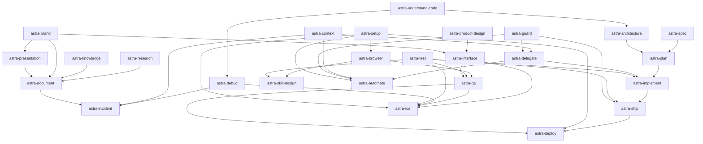
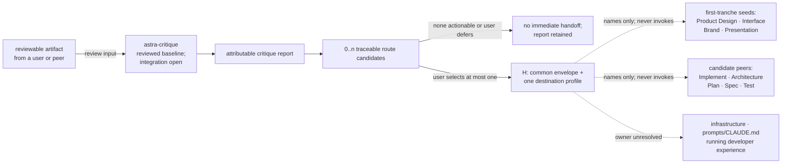

# Astra phase-0 skill design roadmap

**Snapshot:** 2026-07-31
**Status:** Proposed design-document sequence; runtime implementation remains deferred

> **Authority.** `docs/phase-0.md` governs phase scope and ledger ownership.
> `docs/design-requirements.md` governs every per-skill design. This roadmap schedules and
> proposes source allocation; it does not replace either document or make the source-claim
> ledger authoritative by itself.

## 1. Purpose and certainty

This roadmap answers five questions:

1. Which Astra skill design documents remain to be drafted?
2. Which candidate neighborhood is expected to produce each Astra skill?
3. Which original sources would that skill encapsulate if its design validates the proposal?
4. Which other designs must be reconciled before ownership and triggers are final?
5. Which problem classes may pass from Critique to a peer, and how complete is that handoff
   coverage?

The collision map is still evidence, not a predetermined roster. The roadmap therefore uses four
states:

| State | Meaning |
|---|---|
| **Reviewed baseline** | A reviewed phase-0 design exists; source expansion, peer integration, and final-roster reconciliation may remain open. |
| **Confirmed name** | The user approved the skill split and name; source allocation still requires the individual design's inspection. |
| **Provisional** | This roadmap proposes a skill and source allocation so work can be sequenced; the individual design may merge, split, rename, retain, or exclude sources with evidence. |
| **No new Astra skill proposed** | The neighborhood does not currently justify another merged skill; sources are redirected to another design or retained independently. |

In this document, **encapsulates** means *proposed primary source home after successful design,
validation, and later retirement gates*. It does not mean the source is already absorbed or safe
to delete. `docs/phase-0-ledgers.md` remains authoritative until the coordinator reconciles a
completed design.

Sources marked **†** are harness built-ins whose bytes and immutable provenance are unavailable.
They may inform a proposed route, but no design may claim them absorbed until the host-version
provenance rule is resolved.

## 2. Current result

| Measure | Current proposal |
|---|---:|
| Reviewed phase-0 design baselines | 1 |
| Remaining confirmed-name documents | 4 |
| Remaining provisional documents | 22 |
| Planned revision of an existing design | 1 |
| Neighborhoods producing no Astra document or revision | 1 |
| Proposed Astra roster after all remaining documents | 27 |

The reviewed baseline is
[`designs/astra-critique.md`](../designs/astra-critique.md). The 26 remaining documents are
listed below. The proposed final count is not a target: it must shrink, grow, or retain independent
sources if source inspection and trigger comparison require that. Critique is complete only as a
reviewed document baseline; its code-review source expansion and peer handoff reconciliation
remain open.

## 3. Dependency and handoff semantics

Phase 0 permits designs to be drafted in parallel; peer designs do not need to exist first.
Relations in this roadmap are therefore reconciliation or future information-flow edges, not
blanket drafting blocks:

| Code | Meaning |
|---|---|
| **R** | **Roster reconciliation:** ownership, trigger, or relationship semantics must agree before either design is accepted into the final roster. |
| **I** | **Later implementation dependency:** the future runtime skill is expected to consume a peer's output or capability. This does not include an optional Critique problem handoff. |
| **H** | **Critique problem handoff:** after rendering every route candidate in its report, Critique may emit zero or one immediate capsule naming a peer that owns a selected problem class. The user decides whether and which route continues; Critique never invokes it. |
| **P** | **Provenance dependency:** unavailable source bytes, host behavior, or an external component must be resolved before absorption or retirement can be claimed. |

All proposed Astra skills are flat peers. Waves express design order; none creates a nested public
skill tree. An **H** relation is not an invocation dependency: it is a user-mediated output edge
carrying a problem, evidence, impact, scope, constraints, and uncertainty, but no solution.
The one-capsule limit bounds the next workflow; it does not permit Critique to omit other
independently actionable routes from its report.

Every proposed peer other than Critique must declare whether it accepts Critique handoffs:
**yes**, **conditional**, or **no**. A yes or conditional peer names the problem class it owns and
contributes a compact problem-only profile. A no declaration prevents a fabricated route but does
not narrow Critique's review scope.

### 3.1 Provisional peer dependency map

The graph below shows only the strongest proposed **I** relationships among peers other than
Critique. **R** and **P** relations remain in the wave tables. Critique is omitted because its
review-and-return topology is a feedback loop, not a forward dependency chain.

Arrows point from an output or capability owner to a likely consumer. They are provisional until
both peer designs reconcile the relationship. Section 5 records source and ownership relations
that do not belong in this implementation-flow view.

### 3.2 Critique review and handoff topology

Critique is cross-cutting. A user may submit an artifact produced by any supported peer or outside
the Astra roster. Critique renders an attributable report first. That report may retain zero or
more route candidates because independent findings can belong to different peers. The user then
selects zero or one candidate as the immediate **H** handoff. The destination may be the same peer
that produced the artifact, so this relationship is intentionally not forced into the acyclic
graph above.

If several reviewers nominate incompatible owners for the same problem, the user resolves the
classification. If several independent problem classes map cleanly to different owners, all
remain in the report and the user chooses which one, if any, becomes the immediate capsule.
Critique's procedural chair does not prioritize them.

Destination profiles are support data, not a skill registry or allowlist. Each destination
design owns the problem class it accepts and the destination-only payload it needs. During final
roster reconciliation, the coordinator records the accepted profile as the canonical peer
contract and Critique consumes that reconciled snapshot. A missing or inconsistent profile leaves
the route candidate in the report as a reconciliation gap; Critique neither guesses its payload
nor substitutes an unrelated peer.

Critique's accepted artifact and selected lenses determine review scope. In later runtime,
Critique reads at most the selected compact profile and never reads or invokes the destination's
full `SKILL.md`. The selected peer owns solution exploration and its own user-visible job; that
peer's design independently defines any mutation or execution authority.

The coverage states below are roadmap states, not implementation claims:

| Critiqued problem class | Candidate destination | Coverage state | Required reconciliation |
|---|---|---|---|
| Product-experience or user-journey problem | `astra-product-design` | **Seeded H** | Destination design must accept, narrow, or decline the seed and own its payload. |
| Interaction, accessibility, or visual-system defect | `astra-interface` | **Seeded H** | Destination design must preserve report-only versus fix authority. |
| Identity or audience-signal inconsistency | `astra-brand` | **Seeded H** | Destination design must define the brand-specific problem payload. |
| Narrative or data-comprehension problem | `astra-presentation` | **Seeded H** | Destination design must define the presentation-specific problem payload. |
| Code defect requiring remediation | `astra-implement` | **Candidate H** | Reconcile with the Code review expansion and keep Critique read-only. |
| Architecture or technical-design problem | `astra-architecture` | **Candidate H** | Distinguish architecture redesign from code remediation. |
| Defect in an accepted execution plan | `astra-plan` | **Candidate H** | Keep plan revision separate from Critique's report. |
| Specification gap or ambiguity | `astra-spec` | **Candidate H** | Distinguish changing intent from changing the execution plan. |
| Missing or inadequate testing | `astra-test` | **Candidate H** | Preserve Critique's non-goal of executing or bootstrapping tests. |
| Infrastructure or operational-change problem | Unresolved among Architecture, Implement, Deploy, or a retained peer | **Open owner** | The relevant peer designs must divide design, code, and deployment ownership. |
| Prompt, `SKILL.md`, or CLAUDE.md problem | Unresolved among Skill Design, Document, or a retained peer | **Open owner** | The relevant peer designs must divide instruction design from artifact editing. |
| Running developer-experience problem | Unresolved among Interface, QA, Setup, or a retained peer | **Open owner** | The relevant peer designs must divide product defects, verification, and environment setup. |
| No actionable finding survives | `none` | **Terminal** | Emit no handoff. |
| The user defers every actionable route | `none` for the immediate handoff | **Terminal for this run** | Retain every route candidate in the report; start no peer workflow. |
| A clean review is followed by publication | `astra-ship` | **I only, not H** | Ship may consume review evidence, but Critique must not invent a problem handoff. |

**Seeded H** means Critique currently contains an illustrative destination payload; it does not
mean the destination has accepted it. **Candidate H** means Critique names the problem class and
likely owner but the destination profile remains unwritten. **Open owner** requires an explicit
roster decision rather than fallback to an unrelated peer.

## 4. Recommended design waves

### Wave 0 — reviewed baseline

| Design | Status | Result |
|---|---|---|
| [`astra-critique`](../designs/astra-critique.md) | **Reviewed baseline; integration open** | Owns adversarial critique and the audit/report portion of `design-review`; code-review source expansion and destination acceptance remain open. |

### Wave 1 — current Design tranche

The user selected this tranche next. Draft `astra-product-design` and `astra-brand` first; their
journey and identity boundaries make the `astra-interface` and `astra-presentation` ownership
decisions easier to state.

| Proposed design file | Status | Reconcile with |
|---|---|---|
| `designs/astra-product-design.md` | **Confirmed name** | **R:** `astra-interface`, `astra-brand`, `astra-presentation`; **H (seeded):** Critique product-experience and user-journey problems |
| `designs/astra-brand.md` | **Confirmed name** | **R:** `astra-interface`, `astra-presentation`, `astra-document`; **H (seeded):** Critique identity and audience-signal problems; **I:** design-token and asset consumers |
| `designs/astra-interface.md` | **Confirmed name** | **R:** Product/Brand, `astra-test`, `astra-qa`; **H (seeded):** Critique interaction, accessibility, and visual-system defects; **P:** `artifact-design` and `artifact-capabilities` built-ins |
| `designs/astra-presentation.md` | **Confirmed name** | **R:** `astra-brand`, `astra-document`, Product; **H (seeded):** Critique narrative and data-comprehension problems; **P:** `dataviz` built-in |

### Wave 2 — cross-cutting foundations

| Proposed design file | Status | Reconcile with |
|---|---|---|
| `designs/astra-guard.md` | **Provisional** | **R:** authority and trigger semantics with every mutation-capable skill; **I:** peers may consume explicit Guard state or warnings if their designs justify it; destructive-action boundaries remain local to each consumer |
| `designs/astra-context.md` | **Provisional** | **R:** ownership and trigger semantics with `astra-delegate`, `astra-automate`, `astra-plan`, `astra-incident`; **I:** those peers may consume explicit restored or serialized context if their designs justify it |
| `designs/astra-understand-code.md` | **Provisional** | **R:** `astra-architecture`, Critique code lenses, `astra-debug` |
| `designs/astra-test.md` | **Provisional** | **R:** `astra-implement`, `astra-qa`, `astra-ship`, `astra-interface`; **H (candidate):** Critique testing gaps; **P:** `run` built-in |
| `designs/astra-delegate.md` | **Provisional** | **R:** Context, Guard, `astra-implement`, `astra-automate`; preserve agent delivery shape |
| `designs/astra-setup.md` | **Provisional** | **R:** Browser, Deploy, Automation, iOS, Skill Design; **P:** three setup/config built-ins |

### Wave 3 — core project-development loop

| Proposed design file or revision | Status | Reconcile with |
|---|---|---|
| `designs/astra-spec.md` | **Provisional** | **R:** `astra-knowledge`, `astra-architecture`, Product Design; **H (candidate):** Critique specification gaps |
| `designs/astra-architecture.md` | **Provisional** | **R:** `astra-understand-code`, Spec, Plan, `domain-modeling`, Critique infrastructure-route ownership; **H (candidate):** Critique architecture and technical-design problems |
| `designs/astra-plan.md` | **Provisional** | **R:** Spec, Architecture, Context, Implement; **H (candidate):** Critique execution-plan defects |
| `designs/astra-implement.md` | **Provisional** | **R:** Plan, Delegate, Test, Guard, Critique infrastructure-route ownership; **H (candidate):** Critique code-remediation problems; receives code-simplification sources from Code review |
| `designs/astra-critique.md` source-expansion revision | **Existing design revision** | **R:** Code review, Understand Code, Test, Architecture; must not create a competing nested code-critique skill |
| `designs/astra-debug.md` | **Provisional** | **R:** Understand Code, Test, Browser/QA, Incident |
| `designs/astra-incident.md` | **Provisional** | **R:** Debug, Context, Document, Guard; keep stabilization distinct from causal diagnosis |

### Wave 4 — browser, quality, and delivery

| Proposed design file | Status | Reconcile with |
|---|---|---|
| `designs/astra-browser.md` | **Provisional** | **R:** Setup, Guard, QA, Skill Design; preserve MCP, browser-daemon, cloud-browser, Electron, and authenticated-session delivery shapes |
| `designs/astra-qa.md` | **Provisional** | **R:** Browser, Test, Interface, Critique running-developer-experience route ownership; distinguish report-only from fix authority |
| `designs/astra-ship.md` | **Provisional** | **R:** Implement, Test, Guard, Context, Document; **I:** may consume Critique review evidence, but a clean review is not an **H** edge; preserve explicit user control over commits, pushes, PRs, and merges |
| `designs/astra-deploy.md` | **Provisional** | **R:** Ship, Setup, Browser/QA, Guard, Critique infrastructure-route ownership; preserve provider-specific prerequisites and canary degradation |

### Wave 5 — knowledge, meta-work, and autonomy

| Proposed design file | Status | Reconcile with |
|---|---|---|
| `designs/astra-research.md` | **Provisional** | **R:** Browser, Document, Knowledge, Critique evidence requirements |
| `designs/astra-knowledge.md` | **Provisional** | **R:** Spec, Architecture, Document, Context; preserve `domain-modeling` as a cross-role |
| `designs/astra-document.md` | **Provisional** | **R:** Research, Knowledge, Brand, Presentation, Ship, Incident, Critique prompt/CLAUDE.md route ownership |
| `designs/astra-skill-design.md` | **Provisional** | **R:** Test, Research, Browser, Setup, Critique prompt/`SKILL.md` route ownership; preserve skill-scoped agents and benchmark delivery shapes |
| `designs/astra-automate.md` | **Provisional** | **R:** Delegate, Context, Guard, Setup, Plan, Ship, and the six separate `loop-goal` lifecycle handlers; **P:** `loop` and `schedule` built-ins |

### Wave 6 — specialized platform decision

| Proposed design file | Status | Reconcile with |
|---|---|---|
| `designs/astra-ios.md` | **Provisional, later** | **R:** Interface, QA, Debug, Test, Setup, Critique iOS-problem route ownership; the design may instead retain the iOS pack if a self-contained merger adds no personal value |

The Ops & routine neighborhood currently produces no merged Astra design. Section 5.17 records
why `meeting` and `retro` should remain independent unless later evidence establishes one user job.

## 5. Neighborhood derivation and proposed source allocation

Every source below is an exact collision-map identifier. Allocations remain roadmap proposals
unless the coordinator reserves or reconciles them in `docs/phase-0-ledgers.md`; that ledger is
authoritative. The Wave 1 primary homes are now reserved as `claimed`, not `resolved`.

### 5.1 Adversarial critique — reviewed baseline; integration open

**Derived Astra skill:** `astra-critique`.

**Encapsulates:** `grilling`, `grill-me`, `grill-with-docs`, `/diss`, `/diss-api`,
`diss-infra`, `diss-claudemd`, `/elon`, `/trim`, `office-hours`, `plan-ceo-review`,
`plan-eng-review`, `plan-design-review`, `plan-devex-review`, `devex-review`, and `autoplan`.

**Remaining work:** no new standalone design document. Later source-expansion revisions reconcile
Code review sources and any other critique jurisdiction. Each peer design must also accept,
condition, or decline its candidate **H** relation; neither unfinished profiles nor declined
destinations narrow Critique's review scope.

### 5.2 Code review

**Derived Astra skills:** no competing code-critique skill. Revise `astra-critique`, and route
mutation-oriented cleanup into `astra-implement`.

- **`astra-critique` expansion:** `code-review`, `review`, `requesting-code-review`,
  `receiving-code-review`, `superpowers:requesting-code-review`,
  `superpowers:receiving-code-review`, `feature-dev:code-reviewer`,
  `code-review:code-review`, and `security-review`†.
- **`astra-implement`:** `simplify`†, `code-simplifier`, and `health`.

The individual investigation must test whether requesting/receiving review remain lifecycle modes
inside Critique or retain independent entry points. In either case, they do not justify a child
skill tree.

### 5.3 Browser & QA

**Derived Astra skills:** `astra-browser` and `astra-qa`.

- **`astra-browser`:** `agent-browser`, `browse`, `connect-chrome`, `open-gstack-browser`,
  `agentcore`, `vercel-sandbox`, `electron`, `scrape`, `slack`, `setup-browser-cookies`, and
  `playwright` MCP.
- **`astra-qa`:** `webapp-testing`, `benchmark`, `dogfood`, `qa`, and `qa-only`.
- **Cross-neighborhood primary homes:** `skillify` → `astra-skill-design`; `pair-agent` →
  `astra-delegate`. Browser remains a secondary role for both.

`astra-browser` must expose capability and environment selection without making cloud browsers,
Electron, Slack, or authenticated cookies separate public child skills. `astra-qa` owns testing
policy, evidence, and report/fix authority, not browser setup.

### 5.4 Design & visual

**Derived Astra skills:** `astra-product-design`, `astra-interface`, `astra-brand`, and
`astra-presentation`.

- **`astra-product-design`:** `design-consultation` and `design-shotgun`.
- **`astra-interface`:** `design-system`, `design-html`, `ui-styling`, `ui-ux-pro-max`,
  `frontend-design`, `artifact-design`†, `artifact-capabilities`†, and
  `web-artifacts-builder`.
- **`astra-brand`:** `design`, `theme-factory`, `brand`, `brand-guidelines`, `banner-design`,
  `canvas-design`, and `algorithmic-art`.
- **`astra-presentation`:** `slides`, `dataviz`†, and `diagram`.
- **Existing primary home:** `design-review` audit/report → `astra-critique`; Interface owns its
  fix/verify secondary role and Test owns its bootstrap/regression secondary role.

Cross-role behaviors must remain visible: `design-system` also informs Brand and Presentation;
`theme-factory` also informs Interface and Presentation; `ui-ux-pro-max` also informs Product;
and `diagram` also informs Document.

### 5.5 Plan & spec

**Derived Astra skills:** `astra-spec`, `astra-plan`, and `astra-implement`.

- **`astra-spec`:** `superpowers:brainstorming`, `spec`, `to-spec`, and `sdd`.
- **`astra-plan`:** `superpowers:writing-plans`, `planb`, `plan-tune`, `wayfinder`, and
  `to-tickets`.
- **`astra-implement`:** `superpowers:executing-plans`,
  `superpowers:subagent-driven-development`, `implement`, and
  `feature-dev:feature-dev`.
- **Cross-neighborhood primary home:** `feature-dev:code-architect` → `astra-architecture`.
- **Independent candidate:** retain `prototype` unless the Product Design or Architecture
  investigation proves its throwaway-experiment job belongs inside that skill without flattening
  its trigger.

Spec decides what should be built, Plan turns an accepted specification into executable work, and
Implement changes the project. Their user approvals and mutation authority must remain separate.

### 5.6 Ship & VCS

**Derived Astra skills:** `astra-ship` and `astra-deploy`.

- **`astra-ship`:** `ship`, `landing-report`, `/pr`, `/commit`,
  `commit-commands:commit`, `commit-commands:commit-push-pr`,
  `commit-commands:clean_gone`, `changelog`, `document-release`,
  `resolving-merge-conflicts`, `superpowers:finishing-a-development-branch`,
  `superpowers:using-git-worktrees`, and `github`.
- **`astra-deploy`:** `land-and-deploy`, `canary`, `setup-deploy`, and
  `/build-push-ecr`.

Ship owns working-tree-to-reviewed-change publication. Deploy owns landing through production
verification. The designs must keep read-only status/report modes distinct from irreversible
commit, push, merge, deployment, and cleanup effects.

### 5.7 Docs & knowledge

**Derived Astra skills:** `astra-document`, `astra-research`, and `astra-knowledge`.

- **`astra-document`:** `document-generate`, `doc-coauthoring`, `/doc`, `make-pdf`,
  `internal-comms`, `rtfm`, `claude-md-management:revise-claude-md`, and
  `claude-md-management:claude-md-improver`.
- **`astra-research`:** `research`.
- **`astra-knowledge`:** `learn`, `teach`, `domain-modeling`, and `init`†.
- **Cross-neighborhood primary home:** `slack-gif-creator` → `astra-brand`.

Research establishes evidence; Knowledge maintains reusable understanding and domain language;
Document produces or revises an artifact for a reader. Rendering a PDF is a Document delivery
mode, not a separate knowledge job.

### 5.8 Debug & incident

**Derived Astra skills:** `astra-debug` and `astra-incident`.

- **`astra-debug`:** `investigate`, `diagnosing-bugs`,
  `superpowers:systematic-debugging`, `java-leak-resolver`, `staging-debug`, and
  `local-debug`.
- **`astra-incident`:** `rca`, `firefighting`, and `triage`.

Debug owns diagnosis and repair of a bounded failure. Incident owns stabilization, incident-state
navigation, parallel causal investigation, and operational handoff. `rca` and `firefighting`
retain distinct simultaneous roles rather than becoming one synthesized voice.

### 5.9 Codebase comprehension

**Derived Astra skills:** `astra-understand-code` and `astra-architecture`.

- **`astra-understand-code`:** `how`, `code-tracing`, and `feature-dev:code-explorer`.
- **`astra-architecture`:** `codebase-design`, `improve-codebase-architecture`, plus
  `feature-dev:code-architect` from Plan & spec.

Understand Code explains and traces what exists without selecting a new design. Architecture owns
module boundaries, technical-design choices, and implementation blueprints. Critique may review
either result but does not own the solution.

### 5.10 Skill meta

**Derived Astra skill:** `astra-skill-design`.

- **`astra-skill-design`:** `skill-creator`, `skill-creator:skill-creator`,
  `writing-great-skills`, `superpowers:writing-skills`, `skillify`, and
  `benchmark-models`.
- **Cross-neighborhood primary homes:** `prompt-lookup` → `astra-research`;
  `gstack-upgrade` → `astra-setup`.
- **Deferred routing components:** `ask-matt`, `gstack`, and `_gstack-command` do not produce
  another skill design. They remain migration inputs to the separately deferred Astra
  router/tuning decision.

Skill Design owns authoring, validation, forward tests, and skill-specific benchmarking. It must
preserve the installed `skill-creator` component's scoped agents rather than flattening them into
prompt prose.

### 5.11 Delegation & autonomy

**Derived Astra skills:** `astra-delegate` and `astra-automate`.

- **`astra-delegate`:** `coding-agent`, `codex`,
  `superpowers:dispatching-parallel-agents`, and `pair-agent`.
- **`astra-automate`:** `nightnight`, `loop`†, `loop-goal`, and `schedule`†.

Delegate owns a bounded user-authorized delegation. Automate owns recurring, unattended, or
goal-loop execution and therefore has stronger Context, Guard, cancellation, monitoring, and
external-state dependencies. `loop-goal` also contributes six lifecycle hook handlers recorded
separately in the phase-0 ledger. The Automate design must preserve, replace, or explicitly retain
each handler by delivery shape; absorbing the `loop-goal` skill body does not account for them.

### 5.12 Testing

**Derived Astra skill:** `astra-test`.

**Encapsulates:** `tdd`, `superpowers:test-driven-development`, `bdd`, `spock`, `nextjs-test`,
`shell-scripting:bats-testing-patterns`, `superpowers:verification-before-completion`, and
`run`†.

Framework-specific material becomes directly selected internal references or retained independent
references if self-containment is not justified. TDD/BDD construction, framework jurisdiction,
test execution, and final verification remain distinguishable modes inside one testing job.

### 5.13 Context & handoff

**Derived Astra skill:** `astra-context`.

**Encapsulates:** `context-save`, `context-restore`, `strategic-compact`, `handoff`, and
`nowhat`.

The design must test whether `nowhat`'s meta-cognitive strategy switching belongs as a
reorientation mode or should remain independent. It may not be silently reduced to context
serialization.

### 5.14 Safety

**Derived Astra skill:** `astra-guard`.

**Encapsulates:** `careful`, `freeze`, `unfreeze`, and `guard`.

Guard combines destructive-action warnings with explicit edit boundaries. Freeze and unfreeze
must remain reversible user-controlled state transitions, not hidden automatic policy.

### 5.15 Setup & config

**Derived Astra skill:** `astra-setup`.

**Encapsulates:** `setup-aurora-pg-mcp`, `setup-gbrain`, `sync-gbrain`,
`setup-matt-pocock-skills`, `update-config`†, `keybindings-help`†,
`fewer-permission-prompts`†, and
`claude-code-setup:claude-automation-recommender`.

**Cross-neighborhood secondary source:** `gstack-upgrade` contributes migration and upgrade
behavior until gstack retirement is complete.

Setup owns configuring and maintaining the agent-development environment. Provider-specific
credentials, MCPs, project mutations, and read-only recommendations stay explicit modes with
separate authority.

### 5.16 iOS

**Derived Astra skill:** `astra-ios`.

**Encapsulates:** `ios-qa`, `ios-fix`, `ios-design-review`, `ios-sync`, and `ios-clean`.

The platform boundary justifies one investigation, not automatically one monolithic workflow.
The design must preserve live-device QA, visual review, autonomous repair, debug-bridge
maintenance, and cleanup as distinct modes or retain the original pack if their coordination
shows no advantage.

### 5.17 Ops & routine

**Derived Astra skill:** none currently recommended.

- `office-hours` is a duplicate occurrence whose primary home is `astra-critique`.
- `retro` is a weekly engineering retrospective.
- `meeting` schedules calendar events and drafts notifications through Google Calendar and Gmail.

`retro` and `meeting` do not share one user job, evidence method, authority, or dependencies.
Keep them independent unless later personal-value evidence justifies separate rename-only Astra
designs; do not create an `astra-routine` grab bag merely to empty the neighborhood.

## 6. Per-design completion contract

For each remaining document:

1. Reserve its exact occurrence claims in `docs/phase-0-ledgers.md`.
2. Inspect every proposed primary source body, registration, component type, invocation,
   immutable revision or hash, authority, dependency, and failure path.
3. Inspect cross-neighborhood evidence without taking another design's primary claim.
4. Write the ten required sections from `docs/design-requirements.md`.
5. State which roadmap allocation was confirmed, changed, split, retained, or excluded and why.
6. Define source-oracle, reference-convener, self-contained-candidate, and source-specific
   retirement gates without claiming they have run.
7. For every design other than Critique, declare Critique handoff acceptance as **yes**,
   **conditional**, or **no**. For yes or conditional, name the owned problem class and compact
   destination-only payload; for no, explain why the job does not own a post-critique problem. Do
   not turn the relation into an invocation. The destination design owns that profile; the
   Critique source-expansion revision instead reconciles the coverage classes from its side.
8. Record a proposed update to this roadmap's section 3.2 inside the assigned design; the
   coordinator applies the roadmap state after review.
9. Self-review, validate Markdown, commit the document, and obtain user review.
10. Let the coordinator apply proposed ledger changes between waves.

A source list in this roadmap is not sufficient evidence for a design and cannot satisfy any
retirement gate.

## 7. Final reconciliation milestones

After all proposed documents and no-new-skill decisions have been reviewed:

1. Compare every trigger and non-trigger across the proposed roster.
2. Resolve every source occurrence to one primary disposition and zero or more explicit secondary
   roles.
3. Resolve every section 3.2 Critique problem class to an accepted or conditional **H** profile,
   an explicit `none`, or a retained independent peer. Record each accepting destination design
   as the profile authority and give Critique the coordinator-reconciled canonical snapshot. Keep
   **H** separate from lifecycle and review-evidence **I** relations.
4. Verify that each **H** profile preserves the common problem envelope, adds only
   destination-owned evidence, and never authorizes Critique to invoke the peer. Verify that a
   report retains every independent route candidate even though the user selects zero or one
   immediate capsule.
5. Decide whether provisional designs with one weak source should remain Astra skills or retain
   the independent original.
6. Resolve all † built-in provenance gaps.
7. Decide keep/defer/exclude for the reference and cleanup ledger; reference skills do not need
   Astra wrappers merely to appear in the roadmap.
8. Reconcile commands, agents, MCP servers, hooks, and LSP servers by component type.
9. Present the final roster, priorities, exclusions, unresolved questions, and manual bridges to
   the user.

Only after that roster is selected may implementation planning begin. Runtime skill creation,
router/tuning work, plugin packaging, behavioral harnesses, installation, and source retirement
remain outside phase 0.
