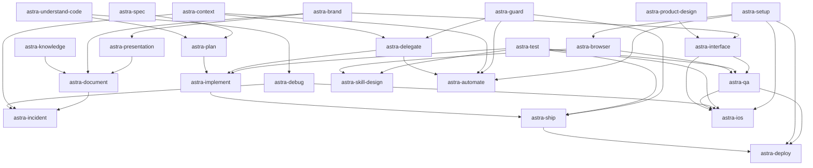
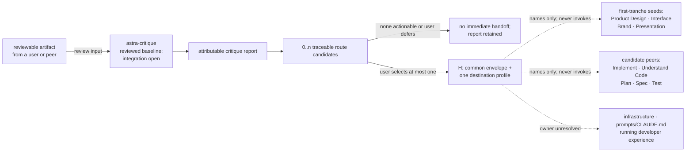

# Astra phase-0 skill design roadmap

**Snapshot:** 2026-07-31
**Status:** Proposed design-document sequence; runtime implementation remains deferred
**Amendment 1 (2026-07-31):** Source-body inspection of six thin candidates dissolved two proposed
designs, relocated one misfiled source, and excluded one broken source. See section 8.
**Amendment 2 (2026-07-31):** Source-body inspection of Context, Safety, Delegation & autonomy, and
Browser & QA withdrew one source, collapsed one alias, and recorded delivery-shape, authority, and
version obligations that the affected sections had omitted. No design was withdrawn. See section 9.

> **Authority.** `docs/phase-0.md` governs phase scope and ledger ownership.
> `docs/design-requirements.md` governs every per-skill design. This roadmap schedules and
> proposes source allocation; it does not replace either document or make the source-claim
> ledger authoritative by itself.

## 1. Purpose and certainty

This roadmap answers five questions:

1. Which Astra skill design documents remain to be drafted?
2. Which candidate neighborhood is expected to produce each Astra skill?
3. Which original sources would that skill encapsulate if its design validates the proposal?
4. Which other designs must be reconciled before ownership and triggers are final?
5. Which problem classes may pass from Critique to a peer, and how complete is that handoff
   coverage?

The collision map is still evidence, not a predetermined roster. The roadmap therefore uses four
states:

| State | Meaning |
|---|---|
| **Reviewed baseline** | A reviewed phase-0 design exists; source expansion, peer integration, and final-roster reconciliation may remain open. |
| **Confirmed name** | The user approved the skill split and name; source allocation still requires the individual design's inspection. |
| **Provisional** | This roadmap proposes a skill and source allocation so work can be sequenced; the individual design may merge, split, rename, retain, or exclude sources with evidence. |
| **No new Astra skill proposed** | The neighborhood does not currently justify another merged skill; sources are redirected to another design or retained independently. |

In this document, **encapsulates** means *proposed primary source home after successful design,
validation, and later retirement gates*. It does not mean the source is already absorbed or safe
to delete. `docs/phase-0-ledgers.md` remains authoritative until the coordinator reconciles a
completed design.

Sources marked **†** are harness built-ins whose bytes and immutable provenance are unavailable.
They may inform a proposed route, but no design may claim them absorbed until the host-version
provenance rule is resolved.

## 2. Current result

| Measure | Current proposal |
|---|---:|
| Reviewed phase-0 design baselines | 1 |
| Remaining confirmed-name documents | 4 |
| Remaining provisional documents | 20 |
| Planned revision of an existing design | 1 |
| Neighborhoods producing no Astra document or revision | 1 |
| Proposed Astra roster after all remaining documents | 25 |

The reviewed baseline is
[`designs/astra-critique.md`](../designs/astra-critique.md). The 24 remaining documents are
listed below. The proposed final count is not a target: it must shrink, grow, or retain independent
sources if source inspection and trigger comparison require that. Critique is complete only as a
reviewed document baseline; its code-review source expansion and peer handoff reconciliation
remain open.

## 3. Dependency and handoff semantics

Phase 0 permits designs to be drafted in parallel; peer designs do not need to exist first.
Relations in this roadmap are therefore reconciliation or future information-flow edges, not
blanket drafting blocks:

| Code | Meaning |
|---|---|
| **R** | **Roster reconciliation:** ownership, trigger, or relationship semantics must agree before either design is accepted into the final roster. |
| **I** | **Later implementation dependency:** the future runtime skill is expected to consume a peer's output or capability. This does not include an optional Critique problem handoff. |
| **H** | **Critique problem handoff:** after rendering every route candidate in its report, Critique may emit zero or one immediate capsule naming a peer that owns a selected problem class. The user decides whether and which route continues; Critique never invokes it. |
| **P** | **Provenance dependency:** unavailable source bytes, host behavior, or an external component must be resolved before absorption or retirement can be claimed. |

All proposed Astra skills are flat peers. Waves express design order; none creates a nested public
skill tree. An **H** relation is not an invocation dependency: it is a user-mediated output edge
carrying a problem, evidence, impact, scope, constraints, and uncertainty, but no solution.
The one-capsule limit bounds the next workflow; it does not permit Critique to omit other
independently actionable routes from its report.

Every proposed peer other than Critique must declare whether it accepts Critique handoffs:
**yes**, **conditional**, or **no**. A yes or conditional peer names the problem class it owns and
contributes a compact problem-only profile. A no declaration prevents a fabricated route but does
not narrow Critique's review scope.

### 3.1 Provisional peer dependency map

The graph below shows only the strongest proposed **I** relationships among peers other than
Critique. **R** and **P** relations remain in the wave tables. Critique is omitted because its
review-and-return topology is a feedback loop, not a forward dependency chain.

Arrows point from an output or capability owner to a likely consumer. They are provisional until
both peer designs reconcile the relationship. Section 5 records source and ownership relations
that do not belong in this implementation-flow view.

**Amendment 1 changes to this graph.** The `astra-architecture` node was removed and its
`architecture --> plan` edge succeeded by `understand --> plan`, because `astra-understand-code`
absorbs the technical-design jurisdiction. The `astra-research` node was removed because `research`
is now a retained independent source, not a peer: `astra-document` still consumes its output, but
as an independent reference recorded in the reference and cleanup ledger, which is not an **I**
relation between peers. Section 8 records the inspected evidence for both removals.

### 3.2 Critique review and handoff topology

Critique is cross-cutting. A user may submit an artifact produced by any supported peer or outside
the Astra roster. Critique renders an attributable report first. That report may retain zero or
more route candidates because independent findings can belong to different peers. The user then
selects zero or one candidate as the immediate **H** handoff. The destination may be the same peer
that produced the artifact, so this relationship is intentionally not forced into the acyclic
graph above.

If several reviewers nominate incompatible owners for the same problem, the user resolves the
classification. If several independent problem classes map cleanly to different owners, all
remain in the report and the user chooses which one, if any, becomes the immediate capsule.
Critique's procedural chair does not prioritize them.

Destination profiles are support data, not a skill registry or allowlist. Each destination
design owns the problem class it accepts and the destination-only payload it needs. During final
roster reconciliation, the coordinator records the accepted profile as the canonical peer
contract and Critique consumes that reconciled snapshot. A missing or inconsistent profile leaves
the route candidate in the report as a reconciliation gap; Critique neither guesses its payload
nor substitutes an unrelated peer.

Critique's accepted artifact and selected lenses determine review scope. In later runtime,
Critique reads at most the selected compact profile and never reads or invokes the destination's
full `SKILL.md`. The selected peer owns solution exploration and its own user-visible job; that
peer's design independently defines any mutation or execution authority.

The coverage states below are roadmap states, not implementation claims:

| Critiqued problem class | Candidate destination | Coverage state | Required reconciliation |
|---|---|---|---|
| Product-experience or user-journey problem | `astra-product-design` | **Seeded H** | Destination design must accept, narrow, or decline the seed and own its payload. |
| Interaction, accessibility, or visual-system defect | `astra-interface` | **Seeded H** | Destination design must preserve report-only versus fix authority. |
| Identity or audience-signal inconsistency | `astra-brand` | **Seeded H** | Destination design must define the brand-specific problem payload. |
| Narrative or data-comprehension problem | `astra-presentation` | **Seeded H** | Destination design must define the presentation-specific problem payload. |
| Code defect requiring remediation | `astra-implement` | **Candidate H** | Reconcile with the Code review expansion and keep Critique read-only. |
| Architecture or technical-design problem | `astra-understand-code` | **Candidate H** | Distinguish architecture redesign from code remediation. Re-targeted by amendment 1. Reconcile against `how`'s existing critique mode so two peers do not both own multi-lens architectural critique. |
| Defect in an accepted execution plan | `astra-plan` | **Candidate H** | Keep plan revision separate from Critique's report. |
| Specification gap or ambiguity | `astra-spec` | **Candidate H** | Distinguish changing intent from changing the execution plan. |
| Missing or inadequate testing | `astra-test` | **Candidate H** | Preserve Critique's non-goal of executing or bootstrapping tests. |
| Infrastructure or operational-change problem | Unresolved among Understand Code, Implement, Deploy, or a retained peer | **Open owner** | The relevant peer designs must divide design, code, and deployment ownership. |
| Prompt, `SKILL.md`, or CLAUDE.md problem | Unresolved among Skill Design, Document, or a retained peer | **Open owner** | The relevant peer designs must divide instruction design from artifact editing. |
| Running developer-experience problem | Unresolved among Interface, QA, Setup, or a retained peer | **Open owner** | The relevant peer designs must divide product defects, verification, and environment setup. |
| No actionable finding survives | `none` | **Terminal** | Emit no handoff. |
| The user defers every actionable route | `none` for the immediate handoff | **Terminal for this run** | Retain every route candidate in the report; start no peer workflow. |
| A clean review is followed by publication | `astra-ship` | **I only, not H** | Ship may consume review evidence, but Critique must not invent a problem handoff. |

**Seeded H** means Critique currently contains an illustrative destination payload; it does not
mean the destination has accepted it. **Candidate H** means Critique names the problem class and
likely owner but the destination profile remains unwritten. **Open owner** requires an explicit
roster decision rather than fallback to an unrelated peer.

## 4. Recommended design waves

### Wave 0 — reviewed baseline

| Design | Status | Result |
|---|---|---|
| [`astra-critique`](../designs/astra-critique.md) | **Reviewed baseline; integration open** | Owns adversarial critique and the audit/report portion of `design-review`; code-review source expansion and destination acceptance remain open. |

### Wave 1 — current Design tranche

The user selected this tranche next. Draft `astra-product-design` and `astra-brand` first; their
journey and identity boundaries make the `astra-interface` and `astra-presentation` ownership
decisions easier to state.

| Proposed design file | Status | Reconcile with |
|---|---|---|
| `designs/astra-product-design.md` | **Confirmed name** | **R:** `astra-interface`, `astra-brand`, `astra-presentation`; **H (seeded):** Critique product-experience and user-journey problems |
| `designs/astra-brand.md` | **Confirmed name** | **R:** `astra-interface`, `astra-presentation`, `astra-document`; **H (seeded):** Critique identity and audience-signal problems; **I:** design-token and asset consumers |
| `designs/astra-interface.md` | **Confirmed name** | **R:** Product/Brand, `astra-test`, `astra-qa`; **H (seeded):** Critique interaction, accessibility, and visual-system defects; **P:** `artifact-design` and `artifact-capabilities` built-ins |
| `designs/astra-presentation.md` | **Confirmed name** | **R:** `astra-brand`, `astra-document`, Product; **H (seeded):** Critique narrative and data-comprehension problems; **P:** `dataviz` built-in |

### Wave 2 — cross-cutting foundations

| Proposed design file | Status | Reconcile with |
|---|---|---|
| `designs/astra-guard.md` | **Provisional** | **R:** authority and trigger semantics with every mutation-capable skill; **I:** peers may consume explicit Guard state or warnings if their designs justify it; destructive-action boundaries remain local to each consumer; **must** disposition three `PreToolUse` hooks, two vendored `bin/` scripts, and template-generated `SKILL.md` provenance — see section 5.14 |
| `designs/astra-context.md` | **Provisional; narrowed by amendment 2** | **R:** ownership and trigger semantics with `astra-delegate`, `astra-automate`, `astra-plan`, `astra-incident`; **I:** those peers may consume explicit restored or serialized context if their designs justify it; `nowhat` withdrawn to retained independent; `handoff`'s temp-directory destination, fresh-agent reader, and redaction duty must survive as declared behavior |
| `designs/astra-understand-code.md` | **Provisional; scope widened by amendment 1** | **R:** Spec, Plan, `astra-debug`, `astra-implement`, Critique code lenses and `how`'s existing critique mode; **H (candidate):** Critique architecture and technical-design problems; **absorbs** the Codebase-comprehension technical-design jurisdiction formerly proposed as `astra-architecture`; must justify why one invocation coordinates explaining what exists and choosing what should exist, or split again |
| `designs/astra-test.md` | **Provisional** | **R:** `astra-implement`, `astra-qa`, `astra-ship`, `astra-interface`; **H (candidate):** Critique testing gaps; **P:** `run` built-in |
| `designs/astra-delegate.md` | **Provisional** | **R:** Context, Guard, `astra-implement`, `astra-automate`; preserve agent delivery shape |
| `designs/astra-setup.md` | **Provisional** | **R:** Browser, Deploy, Automation, iOS, Skill Design; **P:** three setup/config built-ins |

### Wave 3 — core project-development loop

| Proposed design file or revision | Status | Reconcile with |
|---|---|---|
| `designs/astra-spec.md` | **Provisional** | **R:** `astra-knowledge`, `astra-understand-code`, Product Design; **H (candidate):** Critique specification gaps |
| `designs/astra-plan.md` | **Provisional** | **R:** Spec, `astra-understand-code`, Context, Implement; **H (candidate):** Critique execution-plan defects |
| `designs/astra-implement.md` | **Provisional** | **R:** Plan, Delegate, Test, Guard, `astra-understand-code`, Critique infrastructure-route ownership; **H (candidate):** Critique code-remediation problems; receives code-simplification sources from Code review; consumes `codebase-design` as a retained independent reference |
| `designs/astra-critique.md` source-expansion revision | **Existing design revision** | **R:** Code review, Understand Code, Test; must not create a competing nested code-critique skill; must reconcile `how`'s multi-lens critique mode and `improve-codebase-architecture`'s `/grilling` step as **H** edges rather than duplicated internal panels |
| `designs/astra-debug.md` | **Provisional** | **R:** Understand Code, Test, Browser/QA, Incident |
| `designs/astra-incident.md` | **Provisional; narrowed by amendment 1** | **R:** Debug, Context, Document, Guard; keep stabilization distinct from causal diagnosis; `rca` and `firefighting` are concurrent sessions with mutually exclusive authority, so the declared advantage is **coordination only**, not better judgment; `triage` relocated out of this design |

### Wave 4 — browser, quality, and delivery

| Proposed design file | Status | Reconcile with |
|---|---|---|
| `designs/astra-browser.md` | **Provisional; restructured by amendment 2** | **R:** Setup, Guard, QA, Skill Design; preserve MCP, browser-daemon, cloud-browser, Electron, and authenticated-session delivery shapes; the four environment adapters become reference files behind one description, each retaining its own prerequisite and degradation; `connect-chrome` and `open-gstack-browser` collapse to one artifact with one shadowed identifier; **P:** the `agent-browser` CLI binary |
| `designs/astra-qa.md` | **Provisional** | **R:** Browser, Test, Interface, Critique running-developer-experience route ownership; distinguish report-only from fix authority, which the sources express as declared tool authority rather than prose; merge against `qa` 2.0.0 and account for `qa-only` 1.0.0's 491 drifted body lines; reconcile the CLI, Python-Playwright, and MCP runtimes by component type |
| `designs/astra-ship.md` | **Provisional** | **R:** Implement, Test, Guard, Context, Document; **I:** may consume Critique review evidence, but a clean review is not an **H** edge; preserve explicit user control over commits, pushes, PRs, and merges |
| `designs/astra-deploy.md` | **Provisional** | **R:** Ship, Setup, Browser/QA, Guard, Critique infrastructure-route ownership; preserve provider-specific prerequisites and canary degradation |

### Wave 5 — knowledge, meta-work, and autonomy

| Proposed design file | Status | Reconcile with |
|---|---|---|
| `designs/astra-knowledge.md` | **Provisional** | **R:** Spec, `astra-understand-code`, Document, Context; preserve `domain-modeling` as a cross-role; must not absorb `research`, whose evidence-gathering outcome amendment 1 kept separate |
| `designs/astra-document.md` | **Provisional** | **R:** Knowledge, Brand, Presentation, Ship, Incident, Critique prompt/CLAUDE.md route ownership; consumes `research` as a retained independent reference, not a peer output; must decide whether `diagram` belongs here rather than in Presentation |
| `designs/astra-skill-design.md` | **Provisional** | **R:** Test, Browser, Setup, Critique prompt/`SKILL.md` route ownership; preserve skill-scoped agents and benchmark delivery shapes; `prompt-lookup` is no longer routed here or anywhere — amendment 1 excludes it |
| `designs/astra-automate.md` | **Provisional** | **R:** Delegate, Context, Guard, Setup, Plan, Ship, and the six separate `loop-goal` lifecycle handlers, which must be pinned to `loop-goal` 1.3.0 because the orphaned 1.2.0 carries only four; `nightnight` spans Spec, Automate, Critique/QA, and Ship and needs explicit cross-roles; **P:** `loop` and `schedule` built-ins, plus `nightnight`'s two currently unmet prerequisites — the uninstalled `ralph-loop:ralph-loop` skill and a Jira MCP tool |

### Wave 6 — specialized platform decision

| Proposed design file | Status | Reconcile with |
|---|---|---|
| `designs/astra-ios.md` | **Provisional, later** | **R:** Interface, QA, Debug, Test, Setup, Critique iOS-problem route ownership; the design may instead retain the iOS pack if a self-contained merger adds no personal value |

The Ops & routine neighborhood currently produces no merged Astra design. Section 5.17 records
why `meeting` and `retro` should remain independent unless later evidence establishes one user job.

## 5. Neighborhood derivation and proposed source allocation

Every source below is an exact collision-map identifier. Allocations remain roadmap proposals
unless the coordinator reserves or reconciles them in `docs/phase-0-ledgers.md`; that ledger is
authoritative. The Wave 1 primary homes are now reserved as `claimed`, not `resolved`.

### 5.1 Adversarial critique — reviewed baseline; integration open

**Derived Astra skill:** `astra-critique`.

**Encapsulates:** `grilling`, `grill-me`, `grill-with-docs`, `/diss`, `/diss-api`,
`diss-infra`, `diss-claudemd`, `/elon`, `/trim`, `office-hours`, `plan-ceo-review`,
`plan-eng-review`, `plan-design-review`, `plan-devex-review`, `devex-review`, and `autoplan`.

**Remaining work:** no new standalone design document. Later source-expansion revisions reconcile
Code review sources and any other critique jurisdiction. Each peer design must also accept,
condition, or decline its candidate **H** relation; neither unfinished profiles nor declined
destinations narrow Critique's review scope.

### 5.2 Code review

**Derived Astra skills:** no competing code-critique skill. Revise `astra-critique`, and route
mutation-oriented cleanup into `astra-implement`.

- **`astra-critique` expansion:** `code-review`, `review`, `requesting-code-review`,
  `receiving-code-review`, `superpowers:requesting-code-review`,
  `superpowers:receiving-code-review`, `feature-dev:code-reviewer`,
  `code-review:code-review`, and `security-review`†.
- **`astra-implement`:** `simplify`†, `code-simplifier`, and `health`.

The individual investigation must test whether requesting/receiving review remain lifecycle modes
inside Critique or retain independent entry points. In either case, they do not justify a child
skill tree.

### 5.3 Browser & QA

**Derived Astra skills:** `astra-browser` and `astra-qa`.

- **`astra-browser`:** `agent-browser`, `browse`, `connect-chrome` / `open-gstack-browser` (one
  artifact; see below), `agentcore`, `vercel-sandbox`, `electron`, `scrape`, `slack`,
  `setup-browser-cookies`, and `playwright` MCP.
- **`astra-qa`:** `webapp-testing`, `benchmark`, `dogfood`, `qa`, and `qa-only`.
- **Cross-neighborhood primary homes:** `skillify` → `astra-skill-design`; `pair-agent` →
  `astra-delegate`. Browser remains a secondary role for both.

`astra-browser` must expose capability and environment selection without making cloud browsers,
Electron, Slack, or authenticated cookies separate public child skills. `astra-qa` owns testing
policy, evidence, and report/fix authority, not browser setup.

**Amendment 2 — five findings.**

- **`connect-chrome` and `open-gstack-browser` are one artifact, and one identifier is
  unreachable.** Both `SKILL.md` files are symlinks into `~/.claude/skills/gstack/` with different
  targets and different inodes, but identical bytes and identical length, and **both declare
  `name: open-gstack-browser`**. The live roster registers only `connect-chrome`; the other
  identifier is shadowed by that name collision and is not invocable. These are two collision-map
  occurrences over one artifact, so one row is an alias whose `availability` cannot read plain
  `live`, and the ledger's count of distinct source identifiers is overstated accordingly. Section
  9.3 proposes both corrections.
- **Four of the eleven Browser sources are adapters over one CLI, not peers.** `agentcore`,
  `vercel-sandbox`, `electron`, and `slack` each declare `agent-browser` as their only tool
  authority and each describes running that CLI somewhere else — AgentCore states the invariance
  outright, that all standard commands work identically and only the browser's location differs.
  Same playbook, different target: these are jurisdictions, and the README principle on granularity
  puts jurisdictions of that shape into reference files behind one description rather than into four
  separate descriptions. Demoting them is the largest context-budget saving currently identified in
  this roadmap, and it is a tiering decision the deferred architecture section does not yet own.
  What must survive the move is each adapter's **prerequisite and degradation**, which differ even
  though the playbook does not: AWS credentials, a Vercel Sandbox plus a snapshot identifier, a
  Chrome DevTools Protocol port, and an authenticated session respectively. The `agent-browser` CLI
  itself is a binary prerequisite, not prose.
- **`qa` and `qa-only` differ by declared tool authority over a drifted fork.** They share 1217
  identical lines, 96.9% of `qa-only`. The decisive delta is that `qa` declares `Edit`, `Glob`, and
  `Grep` and `qa-only` does not — the report-versus-fix boundary is expressed purely as tool
  authority, which must remain visible rather than becoming a tool restriction. `qa` is version 2.0.0
  and `qa-only` is 1.0.0, and 491 body lines differ, so `qa-only` is a fork of an older `qa` rather
  than a clean report mode of the current one. The design must merge against 2.0.0 and account for
  that drift; internalizing both without resolving it silently adopts 1.0.0 behavior and fails the
  internalization-fidelity gate.
- **Three delivery shapes drive a browser across these two skills.** The `agent-browser` CLI, the
  Python Playwright scripts that `webapp-testing` writes with its own helper script and licence file,
  and the `playwright` MCP server are three runtimes for one capability, currently split across
  `astra-browser` and `astra-qa` with no reconciliation. `docs/phase-0.md` section 9 criteria 8 and 9
  require resolving this by component type.
- **A 79% shared block is split across the two skills.** `browse` and `benchmark` share 620
  identical lines, 79.0% of `benchmark`, yet the former is proposed for Browser and the latter for
  QA. Either QA vendors its own copy, which self-containment permits but which must be a recorded
  decision, or `benchmark` consumes `astra-browser` over the existing `browser --> qa` relation with
  the shared block owned by Browser. Separately, `dogfood` shares only 99 lines with `qa` and imposes
  a stricter evidence standard — step-by-step screenshots and reproduction video for handoff — that
  must be reconciled against `qa-only`'s report. `scrape` declares an extraction outcome rather than
  a browser-driving or quality outcome and needs the same different-outcome test applied to `triage`
  in section 5.8; amendment 2 inspected only its declaration, not its body.

### 5.4 Design & visual

**Derived Astra skills:** `astra-product-design`, `astra-interface`, `astra-brand`, and
`astra-presentation`.

- **`astra-product-design`:** `design-consultation` and `design-shotgun`.
- **`astra-interface`:** `design-system`, `design-html`, `ui-styling`, `ui-ux-pro-max`,
  `frontend-design`, `artifact-design`†, `artifact-capabilities`†, and
  `web-artifacts-builder`.
- **`astra-brand`:** `design`, `theme-factory`, `brand`, `brand-guidelines`, `banner-design`,
  `canvas-design`, and `algorithmic-art`.
- **`astra-presentation`:** `slides`, `dataviz`†, and `diagram`.
- **Existing primary home:** `design-review` audit/report → `astra-critique`; Interface owns its
  fix/verify secondary role and Test owns its bootstrap/regression secondary role.

Cross-role behaviors must remain visible: `design-system` also informs Brand and Presentation;
`theme-factory` also informs Interface and Presentation; `ui-ux-pro-max` also informs Product;
and `diagram` also informs Document.

**Amendment 1 correction — `design` was missing every cross-role.** Its declaration spans all four
proposed Design peers: brand identity and logo/CIP work (Brand), design tokens and UI styling
(Interface), HTML presentations and slide building (Presentation), and mockups (Product Design).
The ledger reserved it to `astra-brand` with no secondary roles recorded, which conflicts with
`docs/phase-0.md` section 5's rule that secondary roles must be explicit. Section 8 proposes the
correction. `design-shotgun` additionally carries a usability **perspective** — the Three Laws of
Usability, the Goodwill Reservoir, billboard design, and wayfinding — that overlaps
`ui-ux-pro-max`; Product and Interface must agree on one primary home for those priors.

### 5.5 Plan & spec

**Derived Astra skills:** `astra-spec`, `astra-plan`, and `astra-implement`.

- **`astra-spec`:** `superpowers:brainstorming`, `spec`, `to-spec`, and `sdd`.
- **`astra-plan`:** `superpowers:writing-plans`, `planb`, `plan-tune`, `wayfinder`, and
  `to-tickets`.
- **`astra-implement`:** `superpowers:executing-plans`,
  `superpowers:subagent-driven-development`, `implement`, and
  `feature-dev:feature-dev`.
- **Cross-neighborhood disposition:** `feature-dev:code-architect` is a retained agent coordinated
  by `astra-understand-code`; see section 5.9. Amendment 1 changed this from a primary home in
  `astra-architecture`.
- **Independent candidate:** retain `prototype` unless the Product Design or Understand Code
  investigation proves its throwaway-experiment job belongs inside that skill without flattening
  its trigger.

Spec decides what should be built, Plan turns an accepted specification into executable work, and
Implement changes the project. Their user approvals and mutation authority must remain separate.

### 5.6 Ship & VCS

**Derived Astra skills:** `astra-ship` and `astra-deploy`.

- **`astra-ship`:** `ship`, `landing-report`, `/pr`, `/commit`,
  `commit-commands:commit`, `commit-commands:commit-push-pr`,
  `commit-commands:clean_gone`, `changelog`, `document-release`,
  `resolving-merge-conflicts`, `superpowers:finishing-a-development-branch`,
  `superpowers:using-git-worktrees`, and `github`.
- **`astra-deploy`:** `land-and-deploy`, `canary`, `setup-deploy`, and
  `/build-push-ecr`.

Ship owns working-tree-to-reviewed-change publication. Deploy owns landing through production
verification. The designs must keep read-only status/report modes distinct from irreversible
commit, push, merge, deployment, and cleanup effects.

### 5.7 Docs & knowledge

**Derived Astra skills:** `astra-document` and `astra-knowledge`. Amendment 1 withdrew
`astra-research`.

- **`astra-document`:** `document-generate`, `doc-coauthoring`, `/doc`, `make-pdf`,
  `internal-comms`, `rtfm`, `claude-md-management:revise-claude-md`, and
  `claude-md-management:claude-md-improver`.
- **`astra-knowledge`:** `learn`, `teach`, `domain-modeling`, and `init`†.
- **Retained independent:** `research`. Amendment 1 inspected its body: 12 lines, of which the
  instruction is a background-agent dispatch plus a two-line primary-source playbook. It is a
  single-source occurrence, so an `astra-research` wrapper would be a rename whose source oracle is
  itself, making the positive-advantage gate vacuous. Keep it independent under the same reasoning
  section 5.17 applies to `retro` and `meeting`.
- **Cross-neighborhood primary home:** `slack-gif-creator` → `astra-brand`.

Research establishes evidence; Knowledge maintains reusable understanding and domain language;
Document produces or revises an artifact for a reader. Rendering a PDF is a Document delivery
mode, not a separate knowledge job. Because those three outcomes differ, withdrawing
`astra-research` must not fold `research` into Knowledge or Document; `astra-document` consumes it
as a retained independent reference instead.

### 5.8 Debug & incident

**Derived Astra skills:** `astra-debug` and `astra-incident`.

- **`astra-debug`:** `investigate`, `diagnosing-bugs`,
  `superpowers:systematic-debugging`, `java-leak-resolver`, `staging-debug`, and
  `local-debug`.
- **`astra-incident`:** `rca` and `firefighting`.
- **Relocated by amendment 1:** `triage`. Its body is an issue-tracker state machine — category
  roles `bug`/`enhancement` and state roles `needs-triage`, `needs-info`, `ready-for-agent`,
  `ready-for-human`, `wontfix` — that posts agent briefs, maintains an `.out-of-scope/` knowledge
  base, and depends on a label mapping from `setup-matt-pocock-skills`. It never mentions an
  outage, alert, or stabilization. README placed it here on the word *triage* alone. It is already
  registered `disable-model-invocation: true`, so retaining it independently costs no context.
  Candidate homes are `astra-ship` on `github` and `/pr` adjacency, or retained independent; the
  relevant designs decide.

Debug owns diagnosis and repair of a bounded failure. Incident owns stabilization, incident-state
navigation, parallel causal investigation, and operational handoff. `rca` and `firefighting`
retain distinct simultaneous roles rather than becoming one synthesized voice.

**Amendment 1 evidence for that last sentence, and its consequence.** Each source names the other's
jurisdiction and refuses it: `rca` runs as a separate agent session in parallel and declines to
suggest stabilization; `firefighting` declines to find root cause, distinguishes *stabilized* from
*understood*, and spawns `rca` through an `Agent(...)` call as a separate session. Those are two
user outcomes and an agent-dispatch relation, so `docs/design-requirements.md` sections 6 and 4.3
both forbid fusing them. `astra-incident` is therefore a coordination wrapper over two concurrent
contexts, not a merger. Its declared advantage class is coordination, and its
internalization-fidelity gate must reproduce a two-session parallel architecture — the strongest
such obligation currently proposed in the roster.

### 5.9 Codebase comprehension

**Derived Astra skill:** `astra-understand-code`. Amendment 1 withdrew `astra-architecture` and
moved its jurisdiction here.

- **`astra-understand-code`:** `how`, `code-tracing`, `feature-dev:code-explorer`, and
  `improve-codebase-architecture`.
- **Retained independent reference:** `codebase-design`. Its own declaration offers a shared
  deep-module vocabulary *for other skills*, and `improve-codebase-architecture` consumes it three
  times — for the module/interface/depth/seam/adapter/leverage/locality terms, for architecture
  naming, and for its design-it-twice parallel sub-agent pattern. Fusing it would break live
  consumers, which `docs/phase-0.md` section 9 criterion 10 forbids. Consuming designs:
  `astra-understand-code` and `astra-implement`.
- **Retained agent, coordinated not absorbed:** `feature-dev:code-architect` from Plan & spec. It
  remains a separate execution context, and its stated policy — commit to one approach rather than
  presenting options — conflicts with `improve-codebase-architecture`'s grill loop, which returns
  every decision to the user. Differing authority may not be waived through prose merger.

Understand Code explains and traces what exists, and now also owns module boundaries and
technical-design choices. Because that joins two outcomes, its design must justify why one
invocation coordinates them or split again; the justification available in the sources is that `how`
requires understanding the architecture before judging it, and the same prerequisite holds before
redesigning it.

**Why no separate Architecture skill.** Its three proposed sources total 219 lines and each is
disqualified from merging by a different rule: `codebase-design` is a reference with live consumers;
`improve-codebase-architecture` is a 71-line orchestrator whose terminal step invokes `grilling`,
Critique's own primary source, and whose vocabulary step invokes `codebase-design`; and
`feature-dev:code-architect` is an agent. After applying those three rules nothing remains to merge.
The `grilling` step becomes an **H** edge to Critique rather than an internal panel.

### 5.10 Skill meta

**Derived Astra skill:** `astra-skill-design`.

- **`astra-skill-design`:** `skill-creator`, `skill-creator:skill-creator`,
  `writing-great-skills`, `superpowers:writing-skills`, `skillify`, and
  `benchmark-models`.
- **Cross-neighborhood primary home:** `gstack-upgrade` → `astra-setup`.
- **Excluded by amendment 1:** `prompt-lookup`. All three of its capabilities are calls to the
  prompts.chat MCP server, that server is not among the configured MCP servers on this machine, and
  it ships no fallback path. That is the shape README already records as structurally broken for
  `/trim`, and `docs/design-requirements.md` section 5 covers it under **Exclude**. Exclusion means
  it is not in the personalized roster; it does not authorize deletion, and the disposition should
  be revisited if the server is ever configured.
- **Deferred routing components:** `ask-matt`, `gstack`, and `_gstack-command` do not produce
  another skill design. They remain migration inputs to the separately deferred Astra
  router/tuning decision.

Skill Design owns authoring, validation, forward tests, and skill-specific benchmarking. It must
preserve the installed `skill-creator` component's scoped agents rather than flattening them into
prompt prose.

### 5.11 Delegation & autonomy

**Derived Astra skills:** `astra-delegate` and `astra-automate`.

- **`astra-delegate`:** `coding-agent`, `codex`,
  `superpowers:dispatching-parallel-agents`, and `pair-agent`.
- **`astra-automate`:** `nightnight`, `loop`†, `loop-goal`, and `schedule`†.

Delegate owns a bounded user-authorized delegation. Automate owns recurring, unattended, or
goal-loop execution and therefore has stronger Context, Guard, cancellation, monitoring, and
external-state dependencies. `loop-goal` also contributes six lifecycle hook handlers recorded
separately in the phase-0 ledger. The Automate design must preserve, replace, or explicitly retain
each handler by delivery shape; absorbing the `loop-goal` skill body does not account for them.

**Amendment 2 — three additions.**

- **The Delegate merger rests on machinery duplication.** `codex` and `pair-agent` share 876
  byte-identical lines, 81.7% of `pair-agent`, in the same gstack preamble found elsewhere in this
  roadmap. `coding-agent` shares only 121 lines with `codex`, so it carries independent content and
  is not absorbed by that collapse. Declared advantage: maintenance.
- **`loop-goal`'s six handlers are version-specific.** The installed 1.3.0 carries exactly six —
  `check_dispatch`, `refresh_planner`, `check_confirm_gate`, `check_planner_self_exec`,
  `archive_on_confirm`, and `mark_user_confirm` — plus a shared `_active_loop.sh` library. An
  orphaned 1.2.0 is also on disk and carries only four of them. The claim above is therefore true of
  1.3.0 and false of 1.2.0, so the ledger row must pin the version. The collision ledger schema has
  no version field; this is the same provenance problem the built-ins raise, appearing in a source
  whose bytes *are* available.
- **`nightnight` spans four proposed peers and has two unmet prerequisites.** Its subcommands are
  `start`, `speckit`, `loop`, `evaluate`, `split-pr`, `status`, and `cancel`, and its own
  description is to extract acceptance criteria from Jira, loop overnight, evaluate holistically,
  then split the work into pull requests. That crosses Spec, Automate, Critique or QA, and Ship; it
  is a pipeline, not an automation primitive, and its cross-roles must be explicit. Its pre-flight
  check requires the `ralph-loop:ralph-loop` skill, which is present in the plugin marketplace
  catalogue but absent from the installed plugin cache, and a Jira MCP tool, where the only
  configured MCP server is `github`. Unlike `prompt-lookup`, it declares and pre-flight-checks these
  dependencies, so this is a declared prerequisite that is currently unmet rather than a broken
  source. Record the unmet prerequisite and its consequence; do not exclude it.

### 5.12 Testing

**Derived Astra skill:** `astra-test`.

**Encapsulates:** `tdd`, `superpowers:test-driven-development`, `bdd`, `spock`, `nextjs-test`,
`shell-scripting:bats-testing-patterns`, `superpowers:verification-before-completion`, and
`run`†.

Framework-specific material becomes directly selected internal references or retained independent
references if self-containment is not justified. TDD/BDD construction, framework jurisdiction,
test execution, and final verification remain distinguishable modes inside one testing job.

### 5.13 Context & handoff

**Derived Astra skill:** `astra-context`.

**Encapsulates:** `context-save`, `context-restore`, `strategic-compact`, and `handoff`.

**Retained independent (amendment 2):** `nowhat`. Section 5.13 previously required the design to
test whether its meta-cognitive strategy switching belonged here. Inspection settles it: across 293
lines the body is a breakout layer over reasoning quality — two intervention layers, automatic
strategy switching then the user as external signal, grounded in cited work on self-correction
without new information degrading output and on chain-of-thought faithfulness plateauing. Its
outcome is changing reasoning direction; it performs no context serialization. Different user
outcome, so it remains independent. It also names a complementary skill, `PUA`, that is **not
installed** — a dangling cross-reference to record, not to resolve here. Because it is
model-invoked with a long bilingual trigger list, it costs a description slot; that is a tiering
question deferred with the rest of the architecture.

**Amendment 2 evidence for the remaining merger.** `context-save` and `context-restore` share 813
byte-identical lines — 79.1% of save, 89.3% of restore — and that block is gstack machinery.
Removing one copy of it is the merger's declared advantage, which is **maintenance**, not better
judgment.

Two distinctions must survive rather than be merged away:

- **`handoff`** targets the operating system's temporary directory, explicitly *not* the workspace;
  its reader is a fresh agent, whereas `context-save` maintains its own `list` and `resume` flow for
  a later session of the same user; and it mandates redaction of API keys, passwords, and personally
  identifiable information. Those are behavior and authority, not register. It is already registered
  `disable-model-invocation: true`, so absorbing it saves no context.
- **`strategic-compact`** produces no artifact. Its output is a heuristic for *when* to compact at
  task boundaries rather than at arbitrary auto-compaction points. That is a playbook inside the
  job, not a separate outcome.

### 5.14 Safety

**Derived Astra skill:** `astra-guard`.

**Encapsulates:** `careful`, `freeze`, `unfreeze`, and `guard`.

Guard combines destructive-action warnings with explicit edit boundaries. Freeze and unfreeze
must remain reversible user-controlled state transitions, not hidden automatic policy. Because
`unfreeze` exists only to clear the boundary `freeze` sets, the two are inverse transitions over one
piece of state and belong as explicit modes of one skill.

**Amendment 2 — delivery shape, which this section previously omitted entirely.** `guard` is not a
third safety policy. Its frontmatter is a hook manifest that composes the other two skills'
executables:

| Registration | Matcher | Command |
|---|---|---|
| `PreToolUse` | `Bash` | `$HOME/.claude/skills/gstack/careful/bin/check-careful.sh` |
| `PreToolUse` | `Edit` | `$HOME/.claude/skills/gstack/freeze/bin/check-freeze.sh` |
| `PreToolUse` | `Write` | `$HOME/.claude/skills/gstack/freeze/bin/check-freeze.sh` |

`freeze` declares the same `Edit` and `Write` hooks independently. Three components must therefore
carry explicit dispositions rather than becoming prose: the `PreToolUse` registrations, which remain
lifecycle behavior; the two vendored `bin/` scripts; and the fact that all four `SKILL.md` files are
generated from a `SKILL.md.tmpl` template by a `bun run gen:skill-docs` step, so the template and
generator — not the `SKILL.md` — are the source of truth that the design's Location and provenance
evidence must record. `docs/phase-0.md` section 9 criterion 9 makes omitting any of these an
acceptance failure.

**The merger's advantage is self-containment, and README already named this case.** Each of the four
live registrations at `~/.claude/skills/{careful,freeze,guard,unfreeze}/` contains only a
`SKILL.md`; every executable lives under `~/.claude/skills/gstack/`. The scripts are present, so the
skills work, but each reaches sideways into a sibling for its implementation — which README's
self-containment principle calls out by name as *the `guard` lesson*. Merging the four vendors both
scripts locally and discharges that lesson. Declared advantage: **self-containment plus
maintenance**, not better judgment.

### 5.15 Setup & config

**Derived Astra skill:** `astra-setup`.

**Encapsulates:** `setup-aurora-pg-mcp`, `setup-gbrain`, `sync-gbrain`,
`setup-matt-pocock-skills`, `update-config`†, `keybindings-help`†,
`fewer-permission-prompts`†, and
`claude-code-setup:claude-automation-recommender`.

**Cross-neighborhood secondary source:** `gstack-upgrade` contributes migration and upgrade
behavior until gstack retirement is complete.

Setup owns configuring and maintaining the agent-development environment. Provider-specific
credentials, MCPs, project mutations, and read-only recommendations stay explicit modes with
separate authority.

### 5.16 iOS

**Derived Astra skill:** `astra-ios`.

**Encapsulates:** `ios-qa`, `ios-fix`, `ios-design-review`, `ios-sync`, and `ios-clean`.

The platform boundary justifies one investigation, not automatically one monolithic workflow.
The design must preserve live-device QA, visual review, autonomous repair, debug-bridge
maintenance, and cleanup as distinct modes or retain the original pack if their coordination
shows no advantage.

### 5.17 Ops & routine

**Derived Astra skill:** none currently recommended.

- `office-hours` is a duplicate occurrence whose primary home is `astra-critique`.
- `retro` is a weekly engineering retrospective.
- `meeting` schedules calendar events and drafts notifications through Google Calendar and Gmail.

`retro` and `meeting` do not share one user job, evidence method, authority, or dependencies.
Keep them independent unless later personal-value evidence justifies separate rename-only Astra
designs; do not create an `astra-routine` grab bag merely to empty the neighborhood.

## 6. Per-design completion contract

For each remaining document:

1. Reserve its exact occurrence claims in `docs/phase-0-ledgers.md`.
2. Inspect every proposed primary source body, registration, component type, invocation,
   immutable revision or hash, authority, dependency, and failure path.
3. Inspect cross-neighborhood evidence without taking another design's primary claim.
4. Write the ten required sections from `docs/design-requirements.md`.
5. State which roadmap allocation was confirmed, changed, split, retained, or excluded and why.
6. Define source-oracle, reference-convener, self-contained-candidate, and source-specific
   retirement gates without claiming they have run.
7. For every design other than Critique, declare Critique handoff acceptance as **yes**,
   **conditional**, or **no**. For yes or conditional, name the owned problem class and compact
   destination-only payload; for no, explain why the job does not own a post-critique problem. Do
   not turn the relation into an invocation. The destination design owns that profile; the
   Critique source-expansion revision instead reconciles the coverage classes from its side.
8. Record a proposed update to this roadmap's section 3.2 inside the assigned design; the
   coordinator applies the roadmap state after review.
9. Self-review, validate Markdown, commit the document, and obtain user review.
10. Let the coordinator apply proposed ledger changes between waves.

A source list in this roadmap is not sufficient evidence for a design and cannot satisfy any
retirement gate.

### 6.1 Pre-wave source-body triage

Added by amendment 1. Before a wave is assigned, inspect the bodies of every source proposed for a
design in that wave whose allocation rests only on this roadmap, and answer three questions before
any of the ten steps above begin:

1. **Is the source a reference?** A source whose own declaration offers knowledge to other skills,
   or that a sibling source invokes for vocabulary or method, belongs in the reference and cleanup
   ledger, not inside a merger.
2. **Is the source live?** A source whose behavior is entirely calls to an unconfigured external
   capability, with no fallback, is broken and takes an exclusion with the reason recorded.
3. **Does the label match the body?** A source placed in a neighborhood by keyword must be checked
   against its own instructions before it is allocated.

If applying these three questions leaves a proposed design with nothing to merge, withdraw the
design before drafting it. Amendment 1 ran this triage on the six candidates that carried three or
fewer proposed sources and withdrew two designs; it did not cover the remaining waves. Running it
first is cheaper than discovering the same result inside a completed ten-section document, and much
cheaper than discovering it at a section 7 milestone after the document has been reviewed.

Source count is a screening filter for this triage, not a verdict. Amendment 1's own screen would
have condemned `astra-product-design`, whose two sources are 76.6% and 68.6% byte-identical and
which is consequently the best-evidenced merger currently proposed. Measure the artifacts, not the
ledger rows.

## 7. Final reconciliation milestones

After all proposed documents and no-new-skill decisions have been reviewed:

1. Compare every trigger and non-trigger across the proposed roster.
2. Resolve every source occurrence to one primary disposition and zero or more explicit secondary
   roles.
3. Resolve every section 3.2 Critique problem class to an accepted or conditional **H** profile,
   an explicit `none`, or a retained independent peer. Record each accepting destination design
   as the profile authority and give Critique the coordinator-reconciled canonical snapshot. Keep
   **H** separate from lifecycle and review-evidence **I** relations.
4. Verify that each **H** profile preserves the common problem envelope, adds only
   destination-owned evidence, and never authorizes Critique to invoke the peer. Verify that a
   report retains every independent route candidate even though the user selects zero or one
   immediate capsule.
5. Decide whether provisional designs with one weak source should remain Astra skills or retain
   the independent original. Amendment 1 discharged this for the six candidates carrying three or
   fewer proposed sources; section 6.1 now runs the same test before each wave, so this milestone
   covers only designs whose source weakness emerges during drafting.
6. Resolve all † built-in provenance gaps.
7. Decide keep/defer/exclude for the reference and cleanup ledger; reference skills do not need
   Astra wrappers merely to appear in the roadmap.
8. Reconcile commands, agents, MCP servers, hooks, and LSP servers by component type.
9. Present the final roster, priorities, exclusions, unresolved questions, and manual bridges to
   the user.

Only after that roster is selected may implementation planning begin. Runtime skill creation,
router/tuning work, plugin packaging, behavioral harnesses, installation, and source retirement
remain outside phase 0.

## 8. Amendment 1 — source-body triage of the thin candidates

**Date:** 2026-07-31
**Scope:** the six proposed designs carrying three or fewer proposed sources
**Authority:** this section amends roadmap allocations only. The ledger changes in section 8.3 are
*proposed*; `docs/phase-0.md` section 1 names the phase-0 coordinator as the sole editor of
`docs/phase-0-ledgers.md`, and section 5.1 step 4 has the coordinator apply them between waves.

### 8.1 Inspection provenance

All sixteen sources were inspected on 2026-07-31. Line counts and `sha256` prefixes are of the
inspected bytes, as `docs/design-requirements.md` section 4.1 requires. `dataviz` is listed for
completeness and remains **unavailable**.

| Source | Component type | Lines | `sha256` prefix |
|---|---|---:|---|
| `research` | skill | 12 | `af378829f015` |
| `prompt-lookup` | skill | 68 | `3b0097f8f23c` |
| `codebase-design` | skill | 114 | `a8d50abac5a4` |
| `improve-codebase-architecture` | skill | 71 | `4b4cb798c386` |
| `how` | skill | 139 | `b6097e3854c7` |
| `code-tracing` | skill | 98 | `9810975a10c4` |
| `feature-dev:code-explorer` | agent | 51 | `3b277703de74` |
| `feature-dev:code-architect` | agent | 34 | `c50fb08d59a4` |
| `rca` | skill | 152 | `4ca9f6f1a52f` |
| `firefighting` | skill | 290 | `7b47060da945` |
| `triage` | skill | 112 | `d45827c299c0` |
| `design-consultation` | skill | 1230 | `44379ed9283c` |
| `design-shotgun` | skill | 1373 | `513d9e18dbe5` |
| `slides` | skill | 40 | `2b90bdaf63f2` |
| `diagram` | skill | 923 | `f57f8722f566` |
| `dataviz` | built-in skill | unavailable | unavailable |

### 8.2 Verdicts

| Candidate | Proposed sources | Verdict | Basis |
|---|---:|---|---|
| `astra-research` | 2 | **Withdrawn** | One 12-line dispatch-plus-playbook source and one broken MCP wrapper of a different outcome. No merger exists; the wrapper's source oracle would be itself. |
| `astra-architecture` | 3 | **Withdrawn** | 219 lines total; one reference with live consumers, one 71-line orchestrator of `codebase-design` and `grilling`, one agent whose decision policy conflicts with that orchestrator. No residue. |
| `astra-incident` | 3 → 2 | **Retained, narrowed** | `triage` is issue-tracker work misfiled on a keyword. `rca` and `firefighting` are concurrent contexts with mutually exclusive authority, so the design is a coordination wrapper, not a merger. |
| `astra-understand-code` | 3 → 4 | **Retained, widened** | Locate-only, explain, explain-then-critique, and delegate-to-agent are protocol, playbook, and component-type differences that belong inside one job. Absorbs the withdrawn Architecture jurisdiction. |
| `astra-product-design` | 2 | **Retained** | 942 lines are byte-identical between its two sources — 76.6% of `design-consultation`, 68.6% of `design-shotgun` — and that block is gstack machinery. The remaining divergence is two protocols over one outcome. |
| `astra-presentation` | 3 | **Retained** | Source count misled: 963 inspectable lines plus four `slides` reference files. Survives on condition that section 7.1's job statement can be written without an `or`; if it cannot, `diagram` moves to `astra-document`. |

Net roster effect: 27 proposed designs become 25. One source is relocated, one is excluded, and one
is reclassified as a retained independent reference.

### 8.3 Proposed ledger changes

For the coordinator to apply to `docs/phase-0-ledgers.md`. Every row below moves from
`unassigned` / `unclaimed` unless noted.

**Collision source-claim ledger.**

| Occurrence ID | Source | Proposed primary disposition | Proposed primary home | Proposed secondary roles |
|---|---|---|---|---|
| `cm-docs-and-knowledge-08` | `research` | independent reference | retained independent | `astra-document` (consumes output) |
| `cm-skill-meta-09` | `prompt-lookup` | exclude | — | — |
| `cm-codebase-comprehension-01` | `how` | proposed Astra design | `astra-understand-code` | `astra-critique` (multi-lens critique mode) |
| `cm-codebase-comprehension-02` | `code-tracing` | proposed Astra design | `astra-understand-code` | — |
| `cm-codebase-comprehension-03` | `codebase-design` | independent reference | retained independent | `astra-understand-code`, `astra-implement` |
| `cm-codebase-comprehension-04` | `improve-codebase-architecture` | proposed Astra design | `astra-understand-code` | `astra-critique` (`grilling` step becomes an **H** edge) |
| `cm-codebase-comprehension-05` | `feature-dev:code-explorer` | proposed Astra design | `astra-understand-code` | — |
| `cm-plan-and-spec-14` | `feature-dev:code-architect` | retained agent, coordinated | `astra-understand-code` | — |
| `cm-debug-and-incident-04` | `rca` | proposed Astra design | `astra-incident` | — |
| `cm-debug-and-incident-05` | `firefighting` | proposed Astra design | `astra-incident` | — |
| `cm-debug-and-incident-09` | `triage` | **relocation pending** | unassigned — `astra-ship` or retained independent | `astra-critique` (invokes `grilling`), `astra-knowledge` (invokes `domain-modeling`) |
| `cm-design-and-visual-01` | `design` | proposed Astra design *(unchanged)* | `astra-brand` *(unchanged)* | **add:** `astra-interface` (tokens, UI styling), `astra-presentation` (HTML presentations, slides), `astra-product-design` (mockups) |
| `cm-design-and-visual-05` | `design-shotgun` | proposed Astra design *(unchanged)* | `astra-product-design` *(unchanged)* | **add:** `astra-interface` (usability priors overlapping `ui-ux-pro-max`) |

Rows `cm-codebase-comprehension-01` through `-05`, `cm-debug-and-incident-04`, `-05`, `-09`,
`cm-docs-and-knowledge-08`, `cm-plan-and-spec-14`, and `cm-skill-meta-09` also move from
`Pending source inspection` to evidence citing section 8.1. They become `claimed`, not `resolved`.

The two Design & visual rows are already `claimed` on roadmap authority with inspection pending;
this amendment supplies inspected evidence for their secondary roles only and does not change either
primary home.

**Reference and cleanup ledger.** Two rows to add, both with disposition `keep` pending the user's
decision, since `docs/phase-0.md` section 6 reserves keep/defer/exclude to the user:

| Source | Component type | Reason | Consuming designs |
|---|---|---|---|
| `research` | skill | Single-source occurrence; a rename-only wrapper adds nothing and its positive-advantage gate would be vacuous. | `astra-document` |
| `codebase-design` | skill | Self-declared shared vocabulary with live sibling consumers; fusing it would break them. | `astra-understand-code`, `astra-implement` |

### 8.4 What this amendment does not establish

- It does not claim any source is absorbed, preserved, or eligible for retirement.
- It does not resolve `triage`'s new home. That belongs to the `astra-ship` design or to an explicit
  retained-independent decision.
- It does not resolve the `design` and `design-shotgun` secondary roles as *primary* boundaries; the
  four Wave 1 designs still own that reconciliation.
- It does not inspect the remaining waves. Sections 5.11, 5.13, 5.14, and 5.15 in particular
  contain unexamined allocations of the same kind, including `nowhat` inside Context, the
  `freeze`/`unfreeze` pair inside Guard, and the Delegate-versus-Automate boundary.
- It leaves the twelve built-in provenance gaps untouched; `docs/phase-0.md` section 5 still governs
  them.

## 9. Amendment 2 — Context, Safety, Delegation, and Browser & QA

**Date:** 2026-07-31
**Scope:** `astra-context`, `astra-guard`, `astra-delegate`, `astra-automate`, `astra-browser`, and
`astra-qa`
**Authority:** as in section 8. The ledger changes in 9.3 are proposed, not applied.

### 9.1 Inspection provenance

Twenty-nine sources inspected on 2026-07-31.

| Source | Lines | `sha256` prefix | Source | Lines | `sha256` prefix |
|---|---:|---|---|---:|---|
| `context-save` | 1028 | `1c5635797c27` | `qa` | 1684 | `f80573f4bf3a` |
| `context-restore` | 910 | `d006b63c8568` | `qa-only` | 1256 | `911aec7f512a` |
| `nowhat` | 293 | `6de7b4c69999` | `browse` | 1022 | `a33632d9948a` |
| `strategic-compact` | 103 | `c83c4c9d60d3` | `connect-chrome` | 1016 | `76d4dca3906e` |
| `handoff` | 16 | `57c9f1f392d7` | `open-gstack-browser` | 1016 | `76d4dca3906e` |
| `guard` | 90 | `ab22714e84c0` | `scrape` | 949 | `16a367c64fe5` |
| `freeze` | 91 | `f8cb02804952` | `benchmark` | 785 | `e1061bb7f982` |
| `careful` | 67 | `64adcd299248` | `agent-browser` | 779 | `b341cb091e16` |
| `unfreeze` | 48 | `e0a396b1304d` | `setup-browser-cookies` | 632 | `17363a8db951` |
| `codex` | 1596 | `cec7ff8dba8b` | `slack` | 285 | `16817a09c54f` |
| `pair-agent` | 1072 | `1f76495f2d13` | `vercel-sandbox` | 280 | `15da32dca80c` |
| `coding-agent` | 316 | `94c6b4de7743` | `electron` | 236 | `d97a2bc221b5` |
| `superpowers:dispatching-parallel-agents` | 185 | `f0df13f58404` | `dogfood` | 220 | `c86db6b33c8f` |
| `nightnight` | 157 | `e61f5e1bee29` | `agentcore` | 115 | `f616b6dbce7c` |
| | | | `webapp-testing` | 95 | `51b7349e77ec` |

`connect-chrome` and `open-gstack-browser` share one hash because they are one artifact.

### 9.2 Verdicts

No design was withdrawn. Every defect found is a recording defect rather than an existence defect,
which is the opposite of amendment 1's result.

| Design | Verdict | Change |
|---|---|---|
| `astra-context` | Retained | 5 sources to 4; `nowhat` withdrawn to retained independent |
| `astra-guard` | Retained | Hooks, `bin/` scripts, and template provenance now recorded; advantage restated as self-containment |
| `astra-delegate` | Retained | Machinery-duplication basis recorded |
| `astra-automate` | Retained | `loop-goal` version pin, `nightnight` cross-roles and unmet prerequisites recorded |
| `astra-browser` | Retained, restructured | Alias collapsed; four adapters demoted to references |
| `astra-qa` | Retained | Authority-as-tool-declaration and fork-drift obligations recorded |

Roster unchanged at 25. Amendment 2 changes source dispositions and design obligations only.

### 9.3 Proposed ledger changes

**Collision source-claim ledger.**

| Occurrence ID | Source | Proposed primary disposition | Proposed primary home | Note |
|---|---|---|---|---|
| `cm-context-and-handoff-05` | `nowhat` | independent reference | retained independent | Different outcome; records a dangling reference to an uninstalled `PUA` skill |
| `cm-browser-and-qa-03` | `connect-chrome` | proposed Astra design | `astra-browser` | Invocable registration of the shared artifact |
| `cm-browser-and-qa-04` | `open-gstack-browser` | duplicate occurrence | `astra-browser` | Same bytes as `-03`; declares the same `name`; shadowed and not invocable — `availability` must change from `live` |
| `cm-delegation-and-autonomy-06` | `loop-goal` | proposed Astra design | `astra-automate` | Pin to 1.3.0; the orphaned 1.2.0 carries four of the six handlers |
| `cm-delegation-and-autonomy-04` | `nightnight` | proposed Astra design | `astra-automate` | Secondary roles: `astra-spec`, `astra-critique` or `astra-qa`, `astra-ship`. Prerequisites unmet |
| `cm-browser-and-qa-05` | `agentcore` | proposed Astra design | `astra-browser` | Reference-file jurisdiction; prerequisite: AWS credentials |
| `cm-browser-and-qa-06` | `vercel-sandbox` | proposed Astra design | `astra-browser` | Reference-file jurisdiction; prerequisite: Vercel Sandbox and a snapshot identifier |
| `cm-browser-and-qa-07` | `electron` | proposed Astra design | `astra-browser` | Reference-file jurisdiction; prerequisite: a CDP port |
| `cm-browser-and-qa-11` | `slack` | proposed Astra design | `astra-browser` | Reference-file jurisdiction; prerequisite: an authenticated session |
| `cm-browser-and-qa-16` | `qa` | proposed Astra design | `astra-qa` | Version 2.0.0 is the merge baseline; declares `Edit`, `Glob`, `Grep` |
| `cm-browser-and-qa-17` | `qa-only` | proposed Astra design | `astra-qa` | Version 1.0.0 fork; 491 body lines drifted; omits the mutation tools |
| `cm-browser-and-qa-08` | `webapp-testing` | proposed Astra design | `astra-qa` | Distinct Python-Playwright runtime; reconcile with the `playwright` MCP row |
| `cm-browser-and-qa-09` | `scrape` | **unresolved** | unassigned | Extraction outcome; body not yet inspected |

**Reference and cleanup ledger.** One row to add, disposition `keep` pending the user's decision:

| Source | Component type | Reason | Consuming designs |
|---|---|---|---|
| `nowhat` | skill | Reasoning-direction outcome distinct from context serialization; cited-literature basis; references an uninstalled `PUA` skill | — |

**Ledger header correction.** The stated total of 176 distinct source identifiers across 179
occurrences is overstated. `connect-chrome` and `open-gstack-browser` are two identifiers over one
artifact with one declared name, so at most 175 distinct artifacts are represented. The coordinator
should re-derive the figure during the coverage diff that `docs/phase-0.md` section 9 criterion 1
requires, rather than adjusting it by one on this evidence alone.

### 9.4 What this amendment does not establish

- It does not settle `scrape`'s disposition; only its declaration was read.
- It does not assign an owner to the tiering decision that demoting the four Browser adapters
  implies. That decision belongs to the deferred architecture work, and section 8's roster figures
  are unaffected by it.
- It does not resolve the `loop-goal` version-pinning gap in the ledger schema, which currently has
  no field for it.
- It does not install, configure, or repair any unmet prerequisite.
