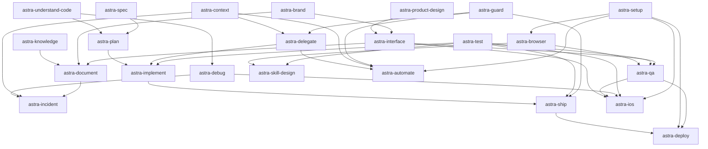
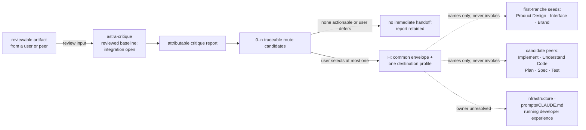

# Astra phase-0 skill design roadmap

**Snapshot:** 2026-08-13
**Status:** Locked six-skill authority roster and coordinator allocation;
consultant pairs and the final trigger surface are reconciled; source internalization and runtime
implementation remain deferred
**Amendment 1 (2026-07-31):** Source-body inspection of six thin candidates dissolved two proposed
designs, relocated one misfiled source, and excluded one broken source. See section 8.
**Amendment 2 (2026-07-31):** Source-body inspection of Context, Safety, Delegation & autonomy, and
Browser & QA withdrew one source, collapsed one alias, and recorded delivery-shape, authority, and
version obligations that the affected sections had omitted. No design was withdrawn. See section 9.
**Amendment 3 (2026-07-31):** Wave 1 pre-wave triage of all 21 Design & visual occurrences moved one
source, split three umbrellas, returned three sources to independent, deferred three built-ins,
recorded 36 bundled executables and 55 binary assets the neighborhood had never declared, and
proposed a reconciliation for the competing design-artifact authority claims. On the user's decision, `astra-presentation`
folded into `astra-interface`; the roster is 24. See section 10.
**Amendment 4 (2026-08-03):** Independent review of `astra-product-design` retained the merger on
source-authored evidence, corrected its authority, provenance, dependency, and peer contracts,
applied coordinator-safe ledger proposals from amendments 1–3, and withdrew generated-output line
duplication as maintenance or fork evidence wherever earlier roadmap sections relied on it. See
section 11.
**Amendment 5 (2026-08-04):** The eight-document initial public tranche is drafted. Seven designs
were written after amendment 4 with no roadmap or ledger update in between, so sections 2, 3.2, 4,
and 6.1 carried counts and coverage states that the drafted documents had already superseded. This
amendment reconciles those sections, records the seven declared Critique handoff profiles, adds the
`astra-debug` coverage row, and states plainly what remains unapplied. **It marks no design as
reviewed and changes no ledger row.** See section 12.
**Amendment 6 (2026-08-04):** The tranche was reconciled pairwise across all 28 bilateral pairs — 19
agree, 2 carry minor payload mismatches, 7 are structurally one-sided pending the Critique revision,
none is absent, and no two designs claim the same occurrence as primary. Reconciliation escalated
seven normative questions that evidence could not settle; all seven were decided by the user.
Deployment and release infrastructure are now **out of roster scope**, excluding `staging-debug` and
`changelog` on job-boundary grounds and scope-deferring four uninspected sources; `astra-plan` gains
an obligation to declare a second conditional handoff class; `triage` and
`commit-commands:clean_gone` are retained independent; all ten standing reference rows are kept.
On the user's further direction, five recorded repairs were then executed the same day in four
design files — the D1 class, the stale `astra-presentation` reroute, and three payload fixes;
section 13.8 records them. **It marks no design as reviewed and changes no ledger row.** See
section 13.
**Amendment 7 (2026-08-12):** The user-approved 92-component target is now the active coordinator
roadmap. The earlier 24-skill proposal is reconciled to six public coding-lifecycle skills and
profile/adaptor delivery shapes. Thirty-five collision occurrences were migrated as `claimed`,
and seven reference rows received locked consuming-design allocations without acquiring a global
disposition. No row is `resolved`. See section 14.
**Amendment 8 (2026-08-12):** All 15 admissible directed consultant pairs are reconciled as one
complete conditional authority DAG. Thirteen existing bilateral contracts remain unchanged;
Understand Code -> Critique is admitted conditionally and Understand Code -> Spec gains its
missing consumer checkpoint. The final shared trigger surface remains separate and open. See
section 15.
**Amendment 9 (2026-08-13):** Authority-result and artifact-state routing now reconciles the six
directly invocable lifecycle authorities with non-authoritative Report, replaces active Plan and
Debug destinations, and makes producer-owned reporting contracts reciprocal across all six
designs. The user-approved work order is slice-first: acceptance cases and drift-risk captures
precede one non-retiring implementation slice; reusable harness structure does not. See section 16.

> **Authority.** `docs/phase-0.md` governs phase scope and ledger ownership.
> `docs/design-requirements.md` governs every per-skill design. This roadmap schedules and
> proposes source allocation; it does not replace either document or make the source-claim
> ledger authoritative by itself.

> **Current-roadmap rule.** Sections 14–16 supersede sections 2–7 wherever the pre-lock 24-skill
> proposal conflicts with the locked six-skill coding stack. Sections 2–13 remain historical
> design and decision evidence; they do not authorize a seventh public coding-lifecycle skill.

## 1. Purpose and certainty

This roadmap answers five questions:

1. Which Astra skill design documents remain to be drafted?
2. Which candidate neighborhood is expected to produce each Astra skill?
3. Which original sources would that skill encapsulate if its design validates the proposal?
4. Which other designs must be reconciled before ownership and triggers are final?
5. Which problem classes may pass from Critique to a peer, and how complete is that handoff
   coverage?

The collision map is still evidence, not a predetermined roster. The roadmap therefore uses four
states:

| State | Meaning |
|---|---|
| **Reviewed baseline** | A reviewed phase-0 design exists; source expansion, peer integration, and final-roster reconciliation may remain open. |
| **Drafted; awaiting review** *(added by amendment 5)* | A complete phase-0 design document exists and was self-reviewed against `docs/design-requirements.md` sections 11 and 12, but the user has not reviewed it and the coordinator has not applied its ledger proposals. Its source allocations, peer contracts, and declared handoff profiles are **proposals with evidence**, not accepted contracts. A drafted design may still be revised, split, or withdrawn on review. |
| **Confirmed name** | The user approved the skill split and name; source allocation still requires the individual design's inspection. |
| **Provisional** | This roadmap proposes a skill and source allocation so work can be sequenced; the individual design may merge, split, rename, retain, or exclude sources with evidence. |
| **No new Astra skill proposed** | The neighborhood does not currently justify another merged skill; sources are redirected to another design or retained independently. |

**Drafted** sits between **Provisional** and **Reviewed baseline**, and the distance from drafted to
reviewed is not clerical: amendment 4's review of `astra-product-design` withdrew that design's
principal advantage claim and corrected its authority, provenance, dependency, and peer contracts
without changing the roster. Treat a drafted design's conclusions accordingly.

In this document, **encapsulates** means *proposed primary source home after successful design,
validation, and later retirement gates*. It does not mean the source is already absorbed or safe
to delete. `docs/phase-0-ledgers.md` remains authoritative until the coordinator reconciles a
completed design.

Sources marked **†** are harness built-ins whose bytes and immutable provenance are unavailable.
They may inform a proposed route, but no design may claim them absorbed until the host-version
provenance rule is resolved.

## 2. Current result

| Measure | Current proposal |
|---|---:|
| Reviewed phase-0 design baselines | 2 |
| **Drafted designs awaiting user review** *(amendment 5)* | **7** |
| Remaining confirmed-name documents | 2 |
| Remaining provisional documents | 13 |
| Planned revision of an existing design | 1 |
| Neighborhoods producing no Astra document or revision | 1 |
| Proposed Astra roster after all remaining documents | 24 |

The first four rows sum to the roster: 2 reviewed, 7 drafted, 2 confirmed-name, 13 provisional.

Amendment 3 reduced the confirmed-name count from four to three and the roster from 25 to 24 by
folding `astra-presentation` into `astra-interface`. That was a user decision recorded in section
10.2, not a source-evidence verdict; section 10.2 also records the obligation it transfers.
Amendment 4 moved `astra-product-design` from confirmed-name drafting to a reviewed baseline without
changing the roster. Amendment 5 moved seven designs from provisional to drafted, also without
changing the roster.

The reviewed baselines are [`designs/astra-critique.md`](../designs/astra-critique.md) and
[`designs/astra-product-design.md`](../designs/astra-product-design.md).

The seven **drafted** designs are [`astra-understand-code`](../designs/astra-understand-code.md),
[`astra-spec`](../designs/astra-spec.md), [`astra-plan`](../designs/astra-plan.md),
[`astra-implement`](../designs/astra-implement.md), [`astra-test`](../designs/astra-test.md),
[`astra-debug`](../designs/astra-debug.md), and [`astra-ship`](../designs/astra-ship.md). With
`astra-critique`, they are the eight-member **initial public tranche** — the minimal
project-development loop. All eight documents now exist; **drafted means written and self-reviewed,
not accepted.** Section 12.3 lists what that leaves open.

The 15 remaining documents and one revision are listed below. The proposed final count is not a
target: it must shrink, grow, or retain independent sources if source inspection and trigger
comparison require that. Critique is complete only as a reviewed document baseline; its code-review
source expansion and peer handoff reconciliation remain open.

## 3. Dependency and handoff semantics

Phase 0 permits designs to be drafted in parallel; peer designs do not need to exist first.
Relations in this roadmap are therefore reconciliation or future information-flow edges, not
blanket drafting blocks:

| Code | Meaning |
|---|---|
| **R** | **Roster reconciliation:** ownership, trigger, or relationship semantics must agree before either design is accepted into the final roster. |
| **I** | **Later implementation dependency:** the future runtime skill is expected to consume a peer's output or capability. This does not include an optional Critique problem handoff. |
| **H** | **Critique problem handoff:** after rendering every route candidate in its report, Critique may emit zero or one immediate capsule naming a peer that owns a selected problem class. The user decides whether and which route continues; Critique never invokes it. |
| **P** | **Provenance dependency:** unavailable source bytes, host behavior, or an external component must be resolved before absorption or retirement can be claimed. |

All proposed Astra skills are flat peers. Waves express design order; none creates a nested public
skill tree. An **H** relation is not an invocation dependency: it is a user-mediated output edge
carrying a problem, evidence, impact, scope, constraints, and uncertainty, but no solution.
The one-capsule limit bounds the next workflow; it does not permit Critique to omit other
independently actionable routes from its report.

Every proposed peer other than Critique must declare whether it accepts Critique handoffs:
**yes**, **conditional**, or **no**. A yes or conditional peer names the problem class it owns and
contributes a compact problem-only profile. A no declaration prevents a fabricated route but does
not narrow Critique's review scope.

### 3.1 Provisional peer dependency map

The graph below shows only the strongest proposed **I** relationships among peers other than
Critique. **R** and **P** relations remain in the wave tables. Critique is omitted because its
review-and-return topology is a feedback loop, not a forward dependency chain.



Arrows point from an output or capability owner to a likely consumer. They are provisional until
both peer designs reconcile the relationship. Section 5 records source and ownership relations
that do not belong in this implementation-flow view.

**Amendment 1 changes to this graph.** The `astra-architecture` node was removed and its
`architecture --> plan` edge succeeded by `understand --> plan`, because `astra-understand-code`
absorbs the technical-design jurisdiction. The `astra-research` node was removed because `research`
is now a retained independent source, not a peer: `astra-document` still consumes its output, but
as an independent reference recorded in the reference and cleanup ledger, which is not an **I**
relation between peers. Section 8 records the inspected evidence for both removals.

**Amendment 3 changes to this graph.** The `astra-presentation` node was removed. Its
`brand --> presentation` edge is discharged by the existing `brand --> interface` edge, and its
`presentation --> document` edge was succeeded by `interface --> document`, because
`astra-interface` now owns deck output. Unlike amendment 1's two removals, this one is a user
decision rather than a source-evidence verdict: the sources still describe a deck outcome, and
section 10.2 records the job-statement obligation that removing the node transfers to
`astra-interface`.

### 3.2 Critique review and handoff topology

Critique is cross-cutting. A user may submit an artifact produced by any supported peer or outside
the Astra roster. Critique renders an attributable report first. That report may retain zero or
more route candidates because independent findings can belong to different peers. The user then
selects zero or one candidate as the immediate **H** handoff. The destination may be the same peer
that produced the artifact, so this relationship is intentionally not forced into the acyclic
graph above.



If several reviewers nominate incompatible owners for the same problem, the user resolves the
classification. If several independent problem classes map cleanly to different owners, all
remain in the report and the user chooses which one, if any, becomes the immediate capsule.
Critique's procedural chair does not prioritize them.

Destination profiles are support data, not a skill registry or allowlist. Each destination
design owns the problem class it accepts and the destination-only payload it needs. During final
roster reconciliation, the coordinator records the accepted profile as the canonical peer
contract and Critique consumes that reconciled snapshot. A missing or inconsistent profile leaves
the route candidate in the report as a reconciliation gap; Critique neither guesses its payload
nor substitutes an unrelated peer.

Critique's accepted artifact and selected lenses determine review scope. In later runtime,
Critique reads at most the selected compact profile and never reads or invokes the destination's
full `SKILL.md`. The selected peer owns solution exploration and its own user-visible job; that
peer's design independently defines any mutation or execution authority.

The coverage states below are roadmap states, not implementation claims:

| Critiqued problem class | Candidate destination | Coverage state | Required reconciliation |
|---|---|---|---|
| Approved design-direction problem | `astra-product-design` | **Accepted and narrowed H; design reviewed** | Product Design owns whether the approved direction is wrong for the product or its users. Payload: approved variant and `approved.json`, contradicted `DESIGN.md` anchors, memorable-thing statement, and originating decision stage. User-journey materialization belongs to Interface. |
| Interaction, accessibility, or visual-system defect | `astra-interface` | **Seeded H** | Destination design must preserve report-only versus fix authority. |
| Identity or audience-signal inconsistency | `astra-brand` | **Seeded H** | Destination design must define the brand-specific problem payload. |
| Narrative or data-comprehension problem | `astra-interface` | **Seeded H; re-targeted by amendment 3** | Re-targeted from `astra-presentation`, which amendment 3 folded into Interface. Interface therefore owns two seeded problem classes and must give each a separately named payload or narrow one; a single merged payload would lose the distinction Critique needs to route. **Reconciled by amendment 6 section 13.8:** both stale `astra-presentation` anchors in `designs/astra-critique.md` — the destination table and the section 9.2 routing corpus, the latter an anchor amendment 3 did not cite — now name `astra-interface`, and the destination table gained an explicit problem-class column so Interface's two classes stay separately payloaded. The Critique source-expansion revision inherits the profiles, not this correction. |
| Code defect requiring remediation | `astra-implement` | **Declared H; design drafted** | Declared `conditional` for `approved-code-remediation`. Accepted only with an approved bounded remediation plan attached; otherwise Plan is the destination. **Amendment 6:** that fallback had no receiving contract — Plan's declared class and both of its intake doors rejected a known-cause defect with no plan. Decision D1 resolves it, and section 13.8 records the resolution as **applied**: `astra-plan` §7.2.2 now declares `unplanned-code-remediation`, so the fallback is receivable and the Critique source-expansion revision may encode it. Reconcile with the Code review expansion and keep Critique read-only. |
| Architecture or technical-design problem | `astra-understand-code` | **Declared H; design drafted** | Declared `yes` for `architecture-or-technical-design`. Re-targeted by amendment 1. Still reconcile against `how`'s existing critique mode so two peers do not both own multi-lens architectural critique. |
| Defect in an accepted execution plan | `astra-plan` | **Declared H; design drafted** | Declared `conditional` for `execution-plan-defect`. Keep plan revision separate from Critique's report. **Amendment 6:** decision D1 obliges Plan's next revision to declare a *second* conditional class for a known-cause defect with no plan, carrying its own payload and no `plan_lifecycle_state` field, so `execution-plan-defect` is not stretched to cover planning from scratch. Two distinct jobs, two classes. |
| Specification gap or ambiguity | `astra-spec` | **Declared H; design drafted** | Declared `yes` for `specification-gap-or-ambiguity`, with a two-field destination payload. Distinguish changing intent from changing the execution plan. |
| Missing or inadequate testing | `astra-test` | **Declared H; design drafted** | Declared `yes` for `test-evidence-gap`. Preserve Critique's non-goal of executing or bootstrapping tests. |
| **Observed failure whose cause is unestablished** | `astra-debug` | **Declared H; design drafted** *(new in amendment 5)* | Declared `conditional` for `unexplained-failure`. Distinguish from Implement's remediation class (cause already known), Understand Code's architecture class (no runtime failure), and Test's evidence-gap class (coverage, not causation). The payload carries no suspected cause: a suspicion is a partial solution, which Critique may not emit. See [`designs/astra-debug.md`](../designs/astra-debug.md) section 7.3. |
| **Published artifact misrepresents the change** | `astra-ship` | **Declared H; design drafted** *(new in amendment 5)* | Declared `conditional` for `publication-defect` — commit history, release metadata, PR/MR body, integration state, or workspace residue. `landed_state: merged` never authorizes history rewriting. Distinct from the clean-review **I** row below. |
| Infrastructure or operational-change problem | Diagnosis half claimed by `astra-debug`; change half unresolved among Understand Code, Implement, or a retained peer | **Partially narrowed; deployment portion out of scope; owner still open** | Amendment 5: `astra-debug` claims only *identifying* that a cause is infrastructural, on the evidence of `staging-debug`'s and `local-debug`'s infrastructure classifiers, and explicitly declines the change half. **Amendment 6:** decision D2 puts the change half's *deployment* portion out of roster scope, so Deploy is no longer a candidate owner for it; `staging-debug` is excluded and Debug's classifier evidence now rests on `local-debug` alone. The design and code portions remain open among the remaining peers. |
| Prompt, `SKILL.md`, or CLAUDE.md problem | Unresolved among Skill Design, Document, or a retained peer | **Open owner** | The relevant peer designs must divide instruction design from artifact editing. **Amendment 6:** all three Plan-&-spec-derived designs are now drafted and none claims the class — Spec's non-goals exclude project mutation, Plan's core has zero write authority, and Implement mutates only what an approved plan names. The ledger's applied `/trim` secondary role ("Plan & spec: prompt or skill remediation") therefore points at a neighborhood that produced no owner and should be re-aimed when Skill Design or Document is drafted. |
| Running developer-experience problem | Unresolved among Interface, QA, Setup, or a retained peer | **Open owner** | The relevant peer designs must divide product defects, verification, and environment setup. Amendment 6: unchanged — the tranche supplied no evidence, and `astra-test` section 2.2 explicitly routes exploratory QA out. |
| No actionable finding survives | `none` | **Terminal** | Emit no handoff. |
| The user defers every actionable route | `none` for the immediate handoff | **Terminal for this run** | Retain every route candidate in the report; start no peer workflow. |
| A clean review is followed by publication | `astra-ship` | **I only, not H** | Ship may consume review evidence, but Critique must not invent a problem handoff. |

**Seeded H** means Critique currently contains an illustrative destination payload; it does not
mean the destination has accepted it. **Candidate H** means Critique names the problem class and
likely owner but the destination profile remains unwritten. **Declared H; design drafted**
*(amendment 5)* means the destination design exists, declares `yes` or `conditional`, and owns a
written problem class and compact payload — but the design is self-reviewed only, so the profile is
**not yet a canonical peer contract**. Section 7 milestone 3 still has to record it as one, and
Critique consumes only the coordinator-reconciled snapshot. **Open owner** requires an explicit
roster decision rather than fallback to an unrelated peer.

No class advanced to a reviewed state in amendment 5. Seven destinations moved from *unwritten
profile* to *written but unreviewed profile*, which changes what Critique's source-expansion
revision has to read, not what it may rely on.

## 4. Recommended design waves

**Amendment 5 status note.** Waves express drafting order, not acceptance order. Seven designs now
read **Drafted; awaiting review** — `astra-understand-code` and `astra-test` from Wave 2,
`astra-spec`, `astra-plan`, `astra-implement`, and `astra-debug` from Wave 3, and `astra-ship` from
Wave 4. They were drafted out of wave order because together they form the initial public tranche
the user selected. A drafted design is self-reviewed only: it may still be revised, split, or
withdrawn on review, and its ledger proposals remain unapplied. Waves 1, 5, and 6 are untouched.

### Wave 0 — reviewed baseline

| Design | Status | Result |
|---|---|---|
| [`astra-critique`](../designs/astra-critique.md) | **Reviewed baseline; integration open** | Owns adversarial critique and the audit/report portion of `design-review`; code-review source expansion and destination acceptance remain open. |

### Wave 1 — current Design tranche

The user selected this tranche next. Amendment 3 ran section 6.1's pre-wave triage over all 21
occurrences and reduced the tranche from four designs to three. Product Design is now reviewed;
draft `astra-brand` next because its identity boundary constrains `astra-interface`. Interface is
deliberately last: amendment 3 gives it the largest jurisdiction, the deck outcome, two seeded
Critique classes, and the token-generator conflict, so it should be written once both Product and
Brand boundaries are fixed.

| Proposed design file | Status | Reconcile with |
|---|---|---|
| [`designs/astra-product-design.md`](../designs/astra-product-design.md) | **Reviewed baseline; reconciliation open** | **R:** `astra-interface`, `astra-brand`; **H (accepted and narrowed):** Critique design-direction problems, not user-journey materialization; accepts Product's side of provisional `DESIGN.md` editorship; shared `UX_PRINCIPLES` is a generation-pipeline component whose behavior each Product/Interface/Critique consumer must classify, not a Product-versus-Interface primary-home contest |
| `designs/astra-brand.md` | **Confirmed name; narrowed by amendment 3** | **R:** `astra-interface`, `astra-document`; **H (seeded):** Critique identity and audience-signal problems; **I:** design-token and asset consumers; loses `theme-factory`, `canvas-design`, and `algorithmic-art`; **must** disposition four `scripts/*.cjs` executables, one Python test, and the `docs/brand-guidelines.md` → `assets/design-tokens.json` sync it owns — see section 10.3 |
| `designs/astra-interface.md` | **Confirmed name; scope widened by amendment 3** | **R:** Product/Brand, `astra-test`, `astra-qa`, `astra-document`; **H (seeded):** Critique interaction, accessibility, and visual-system defects **and** narrative or data-comprehension problems; **absorbs** the deck jurisdiction formerly proposed as `astra-presentation`; **must** write section 7.1's job statement without an `or` or split again, disposition 22 bundled executables across five sources, and resolve which token generator is authoritative — see sections 10.2 to 10.4; **P:** `artifact-design`, `artifact-capabilities`, and `dataviz` built-ins, all deferred by amendment 3 |

### Wave 2 — cross-cutting foundations

| Proposed design file | Status | Reconcile with |
|---|---|---|
| `designs/astra-guard.md` | **Provisional** | **R:** authority and trigger semantics with every mutation-capable skill; **I:** peers may consume explicit Guard state or warnings if their designs justify it; destructive-action boundaries remain local to each consumer; **must** disposition three `PreToolUse` hooks, two vendored `bin/` scripts, and template-generated `SKILL.md` provenance — see section 5.14 |
| `designs/astra-context.md` | **Provisional; narrowed by amendment 2** | **R:** ownership and trigger semantics with `astra-delegate`, `astra-automate`, `astra-plan`, `astra-incident`; **I:** those peers may consume explicit restored or serialized context if their designs justify it; `nowhat` withdrawn to retained independent; `handoff`'s temp-directory destination, fresh-agent reader, and redaction duty must survive as declared behavior |
| [`designs/astra-understand-code.md`](../designs/astra-understand-code.md) | **Drafted; awaiting review** *(amendment 5)* | **R:** Spec, Plan, `astra-debug`, `astra-implement`, Critique code lenses and `how`'s existing critique mode; **H declared `yes`:** `architecture-or-technical-design`; **absorbs** the Codebase-comprehension technical-design jurisdiction formerly proposed as `astra-architecture`. Amendment 1's one-invocation justification is answered in the design; the `code-tracing` eval-bundle drift it found is a new open item |
| [`designs/astra-test.md`](../designs/astra-test.md) | **Drafted; awaiting review** *(amendment 5)* | **R:** `astra-implement`, `astra-qa`, `astra-ship`, `astra-interface`; **H declared `yes`:** `test-evidence-gap`; **P:** `run` built-in still unresolved |
| `designs/astra-delegate.md` | **Provisional; advantage reopened by amendment 4** | **R:** Context, Guard, `astra-implement`, `astra-automate`; preserve agent delivery shape; generated preamble duplication is not maintenance value, so re-triage its four sources and prove a source-authored positive advantage or split/retain them |
| `designs/astra-setup.md` | **Provisional** | **R:** Browser, Deploy, Automation, iOS, Skill Design; **P:** three setup/config built-ins |

### Wave 3 — core project-development loop

| Proposed design file or revision | Status | Reconcile with |
|---|---|---|
| [`designs/astra-spec.md`](../designs/astra-spec.md) | **Drafted; awaiting review** *(amendment 5)* | **R:** `astra-knowledge`, `astra-understand-code`, Product Design; **H declared `yes`:** `specification-gap-or-ambiguity` with a two-field destination payload |
| [`designs/astra-plan.md`](../designs/astra-plan.md) | **Drafted; awaiting review; amended in place by amendment 6** | **R:** Spec, `astra-understand-code`, Context, Implement; **H declared `conditional`:** **two** classes — `execution-plan-defect` (§7.2.1) and `unplanned-code-remediation` (§7.2.2). Its open question 9 — the exact accepted diagnosis artifact — is answered by `astra-debug` section 2.4. **Decision D1's obligation is discharged, not pending:** section 13.8 records the second class as applied, with a two-field payload, an `unknown`-bearing `spec_coverage` field, a rule that this class does **not** require an accepted Spec, a matching intake door at section 2.5, and a boundary statement against four neighbouring classes. Review should check that §7.2.2 and §2.5 do not overlap and that §2.4's Spec gate is correctly bypassed rather than weakened |
| [`designs/astra-implement.md`](../designs/astra-implement.md) | **Drafted; awaiting review** *(amendment 5)* | **R:** Plan, Delegate, Test, Guard, `astra-understand-code`, Critique infrastructure-route ownership; **H declared `conditional`:** `approved-code-remediation`; receives code-simplification sources from Code review; consumes `codebase-design` as a retained independent reference. Its three Ship-dependent retirement gates are answered by `astra-ship` section 6.4 |
| `designs/astra-critique.md` source-expansion revision | **Existing design revision; not started** | **R:** Code review, Understand Code, Test; must not create a competing nested code-critique skill; must reconcile `how`'s multi-lens critique mode and `improve-codebase-architecture`'s `/grilling` step as **H** edges rather than duplicated internal panels. **Amendment 5 adds:** it must also read the seven declared destination profiles in section 3.2 and correct the stale `astra-presentation` destination at `designs/astra-critique.md` lines 588 and 764 |
| [`designs/astra-debug.md`](../designs/astra-debug.md) | **Drafted; awaiting review** *(amendment 5)* | **R:** Understand Code, Test, Browser/QA, Incident; **H declared `conditional`:** `unexplained-failure`. **Amendment 6:** its proposal to move `staging-debug` to `astra-deploy` is **void** — decision D2 excluded the source outright, so the design's five remaining sources stand and its infrastructure-classifier evidence now rests on `local-debug` alone. The "root cause analysis" collision with `astra-incident` is settled provisionally by decision D3 (live-incident context → Incident; otherwise Debug; the bare string is not a router key), pending Incident's confirmation on drafting. Its `local-debug` steps 1–3 secondary role onto `astra-test` remains Test-unconfirmed |
| `designs/astra-incident.md` | **Provisional; narrowed by amendment 1** | **R:** Debug, Context, Document, Guard; keep stabilization distinct from causal diagnosis; `rca` and `firefighting` are concurrent sessions with mutually exclusive authority, so the declared advantage is **coordination only**, not better judgment; `triage` relocated out of this design and **retained independent by amendment 6 decision D5**. **Amendment 6 adds an obligation:** it **must confirm or amend decision D3's provisional routing rule** for "root cause analysis" — live-incident signals route here, everything else to `astra-debug`, and the bare string is never a router key. Incident is the only party that can accept a rule proposed from Debug's side alone |

### Wave 4 — browser, quality, and delivery

| Proposed design file | Status | Reconcile with |
|---|---|---|
| `designs/astra-browser.md` | **Provisional; restructured by amendment 2** | **R:** Setup, Guard, QA, Skill Design; preserve MCP, browser-daemon, cloud-browser, Electron, and authenticated-session delivery shapes; the four environment adapters become reference files behind one description, each retaining its own prerequisite and degradation; `connect-chrome` and `open-gstack-browser` collapse to one artifact with one shadowed identifier; **P:** the `agent-browser` CLI binary |
| `designs/astra-qa.md` | **Provisional; fork evidence corrected by amendment 4** | **R:** Browser, Test, Interface, Critique running-developer-experience route ownership; preserve report-only versus fix effects without treating frontmatter pre-approval as enforcement; compare the 2.0.0 and 1.0.0 templates plus shared resolver semantics because generated-line counts do not prove fork drift; reconcile the CLI, Python-Playwright, and MCP runtimes by component type |
| [`designs/astra-ship.md`](../designs/astra-ship.md) | **Drafted; awaiting review** *(amendment 5)* | **R:** Implement, Test, Guard, Context, Document; **I:** may consume Critique review evidence, but a clean review is not an **H** edge; **H declared `conditional`:** `publication-defect`; preserve explicit user control over commits, pushes, PRs, and merges |
| `designs/astra-deploy.md` | **Provisional; out of roster scope for now (amendment 6)** | **R:** Ship, Setup, Browser/QA, Guard, Critique infrastructure-route ownership; preserve provider-specific prerequisites and canary degradation. **Amendment 6 decision D2 puts deployment and release infrastructure out of scope for the minimal coding roster.** Both inbound claims from amendment 5 are void, not deferred: `staging-debug` and `changelog` are excluded outright rather than rehomed here. Its four proposed sources — `land-and-deploy`, `canary`, `setup-deploy`, `/build-push-ecr` — are **scope-deferred**, still `unclaimed` and `Pending source inspection`, which the ledger's state vocabulary says cannot support exclusion until inspected. The design is annotated, **not withdrawn**: a later scope change reopens it without resurrecting a deleted node. Do not draft it until the user returns deployment to scope |

### Wave 5 — knowledge, meta-work, and autonomy

| Proposed design file | Status | Reconcile with |
|---|---|---|
| `designs/astra-knowledge.md` | **Provisional** | **R:** Spec, `astra-understand-code`, Document, Context; preserve `domain-modeling` as a cross-role; must not absorb `research`, whose evidence-gathering outcome amendment 1 kept separate |
| `designs/astra-document.md` | **Provisional; adjusted by amendment 3** | **R:** Knowledge, Brand, Interface, Ship, Incident, Critique prompt/CLAUDE.md route ownership; consumes `research` and — after amendment 3 — `diagram` as retained independent references, not peer outputs; the open question is no longer whether `diagram` belongs here rather than in Presentation, but whether Document's consumption of it is strong enough to reopen a primary claim |
| `designs/astra-skill-design.md` | **Provisional** | **R:** Test, Browser, Setup, Critique prompt/`SKILL.md` route ownership; preserve skill-scoped agents and benchmark delivery shapes; `prompt-lookup` is no longer routed here or anywhere — amendment 1 excludes it |
| `designs/astra-automate.md` | **Provisional** | **R:** Delegate, Context, Guard, Setup, Plan, Ship, and the six separate `loop-goal` lifecycle handlers, which must be pinned to `loop-goal` 1.3.0 because the orphaned 1.2.0 carries only four; `nightnight` spans Spec, Automate, Critique/QA, and Ship and needs explicit cross-roles; **P:** `loop` and `schedule` built-ins, plus `nightnight`'s two currently unmet prerequisites — the uninstalled `ralph-loop:ralph-loop` skill and a Jira MCP tool |

### Wave 6 — specialized platform decision

| Proposed design file | Status | Reconcile with |
|---|---|---|
| `designs/astra-ios.md` | **Provisional, later** | **R:** Interface, QA, Debug, Test, Setup, Critique iOS-problem route ownership; the design may instead retain the iOS pack if a self-contained merger adds no personal value |

The Ops & routine neighborhood currently produces no merged Astra design. Section 5.17 records
why `meeting` and `retro` should remain independent unless later evidence establishes one user job.

## 5. Neighborhood derivation and proposed source allocation

Every source below is an exact collision-map identifier. Allocations remain roadmap proposals
unless the coordinator reserves or reconciles them in `docs/phase-0-ledgers.md`; that ledger is
authoritative. The Wave 1 primary homes are now reserved as `claimed`, not `resolved`.

### 5.1 Adversarial critique — reviewed baseline; integration open

**Derived Astra skill:** `astra-critique`.

**Encapsulates:** `grilling`, `grill-me`, `grill-with-docs`, `/diss`, `/diss-api`,
`diss-infra`, `diss-claudemd`, `/elon`, `/trim`, `office-hours`, `plan-ceo-review`,
`plan-eng-review`, `plan-design-review`, `plan-devex-review`, `devex-review`, and `autoplan`.

**Remaining work:** no new standalone design document. Later source-expansion revisions reconcile
Code review sources and any other critique jurisdiction. Each peer design must also accept,
condition, or decline its candidate **H** relation; neither unfinished profiles nor declined
destinations narrow Critique's review scope.

### 5.2 Code review

**Derived Astra skills:** no competing code-critique skill. Revise `astra-critique`, and route
mutation-oriented cleanup into `astra-implement`.

- **`astra-critique` expansion:** `code-review`, `review`, `requesting-code-review`,
  `receiving-code-review`, `superpowers:requesting-code-review`,
  `superpowers:receiving-code-review`, `feature-dev:code-reviewer`,
  `code-review:code-review`, and `security-review`†.
- **`astra-implement`:** `simplify`†, `code-simplifier`, and `health`.

The individual investigation must test whether requesting/receiving review remain lifecycle modes
inside Critique or retain independent entry points. In either case, they do not justify a child
skill tree.

### 5.3 Browser & QA

**Derived Astra skills:** `astra-browser` and `astra-qa`.

- **`astra-browser`:** `agent-browser`, `browse`, `connect-chrome` / `open-gstack-browser` (one
  artifact; see below), `agentcore`, `vercel-sandbox`, `electron`, `scrape`, `slack`,
  `setup-browser-cookies`, and `playwright` MCP.
- **`astra-qa`:** `webapp-testing`, `benchmark`, `dogfood`, `qa`, and `qa-only`.
- **Cross-neighborhood primary homes:** `skillify` → `astra-skill-design`; `pair-agent` →
  `astra-delegate`. Browser remains a secondary role for both.

`astra-browser` must expose capability and environment selection without making cloud browsers,
Electron, Slack, or authenticated cookies separate public child skills. `astra-qa` owns testing
policy, evidence, and report/fix authority, not browser setup.

**Amendment 2 — five findings.**

- **`connect-chrome` and `open-gstack-browser` are one artifact, and one identifier is
  unreachable.** Both `SKILL.md` files are symlinks into `~/.claude/skills/gstack/` with different
  targets and different inodes, but identical bytes and identical length, and **both declare
  `name: open-gstack-browser`**. The live roster registers only `connect-chrome`; the other
  identifier is shadowed by that name collision and is not invocable. These are two collision-map
  occurrences over one artifact, so one row is an alias whose `availability` cannot read plain
  `live`, and the ledger's count of distinct source identifiers is overstated accordingly. Section
  9.3 proposes both corrections.
- **Four of the eleven Browser sources are adapters over one CLI, not peers.** `agentcore`,
  `vercel-sandbox`, `electron`, and `slack` each declare `agent-browser` as their only tool
  authority and each describes running that CLI somewhere else — AgentCore states the invariance
  outright, that all standard commands work identically and only the browser's location differs.
  Same playbook, different target: these are jurisdictions, and the README principle on granularity
  puts jurisdictions of that shape into reference files behind one description rather than into four
  separate descriptions. Demoting them is the largest context-budget saving currently identified in
  this roadmap, and it is a tiering decision the deferred architecture section does not yet own.
  What must survive the move is each adapter's **prerequisite and degradation**, which differ even
  though the playbook does not: AWS credentials, a Vercel Sandbox plus a snapshot identifier, a
  Chrome DevTools Protocol port, and an authenticated session respectively. The `agent-browser` CLI
  itself is a binary prerequisite, not prose.
- **`qa` and `qa-only` differ by declared mutation capability and version.** *Amendment 2's
  quantitative fork basis is superseded:* the 1217 identical lines and 491-line delta were measured
  on generated `SKILL.md` outputs. Both authored templates invoke the same `QA_METHODOLOGY` resolver;
  their templates share 91 lines by multiset intersection, 61 non-blank. `qa` still declares
  `Edit`, `Glob`, and `Grep` while `qa-only` does not, and their declared versions remain 2.0.0 and
  1.0.0. Those are real obligations, but neither generated-line count proves that `qa-only` is an
  older behavioral fork. The QA design must compare templates plus resolver output semantically and
  must preserve report-only versus fix effects without mistaking tool pre-approval for enforcement.
- **Three delivery shapes drive a browser across these two skills.** The `agent-browser` CLI, the
  Python Playwright scripts that `webapp-testing` writes with its own helper script and licence file,
  and the `playwright` MCP server are three runtimes for one capability, currently split across
  `astra-browser` and `astra-qa` with no reconciliation. `docs/phase-0.md` section 9 criteria 8 and 9
  require resolving this by component type.
- **Browser and Benchmark share capability setup, not a measured authored block.** *Amendment 2's
  620-line / 79% basis is superseded:* it measured generated outputs; the authored templates share
  81 lines by multiset intersection, 34 non-blank, much of it frontmatter, fences, `PREAMBLE`, and
  `BROWSE_SETUP`. The `browser --> qa` relation may still be justified because Benchmark consumes a
  browser capability, but it may not be justified as removing copied authored prose. The two designs
  must classify that capability relation from templates and resolver sources. Separately,
  `dogfood` shares only 99 generated lines with `qa` and imposes
  a stricter evidence standard — step-by-step screenshots and reproduction video for handoff — that
  must be reconciled against `qa-only`'s report. `scrape` declares an extraction outcome rather than
  a browser-driving or quality outcome and needs the same different-outcome test applied to `triage`
  in section 5.8; amendment 2 inspected only its declaration, not its body.

### 5.4 Design & visual

**Derived Astra skills:** `astra-product-design`, `astra-interface`, and `astra-brand`. Amendment 3
folded `astra-presentation` into `astra-interface` on the user's decision.

- **`astra-product-design`:** `design-consultation` and `design-shotgun`; consumes the mockup slice
  of coordinating-home source `design` as an explicit secondary role.
- **`astra-interface`:** `design-system`, `design-html`, `ui-styling` less its canvas-art reference
  slice, `ui-ux-pro-max`, `frontend-design`, `web-artifacts-builder`, `slides`, and `theme-factory`
  moved in from Brand, plus the token/UI-routing and slide/HTML-presentation slices of `design`.
- **`astra-brand`:** `design` as coordinating primary home, `brand`, `brand-guidelines` as a
  source-specific profile rather than a generic workflow, and `banner-design`.
- **Returned to independent by amendment 3:** `canvas-design`, `algorithmic-art`, and `diagram`.
  None is retirement-eligible; each becomes a reference and cleanup ledger row with disposition
  `keep` pending the user's decision.
- **Deferred by amendment 3:** `artifact-design`†, `artifact-capabilities`†, and `dataviz`†. All
  three are built-ins with no path and no manifest, so they cannot satisfy the provenance rule and
  may not be counted toward any peer's source basis.
- **Existing primary home:** `design-review` audit/report → `astra-critique`; Interface owns its
  fix/verify secondary role, Test owns its bootstrap/regression secondary role, and — added by
  amendment 3 — Ship/VCS owns its commit authority.

Cross-role behaviors must remain visible: `design-system` also informs Brand; `theme-factory` also
informs Brand, which supplies its constraints; `ui-ux-pro-max` also informs Product; and `diagram`
informs both Document and Interface as a retained independent.

**Amendment 1 correction — `design` was missing every cross-role.** Its declaration spans all four
proposed Design peers: brand identity and logo/CIP work (Brand), design tokens and UI styling
(Interface), HTML presentations and slide building (Presentation), and mockups (Product Design).
*Superseded in part by amendment 3: the slide and HTML-presentation cross-role now points at
`astra-interface`, so `design` spans three peers rather than four. The finding that the ledger
recorded no cross-role at all still stands.*
The ledger originally reserved it to `astra-brand` with no secondary roles recorded, which conflicts with
`docs/phase-0.md` section 5's rule that secondary roles must be explicit. Section 8 proposes the
correction, and the coordinator applied the current three-home split in amendment 4.

**Amendment 4 correction — `UX_PRINCIPLES` is a shared build input, not an occurrence cross-role.**
The Three Laws of Usability, Goodwill Reservoir, billboard design, and wayfinding text is generated
from one resolver partial consumed by `design-shotgun`, `design-html`, `design-review`, and
`plan-design-review`, spanning Product, Interface, and Critique. It is not authored inside
`design-shotgun`, so the earlier Product-versus-Interface primary-home question is withdrawn and no
Interface secondary role is attached to that occurrence. Each consuming design must classify the
behavior it needs. A shared Astra module may be proposed only after at least two designs demonstrate
the same interface and variation; meanwhile the generation-pipeline component preserves provenance.

**Amendment 3 — six findings.**

- **The peers survived source inspection; the allocation did not.** All 21 occurrences were read
  from their bodies, registrations, dependencies, and outputs. The result corrects the allocation in
  six ways: `theme-factory` moves out of Brand because its own purpose statement is applying themes
  to *presentation slide decks*; three umbrella sources decompose rather than landing whole;
  `canvas-design`, `algorithmic-art`, and `diagram` return to independent; three built-ins defer;
  `brand-guidelines` is an Anthropic-specific profile, not a generic workflow; and `design-review`
  splits four ways rather than three. What the inspection did **not** find is a reason to add
  `astra-visual-art`: `canvas-design`, `algorithmic-art`, and `diagram` produce different static,
  interactive-generative, and editable-diagram outcomes with different delivery shapes. A wrapper
  would currently add routing convenience only, and no personal-value evidence justifies replacing
  their distinguishable interfaces with another public Astra job.
- **Three umbrella sources decompose, and the ledger schema cannot express that.** `design`,
  `design-system`, and `ui-styling` each carry behavior belonging to more than one peer, and the
  split is a behavioral decomposition rather than one owner informing another. But
  `docs/phase-0.md` section 5 allows `primary_home` exactly one value, and defines `secondary_roles`
  as designs a source informs *without transferring ownership* — which is precisely what a split
  does do. This is the same class of gap amendment 2 recorded for `loop-goal`'s missing version
  field: a real property of the artifacts that the schema has no field for. Section 10.5 proposes
  the coordinating primary home for each so the ledger stays valid, and leaves the split itself as a
  joint obligation on the three Wave 1 designs, which is where amendment 1 section 8.4 already
  placed it.
- **The neighborhood bundles 36 executables and 55 binary assets that no document declares.**
  Amendment 3 inspected bundled components, not only `SKILL.md` bodies, and found the largest
  undeclared delivery-shape surface in the roster so far — roughly ten times the `guard` case
  amendment 2 recorded. `docs/design-requirements.md` section 4.3 forbids flattening these into
  prose and `docs/phase-0.md` section 9 criterion 9 makes omitting them an acceptance failure, so
  each Wave 1 design must give every script and asset in its sources an explicit disposition.
  Section 10.3 holds the census.
- **The design-artifact authority conflict is between generators, not only between documents.**
  Three sources each claim to own the same artifact: `design-consultation` writes root `DESIGN.md`,
  `brand` calls `docs/brand-guidelines.md` the source of truth and syncs it into
  `assets/design-tokens.json`, and `ui-ux-pro-max` directs the agent to use `design-system/MASTER.md`
  *exclusively*. The conflict is executable: `brand/scripts/sync-brand-to-tokens.cjs`,
  `design-system/scripts/generate-tokens.cjs`, and `ui-ux-pro-max/scripts/design_system.py` are
  three programs that write or derive the same token file. Section 10.4 proposes an authority stack
  that would determine which *generator* wins, not merely which document is quoted. Product Design
  accepts its side; Brand, Interface, the coordinator, and the user must still reconcile it.
- **`astra-presentation`'s retention basis was already void when the user folded it.** Amendment 1
  section 8.2 retained it on "963 inspectable lines plus four `slides` reference files", counting
  `diagram` and `dataviz`. Amendment 3 returns `diagram` to independent and defers `dataviz`,
  leaving `slides` at 40 lines — which the inspection also found is a thin router that must not be
  the sole oracle — and `theme-factory` at 59. Its real substance was always the slide subsystem
  inside `design-system`, an Interface-owned source. The user's fold therefore removes a cross-peer
  split rather than creating one; the burden it transfers is recorded in section 10.2.
- **`canvas-design` is a font library with a `SKILL.md` attached.** Its 130-line body ships with 82
  bundled files, 54 of them TrueType fonts, plus 28 licence texts. Amendment 3's retain
  recommendation was written from the body alone; the bundle makes it much stronger, because
  vendoring 54 binaries to satisfy self-containment is not a merger any declared advantage would
  justify. `ui-styling` reaches this material through a single
  `references/canvas-design-system.md` pointer, which is a reference relation, not absorption.

### 5.5 Plan & spec

**Derived Astra skills:** `astra-spec`, `astra-plan`, and `astra-implement`.

- **`astra-spec`:** `superpowers:brainstorming`, `spec`, `to-spec`, and `sdd`.
- **`astra-plan`:** `superpowers:writing-plans`, `planb`, `plan-tune`, `wayfinder`, and
  `to-tickets`.
- **`astra-implement`:** `superpowers:executing-plans`,
  `superpowers:subagent-driven-development`, `implement`, and
  `feature-dev:feature-dev`.
- **Cross-neighborhood disposition:** `feature-dev:code-architect` is a retained agent coordinated
  by `astra-understand-code`; see section 5.9. Amendment 1 changed this from a primary home in
  `astra-architecture`.
- **Independent candidate, discharged by amendment 3:** retain `prototype`. Its Wave 1 inspection
  found a throwaway logic or UI experiment that promotes only its learned decision and discards the
  artifact. Product Design, Interface, and Understand Code may consume its findings; none owns its
  lifecycle, because owning it would mean owning the discard. Understand Code may still reopen this
  during Wave 3, but the Product Design half of the question is now answered.

Spec decides what should be built, Plan turns an accepted specification into executable work, and
Implement changes the project. Their user approvals and mutation authority must remain separate.

### 5.6 Ship & VCS

**Derived Astra skills:** `astra-ship` and `astra-deploy`.

- **`astra-ship`:** `ship`, `landing-report`, `/pr`, `/commit`,
  `commit-commands:commit`, `commit-commands:commit-push-pr`, `document-release`,
  `resolving-merge-conflicts`, `superpowers:finishing-a-development-branch`,
  `superpowers:using-git-worktrees`, and `github`.
- **`astra-deploy`:** `land-and-deploy`, `canary`, `setup-deploy`, and
  `/build-push-ecr` — **all scope-deferred by amendment 6.** They remain `unclaimed` and
  `Pending source inspection`, a state the ledger says cannot support exclusion, so they are
  out of scope without being excluded. Inspection must precede any exclusion.
- **Excluded by amendment 6:** `changelog`. The user's ground is a **job boundary** — deployment
  and release infrastructure are out of scope for this minimal coding roster — which meets
  `docs/design-requirements.md` section 5's *irrelevant* criterion. It is **not** excluded for its
  unmet Jira MCP prerequisite, which section 5.11's rule would forbid. `astra-ship` section 3.3 had
  already withdrawn it from this neighborhood on independent evidence: it generates quarterly,
  Jira-derived deployment runbooks typed `[sql migration]`, `[aws infra]`, `[istio]`, `[k8s]`,
  `[terraform]`, or `[manual]`, and "the name collides with `ship`'s CHANGELOG step; the job does
  not." **Ship loses no capability** — its release-metadata writer role comes from the `ship`
  source. As with `prompt-lookup`, exclusion means absence from the personalized roster; it
  authorizes no deletion and should be revisited if deployment returns to scope.
- **Retained independent by amendment 6 (decision D6):** `commit-commands:clean_gone`. `astra-ship`
  section 3.3 deferred it because its force-deletion authority model is unconfirmed and "requires a
  user decision before any allocation." Branch hygiene stays available, but keeping it outside
  Astra keeps an unaudited force-delete outside the roster's authority surface. The unconfirmed
  authority model is recorded as an open defect on the row; no Astra design inherits it.
- **Coordinator items proposed by `astra-ship`, not decided here:** `github` → independent
  reference consumed by Ship rather than encapsulated (its reference row is kept by decision D7);
  `document-release` → deferred toward `astra-document`; `superpowers:using-git-worktrees` →
  deferred cross-peer, its creation half being `astra-implement`'s intake prerequisite and its
  teardown half Ship's.

Ship owns working-tree-to-reviewed-change publication. Deploy owns landing through production
verification. The designs must keep read-only status/report modes distinct from irreversible
commit, push, merge, deployment, and cleanup effects.

**Amendment 6 scope note.** Deploy's whole jurisdiction is out of roster scope for now. The design
is annotated rather than withdrawn, so returning deployment to scope reopens it without
resurrecting a deleted node; see section 13.3 decision D2. One trigger consequence survives the
scope change and must be encoded roster-wide: "resolve merge conflicts" **outside** a landing flow
is claimed by no design, because Ship claims conflicts only "when the merge is part of preparing
this change-set to land" and `astra-implement` requires an approved plan task. Minor — the manual
bridge survives — but flagged for the Ship review.

### 5.7 Docs & knowledge

**Derived Astra skills:** `astra-document` and `astra-knowledge`. Amendment 1 withdrew
`astra-research`.

- **`astra-document`:** `document-generate`, `doc-coauthoring`, `/doc`, `make-pdf`,
  `internal-comms`, `rtfm`, `claude-md-management:revise-claude-md`, and
  `claude-md-management:claude-md-improver`.
- **`astra-knowledge`:** `learn`, `teach`, `domain-modeling`, and `init`†.
- **Retained independent:** `research`. Amendment 1 inspected its body: 12 lines, of which the
  instruction is a background-agent dispatch plus a two-line primary-source playbook. It is a
  single-source occurrence, so an `astra-research` wrapper would be a rename whose source oracle is
  itself, making the positive-advantage gate vacuous. Keep it independent under the same reasoning
  section 5.17 applies to `retro` and `meeting`.
- **Cross-neighborhood primary home:** `slack-gif-creator` → `astra-brand`.
- **Cross-neighborhood consumed reference (amendment 3):** `diagram`, returned to independent from
  Design & visual. Document is its likely strongest consumer, but consuming a reference is not a
  primary claim; section 5.4 owns its disposition and the reference and cleanup ledger owns its
  keep/defer/exclude decision.

Research establishes evidence; Knowledge maintains reusable understanding and domain language;
Document produces or revises an artifact for a reader. Rendering a PDF is a Document delivery
mode, not a separate knowledge job. Because those three outcomes differ, withdrawing
`astra-research` must not fold `research` into Knowledge or Document; `astra-document` consumes it
as a retained independent reference instead.

### 5.8 Debug & incident

**Derived Astra skills:** `astra-debug` and `astra-incident`.

- **`astra-debug`:** `investigate`, `diagnosing-bugs`,
  `superpowers:systematic-debugging`, `java-leak-resolver`, and `local-debug`.
- **`astra-incident`:** `rca` and `firefighting`.
- **Excluded by amendment 6:** `staging-debug`. The user's ground is a **job boundary** —
  deployment and release infrastructure are out of scope for this minimal coding roster — meeting
  `docs/design-requirements.md` section 5's *irrelevant* criterion. It is **not** excluded on any
  prerequisite ground — registry or cluster access availability is not the reason, and section
  5.11's rule would forbid it if it were. The inspection supporting it
  already exists: `astra-debug` section 3.4 enumerates all eight steps, and steps 2, 3, and 8 build
  a Docker image, push it to ECR, run `helmfile apply` against a shared staging EKS cluster, and
  later restore that cluster, while only steps 5–6 are diagnosis. Every irreversible effect in the
  source is a deployment effect. Amendment 5's proposed move to `astra-deploy` is therefore **void,
  not deferred**. Exclusion authorizes no deletion and should be revisited if deployment returns to
  scope. **No diagnostic capability leaves the coding loop:** `local-debug` stays, and Debug's
  section 7.4 claim on "it works locally but fails in staging" is a *difference* question that
  never depended on this source.
- **Relocated by amendment 1; retained independent by amendment 6 (decision D5):** `triage`. Its
  body is an issue-tracker state machine — category roles `bug`/`enhancement` and state roles
  `needs-triage`, `needs-info`, `ready-for-agent`, `ready-for-human`, `wontfix` — that posts agent
  briefs, maintains an `.out-of-scope/` knowledge base, and depends on a label mapping from
  `setup-matt-pocock-skills`. It never mentions an outage, alert, or stabilization. README placed
  it here on the word *triage* alone. It is already registered `disable-model-invocation: true`, so
  retaining it independently costs no context. Amendment 1 named `astra-ship` its candidate decider
  "on `github` and `/pr` adjacency, or retained independent; the relevant designs decide" — but
  `astra-ship` never mentions the source and `astra-debug` section 3.6 records no view, so with the
  tranche complete the question had no owner left and the row would have failed acceptance
  criterion 4 by default. The user decided it directly on amendment 1's own evidence. The row can
  now close.

Debug owns diagnosis and repair of a bounded failure. Incident owns stabilization, incident-state
navigation, parallel causal investigation, and operational handoff. `rca` and `firefighting`
retain distinct simultaneous roles rather than becoming one synthesized voice.

**Amendment 1 evidence for that last sentence, and its consequence.** Each source names the other's
jurisdiction and refuses it: `rca` runs as a separate agent session in parallel and declines to
suggest stabilization; `firefighting` declines to find root cause, distinguishes *stabilized* from
*understood*, and spawns `rca` through an `Agent(...)` call as a separate session. Those are two
user outcomes and an agent-dispatch relation, so `docs/design-requirements.md` sections 6 and 4.3
both forbid fusing them. `astra-incident` is therefore a coordination wrapper over two concurrent
contexts, not a merger. Its declared advantage class is coordination, and its
internalization-fidelity gate must reproduce a two-session parallel architecture — the strongest
such obligation currently proposed in the roster.

### 5.9 Codebase comprehension

**Derived Astra skill:** `astra-understand-code`. Amendment 1 withdrew `astra-architecture` and
moved its jurisdiction here.

- **`astra-understand-code`:** `how`, `code-tracing`, `feature-dev:code-explorer`, and
  `improve-codebase-architecture`.
- **Retained independent reference:** `codebase-design`. Its own declaration offers a shared
  deep-module vocabulary *for other skills*, and `improve-codebase-architecture` consumes it three
  times — for the module/interface/depth/seam/adapter/leverage/locality terms, for architecture
  naming, and for its design-it-twice parallel sub-agent pattern. Fusing it would break live
  consumers, which `docs/phase-0.md` section 9 criterion 10 forbids. Consuming designs:
  `astra-understand-code` and `astra-implement`.
- **Retained agent, coordinated not absorbed:** `feature-dev:code-architect` from Plan & spec. It
  remains a separate execution context, and its stated policy — commit to one approach rather than
  presenting options — conflicts with `improve-codebase-architecture`'s grill loop, which returns
  every decision to the user. Differing authority may not be waived through prose merger.

Understand Code explains and traces what exists, and now also owns module boundaries and
technical-design choices. Because that joins two outcomes, its design must justify why one
invocation coordinates them or split again; the justification available in the sources is that `how`
requires understanding the architecture before judging it, and the same prerequisite holds before
redesigning it.

**Why no separate Architecture skill.** Its three proposed sources total 219 lines and each is
disqualified from merging by a different rule: `codebase-design` is a reference with live consumers;
`improve-codebase-architecture` is a 71-line orchestrator whose terminal step invokes `grilling`,
Critique's own primary source, and whose vocabulary step invokes `codebase-design`; and
`feature-dev:code-architect` is an agent. After applying those three rules nothing remains to merge.
The `grilling` step becomes an **H** edge to Critique rather than an internal panel.

### 5.10 Skill meta

**Derived Astra skill:** `astra-skill-design`.

- **`astra-skill-design`:** `skill-creator`, `skill-creator:skill-creator`,
  `writing-great-skills`, `superpowers:writing-skills`, `skillify`, and
  `benchmark-models`.
- **Cross-neighborhood primary home:** `gstack-upgrade` → `astra-setup`.
- **Excluded by amendment 1:** `prompt-lookup`. All three of its capabilities are calls to the
  prompts.chat MCP server, that server is not among the configured MCP servers on this machine, and
  it ships no fallback path. That is the shape README already records as structurally broken for
  `/trim`, and `docs/design-requirements.md` section 5 covers it under **Exclude**. Exclusion means
  it is not in the personalized roster; it does not authorize deletion, and the disposition should
  be revisited if the server is ever configured.
- **Deferred routing components:** `ask-matt`, `gstack`, and `_gstack-command` do not produce
  another skill design. They remain migration inputs to the separately deferred Astra
  router/tuning decision.

Skill Design owns authoring, validation, forward tests, and skill-specific benchmarking. It must
preserve the installed `skill-creator` component's scoped agents rather than flattening them into
prompt prose.

### 5.11 Delegation & autonomy

**Derived Astra skills:** `astra-delegate` and `astra-automate`.

- **`astra-delegate`:** `coding-agent`, `codex`,
  `superpowers:dispatching-parallel-agents`, and `pair-agent`.
- **`astra-automate`:** `nightnight`, `loop`†, `loop-goal`, and `schedule`†.

Delegate owns a bounded user-authorized delegation. Automate owns recurring, unattended, or
goal-loop execution and therefore has stronger Context, Guard, cancellation, monitoring, and
external-state dependencies. `loop-goal` also contributes six lifecycle hook handlers recorded
separately in the phase-0 ledger. The Automate design must preserve, replace, or explicitly retain
each handler by delivery shape; absorbing the `loop-goal` skill body does not account for them.

**Amendment 2 — three additions.**

- **The Delegate merger's machinery-duplication basis is withdrawn by amendment 4.** Amendment 2
  measured generated output: the authored `codex` and `pair-agent` templates share only 106 lines by
  multiset intersection, 30 non-blank, mostly declaration keys and fence markers. The common gstack
  preamble is already maintained in the generator and creates no Astra maintenance advantage.
  `coding-agent` remains independent evidence, but the Delegate design must re-triage all four
  sources and establish one coherent job plus a real positive advantage or split/retain them.
- **`loop-goal`'s six handlers are version-specific.** The installed 1.3.0 carries exactly six —
  `check_dispatch`, `refresh_planner`, `check_confirm_gate`, `check_planner_self_exec`,
  `archive_on_confirm`, and `mark_user_confirm` — plus a shared `_active_loop.sh` library. An
  orphaned 1.2.0 is also on disk and carries only four of them. The claim above is therefore true of
  1.3.0 and false of 1.2.0, so the ledger row must pin the version. The collision ledger schema has
  no version field; this is the same provenance problem the built-ins raise, appearing in a source
  whose bytes *are* available.
- **`nightnight` spans four proposed peers and has two unmet prerequisites.** Its subcommands are
  `start`, `speckit`, `loop`, `evaluate`, `split-pr`, `status`, and `cancel`, and its own
  description is to extract acceptance criteria from Jira, loop overnight, evaluate holistically,
  then split the work into pull requests. That crosses Spec, Automate, Critique or QA, and Ship; it
  is a pipeline, not an automation primitive, and its cross-roles must be explicit. Its pre-flight
  check requires the `ralph-loop:ralph-loop` skill, which is present in the plugin marketplace
  catalogue but absent from the installed plugin cache, and a Jira MCP tool, where the only
  configured MCP server is `github`. Unlike `prompt-lookup`, it declares and pre-flight-checks these
  dependencies, so this is a declared prerequisite that is currently unmet rather than a broken
  source. Record the unmet prerequisite and its consequence; do not exclude it.

### 5.12 Testing

**Derived Astra skill:** `astra-test`.

**Encapsulates:** `tdd`, `superpowers:test-driven-development`, `bdd`, `spock`, `nextjs-test`,
`shell-scripting:bats-testing-patterns`, `superpowers:verification-before-completion`, and
`run`†.

Framework-specific material becomes directly selected internal references or retained independent
references if self-containment is not justified. TDD/BDD construction, framework jurisdiction,
test execution, and final verification remain distinguishable modes inside one testing job.

### 5.13 Context & handoff

**Derived Astra skill:** `astra-context`.

**Encapsulates:** `context-save`, `context-restore`, `strategic-compact`, and `handoff`.

**Retained independent (amendment 2):** `nowhat`. Section 5.13 previously required the design to
test whether its meta-cognitive strategy switching belonged here. Inspection settles it: across 293
lines the body is a breakout layer over reasoning quality — two intervention layers, automatic
strategy switching then the user as external signal, grounded in cited work on self-correction
without new information degrading output and on chain-of-thought faithfulness plateauing. Its
outcome is changing reasoning direction; it performs no context serialization. Different user
outcome, so it remains independent. It also names a complementary skill, `PUA`, that is **not
installed** — a dangling cross-reference to record, not to resolve here. Because it is
model-invoked with a long bilingual trigger list, it costs a description slot; that is a tiering
question deferred with the rest of the architecture.

**Amendment 2's maintenance evidence is withdrawn by amendment 4.** The 813-byte-identical-line
claim measured generated `SKILL.md` outputs. The authored templates share 69 lines by multiset
intersection, 35 non-blank; some represent a real checkpoint data model and shared summary shape,
but the large common gstack preamble is already maintained in the generator. The coherent
save/restore lifecycle still supports investigation as one job, but its design must establish an
authored maintenance, routing, or coordination advantage rather than inherit the generated count.

Two distinctions must survive rather than be merged away:

- **`handoff`** targets the operating system's temporary directory, explicitly *not* the workspace;
  its reader is a fresh agent, whereas `context-save` maintains its own `list` and `resume` flow for
  a later session of the same user; and it mandates redaction of API keys, passwords, and personally
  identifiable information. Those are behavior and authority, not register. It is already registered
  `disable-model-invocation: true`, so absorbing it saves no context.
- **`strategic-compact`** produces no artifact. Its output is a heuristic for *when* to compact at
  task boundaries rather than at arbitrary auto-compaction points. That is a playbook inside the
  job, not a separate outcome.

### 5.14 Safety

**Derived Astra skill:** `astra-guard`.

**Encapsulates:** `careful`, `freeze`, `unfreeze`, and `guard`.

Guard combines destructive-action warnings with explicit edit boundaries. Freeze and unfreeze
must remain reversible user-controlled state transitions, not hidden automatic policy. Because
`unfreeze` exists only to clear the boundary `freeze` sets, the two are inverse transitions over one
piece of state and belong as explicit modes of one skill.

**Amendment 2 — delivery shape, which this section previously omitted entirely.** `guard` is not a
third safety policy. Its frontmatter is a hook manifest that composes the other two skills'
executables:

| Registration | Matcher | Command |
|---|---|---|
| `PreToolUse` | `Bash` | `$HOME/.claude/skills/gstack/careful/bin/check-careful.sh` |
| `PreToolUse` | `Edit` | `$HOME/.claude/skills/gstack/freeze/bin/check-freeze.sh` |
| `PreToolUse` | `Write` | `$HOME/.claude/skills/gstack/freeze/bin/check-freeze.sh` |

`freeze` declares the same `Edit` and `Write` hooks independently. Three components must therefore
carry explicit dispositions rather than becoming prose: the `PreToolUse` registrations, which remain
lifecycle behavior; the two vendored `bin/` scripts; and the fact that all four `SKILL.md` files are
generated from a `SKILL.md.tmpl` template by a `bun run gen:skill-docs` step, so the template and
generator — not the `SKILL.md` — are the source of truth that the design's Location and provenance
evidence must record. `docs/phase-0.md` section 9 criterion 9 makes omitting any of these an
acceptance failure.

**The merger's advantage is self-containment, and README already named this case.** Each of the four
live registrations at `~/.claude/skills/{careful,freeze,guard,unfreeze}/` contains only a
`SKILL.md`; every executable lives under `~/.claude/skills/gstack/`. The scripts are present, so the
skills work, but each reaches sideways into a sibling for its implementation — which README's
self-containment principle calls out by name as *the `guard` lesson*. Merging the four vendors both
scripts locally and discharges that lesson. Declared advantage: **self-containment plus
maintenance**, not better judgment.

### 5.15 Setup & config

**Derived Astra skill:** `astra-setup`.

**Encapsulates:** `setup-aurora-pg-mcp`, `setup-gbrain`, `sync-gbrain`,
`setup-matt-pocock-skills`, `update-config`†, `keybindings-help`†,
`fewer-permission-prompts`†, and
`claude-code-setup:claude-automation-recommender`.

**Cross-neighborhood secondary source:** `gstack-upgrade` contributes migration and upgrade
behavior until gstack retirement is complete.

Setup owns configuring and maintaining the agent-development environment. Provider-specific
credentials, MCPs, project mutations, and read-only recommendations stay explicit modes with
separate authority.

### 5.16 iOS

**Derived Astra skill:** `astra-ios`.

**Encapsulates:** `ios-qa`, `ios-fix`, `ios-design-review`, `ios-sync`, and `ios-clean`.

The platform boundary justifies one investigation, not automatically one monolithic workflow.
The design must preserve live-device QA, visual review, autonomous repair, debug-bridge
maintenance, and cleanup as distinct modes or retain the original pack if their coordination
shows no advantage.

### 5.17 Ops & routine

**Derived Astra skill:** none currently recommended.

- `office-hours` is a duplicate occurrence whose primary home is `astra-critique`.
- `retro` is a weekly engineering retrospective.
- `meeting` schedules calendar events and drafts notifications through Google Calendar and Gmail.

`retro` and `meeting` do not share one user job, evidence method, authority, or dependencies.
Keep them independent unless later personal-value evidence justifies separate rename-only Astra
designs; do not create an `astra-routine` grab bag merely to empty the neighborhood.

## 6. Per-design completion contract

For each remaining document:

1. Reserve its exact occurrence claims in `docs/phase-0-ledgers.md`.
2. Inspect every proposed primary source body, registration, component type, invocation,
   immutable revision or hash, authority, dependency, and failure path.
3. Inspect cross-neighborhood evidence without taking another design's primary claim.
4. Write the ten required sections from `docs/design-requirements.md`.
5. State which roadmap allocation was confirmed, changed, split, retained, or excluded and why.
6. Define source-oracle, reference-convener, self-contained-candidate, and source-specific
   retirement gates without claiming they have run.
7. For every design other than Critique, declare Critique handoff acceptance as **yes**,
   **conditional**, or **no**. For yes or conditional, name the owned problem class and compact
   destination-only payload; for no, explain why the job does not own a post-critique problem. Do
   not turn the relation into an invocation. The destination design owns that profile; the
   Critique source-expansion revision instead reconciles the coverage classes from its side.
8. Record a proposed update to this roadmap's section 3.2 inside the assigned design; the
   coordinator applies the roadmap state after review.
9. Self-review, validate Markdown, commit the document, and obtain user review.
10. Let the coordinator apply proposed ledger changes between waves.

A source list in this roadmap is not sufficient evidence for a design and cannot satisfy any
retirement gate.

### 6.1 Pre-wave source-body triage

Added by amendment 1. Before a wave is assigned, inspect the bodies of every source proposed for a
design in that wave whose allocation rests only on this roadmap, and answer three questions before
any of the ten steps above begin:

1. **Is the source a reference?** A source whose own declaration offers knowledge to other skills,
   or that a sibling source invokes for vocabulary or method, belongs in the reference and cleanup
   ledger, not inside a merger.
2. **Is the source live?** A source whose behavior is entirely calls to an unconfigured external
   capability, with no fallback, is broken and takes an exclusion with the reason recorded.
3. **Does the label match the body?** A source placed in a neighborhood by keyword must be checked
   against its own instructions before it is allocated.

If applying these three questions leaves a proposed design with nothing to merge, withdraw the
design before drafting it. Amendment 1 ran this triage on the six candidates that carried three or
fewer proposed sources and withdrew two designs; it did not cover the remaining waves. Running it
first is cheaper than discovering the same result inside a completed ten-section document, and much
cheaper than discovering it at a section 7 milestone after the document has been reviewed.

Source count is a screening filter for this triage, not a verdict. *The following Amendment 1 basis
is superseded by amendment 4:* `astra-product-design` was called the best-evidenced merger because
its generated outputs were 76.6% and 68.6% byte-identical. The authored templates do not support
that maintenance claim. The merger remains reviewed on one outcome, one upstream-shared approval
loop, complementary quality gates, and a live invocation/reimplementation defect. Measure authored
sources and their generator, not only generated artifacts or ledger rows.

**Amendment 3 adds a fourth question: what does the source ship?** Wave 1's triage read bodies and
found the allocation broadly sound, then found 36 executables and 55 binary assets that no body
mentions. A `SKILL.md` is not the component. Before allocating a source, list what its directory
actually contains — following symlinks, since the Anthropic vendor entries are symlinks whose
bundles a plain directory scan misses entirely. Two of amendment 3's six findings exist only
because that step ran, and neither would have survived to the design stage undetected without
failing `docs/phase-0.md` section 9 criterion 9 much later.

Amendment 3 ran this triage for Wave 1 (Design & visual). *Superseded in part by amendment 5:* the
seven drafted designs each ran the four questions over their own sources, including the
bundled-component question, inside the design rather than as a separate pre-wave pass. Their
neighborhoods — Codebase comprehension, Testing, Plan & spec, Ship & VCS, and Debug & incident — are
therefore inspected at this depth, and section 12.2 lists what that surfaced.

**Still uninspected at this depth:** Safety, Context & handoff, Delegation & autonomy, Setup &
config, Browser & QA, Docs & knowledge, Skill meta, iOS, and the Incident half of Debug & incident.
Amendment 2 covered six of those from bodies only, so the bundled-component question remains open
for every one of them. Running the triage inside the design worked, but it is the more expensive
order: `astra-debug` found `staging-debug` to be a deployment pipeline only after committing to
inspect it as a Debug source, which section 6.1 exists to catch earlier.

## 7. Final reconciliation milestones

After all proposed documents and no-new-skill decisions have been reviewed:

1. Compare every trigger and non-trigger across the proposed roster.
2. Resolve every source occurrence to one primary disposition and zero or more explicit secondary
   roles.
3. Resolve every section 3.2 Critique problem class to an accepted or conditional **H** profile,
   an explicit `none`, or a retained independent peer. Record each accepting destination design
   as the profile authority and give Critique the coordinator-reconciled canonical snapshot. Keep
   **H** separate from lifecycle and review-evidence **I** relations.
4. Verify that each **H** profile preserves the common problem envelope, adds only
   destination-owned evidence, and never authorizes Critique to invoke the peer. Verify that a
   report retains every independent route candidate even though the user selects zero or one
   immediate capsule.
5. Decide whether provisional designs with one weak source should remain Astra skills or retain
   the independent original. Amendment 1 discharged this for the six candidates carrying three or
   fewer proposed sources and amendment 3 discharged it for Wave 1; section 6.1 now runs the same
   test before each wave, so this milestone covers only designs whose source weakness emerges
   during drafting.
6. Resolve all † built-in provenance gaps.
7. Decide keep/defer/exclude for the reference and cleanup ledger; reference skills do not need
   Astra wrappers merely to appear in the roadmap. **Amendment 6 discharges this for ten rows:**
   the user decided `keep` for `sdd`, `health`, `github`, `research`, `codebase-design`, `nowhat`,
   `canvas-design`, `algorithmic-art`, `diagram`, and `prototype` (decision D7). The remaining
   reference rows still await a disposition, and the three new rows must be added by the
   coordinator before the `keep` can be recorded against them.
8. Reconcile commands, agents, MCP servers, hooks, and LSP servers by component type.
9. Present the final roster, priorities, exclusions, unresolved questions, and manual bridges to
   the user.

Only after that roster is selected may implementation planning begin. Runtime skill creation,
router/tuning work, plugin packaging, behavioral harnesses, installation, and source retirement
remain outside phase 0.

## 8. Amendment 1 — source-body triage of the thin candidates

**Date:** 2026-07-31
**Scope:** the six proposed designs carrying three or fewer proposed sources
**Authority:** this section amended roadmap allocations only when written. The section 8.3 rows
were proposals; the phase-0 coordinator applied their current `claimed` states on 2026-08-03 under
amendment 4. They remain provisional, not `resolved` or user-approved.

### 8.1 Inspection provenance

All sixteen sources were inspected on 2026-07-31. Line counts and `sha256` prefixes are of the
inspected bytes, as `docs/design-requirements.md` section 4.1 requires. `dataviz` is listed for
completeness and remains **unavailable**.

| Source | Component type | Lines | `sha256` prefix |
|---|---|---:|---|
| `research` | skill | 12 | `af378829f015` |
| `prompt-lookup` | skill | 68 | `3b0097f8f23c` |
| `codebase-design` | skill | 114 | `a8d50abac5a4` |
| `improve-codebase-architecture` | skill | 71 | `4b4cb798c386` |
| `how` | skill | 139 | `b6097e3854c7` |
| `code-tracing` | skill | 98 | `9810975a10c4` |
| `feature-dev:code-explorer` | agent | 51 | `3b277703de74` |
| `feature-dev:code-architect` | agent | 34 | `c50fb08d59a4` |
| `rca` | skill | 152 | `4ca9f6f1a52f` |
| `firefighting` | skill | 290 | `7b47060da945` |
| `triage` | skill | 112 | `d45827c299c0` |
| `design-consultation` | skill | 1230 | `44379ed9283c` |
| `design-shotgun` | skill | 1373 | `513d9e18dbe5` |
| `slides` | skill | 40 | `2b90bdaf63f2` |
| `diagram` | skill | 923 | `f57f8722f566` |
| `dataviz` | built-in skill | unavailable | unavailable |

### 8.2 Verdicts

| Candidate | Proposed sources | Verdict | Basis |
|---|---:|---|---|
| `astra-research` | 2 | **Withdrawn** | One 12-line dispatch-plus-playbook source and one broken MCP wrapper of a different outcome. No merger exists; the wrapper's source oracle would be itself. |
| `astra-architecture` | 3 | **Withdrawn** | 219 lines total; one reference with live consumers, one 71-line orchestrator of `codebase-design` and `grilling`, one agent whose decision policy conflicts with that orchestrator. No residue. |
| `astra-incident` | 3 → 2 | **Retained, narrowed** | `triage` is issue-tracker work misfiled on a keyword. `rca` and `firefighting` are concurrent contexts with mutually exclusive authority, so the design is a coordination wrapper, not a merger. |
| `astra-understand-code` | 3 → 4 | **Retained, widened** | Locate-only, explain, explain-then-critique, and delegate-to-agent are protocol, playbook, and component-type differences that belong inside one job. Absorbs the withdrawn Architecture jurisdiction. |
| `astra-product-design` | 2 | **Retained; basis superseded by amendment 4** | The 942-line claim measured generated output whose shared preamble is already maintained upstream. The reviewed basis is one outcome, one shared approval loop, complementary robustness/quality behavior, and the defect where Shotgun expects Consultation to invoke it while Consultation reimplements generation. See the design §§4 and 9. |
| `astra-presentation` | 3 | **Retained** — *superseded by amendment 3* | Source count misled: 963 inspectable lines plus four `slides` reference files. Survives on condition that section 7.1's job statement can be written without an `or`; if it cannot, `diagram` moves to `astra-document`. *Amendment 3 voided this basis by returning `diagram` to independent and deferring `dataviz`; the user then folded the design into `astra-interface`, which inherits the unmet `or` condition. See section 10.2.* |

Net roster effect: 27 proposed designs become 25. One source is relocated, one is excluded, and one
is reclassified as a retained independent reference.

### 8.3 Proposed ledger changes — applied as claims by amendment 4

The coordinator applied the rows below to `docs/phase-0-ledgers.md` on 2026-08-03. Every affected
row is `claimed`, not `resolved`; later amendments noted in the table control where they conflict.

**Collision source-claim ledger.**

| Occurrence ID | Source | Proposed primary disposition | Proposed primary home | Proposed secondary roles |
|---|---|---|---|---|
| `cm-docs-and-knowledge-08` | `research` | independent reference | retained independent | `astra-document` (consumes output) |
| `cm-skill-meta-09` | `prompt-lookup` | exclude | — | — |
| `cm-codebase-comprehension-01` | `how` | proposed Astra design | `astra-understand-code` | `astra-critique` (multi-lens critique mode) |
| `cm-codebase-comprehension-02` | `code-tracing` | proposed Astra design | `astra-understand-code` | — |
| `cm-codebase-comprehension-03` | `codebase-design` | independent reference | retained independent | `astra-understand-code`, `astra-implement` |
| `cm-codebase-comprehension-04` | `improve-codebase-architecture` | proposed Astra design | `astra-understand-code` | `astra-critique` (`grilling` step becomes an **H** edge) |
| `cm-codebase-comprehension-05` | `feature-dev:code-explorer` | proposed Astra design | `astra-understand-code` | — |
| `cm-plan-and-spec-14` | `feature-dev:code-architect` | retained agent, coordinated | `astra-understand-code` | — |
| `cm-debug-and-incident-04` | `rca` | proposed Astra design | `astra-incident` | — |
| `cm-debug-and-incident-05` | `firefighting` | proposed Astra design | `astra-incident` | — |
| `cm-debug-and-incident-09` | `triage` | **relocation pending** | unassigned — `astra-ship` or retained independent | `astra-critique` (invokes `grilling`), `astra-knowledge` (invokes `domain-modeling`) |
| `cm-design-and-visual-01` | `design` | proposed Astra design *(unchanged)* | `astra-brand` *(unchanged)* | **add:** `astra-interface` (tokens, UI styling), `astra-presentation` (HTML presentations, slides), `astra-product-design` (mockups) — *the `astra-presentation` secondary is withdrawn by amendment 3 section 10.5; the rest stands* |
| `cm-design-and-visual-05` | `design-shotgun` | proposed Astra design *(unchanged)* | `astra-product-design` *(unchanged)* | *Amendment 4 withdraws the proposed Interface secondary:* `UX_PRINCIPLES` is a shared resolver input, not authored content of this occurrence |

Rows `cm-codebase-comprehension-01` through `-05`, `cm-debug-and-incident-04`, `-05`, `-09`,
`cm-docs-and-knowledge-08`, `cm-plan-and-spec-14`, and `cm-skill-meta-09` also move from
`Pending source inspection` to evidence citing section 8.1. They become `claimed`, not `resolved`.

The two Design & visual rows are already `claimed` on roadmap authority with inspection pending;
this amendment supplies inspected evidence for their secondary roles only and does not change either
primary home.

**Reference and cleanup ledger.** Two rows were added with disposition `unassigned` and a
coordinator recommendation to keep, pending the user's `keep` / `defer` / `exclude` decision:

| Source | Component type | Reason | Consuming designs |
|---|---|---|---|
| `research` | skill | Single-source occurrence; a rename-only wrapper adds nothing and its positive-advantage gate would be vacuous. | `astra-document` |
| `codebase-design` | skill | Self-declared shared vocabulary with live sibling consumers; fusing it would break them. | `astra-understand-code`, `astra-implement` |

### 8.4 What this amendment does not establish

- It does not claim any source is absorbed, preserved, or eligible for retirement.
- It does not resolve `triage`'s new home. That belongs to the `astra-ship` design or to an explicit
  retained-independent decision.
- It does not resolve the `design` and `design-shotgun` secondary roles as *primary* boundaries; the
  four Wave 1 designs still own that reconciliation.
- It does not inspect the remaining waves. Sections 5.11, 5.13, 5.14, and 5.15 in particular
  contain unexamined allocations of the same kind, including `nowhat` inside Context, the
  `freeze`/`unfreeze` pair inside Guard, and the Delegate-versus-Automate boundary.
- It leaves the twelve built-in provenance gaps untouched; `docs/phase-0.md` section 5 still governs
  them.

## 9. Amendment 2 — Context, Safety, Delegation, and Browser & QA

**Date:** 2026-07-31
**Scope:** `astra-context`, `astra-guard`, `astra-delegate`, `astra-automate`, `astra-browser`, and
`astra-qa`
**Authority:** as in section 8. The section 9.3 rows were proposed when written and applied by the
phase-0 coordinator as `claimed`, not `resolved`, on 2026-08-03 under amendment 4.

### 9.1 Inspection provenance

Twenty-nine sources inspected on 2026-07-31.

| Source | Lines | `sha256` prefix | Source | Lines | `sha256` prefix |
|---|---:|---|---|---:|---|
| `context-save` | 1028 | `1c5635797c27` | `qa` | 1684 | `f80573f4bf3a` |
| `context-restore` | 910 | `d006b63c8568` | `qa-only` | 1256 | `911aec7f512a` |
| `nowhat` | 293 | `6de7b4c69999` | `browse` | 1022 | `a33632d9948a` |
| `strategic-compact` | 103 | `c83c4c9d60d3` | `connect-chrome` | 1016 | `76d4dca3906e` |
| `handoff` | 16 | `57c9f1f392d7` | `open-gstack-browser` | 1016 | `76d4dca3906e` |
| `guard` | 90 | `ab22714e84c0` | `scrape` | 949 | `16a367c64fe5` |
| `freeze` | 91 | `f8cb02804952` | `benchmark` | 785 | `e1061bb7f982` |
| `careful` | 67 | `64adcd299248` | `agent-browser` | 779 | `b341cb091e16` |
| `unfreeze` | 48 | `e0a396b1304d` | `setup-browser-cookies` | 632 | `17363a8db951` |
| `codex` | 1596 | `cec7ff8dba8b` | `slack` | 285 | `16817a09c54f` |
| `pair-agent` | 1072 | `1f76495f2d13` | `vercel-sandbox` | 280 | `15da32dca80c` |
| `coding-agent` | 316 | `94c6b4de7743` | `electron` | 236 | `d97a2bc221b5` |
| `superpowers:dispatching-parallel-agents` | 185 | `f0df13f58404` | `dogfood` | 220 | `c86db6b33c8f` |
| `nightnight` | 157 | `e61f5e1bee29` | `agentcore` | 115 | `f616b6dbce7c` |
| | | | `webapp-testing` | 95 | `51b7349e77ec` |

`connect-chrome` and `open-gstack-browser` share one hash because they are one artifact.

### 9.2 Verdicts

No design was withdrawn. Every defect found is a recording defect rather than an existence defect,
which is the opposite of amendment 1's result.

| Design | Verdict | Change |
|---|---|---|
| `astra-context` | Retained | 5 sources to 4; `nowhat` withdrawn to retained independent |
| `astra-guard` | Retained | Hooks, `bin/` scripts, and template provenance now recorded; advantage restated as self-containment |
| `astra-delegate` | Retained provisionally; advantage reopened by amendment 4 | Generated-output machinery duplication is not an Astra maintenance advantage; the design must establish a source-authored positive advantage or split/retain its sources |
| `astra-automate` | Retained | `loop-goal` version pin, `nightnight` cross-roles and unmet prerequisites recorded |
| `astra-browser` | Retained, restructured | Alias collapsed; four adapters demoted to references |
| `astra-qa` | Retained; fork basis withdrawn by amendment 4 | Version and declaration differences remain real, but generated-line counts do not prove an older behavioral fork; compare templates and resolver semantics |

Roster unchanged at 25. Amendment 2 changes source dispositions and design obligations only.

### 9.3 Proposed ledger changes — applied as claims by amendment 4

**Collision source-claim ledger.**

| Occurrence ID | Source | Proposed primary disposition | Proposed primary home | Note |
|---|---|---|---|---|
| `cm-context-and-handoff-05` | `nowhat` | independent reference | retained independent | Different outcome; records a dangling reference to an uninstalled `PUA` skill |
| `cm-browser-and-qa-03` | `connect-chrome` | proposed Astra design | `astra-browser` | Invocable registration of the shared artifact |
| `cm-browser-and-qa-04` | `open-gstack-browser` | duplicate occurrence | `astra-browser` | Same bytes as `-03`; declares the same `name`; shadowed and not invocable — `availability` must change from `live` |
| `cm-delegation-and-autonomy-06` | `loop-goal` | proposed Astra design | `astra-automate` | Pin to 1.3.0; the orphaned 1.2.0 carries four of the six handlers |
| `cm-delegation-and-autonomy-04` | `nightnight` | proposed Astra design | `astra-automate` | Secondary roles: `astra-spec`, `astra-critique` or `astra-qa`, `astra-ship`. Prerequisites unmet |
| `cm-browser-and-qa-05` | `agentcore` | proposed Astra design | `astra-browser` | Reference-file jurisdiction; prerequisite: AWS credentials |
| `cm-browser-and-qa-06` | `vercel-sandbox` | proposed Astra design | `astra-browser` | Reference-file jurisdiction; prerequisite: Vercel Sandbox and a snapshot identifier |
| `cm-browser-and-qa-07` | `electron` | proposed Astra design | `astra-browser` | Reference-file jurisdiction; prerequisite: a CDP port |
| `cm-browser-and-qa-11` | `slack` | proposed Astra design | `astra-browser` | Reference-file jurisdiction; prerequisite: an authenticated session |
| `cm-browser-and-qa-16` | `qa` | proposed Astra design | `astra-qa` | Version 2.0.0 is the merge baseline; declares `Edit`, `Glob`, `Grep` |
| `cm-browser-and-qa-17` | `qa-only` | proposed Astra design | `astra-qa` | Version 1.0.0; omits `Edit`, `Glob`, and `Grep`, but still declares Bash/Write. Amendment 4 withdraws the generated-line fork/drift claim pending semantic comparison |
| `cm-browser-and-qa-08` | `webapp-testing` | proposed Astra design | `astra-qa` | Distinct Python-Playwright runtime; reconcile with the `playwright` MCP row |
| `cm-browser-and-qa-09` | `scrape` | **unresolved** | unassigned | Extraction outcome; body not yet inspected |

**Reference and cleanup ledger.** One row was added as `unassigned`, with a recommendation to keep
pending the user's decision:

| Source | Component type | Reason | Consuming designs |
|---|---|---|---|
| `nowhat` | skill | Reasoning-direction outcome distinct from context serialization; cited-literature basis; references an uninstalled `PUA` skill | — |

**Ledger accounting clarification.** The 176 distinct source identifiers across 179 occurrences is
correct as an identifier count. `connect-chrome` and `open-gstack-browser` are two identifiers over
one artifact with one declared name, so at most 175 distinct artifacts are represented. The final
coverage diff must report both measures rather than relabel one as the other.

### 9.4 What this amendment does not establish

- It does not settle `scrape`'s disposition; only its declaration was read.
- It does not assign an owner to the tiering decision that demoting the four Browser adapters
  implies. That decision belongs to the deferred architecture work, and section 8's roster figures
  are unaffected by it.
- It does not resolve the `loop-goal` version-pinning gap in the ledger schema, which currently has
  no field for it.
- It does not install, configure, or repair any unmet prerequisite.

## 10. Amendment 3 — Wave 1 Design & visual source triage

**Date:** 2026-07-31, re-verified 2026-08-01
**Scope:** all 21 Design & visual occurrences plus cross-neighborhood `prototype`
**Authority:** as in sections 8 and 9. The section 10.5 rows were proposed when written and applied
by the phase-0 coordinator as `claimed`, not `resolved`, on 2026-08-03 under amendment 4.
**Research input:** [`docs/research/2026-07-31-wave-1-design-architecture.md`](research/2026-07-31-wave-1-design-architecture.md).

### 10.1 Inspection provenance

Twenty-one occurrences and one cross-neighborhood source were inspected on 2026-07-31 from their
bodies, frontmatter or registration, material references, dependencies, outputs, and failure paths.
All eighteen available hashes were re-verified against the live bytes on 2026-08-01 and every one
matched, so the recorded line anchors remain valid under
`docs/design-requirements.md` section 4.2.

- gstack sources: commit `a3259400a366593e0c909dd9ac3e59752efd2488`; active registrations point
  into `~/.claude/skills/gstack/`.
- Anthropic vendor sources: detached nested-repo commit
  `98669c11ca63e9c81c11501e1437e5c47b556621`; active entries are symlinks into that tree.
- Direct personal and ClaudeKit sources have no containing immutable revision, so the inspected
  `SKILL.md` hash is the provenance record.
- Built-ins have no path and no manifest, so they cannot satisfy reproducible provenance at all.

| Source | Component type | Lines | `sha256` prefix |
|---|---|---:|---|
| `design-review` | skill | 1994 | `a7fb587db289` |
| `design-html` | skill | 1511 | `ed44f14e570b` |
| `design-shotgun` | skill | 1373 | `513d9e18dbe5` |
| `design-consultation` | skill | 1230 | `44379ed9283c` |
| `diagram` | skill | 923 | `f57f8722f566` |
| `ui-ux-pro-max` | skill | 685 | `adcc153bf7d8` |
| `algorithmic-art` | skill | 405 | `3bc4092c0980` |
| `ui-styling` | skill | 324 | `f8b6c3832d2a` |
| `design` | skill | 313 | `413f4ab913d0` |
| `design-system` | skill | 244 | `655468bb723a` |
| `banner-design` | skill | 196 | `913d9c4b2a3b` |
| `canvas-design` | skill | 130 | `a1f288079624` |
| `brand` | skill | 97 | `6a450ee1a83a` |
| `brand-guidelines` | skill | 73 | `1120b3769e29` |
| `web-artifacts-builder` | skill | 74 | `81c5002c6643` |
| `theme-factory` | skill | 59 | `c35893e221e2` |
| `frontend-design` | skill | 42 | `b81e2ff87ed8` |
| `slides` | skill | 40 | `2b90bdaf63f2` |
| `prototype` *(cross-neighborhood)* | skill | 26 | `03074862d4b6` |
| `dataviz` | built-in skill | unavailable | unavailable |
| `artifact-design` | built-in skill | unavailable | unavailable |
| `artifact-capabilities` | built-in skill | unavailable | unavailable |

Re-verification found one stale anchor and one line-count convention defect. The earlier census used
newline counts, so it undercounted `algorithmic-art`, `canvas-design`, and
`web-artifacts-builder`, whose final lines lack trailing newlines; they contain 405, 130, and 74
logical lines respectively. The research input's `algorithmic-art` line-405 anchor was therefore
valid. Separately, its roadmap anchor `L359-L376` was written against `df1d422`, where section 5.4
sat at those lines; amendment 2 moved that section. Neither correction changes a verdict.

### 10.2 Verdicts

Unlike amendment 1, which withdrew two designs for want of anything to merge, and amendment 2, whose
every defect was a recording defect, amendment 3 found the designs sound and the **allocation**
wrong. No design was withdrawn on evidence. One was folded on the user's decision.

| Design | Verdict | Change |
|---|---|---|
| `astra-product-design` | Retained, promise narrowed | Name kept on the user's decision; the job statement narrows to establishing an approved product experience and visual direction, because the sources do not perform product discovery or strategy |
| `astra-brand` | Retained, narrowed | 7 sources to 4; `theme-factory` moves to Interface, `canvas-design` and `algorithmic-art` return to independent; `brand-guidelines` reclassified as a source-specific profile |
| `astra-interface` | Retained, widened | 8 sources to 8 by exchange: two built-ins defer out, `slides` and `theme-factory` move in; absorbs the deck jurisdiction |
| `astra-presentation` | **Folded into `astra-interface`** | User decision; roster 25 to 24 |
| `astra-visual-art` | **Not proposed** | Static art, interactive generative art, and editable diagrams are distinguishable jobs and delivery shapes. A wrapper currently adds routing only, with no demonstrated personal-value reason to replace those independent interfaces; `canvas-design`'s 54-font bundle also makes internalization costly |

**What the fold decides and what it does not.** The user folded `astra-presentation` into
`astra-interface` after amendment 3 showed its retention basis had been voided. That is within the
user's authority — section 1's **Confirmed name** state records a user approval, and the user may
revise it. Two things follow that the fold does not by itself settle:

1. **The job statement obligation transfers; it does not dissolve.**
   `docs/design-requirements.md` section 7.1 requires one outcome and forbids joining independent
   outcomes with an `or`. That is the exact test amendment 1 section 8.2 applied to Presentation.
   `astra-interface` must now write a single job statement covering both an accessible interface
   system and a persuasive deck, or split again. It may not inherit the test unanswered.
2. **The supporting evidence is real and should be recorded as the basis.** The deck machinery is
   physically inside Interface-owned sources: `design-system/scripts/generate-slide.py`,
   `search-slides.py`, and `slide-token-validator.py` sit in the same directory as the general token
   validators, and `design`'s five `slides-*.md` references sit beside its token references. Folding
   therefore removes a cross-peer split rather than creating one. No source evidence *forced* the
   fold, but this evidence supports it, and it is the argument the Interface design should discharge
   obligation 1 with.

### 10.3 Bundled-component census

Counts follow symlinks. `SKILL.md` is excluded from the file count. "Executables" counts `.sh`,
`.cjs`, `.js`, `.mjs`, and `.py` files including their tests; "binary assets" counts `.pdf`, `.png`,
`.ttf`, and `.otf`.

| Source | Proposed home | Bundled files | Executables | Binary assets |
|---|---|---:|---:|---|
| `canvas-design` | retained independent | 82 | — | 54 TrueType fonts |
| `ui-ux-pro-max` | `astra-interface` | 40 | 5 | — |
| `design` | `astra-brand` (coordinating) | 34 | 8 | — |
| `design-system` | `astra-interface` | 26 | 10 | — |
| `brand` | `astra-brand` | 17 | 5 | — |
| `ui-styling` | `astra-interface` | 15 | 4 | — |
| `theme-factory` | `astra-interface` | 12 | — | `theme-showcase.pdf` |
| `slides` | `astra-interface` | 5 | — | — |
| `design-consultation` | `astra-product-design` | 4 | — | — |
| `web-artifacts-builder` | `astra-interface` | 4 | 2 | — |
| `algorithmic-art` | retained independent | 3 | 1 | — |
| `design-html` | `astra-interface` | 2 | 1 | — |
| `banner-design` · `design-shotgun` · `design-review` · `diagram` · `frontend-design` · `brand-guidelines` | various | 1 each | — | — |
| **Total** | | **250** | **36** | **55** |

By proposed home: Interface carries 22 executables across five sources, Brand carries 13 across two,
and the retained independents carry 1. All 55 binary assets sit in `canvas-design` and
`theme-factory`.

Three obligations follow, and each Wave 1 design owns the ones touching its sources:

- **Executables are components, not prose.** `docs/design-requirements.md` section 4.3 requires the
  design to say whether each is retained, coordinated, replaced, or excluded.
- **Vendoring is the self-containment cost.** A self-contained candidate that replaces
  `design-system` must reproduce or replace ten programs, not paraphrase their output. This is the
  concrete price of the approved end state, and it belongs in each design's section 7.9 rather than
  being discovered at the retirement gate.
- **Tests ship with the scripts.** Five of the 36 are test files
  (`test_sync_brand_to_tokens.py`, `test_validate_tokens.py`, `test_core.py`, and the two under
  `ui-styling/scripts/tests/`). They are existing behavioral evidence for the very programs a
  self-contained candidate would have to reproduce, and no design should discard them silently.

### 10.4 Provisional layered artifact authority

Inspection found three sources claiming source-of-truth over the same design artifacts:
`design-consultation` writes root `DESIGN.md`
(`gstack/design-consultation/sections/proposal-and-preview.md` Phase 6); `brand` calls
`docs/brand-guidelines.md` the source of truth and syncs it to `assets/design-tokens.json` and
`assets/design-tokens.css` (`brand/SKILL.md:L42-L55`); and `ui-ux-pro-max` instructs the agent to use
`design-system/MASTER.md` *exclusively* (`ui-ux-pro-max/SKILL.md:L381`, `L395`).

The conflict is executable, not rhetorical: `brand/scripts/sync-brand-to-tokens.cjs`,
`design-system/scripts/generate-tokens.cjs`, and `ui-ux-pro-max/scripts/design_system.py` are three
programs deriving the same token file. The stack below is a reconciliation hypothesis for which
generator wins, not only which document is quoted. Product Design accepts its side. Brand and
Interface must accept or amend their sides, after which the coordinator presents any normative
conflict to the user; the roadmap cannot settle that conflict by itself.

1. **User decisions are final.** Normative conflicts return to the user rather than being resolved
   by precedence.
2. **`docs/brand-guidelines.md`** owns voice, messaging, logo rules, and intended brand primitives.
   Brand's sync script is the only program permitted to write primitive values into the projection.
3. **Root `DESIGN.md`** is the human integration contract, recording product context, approved
   direction, layout and motion principles, and references to Brand and tokens. Product Design is
   its editor and chair — not a judge over peer jurisdictions.
4. **`assets/design-tokens.json`** is the canonical machine projection. Brand owns primitive
   meaning; Interface owns the primitive to semantic to component mapping and its validation.
5. **`assets/design-tokens.css`** is generated output and never independently authoritative.
6. **Deck-specific tokens** extend the projection without overwriting Brand or Interface authority;
   the slide validator checks against the projection rather than defining it.
7. **`design-system/MASTER.md`** becomes a generated read-only view or is removed. The instruction
   to use it *exclusively* does not survive, because it would override levels 2 and 4 by prose.

### 10.5 Coordinator-applied ledger changes

The coordinator applied all 21 inspected rows to `docs/phase-0-ledgers.md` on 2026-08-03. They
remain `claimed`, not `resolved`; the table records the amendment-3 transition from the earlier
reservation state.

**Collision source-claim ledger.** Rows whose primary home or disposition changes are in bold.

| Occurrence ID | Source | Proposed primary disposition | Proposed primary home | Proposed secondary roles and notes |
|---|---|---|---|---|
| `cm-design-and-visual-01` | `design` | proposed Astra design | `astra-brand` | `astra-interface` (tokens, UI styling, slides, HTML presentations), `astra-product-design` (mockups). Amendment 1's `astra-presentation` secondary is **withdrawn**. Coordinating home over a genuine split; its 8 executables are logo, CIP, and icon generators and stay with Brand |
| `cm-design-and-visual-02` | `design-system` | proposed Astra design | `astra-interface` | `astra-brand`. The Presentation secondary is **withdrawn** — the slide subsystem is now Interface-internal. 10 executables |
| `cm-design-and-visual-03` | `design-consultation` | proposed Astra design | `astra-product-design` | `DESIGN.md` editorial owner per 10.4 level 3 |
| `cm-design-and-visual-04` | `design-html` | proposed Astra design | `astra-interface` | Implementation adapter; 1 executable |
| `cm-design-and-visual-05` | `design-shotgun` | proposed Astra design | `astra-product-design` | No occurrence secondary role for `UX_PRINCIPLES`; amendment 4 records that resolver partial in the shared generation-pipeline component and requires Product, Interface, and Critique to classify their own consumption |
| `cm-design-and-visual-06` | `design-review` | proposed Astra design | `astra-critique` | **add `astra-ship`** (commit authority, `gstack/design-review/SKILL.md:L1851-L1852`). Existing: `astra-interface` fix and verify, Testing bootstrap and regression |
| `cm-design-and-visual-07` | `ui-styling` | proposed Astra design | `astra-interface` | Canvas-art slice excluded — it is a `references/canvas-design-system.md` pointer. 4 executables |
| `cm-design-and-visual-08` | `ui-ux-pro-max` | proposed Astra design | `astra-interface` | `astra-product-design`. Its `MASTER.md` exclusivity claim does not survive 10.4. 5 executables |
| `cm-design-and-visual-09` | `frontend-design` | proposed Astra design | `astra-interface` | — |
| `cm-design-and-visual-10` | `theme-factory` | proposed Astra design | **`astra-brand` → `astra-interface`** | `astra-brand` supplies constraints. Ships `theme-showcase.pdf`, which its workflow mandates displaying |
| `cm-design-and-visual-11` | `brand` | proposed Astra design | `astra-brand` | Generic brand source oracle; 5 executables including the token sync of 10.4 level 2 |
| `cm-design-and-visual-12` | `brand-guidelines` | proposed Astra design | `astra-brand` | Anthropic-specific profile, not a generic workflow; retain until a source-specific fidelity gate passes |
| `cm-design-and-visual-13` | `banner-design` | proposed Astra design | `astra-brand` | Activation mode; retain pending dependency and output fidelity |
| `cm-design-and-visual-14` | `canvas-design` | **independent reference** | **`astra-brand` → retained independent** | Consumed by `astra-interface` through `ui-styling`'s reference. 82 bundled files, 54 fonts |
| `cm-design-and-visual-15` | `algorithmic-art` | **independent reference** | **`astra-brand` → retained independent** | Seeded interactive p5.js generative art; 1 executable |
| `cm-design-and-visual-16` | `slides` | proposed Astra design | **`astra-presentation` → `astra-interface`** | Thin router; must not be the sole oracle, because `design-system`'s slide subsystem is richer |
| `cm-design-and-visual-17` | `dataviz` | **defer** | **`astra-presentation` → unassigned** | Built-in; no path, no manifest, provenance unresolved |
| `cm-design-and-visual-18` | `artifact-design` | **defer** | **`astra-interface` → unassigned** | Built-in; same reason |
| `cm-design-and-visual-19` | `artifact-capabilities` | **defer** | **`astra-interface` → unassigned** | Built-in; same reason |
| `cm-design-and-visual-20` | `web-artifacts-builder` | proposed Astra design | `astra-interface` | Delivery adapter, not design judgment; 2 executables |
| `cm-design-and-visual-21` | `diagram` | **independent reference** | **`astra-presentation` → retained independent** | Consumed by `astra-document` and `astra-interface` |

**Reference and cleanup ledger.** Three rows to add with disposition `unassigned` and a coordinator
recommendation to keep, pending the user's `keep` / `defer` / `exclude` decision.

| Source | Component type | Reason | Consuming designs |
|---|---|---|---|
| `canvas-design` | skill | `unassigned`; recommend keep because it is static original art with a bundled 54-font library, and internalizing 54 binaries has no declared advantage | `astra-interface` |
| `algorithmic-art` | skill | `unassigned`; recommend keep because seeded interactive generative art is a different outcome from applying an approved visual system | — |
| `diagram` | skill | `unassigned`; recommend keep because offline Mermaid plus editable Excalidraw and SVG/PNG is an editable-artifact outcome, not deck narrative | `astra-document`, `astra-interface` |

**Ledger count corrections.** Amendment 3 by itself changed the former 37 / 1 / 141 split to
**31** proposed Astra design, **3** independent reference, **3** defer, **1** duplicate occurrence,
and **141** unassigned. After the coordinator also applied amendments 1, 2, and the reviewed Product
refinements, the current 179 collision rows are **47** proposed Astra design, **7** independent
reference, **1** retained agent coordinated, **3** defer, **1** exclude, **2** duplicate occurrence,
and **118** unassigned. Current primary homes are 18 `astra-critique`, 2
`astra-product-design`, 8 `astra-interface`, 4 `astra-brand`, 7 retained independent, 5
`astra-understand-code`, 2 `astra-incident`, 6 `astra-browser`, 3 `astra-qa`, 2 `astra-automate`,
and 122 unassigned. Live reference rows are **48**. Interface's count remains 8 by exchange: it
loses two built-ins and gains `slides` and `theme-factory`.

### 10.6 What this amendment does not establish

- It does not claim any source is absorbed, preserved, or eligible for retirement. Nothing in the
  Design & visual neighborhood is retirement-eligible from this inspection — least of all the three
  unavailable built-ins, the three split umbrellas, the source-specific brand profile, or the three
  retained artifact jobs.
- It does not discharge `astra-interface`'s section 7.1 job-statement obligation. Section 10.2
  records the obligation; only the Interface design can answer it.
- It does not resolve how the ledger should express a three-way behavioral split. Section 10.5's
  applied claim records a coordinating primary home per umbrella so the schema stays valid; that is
  a workaround, not a resolved architecture.
- It does not reconcile `designs/astra-critique.md`, which still names `astra-presentation` as a
  destination at line 588 and lists it at line 764. That is a design file, not the roadmap; the
  Critique source-expansion revision owns the correction. *Corrected by amendment 6 section 13.8 on
  the user's direction, ahead of that revision: both anchors now name `astra-interface`, and the
  destination table gained a problem-class column so Interface's two classes stay separately
  payloaded.*
- It does not decide `keep`, `defer`, or `exclude` for the three new reference rows. That is the
  user's decision under `docs/phase-0.md` section 6.
- It does not inspect the remaining waves' bundled components. Section 6.1's fourth question is now
  open for every design in waves 2 through 6, including the six that amendment 2 covered from bodies
  alone.
- It does not change amendment 2's finding that at most 175 distinct artifacts are represented
  across the 179 occurrences.

## 11. Amendment 4 — Product review and coordinator reconciliation

**Date:** 2026-08-03
**Scope:** review of [`designs/astra-product-design.md`](../designs/astra-product-design.md),
source-of-truth correction for generated gstack skills, and coordinator application of the
ledger proposals already recorded in amendments 1–3.
**Authority:** the Product design remains a reviewed phase-0 baseline. Ledger edits reserve
`claimed` states only. This amendment does not select the final roster, approve a reference
disposition, authorize implementation, or retire an original source.

### 11.1 Product review verdict

`astra-product-design` is **retained as a reviewed baseline**, but not on Amendment 1's maintenance
claim. `design-consultation` and `design-shotgun` produce the same approved-direction outcome, use
the same upstream approval loop, and expose a real integration defect: Shotgun documents invocation
from Consultation, while Consultation instead reimplements generation. The sources also carry
complementary failure behavior worth testing in one design.

The advantage is narrower than the submitted draft stated. Consultation already runs `$D check`
and an anti-slop self-gate. Shotgun adds bounded rate-limit retry, missing/empty-output verification,
per-variant status, the `/tmp` write workaround, and sequential fallback. Therefore the positive
advantage is **generation-failure robustness and quality-gate completeness**, not the introduction
of a quality gate where none existed. If the measurable gates in the Product design do not show
that advantage, the merger is withdrawn rather than falling back to generated-file maintenance.

The review also made these compliance corrections:

- source evidence now records complete declarations, authoritative templates, generated artifacts,
  section templates, resolver definitions, invocations, availability, and cross-neighborhood
  occurrences;
- `prototype/agents/openai.yaml` is interface metadata, not a separately invocable agent;
- Explore versus Record is a forbidden-effect contract. Current Bash-capable frontmatter is
  pre-approval evidence, not enforcement of a repository-write ban;
- `$D`, `$B`, and the feedback endpoint are external prerequisites that may remain retained.
  Self-containment forbids runtime dependency on original skills; it does not require vendoring
  every external binary or service;
- peer contracts now split Spec and Plan and name payload, accepting owner, and unavailable-peer
  behavior; and
- Product accepts only its side of the provisional `DESIGN.md` and token-authority stack. Brand,
  Interface, the coordinator, and the user still have standing over their jurisdictions.

### 11.2 Generated-output evidence correction

The five comparisons below had treated generated `SKILL.md` bytes as authored duplication. All are
generated by the same gstack pipeline. The shared generated preamble is already maintained upstream,
so deleting a second generated copy creates no Astra maintenance advantage.

| Pair | Earlier generated-output basis | Authored-template multiset intersection | Amendment-4 effect |
|---|---:|---:|---|
| `design-consultation` / `design-shotgun` | 942 byte-identical lines | 95 lines; 36 non-blank | Product retained on outcome, shared approval, complementary robustness, and the invocation defect |
| `context-save` / `context-restore` | 813 byte-identical lines | 69 lines; 35 non-blank | Context remains provisional; its design must prove an authored maintenance, routing, or coordination advantage |
| `codex` / `pair-agent` | 876 byte-identical lines | 106 lines; 30 non-blank | Delegate's maintenance basis is withdrawn; its source allocation must be re-triaged |
| `qa` / `qa-only` | 1217 identical lines plus 491-line delta | 91 lines; 61 non-blank | Version and declaration differences stand; older-fork and drift claims require semantic evidence |
| `browse` / `benchmark` | 620 identical lines / 79% | 81 lines; 34 non-blank | A browser-capability relation may stand; copied-authored-block removal does not justify it |

Future designs over generated gstack skills must inspect the authored template, every consumed
resolver or section template, and the generator registration. Generated output remains relevant for
runtime fidelity and hashing, but it cannot be the sole source oracle or merger advantage.

### 11.3 Shared build-input disposition

`UX_PRINCIPLES` is authored once in the gstack resolver and consumed by `design-shotgun`,
`design-html`, `design-review`, and `plan-design-review`, spanning Product Design, Interface, and
Critique. It is not a `design-shotgun`-authored occurrence slice and has no exclusive Astra primary
home at this phase.

The coordinator therefore removed the Shotgun-to-Interface occurrence secondary and added one
`gstack:skill-doc-generation-pipeline` component record. Each consuming design must classify the
behavior it needs. A shared Astra module may be proposed only after at least two designs demonstrate
the same stable seam and meaningful variation; until then, the component record preserves global
provenance without prejudging architecture.

### 11.4 Applied ledger state

The coordinator applied every evidence-backed proposal from amendments 1–3 plus the Product review
refinements to [`docs/phase-0-ledgers.md`](phase-0-ledgers.md). The resulting machine-counted state is:

- **179 collision rows:** 47 proposed Astra design, 7 independent reference, 1 retained agent
  coordinated, 3 defer, 1 exclude, 2 duplicate occurrence, and 118 unassigned;
- **176 distinct source identifiers**, representing at most 175 distinct artifacts because the two
  browser registrations share one artifact;
- **48 live reference rows** and **133 dangling cleanup rows**; and
- **15 separate component records**, including the gstack generation pipeline.

All 63 coordinator-updated collision occurrences are `claimed`, not `resolved`; the other 116 remain
`unclaimed`. The seven new reference rows are `unassigned` recommendations, not inferred `keep`
decisions. No original was removed or made retirement-eligible.

### 11.5 Open obligations before the next Wave 1 design

1. `astra-brand` must accept, narrow, or reject the provisional artifact-authority stack; account
   for its four scripts, test, token sync, source-specific Anthropic profile, and Critique handoff.
2. `astra-interface` must write one job statement without an `or`, distinguish its two Critique
   handoff payloads, account for 22 bundled executables, and resolve the token-generator conflict.
3. Brand, Interface, and Critique must each classify their actual `UX_PRINCIPLES` behavior. This is
   a roster-wide coordinator pass, not a bilateral Product/Interface ownership vote.
4. The user still decides every reference-ledger `keep` / `defer` / `exclude` outcome and the final
   roster. Implementation planning remains deferred until that selection under
   `docs/phase-0.md` section 7.

## 12. Amendment 5 — initial public tranche drafted; roadmap state reconciled

**Date:** 2026-08-04
**Scope:** roadmap sections 2, 3.2, 4, and 6.1, made stale by seven designs written after amendment 4
**Authority:** this amendment reconciles roadmap state to documents that already exist. It marks no
design as reviewed, resolves no collision row, edits no ledger, and approves no roster. Every ledger
proposal recorded in the seven drafted designs remains for the coordinator to apply.

### 12.1 What happened, and the process gap it exposed

Between 2026-08-03 and 2026-08-04, seven per-skill designs were drafted and committed:
`astra-understand-code`, `astra-spec`, `astra-plan`, `astra-implement`, `astra-test`, `astra-ship`,
and `astra-debug`. With `astra-critique`, all eight members of the initial public tranche now exist.

None of them updated this roadmap, and no coordinator pass ran between them. `docs/phase-0.md`
section 7 step 3 says the coordinator reconciles proposed ledger changes *between work waves*; seven
designs were produced without an intervening reconciliation, so:

- section 2 still reported 2 reviewed baselines and 20 remaining provisional documents, six of which
  had already been written;
- section 3.2 still described five destination profiles as unwritten when their designs had written
  and named them, and had no row at all for two more;
- section 4's wave tables still marked seven drafted designs **Provisional**; and
- `docs/phase-0-ledgers.md` still reads `Pending source inspection` for sources those designs
  inspected in depth — `cm-plan-and-spec-01`, `cm-ship-and-vcs-01`, and `cm-testing-01` among them.

The ledger state is unchanged and correct as a record of what the coordinator has applied: **0
resolved rows, 63 claimed, 116 unclaimed**, exactly as amendment 4 section 11.4 left it. That is the
gap, not a defect in the ledger.

**Process consequence.** Parallel drafting is permitted by `docs/phase-0.md` section 7, but the
reconciliation step is what keeps this roadmap usable as a scoreboard. A future tranche should either
run a coordinator pass between designs or accept that the roadmap goes stale for the duration and
schedule this reconciliation as part of the tranche.

### 12.2 What the seven designs changed in this roadmap's proposals

| Change | Source design | Effect |
|---|---|---|
| Seven Critique destination profiles written and named | all seven | Section 3.2 rows move from **Candidate H** to **Declared H; design drafted** |
| One new Critique problem class, `unexplained-failure` | `astra-debug` §7.3 | New section 3.2 row; the class did not previously exist |
| One new Critique problem class, `publication-defect` | `astra-ship` §7.3 | New section 3.2 row, distinct from the pre-existing clean-review **I** row |
| Infrastructure open-owner narrowed | `astra-debug` §7.6 | Debug claims the *diagnosis* half and declines the change half; owner still open |
| `staging-debug` proposed to move to `astra-deploy` | `astra-debug` §3.4 | Section 5.8's Debug source list drops to five; Deploy gains an inbound claim it must accept or decline. *Superseded by amendment 6: decision D2 excluded the source outright on job-boundary grounds, so the list still drops to five but the inbound Deploy claim is void, never accepted or declined. See section 13.3.* |
| `astra-plan` open question 9 answered | `astra-debug` §2.4 | The accepted diagnosis artifact is defined; Plan's provisional payload can be reconciled |
| `astra-implement`'s three Ship-dependent retirement gates answered | `astra-ship` §6.4 | Written, not tested |
| Second instance of the missing ledger version field | `astra-debug` §3.2 | `superpowers` 6.2.0 joins `loop-goal` 1.3.0; two instances now argue for a schema field rather than free-text evidence cells |

Section 5.8's source list is **not** rewritten here beyond the `staging-debug` note, because the
coordinator arbitrates that move and Deploy has not yet had standing to respond. *Amendment 6
rewrote it: an exclusion on job-boundary grounds is the user's decision, not a coordinator
arbitration, so it did not wait on Deploy's standing.*

### 12.3 What "all eight drafted" does and does not mean

**Does:** every job in the minimal project-development loop now has an evidence-grounded design
document with sections mapping onto `docs/design-requirements.md` section 7, and the six one-sided
Debug relation rows that earlier designs had to write blind now have a counterpart.

**Does not:**

1. **Reviewed.** Seven of the nine designs are `proposed` and self-reviewed only. Roadmap section 6
   step 9 and `docs/phase-0.md` section 7 step 5 both require user review, which has not happened.
2. **Reconciled.** No ledger row moved. Every proposed disposition, primary home, secondary role, and
   `consuming_designs` update across the seven designs is pending.
3. **Trigger-compared.** `docs/phase-0.md` section 7 step 4's roster-wide comparison has not run. The
   known collisions it must settle include "root cause analysis" between `astra-debug` and
   `astra-incident`, `local-debug`'s BDD-execution slice between Debug and Test, and the three
   remaining section 3.2 open owners.
4. **Complete as a roster.** The tranche is 8 of a proposed 24. Fifteen documents and one revision
   remain, including both Wave 1 designs carrying the amendment 4 section 11.5 obligations.
5. **Implementable.** `docs/phase-0.md` section 8 still defers implementation planning until the user
   selects a reconciled final roster.

### 12.4 What this amendment does not establish

- It does not claim any source is absorbed, preserved, or eligible for retirement.
- It does not mark any design reviewed, or convert any **Declared H** profile into a canonical peer
  contract. Section 7 milestone 3 still owns that.
- It does not apply, propose, or alter a single ledger row; `docs/phase-0-ledgers.md` is unchanged
  and its coordinator remains its sole editor.
- It does not resolve `staging-debug`'s home, the Debug-versus-Incident trigger collision, or any
  section 3.2 open owner. *Amendment 6 resolved the first two: `staging-debug` is excluded (D2) and
  the trigger collision has a provisional context rule (D3). The section 3.2 open owners remain.*
- It does not inspect the nine neighborhoods section 6.1 still lists as uninspected at bundle depth.

## 13. Amendment 6 — tranche reconciliation and seven user decisions

**Date:** 2026-08-04
**Scope:** roster-wide pairwise reconciliation of the eight tranche designs per `docs/phase-0.md`
section 7 step 4, and the seven normative questions that reconciliation escalated
**Authority:** as in amendments 1–5, with one addition. Sections 13.1–13.2 record a reconciliation
result and update roadmap state only. Section 13.3 records **user decisions** taken on 2026-08-04
under the approval authority `docs/phase-0-ledgers.md` reserves to the user: job boundaries,
exclusions, priorities, and the reference ledger's `keep`/`defer`/`exclude` outcomes. Section 13.8
records design-file edits the user directed after the decisions were taken; sections 13.1–13.7
were written before that direction and 13.8 states what it superseded. This amendment marks no
design reviewed, resolves no ledger row, and approves no roster. Every ledger consequence in
section 13.6 remains for the coordinator to apply.
**Research input:**
[`docs/research/2026-08-04-cross-design-reconciliation.md`](research/2026-08-04-cross-design-reconciliation.md).

### 13.1 Reconciliation result

All 28 bilateral pairs of the eight-member tranche were compared over the 53 directed relation
rows: **19 agreed** (5 with a minor finding attached), **2 carry minor payload mismatches**, **7
are structurally one-sided**, and **none is absent**. No two designs claim the same occurrence as
primary, verified across all eight proposal tables, so the coordinator has no conflicting-claim
rejection to record.

The two mismatches are repairable at coordinator level and neither needed a user ruling:

- **Understand Code ↔ Test.** Test's inbound minimum requires an artifact snapshot and accepted
  architecture constraints; Understand Code's Test-row payload names neither, and is the only
  Understand Code row that omits repository/revision. A faithful packet could arrive without the
  revision Test needs to bind evidence, and Test would stop — safe but avoidable.
- **Plan ↔ Debug.** Plan's six named inbound fields include `diagnosis acceptance`, and its
  section 2.5 makes that field load-bearing. The Debug Report spine has no acceptance field
  because acceptance is a user act in conversation, and Debug's `scope_exceeded` maps onto none of
  Plan's six. Five of six fields map; Debug's field-for-field claim overstates by one.

The seven one-sided pairs are all Critique pairs. Each destination design declares its own profile,
but Critique's reviewed baseline predates all seven, so its side lives in the generic envelope
contract plus section 3.2 until the source-expansion revision consumes them. This is structural,
not a defect.

**One acceptance-claim drift worth recording.** `astra-debug` section 7.2 declares six peer rows
"accepted as written." Checked against the peers' own text: three are faithful (Ship verbatim;
Spec and Implement trivially reworded), Test's and Understand Code's quotes each silently drop one
payload element — "attempts limited to test scope" and "reproduction context if supplied" — and the
Plan row is the overstatement above. Nothing behaves differently today, but section 7 milestone 3
makes the coordinator's snapshot canonical: **it must be built from the peer-owned rows, treating
Debug's section 7.2 as acceptance evidence only.** The owning design is authoritative for its own
side of a seam.

### 13.2 Section 3.2 changes

- The **code-defect** row's `plan-required` fallback is resolved by decision D1 below; the
  Implement row's "otherwise Plan is the destination" now has a receiving contract to point at.
- The **execution-plan-defect** row records that `astra-plan` will carry a *second* conditional
  class, so `execution-plan-defect` no longer has to stretch to cover planning from scratch.
- The **narrative or data-comprehension** row's second stale anchor — `designs/astra-critique.md`'s
  section 9.2 routing corpus, which amendment 3 did not cite — was found and, with the destination
  table anchor, **repaired**; see section 13.8. The Critique source-expansion revision inherits the
  seven declared profiles, not this correction.
- The **infrastructure or operational-change** row records that its deployment portion is now out
  of roster scope by decision D2. The change half's design and code portions remain open.
- The **prompt, `SKILL.md`, or CLAUDE.md** row records that all three Plan-&-spec-derived designs
  are now drafted and **none claims the class** — Spec's non-goals exclude project mutation, Plan's
  core has zero write authority, and Implement mutates only what an approved plan names. The
  ledger's applied `/trim` secondary role ("Plan & spec: prompt or skill remediation") therefore
  points at a neighborhood that produced no owner for it, and should be re-aimed when Skill Design
  or Document is drafted rather than left misdirecting the reader.
- The **running developer-experience** row is unchanged. The tranche supplied no evidence;
  `astra-test` section 2.2 explicitly routes exploratory QA out.

Section 2 is unchanged. No roster count moves: D2's exclusions are source-level, and the roster
stays at 24 proposed designs.

### 13.3 User decisions

Seven normative questions could not be settled by evidence because the designs involved were each
internally consistent. All seven were put to the user and decided on 2026-08-04.

| | Question | Decision |
|---|---|---|
| **D1** | Where does a known-cause code defect with no approved remediation plan go? | `astra-plan` declares a **second conditional handoff sub-class** with its own payload |
| **D2** | `staging-debug`'s primary home | **Excluded**, with a roster-wide deployment scope boundary |
| **D3** | "root cause analysis" trigger collision | **Context-conditional routing**, provisional |
| **D4** | The unowned execution residue | **Release tagging** pre-approved for loss; the rest awaits Delegate and Automate |
| **D5** | `triage`, whose designated decider decided nothing | **Retained independent** |
| **D6** | `commit-commands:clean_gone` | **Retained independent**, authority defect recorded |
| **D7** | The ten standing reference rows | **Keep all ten** |

**D1 — the `plan-required` route had no receiving contract.** `astra-implement` section 7.4 routes
any code-defect finding without an approved plan to `astra-plan`, and section 3.2's Implement row
says the same. But Plan could not receive it: `execution-plan-defect`'s payload requires
`plan_lifecycle_state` (draft-before-approval, approved-not-started, or approved-in-progress) and a
defect with no plan is none of these; section 2.1's trigger requires an accepted Spec; and section
2.5's only inbound diagnosis door is scoped to **Accepted Debug evidence**, which a Critique
finding is not — `astra-debug` section 7.3 rule 6 expressly excludes findings Critique already
explained causally. Because Critique may neither redirect to an unrelated peer nor invent a
payload, the most common review outcome dead-ended. Both designs were internally consistent; only
the user could choose which one widens.

**Decision:** `astra-plan` declares a second conditional handoff sub-class alongside
`execution-plan-defect`, carrying its own payload with no `plan_lifecycle_state` field. The
alternative — generalizing section 2.5's inbound diagnosis contract — was the smaller edit, but the
sub-class keeps planning-from-scratch distinct from plan-repair, which are different jobs with
different evidence. The obligation attaches to `astra-plan`'s next revision and is recorded on its
Wave 3 row. On the user's further direction the obligation was then discharged the same day rather
than deferred — `astra-plan` section 7.2.2 now declares `unplanned-code-remediation`, so the route
is receivable and Critique's source-expansion revision may encode it as available. See section
13.8.

**D2 — deployment and release infrastructure are out of scope for this roster.** The user's
ground is a **job boundary**: this is a minimal coding-skill roster, and container images, registry
pushes, and cluster deployment are not jobs it should own for now.

The ground matters, because two different exclusion rules are in play and only one applies.
`docs/design-requirements.md` section 5 defines **Exclude** as a source "deliberately omitted
because it is unavailable, **irrelevant**, broken, or not worth retaining" — irrelevance to the
roster's job is the criterion met here. This is **not** the unmet-prerequisite case that section
5.11 forbids excluding on ("Record the unmet prerequisite and its consequence; do not exclude
it"), even though both excluded sources happen to carry unmet prerequisites. Had the ground been
"no ECR access" or "no Jira MCP," that rule would bar the exclusion. It is a scope decision, and
`docs/phase-0-ledgers.md` reserves job boundaries and exclusions to the user.

Excluded, both on inspection evidence that already exists:

- **`cm-debug-and-incident-07` `staging-debug`** — inspected in depth by `astra-debug` section 3.4,
  which enumerates all eight steps. Steps 2, 3, and 8 build a Docker image, push it to ECR, run
  `helmfile apply` against a shared staging EKS cluster, and later restore that cluster; only
  steps 5–6 are diagnosis. Every irreversible effect in the source is a deployment effect.
- **`cm-ship-and-vcs-12` `changelog`** — inspected by `astra-ship` section 3.3, which had already
  withdrawn it from Ship & VCS: it generates quarterly, Jira-derived deployment runbooks typed
  `[sql migration]`, `[aws infra]`, `[istio]`, `[k8s]`, `[terraform]`, or `[manual]`. Ship's own
  finding is that "the name collides with `ship`'s CHANGELOG step; the job does not"
  (`designs/astra-ship.md` line 255), so **excluding it costs `astra-ship` no capability** — Ship's
  release-metadata writer role comes from the `ship` source and survives untouched.

Not excluded, because the ledger forbids it: **`cm-ship-and-vcs-02` `land-and-deploy`,
`cm-ship-and-vcs-03` `canary`, `cm-ship-and-vcs-05` `setup-deploy`, and `cm-ship-and-vcs-08`
`/build-push-ecr`** all read `Pending source inspection`, and the ledger's state vocabulary is
explicit that this state "cannot support absorption, preservation, exclusion, or retirement." They
are recorded **scope-deferred**: out of scope for this roster, exclusion available only after
inspection. The rule is not a formality — it is what stops a roster from discarding sources nobody
read.

**Consequences.** `astra-deploy` remains a proposed Wave 4 design, annotated out-of-scope-for-now
rather than withdrawn, so a later scope change reopens it without resurrecting a deleted node. Its
two inbound claims both vanish: the research report's assessment that `staging-debug` should move
to Deploy as coordinating home is **void**, not deferred, and `changelog`'s recommended Deploy home
is void with it. No diagnostic capability is lost from the coding loop — `astra-debug` keeps
`local-debug`, and its section 7.4 claim on "it works locally but fails in staging" is a
*difference* question that never depended on the excluded source. Consistent with the
`prompt-lookup` precedent, **both exclusions are provisional, authorize no deletion, and should be
revisited if deployment ever enters the roster's scope.**

**D3 — "root cause analysis" routes on context, not on the string.** Both holders had standing:
`rca` is claimed for the unwritten `astra-incident` (applied, amendment 1), and the phrase is a
declared trigger of `investigate`, an `astra-debug` source. The rule adopted is `astra-debug`
section 7.4's: live-incident signals — an ongoing outage, paging or alerting language, "production
is down" — route to `astra-incident`, where `rca` runs as the parallel causal session amendment 1
characterized; absent those signals, `astra-debug`. **The bare string is not a router key.** The
two readings partition cleanly on a fact both designs already state: `rca` presupposes a concurrent
outage, and Debug's job has "no outage clock" (`astra-debug` section 4.4). This is **provisional**
— `astra-incident` is unwritten and is the only party that can accept it, so its design must
confirm or amend the rule on drafting.

**D4 — the unowned execution residue.** Two designs independently and explicitly refused a set of
behaviors, leaving them with no owner anywhere in the roster: `planb`'s five refused behaviors
(plan-file writes, host task creation, general subagent dispatch, advisor calls, live adaptation),
gstack `spec`'s fresh-worktree agent spawn, `/pr`'s Jira comment, tracker writes, and release
tagging. This is refusal by matching design decision, not oversight.

**Decision:** **release tagging** is pre-approved for loss, consistent with the D2 scope boundary —
the affected source's retirement gate may pass without replacing it. Everything else is recorded as
an explicit unowned list awaiting the deferred `astra-delegate` and `astra-automate` designs, whose
subject matter subagent dispatch and live adaptation squarely are. No other deletion is approved,
and each affected source's retirement gate must still account for its residue behavior. Note that
tracker behavior is **not** being scoped out: D5 retains `triage`, an issue-tracker state machine.

**D5 — `triage`.** Amendment 1 relocated it out of Debug & incident and named `astra-ship` its
candidate decider "on `github` and `/pr` adjacency, or retained independent; the relevant designs
decide." `astra-ship` never mentions the source, and `astra-debug` section 3.6 records only that it
has no view. With the tranche complete, no drafted design owned the question, and the row would
have failed acceptance criterion 4 by default.

**Decision: retained independent.** Amendment 1's evidence already supported it — the body is an
issue-tracker state machine that never mentions an outage, alert, or stabilization, and it is
registered `disable-model-invocation: true`, so retaining it costs no context budget. Nothing in
Ship's thirteen-source analysis pulls it in. The row can now close.

**D6 — `commit-commands:clean_gone`.** `astra-ship` section 3.3 deferred it because its
force-deletion authority model is unconfirmed and "requires a user decision before any allocation."

**Decision: retained independent, with the unconfirmed authority model recorded as an open defect
on the row.** Branch hygiene is coding-relevant, so the capability stays available; keeping it
outside Astra keeps an unaudited force-delete outside the roster's authority surface, where the
user invokes it deliberately. No Astra design inherits its authority model, and no retirement is
implied.

**D7 — the ten standing reference rows.** `sdd`, `health`, and `github` — added by this tranche —
join `research`, `codebase-design`, `nowhat`, `canvas-design`, `algorithmic-art`, `diagram`, and
`prototype`, all of which have carried a coordinator "Recommend keep; user disposition pending"
since amendments 1–3.

**Decision: keep all ten.** This discharges section 7 milestone 7 for these rows. A reference is
defined as "independently useful knowledge that should remain addressable rather than fused"
(`docs/design-requirements.md` section 5), so keeping one fuses nothing and consumes no roster
budget — the minimal-roster boundary drawn in D2 is a reason to exclude *jobs*, not a reason to
prune addressable references. `nowhat`'s dangling `PUA` reference remains an explicit recorded
defect, unchanged by this decision.

### 13.4 Trigger-surface decisions recorded

- **"root cause analysis"** — the D3 context rule. `astra-incident` must confirm on drafting.
- **`local-debug` steps 1–3 (BDD execution)** — `astra-debug` section 3.4 assigns `astra-test` a
  secondary role and routes bare execution triggers ("run feature tests", "run BDD tests",
  "behave") to Test. Test's design predates the inspection and is silent. **Recommendation: Test
  should accept**, because the slice sits inside its declared triggers and its `bdd` jurisdiction,
  and Debug's split follows the source's own boundary marker at step 4. Recorded as
  Debug-proposed, Test-unconfirmed; if Test declines, BDD pipeline execution has no owner.
- **"fix staging" / "debug staging" phrasings** — with `staging-debug` excluded by D2, the
  deploy-and-retest reading has no owner and is out of scope. The difference-explanation reading
  ("it works locally but fails in staging") remains `astra-debug`'s under its section 7.4 claim.
  The roster-wide trigger table must encode that split, because the phrasings survive their source.
- **"turn this into an issue/ticket"** — input-state adjacency: an idea routes to `astra-spec`; an
  approved plan routes to `astra-plan`'s draft projection.
- **"resolve merge conflicts" outside a landing flow** — claimed by no design. `astra-ship` claims
  conflicts only "when the merge is part of preparing this change-set to land," and `astra-implement`
  requires an approved plan task. A user who syncs a base branch mid-implementation and hits
  conflicts falls between them. Minor: the manual bridge survives. Flagged for the Ship review.

### 13.5 Section 5 allocation deviations recorded

Where a drafted design's inspection deviated from this roadmap's proposed allocation, the deviation
is recorded here as **the design's evidence-backed proposal for the coordinator**, not as an
applied change. Unlike section 13.3's decisions, none of these is a user ruling.

- **5.2 Code review:** `simplify` deferred on unavailable bytes and unresolved host-version
  provenance; `health` proposed a retained independent reference rather than an `astra-implement`
  source, since a report-only quality dashboard is a different outcome from approved-plan mutation.
  `code-simplifier` stands as proposed.
- **5.5 Plan & spec:** `sdd` → retained independent reference, with `astra-spec` consuming only its
  persistent-spec and backward-revision slice; `plan-tune` and `wayfinder` → retained independent;
  `feature-dev:feature-dev` deferred as a cross-peer item (phase 5 is an Implement candidate,
  phases 1–4 and 6 need Spec, Understand Code, Plan, and Critique reconciliation); `planb` split,
  its authoring slice to `astra-plan`, with five execution behaviors refused by both Plan and
  Implement and now explicitly unowned — see decision D4.
- **5.6 Ship & VCS:** recorded in that section above.
- **5.8 Debug & incident:** recorded in that section above.
- **5.12 Testing:** allocation confirmed unchanged; `run` deferred on unavailable bytes.

### 13.6 Ledger consequences, unapplied

`docs/phase-0-ledgers.md` is unchanged by this amendment and its coordinator remains its sole
editor. The following are the decisions' ledger consequences, for that coordinator to apply:

- Roughly 40 collision rows consolidated from the seven drafted designs' section 3.x proposals,
  every one proposed **`claimed`** and none `resolved`, since `resolved` is reserved for
  reconciliation after the user's review of the designs themselves.
- **D2:** `cm-debug-and-incident-07` and `cm-ship-and-vcs-12` → disposition `exclude`, primary home
  `unassigned`, claim status `claimed`, evidence citing this section and the user's job-boundary
  decision — **not** an unmet prerequisite. `cm-ship-and-vcs-02`, `-03`, `-05`, and `-08` → scope
  note only; they stay `unclaimed` and `Pending source inspection`.
- **D5, D6:** `cm-debug-and-incident-09` and `cm-ship-and-vcs-11` → `retained independent`, the
  latter carrying the unconfirmed force-deletion authority model as a recorded defect.
- **D7:** ten reference rows → `keep`.
- **Payload repairs that need no user ruling** — all **applied** on 2026-08-04 per section 13.8,
  ahead of section 7 milestone 3's canonical snapshot rather than after it: `acceptance_ref` added
  to the Debug Report spine mirroring Spec's `approval.decision_ref` pattern; revision and
  accepted-constraint fields added to Understand Code's Test-row payload; Understand Code's
  `analysis_question` and Debug's `observed_behavior` normalized to the reference-not-restate
  convention Test's `proof_obligation` already used; and Understand Code's `requested_mode` given
  the `unknown` escape Test's `required_test_mode` has. The coordinator's snapshot should be taken
  from the repaired text, and must still be built from the peer-owned rows rather than any
  design's summary of a peer.
- **Anchor hygiene:** `astra-plan` section 10.1's recorded Implement snapshot is stale — it records
  `2aac0600…` and the file is now `b087c479…`, changed by Implement's 2026-08-04 revision. The
  drift is benign in direction, since that revision adopted Plan's schema and answered Plan's
  blocking question 2, but the anchor is formally stale and Plan's own rule requires relation
  reconciliation on a hash change. Plan's other four snapshots still match. `astra-debug` recorded
  no peer snapshots at all, so its acceptance claims have no equivalent staleness check; future
  cross-design acceptance claims should follow Plan's snapshot-hash practice.

### 13.7 What this amendment does not establish

- It does not mark any design reviewed. Seven of nine remain `proposed` and self-reviewed only,
  and this reconciliation of unreviewed drafts can be invalidated by the user's review of any one
  of them.
- It does not apply a single ledger row. *Written before the user directed the design-file edits;
  section 13.8 supersedes the design-file half of this bullet. The ledger half stands: the D2
  exclusions and every other row in section 13.6 remain **recorded obligations, not applied
  changes**.*
- It does not convert any **Declared H** profile into a canonical peer contract; section 7
  milestone 3 still owns that, and the section 13.5 payload repairs should land first.
- It does not verify behavior. Every agreement in section 13.1 is textual: no source was executed,
  no comparison system built, and no gate run.
- It does not close the remaining section 3.2 open owners. The infrastructure row's design and code
  portions, the prompt/`SKILL.md`/CLAUDE.md class, and the running developer-experience class all
  remain unowned; D2 removed the deployment portion from scope rather than assigning it.
- It could not consult the absent counterparties. `astra-incident`, `astra-document`,
  `astra-guard`, and `astra-qa` are unwritten, so D3's rule and every inbound claim on them is one
  design's side only.
- It does not run acceptance criterion 1's inventory coverage diff, and it does not inspect the
  nine neighborhoods section 6.1 still lists as uninspected at bundle depth.

### 13.8 Applied in the same session, after the decisions

Sections 13.1–13.7 were written on the basis that every repair would be deferred to the revision
it was assigned to. The user then directed that five of them be executed immediately. That work
was done on 2026-08-04 in the same session, and this section records it, superseding 13.7's
second bullet. **Four design files changed. `docs/phase-0-ledgers.md` remains untouched and its
coordinator remains its sole editor.**

| Obligation | Where it landed | State |
|---|---|---|
| **D1** — Plan's second conditional class | `designs/astra-plan.md` §§2.1, 2.5, 7.2 | **Applied.** Declared as `unplanned-code-remediation`, with a two-field payload and a boundary statement against four neighbouring classes |
| **F2** — stale `astra-presentation` destination | `designs/astra-critique.md` destination table and §9.2 routing corpus | **Applied.** Rerouted to `astra-interface` |
| **F4** — missing diagnosis-acceptance field | `designs/astra-debug.md` §2.4 | **Applied.** `acceptance_ref` added to the Debug Report spine, mirroring `astra-spec`'s `approval.decision_ref` |
| **F13** — Understand Code's Test-row payload | `designs/astra-understand-code.md` §7.2 | **Applied.** Revision snapshot and accepted architecture constraints added |
| **F9** — payload fields restating the envelope | `designs/astra-understand-code.md` §7.3, `designs/astra-debug.md` §7.3 | **Applied.** `analysis_question` and `observed_behavior` normalized to reference-not-restate; `requested_mode` gained the `unknown` escape |

**The reroute is not a rename.** Amendment 3 folded `astra-presentation` into `astra-interface`,
which already held a destination row, so Interface now appears **twice** in Critique's table —
once for interaction, accessibility, and visual-system defects, once for narrative and
data-comprehension problems. Section 3.2 requires separately named payloads for the two, and a
merged row would have lost the distinction Critique routes on. The table therefore gained an
explicit problem-class column, and the §9.2 corpus now requires both classes as separable routing
cases rather than one Interface case.

**One ripple the new class forced.** `astra-debug` section 7.3 rule 6 read: "A finding that
Critique itself explained causally is not this class — it routes to Implement." Once a second Plan
class existed, that became wrong in half the cases, so the rule was split — Implement when an
approved plan already covers the remedy, Plan's `unplanned-code-remediation` otherwise — and
Debug's boundary table gained the matching row. Adding a class to one design silently invalidated
a routing rule in another, which is exactly the drift a reconciliation pass exists to catch.

**What these edits do not change.** All four files remain unreviewed drafts. Correcting a drafted
design does not make it reviewed, resolve a ledger row, or convert a declared profile into a
canonical peer contract. The corrections make the tranche *internally consistent*; section 7
milestone 3 still owns the canonical snapshot, and acceptance criterion 2 still reads **0 resolved
rows of 179**.

**Deliberately untouched:** `designs/astra-spec.md`, `designs/astra-implement.md`,
`designs/astra-test.md`, and `designs/astra-ship.md`, which the user is reviewing concurrently. One
optional follow-up sits in that set — `astra-implement` section 7.4 rule 4 routes
`remediation_authority: plan-required | unknown` to `astra-plan` without naming a class. It is
correct as written and would only gain precision from naming `unplanned-code-remediation`.

## 14. Amendment 7 — locked six-skill coordinator migration

The user approved the 92-component target on 2026-08-11 and locked its coordinator allocation on
2026-08-12 in [`docs/six-skill-source-absorption.md`](six-skill-source-absorption.md). This
amendment makes that decision the active roadmap and applies its expansion rows to the
coordinator-owned ledger. It does not claim source internalization, runtime behavior, installation,
retirement eligibility, or deletion authority.

### 14.1 Active roster, lifecycle, and artifacts

The public coding-lifecycle roster is exactly six skills:

```text
astra-critique -> astra-spec -> astra-implement -> astra-test -> astra-ship
```

Greenfield work may begin at Spec. Understand Code is a conditional, read-only participant when a
downstream judgment depends on an Understanding Report. A return upstream starts a new immutable
change cycle only for an `authority_gap`: evidence outside every approved branch, evidence that
invalidates an upstream artifact, or a new user-owned decision.

| Public skill | Primary authority | Authoritative output |
|---|---|---|
| `astra-critique` | Review and diagnostic judgment | Finding Set |
| `astra-understand-code` | Read-only current-state explanation | Optional Understanding Report |
| `astra-spec` | Intended change, selected solution, and required outcomes | Approved Change Specification |
| `astra-implement` | Approved repository delivery planning and execution | Approved Delivery Roadmap, separate Execution Ledger, atomic commits, and focused verification evidence |
| `astra-test` | Independent verification of pinned requirements and the delivered revision | Test Evidence Packet |
| `astra-ship` | Publication and integration of the verified revision | Publication Record |

The `C` relation remains narrow consultation between these six authorities, not another skill or
permission to mutate a peer's artifact. Implement owns atomic commit boundaries, one-functionality
narrow PR partitions, language-specific execution, and durable repository prose required by the
approved change. Ship verifies and publishes the exact resulting revision.

### 14.2 Reconciliation of the former 24-skill proposal

The older roster remains in sections 2–7 only as historical evidence. All 24 proposed members now
have an explicit treatment:

| Former roadmap members | Count | Current treatment |
|---|---:|---|
| `astra-critique`, `astra-understand-code`, `astra-spec`, `astra-implement`, `astra-test`, `astra-ship` | 6 | Survive as the complete public coding-lifecycle roster. |
| `astra-plan`, `astra-debug` | 2 | Superseded historical designs. Plan's change authority belongs to Spec and its delivery authority to Implement; Debug becomes Critique's `diagnose` mode. |
| `astra-qa`, `astra-ios`, `astra-skill-design`, `astra-delegate`, `astra-document` | 5 | Their in-target coding slices become profiles and adapters across the six. Repository-change documentation belongs to Implement with Ship verification; the separate docs-only cycle remains deferred. Source delivery shapes and prerequisites survive. |
| `astra-browser`, `astra-incident` | 2 | Browser control remains capability infrastructure, not a seventh public job. Live-outage stabilization and incident communication remain outside the coding stack; only RCA moves to Critique. |
| `astra-product-design`, `astra-brand`, `astra-interface`, `astra-guard`, `astra-context`, `astra-setup`, `astra-deploy`, `astra-knowledge`, `astra-automate` | 9 | Outside the locked coding-lifecycle roster. Their designs, sources, and recorded obligations remain installed historical or independent work; this amendment neither absorbs nor retires them. |
| **Total reconciled** | **24** | — |

The nearby browser, deployment, safety, context, automation, product, brand, interface, knowledge,
and live-incident jobs do not become hidden subskills. They remain explicit external capabilities,
independent work, or later scope decisions unless a new user decision changes the boundary.

### 14.3 Locked source target and applied ledger state

The target contains the existing 51-component baseline plus the locked 41-identifier expansion.
The expansion adds no public peer.

| Public skill | Baseline identifiers | Expansion identifiers | Target total |
|---|---:|---:|---:|
| `astra-critique` | 22 | 18 | 40 |
| `astra-understand-code` | 4 | 0 | 4 |
| `astra-spec` | 6 | 10 | 16 |
| `astra-implement` | 4 | 10 | 14 |
| `astra-test` | 7 | 3 | 10 |
| `astra-ship` | 8 | 0 | 8 |
| **Total** | **51** | **41** | **92** |

The coordinator migration applies only the expansion. Its 34 collision identifiers occupy 35
ledger occurrences because `skillify` appears in both Browser & QA and Skill meta; the remaining
seven identifiers are reference rows. All 35 collision occurrences are `claimed`, never
`resolved`. The seven reference rows retain `unassigned` global disposition while recording their
locked primary consuming design and stage-specific consumers, because that ledger has no
claim-status column and allocation does not decide `keep`, `defer`, or `exclude`.

After the migration, the 179-occurrence collision ledger contains 93 `claimed` and 86 `unclaimed`
rows. Its dispositions are 77 proposed Astra design, 7 independent reference, 3 defer, 1 exclude,
3 duplicate occurrence, and 88 unassigned. Post-migration primary homes include 34 Critique,
7 Spec, 9 Implement, and 3 Test occurrences; the expansion migration itself contributes 16, 7,
9, and 3 of those respectively. Pre-existing homes and the 51-source baseline otherwise keep their
prior state. The authoritative row-level record is
[`docs/phase-0-ledgers.md`](phase-0-ledgers.md).

### 14.4 Remaining roadmap

The locked allocation establishes coordinator ownership, not absorption. Work proceeds in this
order:

1. reconcile all 15 directed `C` consultant pairs and the final trigger surface;
2. select one non-retiring vertical slice, write only its behavioral acceptance cases, and
   capture drift-risk oracle behavior;
3. implement and dogfood that slice while allowing only the minimum runner mechanics required by
   demonstrated behavior to emerge;
4. widen internalization or extract a reusable harness only after repeated needs justify stable
   seams and the slice preserves authority, artifacts, delivery shapes, prerequisites, and
   degradation behavior; and
5. expand toward the full source corpus and run source-specific non-regression,
   positive-advantage, internalization-fidelity, and retirement gates only before requesting a
   preservation or retirement decision.

Runtime skills, consultants, harness code, installation, source deletion, and retirement remain
deferred. Failed evidence narrows or rejects only the affected profile; it never silently resolves
a ledger row or broadens another skill's authority.

## 15. Amendment 8 — all 15 consultant pairs reconciled

The pair-first coordinator audit is recorded in
[`docs/research/2026-08-12-six-skill-consultant-pair-reconciliation.md`](research/2026-08-12-six-skill-consultant-pair-reconciliation.md).
The governing topology is the complete forward authority order:

```text
Understand Code -> Critique -> Spec -> Implement -> Test -> Ship
```

This is not a new chronological lifecycle. It enumerates every admissible upstream-consultant to
active-downstream relation: `6 choose 2 = 15`. Understand Code remains conditional on direct
reliance on an Understanding Report, Critique remains conditional on present Finding Set
authority, and other consultants participate only when their immutable authoritative artifacts
are part of the active cycle.

The live audit found 13 bilateral pairs already explicit and consistent. The two incomplete rows
were repaired without changing authority ownership:

- `Understand Code -> Critique` is now admitted after a relied-on Finding Set draft and before
  issue, with the persistent consultant rechecked when evidence or repository revision changes a
  relied-on fact;
- `Understand Code -> Spec` now has its reciprocal gate after the complete Specification draft
  and before whole-revision approval; and
- the other 13 pairs already agree, so `designs/astra-implement.md`, `designs/astra-test.md`, and
  `designs/astra-ship.md` need no pair amendment.

For every pair, the active downstream owner invokes and repairs only its own in-authority
`drift`; the upstream consultant owns the judgment and returns only `pass`, `drift`, or
`authority_gap`. A required unavailable consultant fails closed unless the user explicitly
accepts reduced assurance. Reverse or historical evidence consumption remains `I`, not a backward
`C` edge, and an `authority_gap` begins a new immutable cycle if the user continues.

This amendment completes only the consultant-pair half of section 14.4 item 1. The final shared
trigger surface remains the next coordinator task. This amendment changes no source or reference
ledger row, claim/resolution state, Report delegation, runtime schema, harness, installation,
retirement, publication, or repository effect.

## 16. Amendment 9 — final shared trigger surface reconciled

The evidence record is
[`docs/research/2026-08-12-six-skill-trigger-surface-reconciliation.md`](research/2026-08-12-six-skill-trigger-surface-reconciliation.md),
and the approved design is
[`docs/superpowers/specs/2026-08-12-six-skill-trigger-surface-design.md`](superpowers/specs/2026-08-12-six-skill-trigger-surface-design.md).
The chosen approach is **B: authority-result and artifact-state routing**. Normative routing,
relation boundaries, collision partitions, producer reporting fields, and the `ReportEvent`
envelope live only in `docs/design-requirements.md` sections 7.11.6–7.11.7; this roadmap does not
duplicate those tables.

The result is six directly invocable lifecycle authorities plus one directly invocable,
non-authoritative reporting surface. Explicit invocation never waives prerequisites, implicit
routing chooses the earliest missing authority, ambiguous authority-affecting requests receive
one focused question, and compound requests stop at artifact and approval boundaries. No internal
mode, artifact presence, `C`, `I`, `H`, `I(reporting)`, detail selection, or continuation control
automatically starts another public workflow.

Section 14.4 item 1 is complete. The next governed work is selecting one non-retiring vertical
slice and writing only its behavioral acceptance cases plus drift-risk oracle captures. Minimum
runner mechanics may emerge during implementation; a reusable harness requires repeated,
demonstrated needs, and the full 92-source corpus remains a preservation or retirement
obligation. This amendment authorizes no runtime, corpus runner, reusable harness, ledger change,
installation, deletion, retirement, push, PR, or other repository effect.
