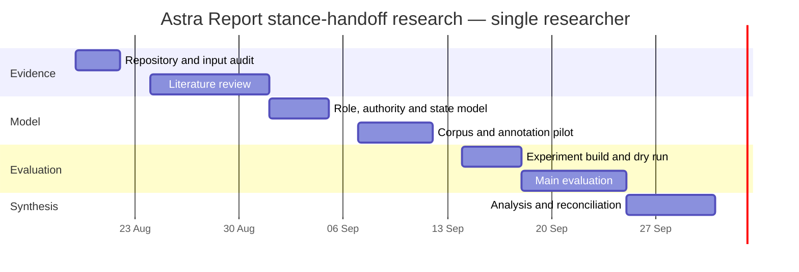

# Astra Report stance-handoff deep-research plan

## Executive summary

The repository and the 19 August handoff define a **research problem, not an implementation task**. The current approved Astra Report design is deliberately output-only: a producer owns facts, consequences, recommendations, options, work state, and lifecycle authority; Report owns rich presentation; the user owns approval; and user-to-producer intake and decisions remain direct. The new handoff asks whether that boundary can be widened into a **bounded bidirectional communication loop** in which Report represents the producer's stance outbound and faithfully transports the user's stance inbound, without acquiring substantive authority or lifecycle control. The handoff explicitly forbids treating that proposed loop as already approved. fileciteturn29file0

The core research question is therefore not “how should Report summarise?” It is whether one intermediary can safely separate **principal, author, animator, stance, authority, transformation, feedback transport, interpretation, disposition, and lifecycle effect** while switching represented principal in different directions. This is a legitimate open research problem: Goffman's production-format distinction provides a useful conceptual decomposition; W3C PROV distinguishes attribution, association, and delegated agency; grounding research shows that delivery and successful conversational coordination are not equivalent; and institutional analogies show that committed representation can coexist with bounded authority. None of those sources, individually, specifies Astra's desired architecture. fileciteturn29file0 citeturn8search3turn9search1turn6search0turn4search0

Two input defects must be resolved before the handoff can be completed literally:

1. **The promised 108-question corpus is absent.** Section 7 still contains the literal placeholder `"[PASTE THE 108 OPEN QUESTIONS HERE]"`. That makes the required 108-row coverage matrix impossible to complete faithfully because there are no stable question IDs or original wordings to preserve. fileciteturn29file0
2. **`docs/research/2026-08-18-astra-report-book-distillation.md` is referenced as required reading but is absent from the branch's `docs/research/` directory.** The directory contains the 12 August method canon, 17 August reconciliation, and 19 August handoff, but no 18 August book-distillation file. The handoff makes that missing document material because one objective is specifically to translate its unified-writer advice without falsely attributing Astra's eventual separation of principals to the books themselves. fileciteturn1file0 fileciteturn30file0

Those gaps block **complete execution of the final handoff package**, but they do not block the conceptual review, repository audit, experimental design, corpus construction plan, or literature programme described below.

A second important repository finding is that **there is still no Report runtime to benchmark**. On the research branch, `skills/` contains only `.gitkeep`; `docs/phase-0.md` says `skills/` is reserved for later implementation; and the interface-complete v1 plan explicitly says runtime execution is unauthorised until a separately scoped authorisation is recorded. Its `skills/astra-report/**` and `tests/astra-report/**` paths are planned future files, not current implementation evidence. fileciteturn22file0 fileciteturn23file0 fileciteturn27file0

Accordingly, the research programme should be staged in this order:

**repository/authority audit → literature synthesis → formal role and state model → purpose-built stance-handoff corpus → annotation pilot → architecture experiments → human decision study → threat-model evaluation → repository reconciliation**.

The recommended primary dataset is a **purpose-built Astra stance-handoff corpus**, because existing datasets cover only fragments of the construct. NIST SARD/Juliet can provide objective security-finding cases; manually vetted SWE-bench cases can provide realistic repository/issue contexts but should not be trusted wholesale as ground truth in 2026; SemEval stance data is useful only as an auxiliary test of target/stance identification, not as a proxy for delegated authority or feedback closure. NIST currently describes SARD as almost 200,000 programs spanning more than 150 weakness classes, while a July 2026 audit estimated roughly 30% of SWE-Bench Pro tasks had substantive benchmark defects and a February 2026 audit found SWE-bench Verified increasingly contaminated. citeturn3search9turn3search0turn7search0turn7search1turn3search12

A full single-researcher programme is approximately **31 person-days**, excluding participant time, with a feasible calendar window of **19 August–30 September 2026**. Budget, stakeholders, available compute, available model endpoints, participant recruitment, and access to the missing research inputs are all **unknown**. A lean evidence-only version could stop after approximately 18–20 person-days, but it would not establish human decision-quality effects.

The main success criterion should **not** be “users agree with Report”, “users trust Report”, or “the output feels clearer”. Framing can change choices even when underlying decision information is equivalent, and human-AI explanations can increase acceptance of AI advice without improving complementary performance. The primary gates should instead measure correct principal identification, intent preservation, authority safety, caveat/conflict visibility, routing accuracy, closed-loop traceability, decision quality, appropriate reliance, and recoverability after misrepresentation. citeturn5search0turn5search1turn5search5

## Repository baseline and explicit handoff contract

The repository's authority hierarchy matters because the proposed research direction conflicts with an already explicit design decision. `docs/design-requirements.md` places current user instructions first, then `docs/phase-0.md`, then the design requirements, then individual skill designs; README material is source inventory rather than governing design. Phase 0 itself states that it produces designs only, does not create `SKILL.md`, implement runtimes, or claim behavioural preservation, and reserves implementation/evaluation machinery for later phases. fileciteturn16file0 fileciteturn23file0

The current Report design is unusually clear on the contested point. Its 17 August amendment preserves “six authorities, one voice”, widens outbound ingress to producer-owned progress/results/blockers/decisions/deliverables, and still resolves delegated voice **only in the output direction**. The six lifecycle skills retain intake and approval records; other producers retain their work state and deliverables. The design's `I(reporting)` relation gives Report presentation authority but not substantive determination authority. fileciteturn26file0 fileciteturn12file0

The handoff deliberately reopens that one boundary. Its proposed loop is:

```text
producer artifact / position
        ↓ delegated, attributed reporting
      Report
        ↓
       user
        ↓ exact response + separately identified normalisation
      Report
        ↓
relevant producer
        ↓ producer-owned interpretation and lifecycle disposition
next authoritative artifact or explicit unresolved state
```

Crucially, the handoff calls this a **question to investigate rather than an approved protocol**. fileciteturn29file0

The research brief fixes fourteen important premises: user sovereignty over approval/direction/policy; producer authority within jurisdiction; no independent Report programme; legitimate but attributed guidance; explicit principal switching; non-equivalence of recorded/delivered/understood/accepted/applied/resolved; preservation of exact user language; visible conflict; bounded report/subject state; exposure distinct from cognition and approval; topic structure as a candidate rather than universal law; plain-language explanation; no proactive/cross-project orchestration; and separation of research evidence from product choice. fileciteturn29file0

The handoff also requires nine explicit research objectives and fourteen final deliverables. Condensed without deleting their obligations:

| Area | Explicit requirement from the handoff | Research consequence |
|---|---|---|
| Role theory | Separate voice/animator, author, principal, stance, intent, authority and delegation | Build a formal production-role ontology before designing fields. fileciteturn29file0 |
| Advocacy | Determine when attributed producer advocacy improves decisions versus becoming framing/manipulation | Measure decision accuracy and caveat use, not agreement. fileciteturn29file0 |
| Bidirectional mediation | Find models for alternating expert representation and faithful user-feedback capture | Compare unified and split-role architectures. fileciteturn29file0 |
| Orchestration boundary | Distinguish communication transport from routing/sequencing/invocation/lifecycle progression | Include authority-transition failures as hard test cases. fileciteturn30file0 |
| Provenance | Establish minimal role, source, revision, transformation and acknowledgement data | Test field-level versus claim/section/message-level provenance. fileciteturn30file0 |
| Architecture | Compare A–E rather than validating a preferred design | Treat the current architecture as one control condition. fileciteturn30file0 |
| Book transfer | Preserve original unified-writer advice separately from Astra's role-separated transfer | Requires recovery of the missing 18 August distillation. fileciteturn30file0 |
| Empiricism | Measure decision quality, intent preservation and authority safety | Build objective task ground truth and preregister primary outcomes. fileciteturn30file0 |
| Question corpus | Answer all 108 original questions with evidence class, confidence, consequence, risk, dependency and falsifier | Blocked until the corpus is recovered. fileciteturn29file0 |
| Conceptual package | Executive answer, conceptual model, source matrix, authority/stance matrix and round-trip state model | These become the first half of the final research artefact. fileciteturn30file0 |
| Design alternatives | Architecture comparison and Report Artifact options including ownership/concurrency/correction | Avoid prematurely encoding one schema. fileciteturn30file0 |
| Safety | Threat model with prevention, detection, repair, repair owner and residual risk | Use adversarial fixture suite, not prose-only discussion. fileciteturn30file0 |
| Demonstration | Seven worked examples, spanning ordinary reporting through disagreement and corrected misrepresentation | Make examples executable against the proposed state model where possible. fileciteturn30file0 |
| Reconciliation | Identify exact repository clauses that would stay/change/be superseded, without editing them | Final output must remain analytical only. fileciteturn30file0 |

The repo already contains evaluation principles that should constrain the new study. `docs/design-requirements.md` requires later merger evaluations to distinguish **source oracle**, **reference convener**, and **self-contained candidate**; use fixed corpora, paired identical artefacts, repeated trials, blind/order-randomised subjective evaluation; and measure such outcomes as critical-decision/defect recall, supported-claim precision, unsupported-claim rate, actionability, noise, routing accuracy, cost, and latency. It also calls for non-regression, positive-advantage, internalisation-fidelity, and source-specific retirement gates. The stance-handoff evaluation should reuse that methodological discipline rather than inventing a disconnected benchmark framework. fileciteturn16file0 fileciteturn17file0

The current method canon is also important because it sharply separates evidence from Astra synthesis. It retains outcome-first communication, immediate-action completeness, optional detail, concrete actor/action language, stable resumption cues, and fidelity over brevity, while explicitly saying that `NOW/NEXT/DEFERRED`, numeric attention budgets, the Change Story, `ReportEvent`, Exposure Ledger, and delta-first-never-delta-only are repository-specific syntheses rather than scientific results. The stance research should preserve this evidence labelling convention. fileciteturn24file0

The most relevant repository evidence and commits are:

| Repository evidence | Relevance |
|---|---|
| [19 Aug stance deep-research handoff](https://github.com/KuroPhoenix/Astra-Skills/blob/research/astra-report-stance-handoff/docs/research/2026-08-19-astra-report-stance-deep-research-handoff.md) | Governing research brief; defines the conflict, premises, architectures, threat model, empirical outcomes and deliverables. fileciteturn29file0 |
| [Astra Report design](https://github.com/KuroPhoenix/Astra-Skills/blob/research/astra-report-stance-handoff/designs/astra-report.md) | Current output-only authority boundary and Reader Brief/Exposure Ledger design. fileciteturn12file0 |
| [Phase 0](https://github.com/KuroPhoenix/Astra-Skills/blob/research/astra-report-stance-handoff/docs/phase-0.md) | Governs phase scope and confirms runtime/evaluation implementation is deferred. fileciteturn23file0 |
| [Design requirements](https://github.com/KuroPhoenix/Astra-Skills/blob/research/astra-report-stance-handoff/docs/design-requirements.md) | Authority order, evidence discipline and later evaluation gates. fileciteturn16file0 |
| [Design roadmap](https://github.com/KuroPhoenix/Astra-Skills/blob/research/astra-report-stance-handoff/docs/design-roadmap.md) | Records the locked six-skill authority roster plus widened outbound Report direction and interface-complete-v1 milestone. fileciteturn18file0 |
| [12 Aug Report method canon](https://github.com/KuroPhoenix/Astra-Skills/blob/research/astra-report-stance-handoff/docs/research/2026-08-12-astra-report-method-canon.md) | Separates direct support, analogy, Astra synthesis and rejected attribution; reusable evidence discipline. fileciteturn24file0 |
| [17 Aug research-to-design reconciliation](https://github.com/KuroPhoenix/Astra-Skills/blob/research/astra-report-stance-handoff/docs/research/2026-08-17-astra-report-research-to-design-reconciliation.md) | Bridge between earlier research and the current interface-complete outbound design. |
| [17 Aug v1 implementation plan](https://github.com/KuroPhoenix/Astra-Skills/blob/research/astra-report-stance-handoff/docs/superpowers/plans/2026-08-17-astra-report-v1.md) | Defines planned pressure cases and deterministic contract machinery; explicitly not runtime-authorised. fileciteturn19file0 |
| [Critique design](https://github.com/KuroPhoenix/Astra-Skills/blob/research/astra-report-stance-handoff/designs/astra-critique.md) | Finding authority and diagnostic/review role; one producer whose stance must not be laundered. fileciteturn21file0 |
| [Understand Code design](https://github.com/KuroPhoenix/Astra-Skills/blob/research/astra-report-stance-handoff/designs/astra-understand-code.md) | Read-only current-state authority; useful contrast to recommendation-bearing producers. fileciteturn21file0 |
| [Spec design](https://github.com/KuroPhoenix/Astra-Skills/blob/research/astra-report-stance-handoff/designs/astra-spec.md) | Owns selected solution and requirements; critical approval/feedback boundary. fileciteturn21file0 |
| [Implement design](https://github.com/KuroPhoenix/Astra-Skills/blob/research/astra-report-stance-handoff/designs/astra-implement.md) | Owns delivery planning/execution; distinguishes feedback transport from mutation authority. fileciteturn21file0 |
| [Test design](https://github.com/KuroPhoenix/Astra-Skills/blob/research/astra-report-stance-handoff/designs/astra-test.md) | Independent verification authority; valuable for conflicting stance and failed-test cases. fileciteturn21file0 |
| [Ship design](https://github.com/KuroPhoenix/Astra-Skills/blob/research/astra-report-stance-handoff/designs/astra-ship.md) | Publication authority and final downstream gate. fileciteturn21file0 |
| Intended [18 Aug book distillation](https://github.com/KuroPhoenix/Astra-Skills/blob/research/astra-report-stance-handoff/docs/research/2026-08-18-astra-report-book-distillation.md) | **Missing on the inspected branch.** Must be recovered rather than reconstructed from secondary mentions. fileciteturn1file0 |
| [Commit `68b0429`: add stance research handoff](https://github.com/KuroPhoenix/Astra-Skills/commit/68b042930a581b0842ef3876e0dad1712c0d6fe3) | Introduces the research brief itself. |
| [Commit `8883d9b`: adopt interface-complete v1](https://github.com/KuroPhoenix/Astra-Skills/commit/8883d9bed1fbe7cfbcc7c900bd8ae2e2d57a8fe5) | Makes outbound progress/results/deliverables and interface-complete v1 explicit while retaining output-only voice. fileciteturn26file0 |
| [Commit `c37d353`: plan interface-complete v1](https://github.com/KuroPhoenix/Astra-Skills/commit/c37d35388565d7178a9ae3b2915643135e5edcab) | Creates the 1,114-line future runtime plan and its RED/GREEN pressure programme. fileciteturn27file0 |
| [Merge commit `389baea`](https://github.com/KuroPhoenix/Astra-Skills/commit/389baeabb1543694437f89e4b9a6c527da23c882) | Merges the stance-handoff branch through PR #2 into `main` on 19 August 2026. fileciteturn28file0 |

The v1 plan's existing pressure scenarios should be reused rather than duplicated. It already anticipates overload, progress, approval, resumption, deliverable-boundary and non-trigger dialogue cases, with explicit failure predicates such as invented approval recommendations, work-state inference, hidden decisions, false recall, deliverable mutation and accidental Reader Brief invocation during ordinary dialogue. The stance programme should **extend** these with inbound-feedback and principal-switching cases. fileciteturn27file0

## Research design and evidence framework

The first analytical deliverable should be a **constitutional model of a stance-bearing report act**, not a JSON schema. The handoff's unit-of-analysis choice is sound because message- or conversation-level labels are too coarse to capture a paragraph that changes principal, a normalisation that is authored by Report but represents a user's position, or a producer recommendation accompanied by Report-selected ordering. fileciteturn29file0

A useful starting formalisation is:

\[
A = (S, R, P, Au, An, T, J, X, E, Q, D)
\]

where:

- \(S\) = stable subject/source revision;
- \(R\) = speech-act role;
- \(P\) = represented principal;
- \(Au\) = substantive author/source;
- \(An\) = animator/delivery agent;
- \(T\) = transformation agent and declared transformation;
- \(J\) = authority jurisdiction;
- \(X\) = stance/intent content;
- \(E\) = evidence, qualifications and counterpositions;
- \(Q\) = requested response/action and permitted return path;
- \(D\) = observable downstream delivery/acknowledgement/disposition/effect events.

This extends the handoff rather than asserting a settled standard. Goffman's `Footing` is a strong conceptual anchor precisely because it decomposes speaker roles, but it does not specify software lifecycle authority; W3C PROV separately provides useful concepts for entity attribution, activity association, roles and scoped delegation while likewise avoiding a domain-specific decision-rights model. fileciteturn29file0 citeturn8search3turn9search1

The research should test five boundary propositions rather than assume them:

| Proposition to test | Falsification condition |
|---|---|
| **No independent stance:** Report may express a stance only when an identified principal and source scope are attached | Report needs to add a substantive recommendation that cannot be traced to a producer/user yet still improves required performance. |
| **Transport is not interpretation:** Report may carry exact feedback and a visibly separate normalisation, while the producer owns authoritative interpretation/disposition | Reliable feedback requires Report to resolve ambiguity or choose lifecycle meaning before producer receipt. |
| **Principal switching can be local and explicit:** every stance-bearing unit can expose its principal without overwhelming the user | Attribution metadata measurably degrades task performance or users repeatedly misidentify roles despite explicit markers. |
| **Feedback closure can remain non-orchestrating:** capture→delivery→acknowledgement can occur without Report controlling producer invocation/lifecycle progress | Closed-loop reliability cannot be achieved without Report selecting workflow sequence or initiating work. |
| **A bounded Report Artifact can improve auditability without becoming quasi-authoritative state** | Shared state causes stale authority, write contention, or users/producers treat Report-owned fields as lifecycle facts. |

The empirical literature provides several useful but deliberately limited transfers. Clark and Schaefer model successful contribution as participants establishing enough mutual belief of understanding for current purposes, supporting the handoff's insistence that mere delivery is insufficient; this should motivate explicit acknowledgement and repair events but **not** a field that claims hidden cognition. citeturn6search0 The 1977 repair literature further supports treating miscommunication as locally repairable and making the originator's correction important, again without implying an Astra protocol. citeturn6search5

The current UK Special Adviser Code is a particularly useful **institutional analogy** because it distinguishes politically committed representation from permanent-service impartiality: authorised advisers may represent ministers' views and convey ministers' priorities, but they may not exercise several powers reserved elsewhere, and the code explicitly separates the source of political advice. That supports studying explicit mandate and role attribution, but does not establish that one AI component should combine analogous roles. citeturn4search0 The Civil Service Code's emphasis on honesty, evidence and impartiality supplies a contrasting evidence-advice role. citeturn4search2

Framing and human-AI reliance research should supply the principal **adversarial hypothesis**. Tversky and Kahneman showed that alternate formulations of equivalent decision problems can predictably change preference; therefore, Report's ordering and compression cannot honestly be treated as inert plumbing. citeturn5search0 Lee and See argue for appropriate rather than maximal reliance on automation, and Bansal et al. found in their studied tasks that explanations could increase acceptance of AI recommendations regardless of correctness without increasing complementary performance. These findings justify making **decision quality and reliance calibration** primary outcomes while demoting agreement, perceived authority and general trust to secondary measures. citeturn5search1turn5search5

The literature work itself should follow the handoff's required **scoping-review-plus-deep-dives** method. For every conclusion, retain four independent labels:

| Evidence layer | Required entry |
|---|---|
| Source finding | What the paper/code/standard actually establishes |
| Transfer distance | Direct evidence / close analogy / institutional analogy / distant mechanism |
| Astra synthesis | Proposed architectural implication |
| Product choice | Exact field/default/state/UI rule, if one is later chosen |

Every source row should additionally store search query, database/domain, access date, immutable DOI/version where available, contrary/null evidence, and a **falsifier**. This directly follows the handoff and the earlier method canon's distinction between direct support, analogical support, Astra synthesis and rejected attribution. fileciteturn30file0 fileciteturn24file0

A useful literature workstream allocation is:

| Workstream | Primary anchors | Question answered |
|---|---|---|
| Production roles | Goffman; Clark & Gerrig | Who speaks, authors and stands behind transformed language? fileciteturn29file0 |
| Provenance/delegation | W3C PROV-DM | What minimum machine-readable attribution/delegation graph is defensible? citeturn9search1 |
| Grounding/repair | Clark & Schaefer; Schegloff et al. | What distinguishes sent, acknowledged and repaired? citeturn6search0turn6search5 |
| Mixed initiative | Horvitz; automation-level literature | Which communication functions may be automated without action-selection authority? The handoff explicitly identifies this family as a source of boundary hypotheses. fileciteturn29file0 |
| Institutional representation | Civil Service / Special Adviser / Ministerial codes | Can committed representation coexist with bounded powers and explicit decision ownership? citeturn4search0turn4search2turn4search3 |
| Framing/persuasion | Tversky & Kahneman; information-design literature | When does presentation discretion become outcome-shaping influence? citeturn5search0 |
| Human-AI reliance | Lee & See; Bansal et al. | Which outcomes capture good advice use rather than mere acceptance? citeturn5search1turn5search5 |
| Design rationale/boundary objects | IBIS/QOC/ADR/boundary-object literature from handoff | How should disagreement, rationale, comments and dispositions remain inspectable without one actor owning all fields? fileciteturn29file0 |

The 108-question coverage matrix should eventually become the research's dependency backbone. Once recovered, map questions into a directed graph using the handoff fields `Dependencies` and `Falsifier`, then solve foundational questions first: role definitions → authority → principal-switch granularity → feedback states → artefact ownership → presentation rules → architecture selection → UX defaults. Product choices such as status symbols or display granularity should not be allowed to masquerade as answers to upstream conceptual questions. fileciteturn29file0

## Datasets, annotation and metrics

There appears to be no off-the-shelf dataset whose gold labels jointly encode **software-authority jurisdiction, represented principal, delegated stance, exact user feedback, transformed feedback, target producer, acknowledgement, disposition and lifecycle effect**. The most defensible design is therefore a purpose-built Astra corpus, with external datasets supplying task content or partial construct checks rather than serving as the primary benchmark. This is an inference from the construct required by the handoff and the narrower tasks represented by the candidate datasets below. fileciteturn30file0 citeturn3search12turn3search9turn7search15

| Candidate dataset | Useful signal | Weakness for stance handoff | Recommended use |
|---|---|---|---|
| **Purpose-built Astra stance-handoff corpus** | Exact producer jurisdiction, principal switches, feedback destinations, revisions and expected lifecycle effects can be authored explicitly | Labour-intensive; initially synthetic/curated; must avoid encoding the preferred architecture into “ground truth” | **Primary dataset**: 56 core scenarios + adversarial variants |
| **NIST SARD / Juliet** | Objective known software weaknesses; SARD spans almost 200,000 test programs and >150 weakness classes; Juliet C/C++ 1.3 alone contains 64,099 cases over 118 CWEs | No user-policy, principal-switch or feedback-loop labels | Security findings, disagreement and evidence-completeness task material. citeturn3search9turn3search0 |
| **Vetted SWE-bench issue/PR cases** | Real GitHub issues and corresponding repository changes; original SWE-bench contains 2,294 problems from 12 Python repositories | Public-data contamination plus task-quality problems; 2026 audits undermine blind reliance on benchmark scores | Manually audit 12–16 cases and reuse only as realistic scenario scaffolds, **not** as unquestioned outcome gold. citeturn7search15turn7search0turn7search1 |
| **SemEval-2016 Task 6 stance data** | Explicit stance-target identification task in natural language | Social-media target stance does not encode delegated principal, authority, provenance or feedback disposition | Optional auxiliary test that stance labels remain correctly attached to targets after rewriting. citeturn3search12 |
| **Counterfactual Astra mutations** | Can hold substantive content fixed while flipping principal, source revision, caveat visibility or feedback destination | Synthetic by construction | Causal/adversarial testing of role markers, stale revisions and laundering failures |

The proposed Astra corpus should contain **eight cases per task family across seven families**, giving 56 core cases:

`code review · architecture choice · test-result review · incident response · security findings · plan approval · revision feedback`.

These are the task classes required by the handoff. Each core case should have at least one clean baseline and selected counterfactual variants—for example source-principal flip, stale-source revision, omitted caveat, producer conflict, user rejection, ambiguous feedback target, explicit policy instruction, or mis-normalised user reply. fileciteturn30file0

A 14-case pilot—two cases per family—should be frozen first. The remaining 42 core cases become the evaluation set after the annotation protocol is stable. At least 18 additional hard-case mutations should instantiate the handoff threat model, yielding roughly **74 base/adversarial evaluation units before experimental condition multiplication**. This size is a planning choice, not a research-derived constant.

The annotation schema should be act-centred and ownership-aware:

| Annotation family | Fields |
|---|---|
| Identity | `case_id`, `act_id`, `subject_id`, `source_revision/hash`, `source_section/claim` |
| Production format | `principal`, `substantive_author`, `animator`, `transformation_agent`, `transformation_type` |
| Authority | `authority_owner`, `jurisdiction`, `allowed_effects`, `forbidden_effects` |
| Communicative role | `speech_act`: inform / explain / recommend / warn / request / decide / comment / reject / approve / defer / policy / correct / acknowledge |
| Stance | target, polarity/orientation, commitment strength, recommendation source, requested action |
| Evidence | supporting refs, material qualifications, alternatives, conflicts, counter-position completeness |
| User return | exact user text, response target, separately authored normalisation, conditions/exceptions/scope |
| Feedback state | captured → delivered → acknowledged → interpreted → dispositioned → lifecycle effect |
| Disposition | accepted / rejected / partially accepted / clarification required / deferred / no authority / superseded |
| Safety failures | invented stance, laundering, wrong principal, altered scope, caveat omission, false consensus, stale source, wrong route, false approval, premature lifecycle effect |
| Repair | correction source, correction event, successful repair, residual ambiguity |

The key design principle is that **exact text and normalisation receive separate provenance**. A normalised user response must never overwrite the exact source response. Similarly, `acknowledged`, `accepted` and `applied` are separate dimensions, not values on one overloaded enum. This follows directly from the handoff's fixed premises. fileciteturn29file0

For annotation quality, use two independent annotators on the 14-case pilot plus at least 20% of the main corpus, with researcher adjudication. Categorical role/authority labels should report Cohen's κ when exactly two complete raters are used or Krippendorff's α when the design has more raters/missing values. A provisional acceptance target of **≥0.80** on the principal, authority owner, speech act and lifecycle-effect fields is reasonable as an engineering gate; below that, the ontology itself should be revised before model comparison. This threshold is a product/research-planning choice, not a universal scientific cutoff.

The metric suite should distinguish **semantic fidelity, authority safety, decision performance and interaction cost**:

| Metric | Definition | Direction | Proposed gate or analysis |
|---|---|---:|---|
| **Principal identification accuracy** | Fraction of acts for which user/evaluator correctly identifies whose stance is represented | ↑ | ≥95% overall; report per architecture |
| **Stance-source fidelity** | Correct principal + target + orientation + commitment strength relative to source | ↑ | Macro F1; no critical recommendation-source flips |
| **Weighted intent preservation** | Slot-level preservation of user decision, polarity, scope, conditions, exceptions and requested change | ↑ | ≥0.98 weighted F1; **zero approval/polarity reversals** |
| **Feedback routing accuracy** | Response delivered to correct producer + correct source revision/claim | ↑ | ≥0.98; critical wrong-revision routes count separately |
| **Authority-boundary violation rate** | Acts that assert or trigger a lifecycle effect Report does not own / eligible acts | ↓ | **0** on deterministic hard cases; confidence interval reported on stochastic trials |
| **False approval rate** | Non-approval represented or processed as approval | ↓ | **0** |
| **Material-caveat recall** | Material source qualifications/counterpositions visible before consequential decision / gold set | ↑ | Non-inferior to direct-producer baseline, provisional margin −5 percentage points |
| **Conflict visibility recall** | Gold producer/user conflicts surfaced as distinct positions | ↑ | 100% for designated material conflicts |
| **Closure trace completeness** | Required observable feedback transitions that carry evidence / all required transitions | ↑ | 100% for consequential decisions; lower states may remain explicitly unresolved |
| **Decision accuracy / utility** | Correct or expert-gold action on task | ↑ | Primary human outcome; non-inferiority first, superiority only where justified |
| **Appropriate reliance** | Correct acceptance of valid recommendations plus correct rejection/inspection of invalid ones | ↑ | Compare conditionally on advice correctness; never optimise raw agreement |
| **Evidence inspection** | Required evidence opened/consulted before consequential decision | Context-dependent ↑ | Secondary behavioural measure |
| **Repair success** | Misrepresentation detected and returned to correct authoritative state | ↑ | Measure probability and turns/time to repair |
| **Time to correct action** | Elapsed decision time until correct action/route | ↓ | Compare only after fidelity/safety gates pass |
| **Interaction cost** | Turns, tokens, UI actions, metadata burden | ↓ | Secondary optimisation subject to safety |
| **Confidence calibration** | Relationship between participant confidence and decision correctness | ↑ | Brier score or calibration error; do not use confidence alone |

This metric hierarchy deliberately avoids equating persuasive success with system quality. Framing research makes presentation effects inevitable enough to require measurement, while human-AI evidence warns that explanation can increase acceptance without corresponding performance benefits. citeturn5search0turn5search5

## Experiments and architecture comparison

The architecture experiment should treat the handoff's five candidates as genuine competitors:

| Candidate | What it tests | Expected advantage | Primary risk to test |
|---|---|---|---|
| **A — output-only neutral renderer** | Current design-like control | Smallest authority surface; simple mental model | Insufficient guidance; producer stance may be obscured; no feedback closure |
| **B — output-only attributed producer advocate** | Whether explicit stance improves useful guidance without inbound mediation | Better source visibility and significance | Framing pressure / excessive producer agreement |
| **C — unified bidirectional stance-switching mediator** | Full proposed insight in one user surface | Lowest interaction fragmentation; potentially strongest loop continuity | Principal-switch errors, role laundering and orchestration creep |
| **D — split reporter + feedback secretary** | Same communication capability with hard internal role isolation | Clearer authority and provenance boundaries | Extra interaction/implementation complexity; possible state synchronisation errors |
| **E — bounded shared Report Artifact** | Explicit report-scoped state and independently owned entries | Strong auditability, conflict visibility, revision linkage | Shared-state authority confusion, stale artefacts and write contention |

A and B should function mainly as controls. C, D and E are the serious design contenders. E can also be combined with B/C/D rather than treated as mutually exclusive, exactly as the handoff permits. fileciteturn30file0

The minimum experimental programme should contain six experiments:

| Experiment | Conditions | Primary outcomes | Design |
|---|---|---|---|
| **Outbound stance** | A neutral vs B attributed advocate | principal accuracy, decision accuracy, caveat recall, appropriate reliance | Paired task content; producer stance held constant |
| **Feedback transport** | direct producer reply vs exact+normalised Report relay vs normalised-only relay | intent preservation, route accuracy, false approval, repair | Exact user response generated before condition assignment |
| **Principal markers** | implicit vs message-level vs section/claim-level attribution | principal accuracy, workload, reading time | Find smallest attribution granularity that remains unambiguous |
| **Unified versus split role** | C versus D | intent fidelity, authority violations, interaction cost, user role understanding | Same underlying state model and task corpus |
| **Bounded artefact** | transient conversation vs E report-scoped artefact | closure traceability, stale-state errors, correction success, concurrency failures | Include revision and conflicting-producer cases |
| **Progressive disclosure** | caveat/counter-position visibly cued in NOW vs hidden until optional detail | caveat miss rate, decision quality, evidence inspection, time | Consequential content held constant; only discoverability changes |

The design must distinguish **automated contract evaluation** from **human decision evaluation**.

Automated evaluation should run every architecture against the deterministic threat fixtures and verify stable-source routing, role fields, prohibition of unauthorised effect, exact-text preservation, supersession handling, concurrency controls and state-machine legality. The current v1 plan's six RED/GREEN pressure cases provide a ready foundation; new fixtures should add user feedback, producer disagreement, stale Report Artifact, mid-message principal switch, false “all producers agree” synthesis, and correction/retraction. fileciteturn27file0 fileciteturn30file0

Model-behaviour evaluation should use fresh contexts, identical source packets, fixed model/version/configuration and **at least five repeated trials per stochastic condition**. Runs should be assigned immutable IDs and raw outputs preserved. Pairwise condition comparisons should use identical underlying cases, consistent with the repository's existing evaluation requirements. fileciteturn17file0

Human evaluation should be blinded to architecture labels. A practical first study would recruit approximately **36–48 technically literate participants** for 60–90 minutes each, using a counterbalanced within-subject or incomplete-block design so no participant sees every transformation of the same case. That number is a planning envelope rather than the final statistical sample; the confirmatory sample size should be set by a power analysis using the pilot's observed variance/effect size and the predeclared primary outcome. Participant recruitment and budget are currently unknown.

For subjective judgements—such as whether a qualification is material or whether a recommendation has changed strength—raters should see outputs in randomised order without system labels. Objective fields such as wrong producer revision, false approval, exact-text divergence, missing acknowledgement, stale-source use and lifecycle transition are deterministic and should not be delegated to an LLM judge.

For binary paired outcomes, use exact paired tests or mixed-effects logistic models depending on the participant/task structure. For decision time and interaction cost, use paired or mixed-effects models after examining their distributions. For primary architecture comparisons, predeclare non-inferiority margins for safety/fidelity outcomes before testing potential superiority in convenience or speed. Correct multiplicity across secondary outcomes rather than selecting only favourable comparisons.

The most important experimental distinction is between **communicating an authoritative position** and **becoming the authority that decides what happens next**. Classic automation research distinguishes information acquisition/analysis, decision selection and action implementation rather than treating automation as one permission category; that decomposition is directly useful for testing whether Report's behaviour has accidentally crossed from communication support into lifecycle action. fileciteturn29file0

The hard-case suite should operationalise every failure in the handoff:

| Failure family | Prevention under test | Detection signal | Repair owner |
|---|---|---|---|
| Invented producer stance | Source-bound stance fields | Untraceable recommendation | Producer corrects; Report re-renders |
| Misleading compression | Material caveat invariant | Caveat-recall failure / source diff | Report presentation repair |
| Wrong feedback target | Subject/revision/claim binding | Routing mismatch | Report transport repair |
| Exact vs normalised divergence | Immutable exact text + distinct transform | Intent-slot mismatch | User clarifies or Report corrects transform |
| Missing acknowledgement | Explicit delivery/ack event | Open transition | Producer owns acknowledgement |
| False approval | Separate review/decision/effect dimensions | Illegal state transition | Producer/lifecycle owner repairs authority state |
| Producer conflict | Position entries remain separate | False-consensus label | Producers own their positions; user decides where authorised |
| User policy conflict | User principal preserved separately | Conflict flag | Relevant lifecycle authority resolves implications |
| Hidden principal switch | Local role marker | Principal-identification error | Report re-renders |
| Stale source | Revision/hash pinning | Supersession mismatch | Report regenerates from authoritative source |
| Shared-artifact contention | Field ownership + append/correction semantics | Conflicting writes | Field owner; Report must not adjudicate |
| Hidden caveat under disclosure | Materiality rule | User decides before seeing caveat | Presentation repair |
| Persuasion vs requirement confusion | Speech-act labelling | Action classification error | Report rendering |
| Feedback starts work | No lifecycle-effect capability | Forbidden transition | Producer/lifecycle authority |
| Host removes controls | Equivalent text fallback | Capability mismatch | Report adapter |
| Report unavailable | Direct bounded fallback | Missing mediation receipt | Producer preserves decision/fidelity envelope |

A design should be rejected even if users like it whenever it materially increases false authority transitions, incorrect decisions, hidden conflicts, or irreversible feedback distortion.

## Timeline, resources and milestones

Assuming one primary researcher, the full programme is approximately **31 person-days**. This estimate includes repository and literature work, corpus development, experiment engineering, analysis and final reconciliation, but excludes external participant hours and any separate implementation of a production Astra Report runtime.

| Phase | Owner | Person-days | Dates | Milestone |
|---|---|---:|---|---|
| Input and repository audit | Single researcher | 3 | 19–21 Aug | Authority map frozen; 108 corpus/book-distillation gaps resolved or formally recorded |
| Scoping review and targeted deep dives | Single researcher | 6 | 24–31 Aug | Source matrix with transfer-distance/evidence classifications |
| Ontology, state model and threat model | Single researcher | 4 | 1–4 Sep | Role model, authority matrix, feedback-state machine and architecture hypotheses frozen |
| Corpus and annotation pilot | Single researcher | 5 | 7–11 Sep | 14-case pilot adjudicated; schema revised; held-out corpus frozen |
| Experiment implementation and dry run | Single researcher | 4 | 14–17 Sep | Conditions A–E and hard-case runner reproducible |
| Main evaluation | Single researcher | 5 | 18–24 Sep | Model runs plus available human/rater evidence complete |
| Analysis, recommendation and repo reconciliation | Single researcher | 4 | 25–30 Sep | Full research package, 108 matrix if corpus recovered, exact proposed repo consequences |



The calendar chart uses calendar spans while the table reports working person-days.

Required resources are modest for deterministic contract work but potentially substantial for human/model experiments:

| Resource | Minimum | Preferred | Status |
|---|---|---|---|
| Repository access | Read access to current Git state/history | Immutable checkout at research baseline + current `main` | Available from public GitHub repository |
| Missing 108-question corpus | Original corpus with IDs/wording/grouping/priority | Same source that produced the handoff | **Unknown / currently absent** fileciteturn29file0 |
| 18 Aug book distillation | Original repository file or immutable historical revision | Plus referenced local-book provenance | **Unknown / absent from inspected branch** fileciteturn1file0 |
| Literature access | Open-access/official sources | Institutional ACM/IEEE/WoS/Scopus access | Unknown |
| Compute | Local CPU for deterministic runners and statistics | Access to 2–3 target LLM families/versions for robustness | **Unknown** |
| Model budget | Hundreds to low thousands of condition runs depending repetitions | ≥5 repeats × frozen cases × architectures | **Unknown** |
| Storage | Raw transcripts, corpus, annotations, hashes | Versioned experiment store | Small; likely <10 GB unless repository containers are retained |
| Independent annotation | One additional rater for pilot | Two independent raters plus adjudication | **Unknown** |
| Human participants | None for engineering-only safety tests | 36–48 technically literate users as planning envelope | **Unknown** |
| Analysis tooling | Python/R-equivalent statistics; Git; structured JSON/CSV | Reproducible notebooks/scripts and preregistration record | Open-source tools sufficient |
| Benchmark environments | NIST cases require compiler/test tooling where exercised | Containers for selected real repo tasks | Moderate CPU/RAM; no GPU intrinsically required |

The deterministic and model-only programme can run on ordinary development hardware; GPU compute becomes relevant only if local model inference is chosen. Because the user has not specified model providers, endpoints, hardware or budget, no monetary estimate is defensible at this stage.

A useful effort split is approximately **6 days evidence discovery, 7 days formal modelling/repository work, 9 days corpus/experiment construction, 5 days execution and 4 days analysis/reconciliation**. External annotation would add roughly 2–4 rater person-days; participant time is additional.

The milestones should be genuine gates:

**Evidence gate:** no architecture recommendation until missing inputs, current repo clauses and primary literature are reconciled.

**Ontology gate:** no benchmark freeze until independent annotators can reliably distinguish principal, author, animator, authority owner, speech act and lifecycle effect.

**Corpus gate:** no main experiment until the pilot demonstrates that gold labels do not themselves encode one preferred architecture.

**Safety gate:** any architecture that produces false approval, unauthorised lifecycle transition, unrecoverable user-intent reversal or hidden material producer conflict on the deterministic suite is not promotion-eligible regardless of UX advantages.

**Decision gate:** only after fidelity/safety non-regression may speed, brevity, user preference or perceived clarity break ties.

**Repository gate:** the research output may state exact amendments that would be required, but the handoff expressly grants no permission to make them. fileciteturn30file0

## Risks, alternatives and decision gates

The largest immediate risk is **research incompleteness disguised as confidence**. The handoff requires all 108 original questions, but those questions are not present. Reconstructing likely questions would violate its requirement to preserve exact identifiers, wording, grouping and priority. The correct handling is to mark the coverage deliverable blocked while progressing the independent literature and experimental work. fileciteturn29file0

The second risk is **design-confirmation bias**. The handoff already contains an attractive synthesis—explicit principals, exact user channel, observable feedback states and bounded artefact—but explicitly labels it Astra synthesis and tells the researcher to falsify it. Therefore A, B, C, D and E must be implemented as comparable experimental conditions rather than grading C/E against a rubric written from C/E's assumptions. fileciteturn30file0

The third is **authority laundering through presentation**. W3C provenance can record that one agent acted on behalf of another, but PROV's delegation relation is intentionally broad and does not determine Astra's substantive responsibility boundaries. A provenance graph therefore cannot by itself prove that Report stayed within authority; the benchmark must separately encode permitted assertions and effects. citeturn9search1

The fourth is **persuasion being mistaken for guidance quality**. Because framing can change choices, and because explanations can increase recommendation acceptance independently of correctness, an experiment that scores “followed producer recommendation” as success would structurally favour the strongest advocate. Decision correctness, evidence use and appropriate reliance must dominate raw acceptance. citeturn5search0turn5search5

The fifth is **benchmark contamination or faulty “objective” tasks**. Public coding benchmarks are useful scenario material, but the 2026 SWE-bench audits show why benchmark tests and prompts cannot be assumed correct merely because they are established. Each reused real-world task should undergo item-level review before entering the stance corpus; NIST's known-weakness suites are preferable where an objectively labelled security fact is specifically needed. citeturn7search0turn7search1turn3search9

The sixth is **overengineering the Report Artifact**. A detailed state machine can itself become a shadow lifecycle system. The research should therefore compare at least three state-storage alternatives: no new durable inbound state beyond producer records; an append-only report-scoped communication-event log; and a bounded multi-owner Report Artifact. A globally shared mutable project cognition ledger should remain outside consideration because both the handoff and existing Report design reject inferred cognition and cross-project orchestration. fileciteturn29file0 fileciteturn12file0

The seventh is **confusing acknowledgement with cognition**. Grounding literature makes successful coordination richer than mere transmission, but Astra should still record observable evidence—receipt, explicit acknowledgement, clarification request, producer disposition—rather than asserting that the user or producer “understood” something internally. That preserves the handoff's exposure-is-not-cognition premise. citeturn6search0 fileciteturn29file0

The eighth is **role metadata overload**. Per-claim `principal/author/animator/transformer` labels may be perfectly auditable and unusable to a human reader. The principal-marker experiment must therefore determine the coarsest boundary that maintains correct attribution: message → segment → section → claim → field. Machine-visible provenance may be finer than the human-visible labels; there is no requirement that the interface display every internal provenance field.

The ninth is **split-role complexity**. D may be conceptually safer than C yet introduce enough synchronisation and state-transfer complexity to create new routing failures. Conversely, C may have lower interaction cost but make principal switches less legible. This is precisely why the study should compare them under an identical underlying state model rather than decide from conceptual elegance.

The tenth is **human-study feasibility**. If participant budget is unavailable, a credible reduced programme still exists: deterministic authority testing, independent expert annotation, multiple model trials, counterfactual case evaluation, and a small within-researcher usability pilot. That can answer contract safety and fidelity questions, but it cannot establish claims about human decision quality, cognitive load or appropriate reliance. Those conclusions must remain unresolved rather than inferred.

The research decision tree should be:

```text
Can exact principal and source authority be represented reliably?
        │
        ├── no → reject bidirectional Report; retain simpler A/B boundary
        │
        └── yes
             ↓
Can exact user feedback survive transport without Report owning interpretation?
        │
        ├── no → retain direct feedback or split D with narrower secretary semantics
        │
        └── yes
             ↓
Can capture/delivery/acknowledgement close without lifecycle orchestration?
        │
        ├── no → do not grant unified C
        │
        └── yes
             ↓
Does unified C match D on safety/fidelity?
        │
        ├── no → prefer D
        │
        └── yes
             ↓
Does bounded artefact E improve traceability without stale/shared authority?
        │
        ├── no → use transient/append-only communication records
        │
        └── yes → consider E combined with the safest communication role
             ↓
Only then compare interaction cost, clarity and speed.
```

The strongest provisional hypothesis to test is therefore **not** “make Report bidirectional”. It is narrower:

> A stance-bearing intermediary may be able to lead bounded communication without owning truth or decisions when every substantive position has an explicit principal and authoritative source, presentation transformations remain attributable, exact user feedback is preserved separately from normalisation, feedback states are observable rather than inferred, and only the relevant producer may interpret the response into lifecycle effect.

That hypothesis is consistent with the handoff's proposed synthesis, provenance/delegation concepts, grounding theory and appropriate-reliance concerns, but it remains an **Astra synthesis requiring falsification**, not an established scientific result. fileciteturn30file0 citeturn9search1turn6search0turn5search1

The corresponding null/alternative should be taken equally seriously:

> The smallest safe architecture may remain output-only attributed advocacy with direct user-to-producer feedback, or a split reporter/feedback-secretary design, because one unified stance-switching role may create more principal ambiguity and orchestration pressure than its interaction savings justify.

That is the correct decision standard implied by the handoff itself: where evidence cannot support a unified role, choose the smallest role separation that preserves user sovereignty, producer authority, faithful feedback and inspectable disagreement. fileciteturn30file0