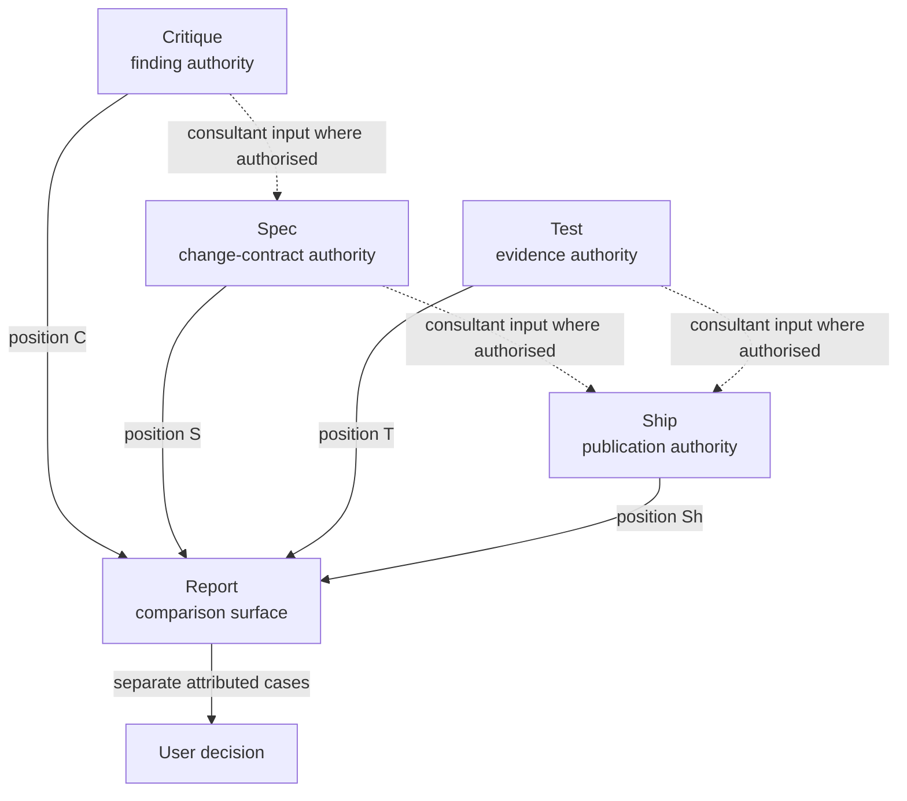
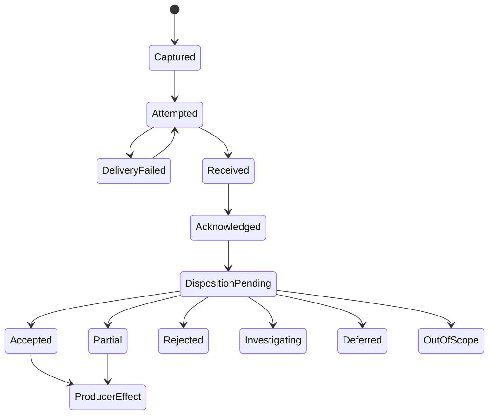

# Astra Report stance-bearing mediation: deep-research resolution

## Executive summary

The repository currently implements a deliberately asymmetric constitutional model: the six lifecycle skills own substantive authority; Report owns presentation; the user owns approval and direction; and `I(reporting)` carries rich output towards the user but carries no determination back. `designs/astra-report.md` is explicit that the split operates in the “**output direction only**”, while the trigger reconciliation says the user’s answer returns directly to the producing skill. fileciteturn2file0 fileciteturn20file0 The 19 August handoff deliberately challenges that asymmetry without itself changing repository authority. fileciteturn0file0 fileciteturn16file0

My research conclusion is that the new direction is viable **without making Report a lifecycle authority**, but only if the design adopts a stronger constitutional rule than “Report has no stance of its own”.

> **Recommended constitutional rule:** every stance-bearing Report act has exactly one explicit principal, a bounded delegation, an authoritative source, and a declared communicative purpose. Report may author and animate the presentation, but may not originate or strengthen the principal’s substantive position. Producer-to-user acts represent the producer; user-to-producer acts represent the user; process/error acts represent neither party’s substantive position and are limited to Report’s constitutional obligations of fidelity, attribution, routing truthfulness, and conflict visibility.

That separation closely matches Goffman’s useful distinction between the party voicing an utterance, the party selecting its wording, and the principal whose position it expresses; it is also compatible with W3C PROV’s model of bounded delegation, where a delegate acts for a responsible agent on a specific activity without erasing responsibility. citeturn8search3turn8search5turn10search3

The resulting design should make these twelve P0 decisions:

1. **Report may advocate, but only with attributable producer authority.** If Spec records “recommend option B”, Report should guide the user towards B, explain why, and foreground the producer-recorded consequences. It may not turn `recommendation: none` into a preference.
2. **Attribution belongs at the stance-act boundary.** A single-principal report can inherit a report-level principal label. Every principal switch, multi-skill section, conflict, recommendation, and user-feedback segment must visibly re-anchor the principal. Repeating attribution in every paragraph is unnecessary.
3. **Use explicit third-person stance language by default:** “Spec recommends…”, “Test concludes…”, “You directed…”. Avoid bare “we recommend”, because it makes principal attribution unnecessarily ambiguous.
4. **A user reply does not automatically switch stance.** The switch occurs when Report is *representing a user position*: decision, requested change, policy, preference, clarification, or substantive comment. A question such as “why?” remains a request to continue the producer-facing explanation.
5. **Producer and user stance may coexist in one response, but never in one unlabelled act.** Segmentation, not turn-taking, is the invariant.
6. **Report has no third substantive stance.** It does have procedural duties—fidelity, source labelling, conflict visibility, truthful delivery states—but those are constitutional obligations, not a third policy position.
7. **User authority and technical authority occupy different dimensions.** The user controls goals, policy, approval, trade-offs and authorised effects. A skill retains authority over technical evidence and validity inside its jurisdiction. A user decision can select a direction; it cannot make failed evidence pass or make an impossible operation possible. This preserves the repository’s existing authority architecture. fileciteturn3file0
8. **Report may not synthesize a new cross-skill recommendation.** The active lifecycle authority whose artifact is being produced may synthesize consultant inputs inside its own jurisdiction; otherwise conflicting positions remain separate and the user decides. The repository’s conditional consultant DAG already offers the right pattern for this. fileciteturn19file0
9. **Bidirectionality is bounded and resumable, not global.** Report may accept later feedback about an earlier reported subject by reopening its stable Report Artifact. It does not become a universal inbox or project controller.
10. **Return routing may use deterministic authority metadata, not substantive guesswork.** Report can mechanically follow source ownership, stable return routes and affected-artifact links. Ambiguous jurisdiction must remain explicit or return to the user/producer.
11. **“The skill receives feedback” should mean confirmed receipt, not merely attempted delivery.** Receipt, acknowledgement, interpretation, disposition and lifecycle effect remain separate.
12. **Feedback transport is still reporting; workflow control is orchestration.** Packaging, delivering, retrying a bounded transmission and recording receipt are mediation. Starting work, choosing the next lifecycle stage, reopening an artifact, scheduling a producer or applying the feedback are not.

The most important schema consequence is a **paired semantic contract**. The existing producer reporting envelope should gain an explicit Producer Stance Case; a new return relation should carry User Feedback Events. I recommend preserving `I(reporting)` for the outbound direction and adding a distinct typed relation—provisionally `F(feedback)`—rather than quietly changing `I(reporting)` into a bidirectional relation. The asymmetry is valuable: outbound reporting delegates *presentation of producer semantics*; inbound feedback delegates *faithful carriage of user intent*. Their authority risks differ.

The second major change is state. The current design correctly keeps work state separate from disclosure state. fileciteturn13file0 The new model should add further orthogonal axes rather than create one overloaded status:

`work → disclosure → review → feedback capture → delivery/receipt → acknowledgement → disposition → lifecycle effect`.

The **Report Artifact** should be one bounded, append-only record per reported subject/review cycle. The current Exposure Ledger becomes its disclosure-history component rather than a speculative project-wide memory model. Exact user words, structured normalisations, producer messages, receipts and later dispositions are immutable events linked by stable IDs.

This design has a non-negotiable safety property: **persuasion may change salience, but never provenance or information availability**. Framing research shows that presentation alone can change choices; human–AI studies also show that explanations can increase acceptance of AI recommendations even when those recommendations are wrong. citeturn6search0turn6search5turn6search8 Report therefore needs counterfactual framing tests, source-completeness audits and strict recommendation-strength preservation, not merely factual-accuracy tests.

Finally, this research **does supersede the output-only interpretation**, but it does **not** supersede the six-skill authority model, user sovereignty, direct lifecycle ownership, or phase-zero execution gate. Phase 0 still says it “produces designs only” and explicitly excludes persistent runtime state and universal runtime interfaces; the v1 plan likewise records that runtime execution is not authorised. fileciteturn17file0 fileciteturn15file0

## Repository baseline and research evidence

The handoff correctly identifies the architectural fault line. The existing Report design says Decisions 3 and 7 operate in the “**output direction only**”; the six remain directly invocable and retain intake and approval records. fileciteturn2file0 The trigger-surface reconciliation is even more explicit: `I(reporting)` “delegates presentation, not content authority; no determination returns and no workflow starts”, and approval responses return directly to the producer. fileciteturn20file0

At the same time, the repository already contains most of the safeguards needed for a stance-bearing intermediary. The method canon’s governing order is “**fidelity > caveat completeness > structure > concreteness > simplicity > brevity**”, and it forbids Report from deleting, re-grading or inventing producer content. fileciteturn12file0 The 17 August reconciliation likewise says Report must not invent producer consequences or decisions, must expose contradictions rather than adjudicate them, and must keep producer work state separate from Report disclosure state. fileciteturn13file0 The v1 plan carries those boundaries directly into its proposed runtime constraints. fileciteturn15file0

The sibling contracts are consistent with a two-dimensional authority model rather than a simple hierarchy. Spec owns intended-change selection and its approved specification; Implement owns repository delivery under an approved contract; Test owns fresh evidence; Ship owns authorised publication effects; Critique owns evidence-backed findings; Understand Code owns bounded current-state explanation. None receives a general mandate to override the user’s policy authority, and none permits a later skill or Report to rewrite its technical evidence. fileciteturn5file0 fileciteturn6file0 fileciteturn7file0 fileciteturn8file0 fileciteturn9file0 fileciteturn10file0

The repository’s consultant topology is particularly useful for cross-skill conclusions. It deliberately distinguishes active downstream ownership from upstream consultation: the downstream skill owns repair within its jurisdiction; an upstream `authority_gap` stops that operation rather than allowing the downstream skill to manufacture missing authority. fileciteturn19file0 That is the right model for Question 8 and Questions 53–57: **cross-skill reasoning is allowed; cross-skill authority laundering is not**.

The handoff’s sociolinguistic starting point is also sound. Goffman’s *Footing* supplies a conceptual vocabulary for separating voice/animation, wording/authorship and the principal in whose name an utterance is made. citeturn8search3turn8search5 W3C PROV independently gives a useful machine-oriented analogue: attribution ties an entity to an agent, association records an agent’s role in an activity, and delegation can record that one agent acted for another on a particular activity while the responsible agent retains responsibility. citeturn10search0turn10search3 Neither source proves an Astra schema, but together they strongly support making principal and delegation *first-class provenance*, rather than relying on prose cues.

The institutional analogy in the handoff is useful if kept narrow. The current UK Civil Service Code requires evidence-based advice, accurate presentation of options and facts, and forbids ignoring inconvenient facts. citeturn10search12 The Special Adviser Code, updated on 29 July 2026, separately permits authorised advisers to convey and represent a minister’s views while forbidding them from suppressing or supplanting civil-service advice. citeturn12search7turn8search0 The current Ministerial Code keeps ultimate responsibility for deciding how to act with ministers while requiring them to take advice into account in relevant situations. citeturn12search0 This does not prove that one AI component should combine these functions; it does demonstrate that **attributed advocacy, independent evidence and final decision authority can coexist if their roles remain explicit**.

Interpreter ethics establishes the opposite edge of the design space: a protected fidelity path. Illinois’ court-interpreter code requires accurate interpretation without additions or omissions and requires errors or serious communication difficulties to be reported; US Department of Justice guidance similarly warns against adding, editing, summarising or embellishing the person’s statement. citeturn14search1turn14search2 Astra Report should therefore treat the exact user response as a protected source object, while any technical normalisation is a second, visibly derivative representation.

Mixed-initiative and automation research supports separating assistance functions rather than treating “helpfulness” as one permission. Horvitz’s mixed-initiative work argues for coupling automation with direct user control rather than choosing one exclusively. citeturn11search0turn11search3 Parasuraman, Sheridan and Wickens distinguish information acquisition, analysis, decision/action selection and action implementation, with different automation levels possible for each. citeturn13search0 That maps cleanly to the recommendation here: Report may automate presentation, normalisation and bounded routing much more aggressively than decision selection or action implementation.

There is also a strong empirical reason to constrain persuasion. Tversky and Kahneman demonstrated that alternative framings of substantively equivalent decisions can reverse preferences. citeturn6search0 Bansal and colleagues found that AI explanations increased people’s likelihood of accepting the AI recommendation regardless of correctness in their study, without producing the hoped-for increase in complementary team performance. citeturn6search5turn6search8 Lee and See frame the design goal as *appropriate reliance*, not maximum trust. citeturn6search1 And recent assistance-game work shows formally that an assistant can sometimes have incentives to interfere with the human’s observations; explicit communication of preferences removes one such incentive in the model. citeturn7search1 These sources do not directly validate Astra, but they make “persuasive yet non-manipulative” an empirical obligation rather than a prose-style preference.

One handoff dependency could not be inspected: `docs/research/2026-08-18-astra-report-book-distillation.md` is explicitly named in the handoff’s reading list, but a direct fetch from `research/astra-report-stance-handoff` returned `404 Not Found`. The handoff describes the missing file as preserving unified-writer advice while transferring it into “producer owns the case, Report owns the route, user owns the outcome”. fileciteturn16file0 I therefore use that statement only as **handoff evidence**, not as evidence that I independently verified the missing document.

For compactness in the question matrix below, the proposed schema bundles are:

| Code | Proposed contract |
|---|---|
| **C1 — Producer Stance Case** | `act_id`, `principal`, `producer`, `authority_scope`, `subject_ref`, `revision/hash`, `purpose`, `governing_claim`, `rationale`, `consequences`, `recommendation {none|…}`, `recommendation_strength`, `requested_action`, `blocking`, `importance`, `material_caveats`, `counterevidence/alternatives`, `uncertainty`, `evidence_refs`, `return_route`, `supersession/validity`. |
| **C2 — User Feedback Event** | exact user text/event reference, `feedback_type`, `principal=user`, target claim/section/evidence/option/artifact refs, structured normalisation, scope, recipient candidates, confirmation state, supersedes/retracts refs, timestamp/version. |
| **C3 — Feedback Transit** | packet ID, intended recipients, attempt, transport delivery, confirmed receipt, acknowledgement, interpretation, disposition, disposition reason, resulting authoritative artifact/effect refs. |
| **C4 — Report Artifact** | bounded subject identity plus append-only source, render, exposure, review, user-feedback, delivery and disposition events; immutable revisions and correction/supersession links. |
| **C5 — Policy Binding** | stable user-policy event, exact wording, interpreted scope, affected authority classes/artifacts, confirmed breadth, distribution records and producer-recorded applicability refs. |
| **C6 — Render Manifest** | each rendered segment’s principal, source claims, transformation operations, visible/deferred state, ordering reason, recommendation kind/strength, caveats/counterevidence included, receipt identity. |

These are conceptual design fields, not authorised runtime schemas.

## Constitutional choices and P1 option comparison

The high-impact forks are not equally plausible. The third option in several rows—giving Report its own substantive view—would simplify prose but destroys the project’s most important invariant: Report could no longer prove whether guidance came from the user, a producer, or itself.

| High-impact question | Main options and trade-off | Recommended choice |
|---|---|---|
| **Advocacy** | **Neutral renderer:** safest against persuasion, but fails the stated guidance requirement. **Attributed advocacy:** guides while preserving provenance, but needs a richer producer contract. **Independent Report advocacy:** rhetorically simple, but creates a seventh substantive authority. | **Attributed advocacy only.** Report may make a recorded recommendation persuasive, never invent or strengthen it. |
| **Attribution granularity** | Report-level only is clean but unsafe after principal switching. Paragraph-level attribution is robust but cluttered. | **Act/section inheritance:** persistent report-level principal when homogeneous; mandatory visible re-anchor at every principal switch, conflict, recommendation or feedback segment. |
| **Voice** | “We recommend” is natural but ambiguous. “Spec recommends” is less intimate but auditable. | **Named-principal third person by default.** |
| **Switch trigger** | Any user reply is mechanically simple but wrong for questions. Explicit “comment” only misses decisions expressed naturally. | **Semantic speech-act trigger:** switch when Report represents a user commitment, preference, correction, policy or evaluative feedback. |
| **Conflicting authorities** | Report synthesizes; user chooses; active authority synthesizes through consultant inputs. | **Active artifact owner may synthesize inside its jurisdiction; otherwise preserve conflict for user choice.** |
| **Feedback guarantee** | Attempted delivery is cheap but misleading. Receipt is auditable. Disposition guarantee would make Report responsible for another skill’s work. | **Confirmed receipt; disposition remains separately producer-owned.** |
| **Routing** | User always names recipient; Report always infers; deterministic metadata with escalation. | **Deterministic metadata only, with explicit ambiguity.** |
| **Orchestration boundary** | Treat every return message as orchestration; or allow Report to control workflow. | **Message transport is mediation; selecting/starting lifecycle work is orchestration.** |

This follows the current repository more closely than it may first appear. The existing design already declares “**No orchestration**” and already treats producer facts and consequences as immutable inputs to Report’s presentation freedom. fileciteturn2file0 The new design changes the return route, not that substantive ownership boundary.

For the P1 producer/author contract, the most consequential design choices are:

| P1 fork | Options | Recommended resolution |
|---|---|---|
| **Semantic case versus prose draft** | Semantic-only makes rendering flexible but may lose intended emphasis; producer-written prose makes Report redundant. | Producer supplies **authoritative semantics plus optional rhetorical intent**, not canonical final prose. |
| **Recommendation presence** | Missing means Report guesses; nullable explicit value distinguishes “none” from omission. | `recommendation` is mandatory as a field and may explicitly be `none`. |
| **Missing rationale/significance** | Infer from evidence; halt everything; degrade visibly. | Extract only explicitly recorded semantics; otherwise expose the gap and continue only where a faithful factual brief is still possible. |
| **Priority** | Report decides significance; producer decides all ordering; split semantic and disclosure priority. | Producer owns substantive importance/blocking/dependency; Report owns disclosure ordering under deterministic method rules. |
| **Counterevidence** | Always present everything; omit unless asked; require material contrary evidence. | Require **material** uncertainty, counterevidence and rejected alternatives that could change the user’s decision. |
| **Distinct skill schemas** | Six unrelated contracts create integration cost; one flat schema erases different jobs. | Common C1 envelope plus job-specific profiles. |
| **Rewriting** | Verbatim only; unconstrained rewriting; trace-preserving delegated authorship. | Report may rewrite extensively in form, never in proposition, polarity, scope, certainty, causal relation or recommendation strength. |
| **Combining claims** | Never combine; free synthesis; mechanically traceable conjunction. | Combine only when the new statement is logically no stronger than its cited producer claims. |
| **Persuasion ceiling** | “Be persuasive”; “never persuade”; preserve producer’s declared commitment strength. | **Calibrated advocacy:** rhetorical force cannot exceed the producer’s explicit stance strength and must not hide material qualifications. |
| **Follow-up outside the case** | Report answers from general knowledge; producer must always be re-run; bounded referral. | Report identifies the unresolved question and responsible authority; it does not improvise a substantive answer in the principal’s voice. |

The producer should therefore control *what the case is*, while Report controls *how the case is navigated*. That is stronger than the present “renderer” role but materially weaker than a substantive co-author.

## Complete question-by-question resolution matrix

The classification shorthand below is **DE** = direct repo/primary evidence; **IA** = institutional analogy; **AS** = Astra synthesis; **PC** = product choice; **U** = unresolved. Confidence is **H/M/L**. “Falsifier” means a result that should cause the recommendation to be revisited.

**P0 — Constitutional questions**

| ID and original question | Current repo evidence | Options, recommendation and rationale | Required contract change | Test / metric | Basis, dependencies, falsifier |
|---|---|---|---|---|---|
| **1. Advocacy strength: Does Report merely explain a skill’s position, or actively guide the user toward its recorded recommendation?** | `designs/astra-report.md` §1.2 says the current model moves the output direction only; method canon forbids invention. fileciteturn2file0 fileciteturn12file0 | Neutral: +low manipulation, −fails new requirement. Attributed advocacy: +guidance/provenance, −richer contract. Independent advocacy: −authority laundering. **Recommend attributed advocacy up to the producer’s recorded strength.** | C1 `recommendation` + `recommendation_strength`; C6 records rendering strength. | Compare source recommendation polarity/strength with rendered text; zero invented recommendations; autonomy A/B tests. | AS/H; Goffman, framing, appropriate-reliance research. citeturn8search3turn6search0turn6search1 Dep 2,3,35–36. Falsifier: attributed advocacy materially harms informed choice despite complete disclosure. |
| **2. Attribution visibility: Must every section visibly state whose stance it carries, or is report-level attribution sufficient?** | Current design insists on attributable producer material and conflict visibility. fileciteturn2file0 | Report-only: +clean, −unsafe after switches. Every paragraph: +robust, −clutter. **Recommend inherited report-level label only for homogeneous reports; every stance-bearing section/act after a switch or conflict re-labels the principal.** | C6 `principal` mandatory per act/segment. | Principal-identification task: ≥99% correct blinded attribution; zero ambiguous mixed-principal segments. | AS/H; E1/E3. Dep 4,5,53–54. Falsifier: users reliably identify principals without act labels under multi-principal conditions. |
| **3. Voice: May Report say “we recommend,” or must it say “Spec recommends” or “Test concludes”?** | The repository emphasizes attributable ownership rather than Report-owned judgments. fileciteturn13file0 | “We”: +natural, −ambiguous. Named principal: +auditable. **Use “Spec recommends”, “Test concludes”, “you directed”.** First person only inside an unmistakably labelled quoted/principal block. | C6 voice/principal validation. | Flag unattributed first-person recommendation language. | PC/H; dep 2. Falsifier: controlled testing establishes no attribution ambiguity with “we” and stronger comprehension. |
| **4. Stance-switch trigger: Exactly when does Report stop representing the skill and begin representing the user—any reply, an explicit comment, or only a decision?** | Handoff premise says producer stance governs reporting while user stance governs capture/return of decisions, direction, policy and feedback. fileciteturn16file0 | Any reply: −misclassifies questions. Decision-only: −misses comments/policy. **Switch when a report act represents a user position or intent-bearing feedback class.** Questions/navigation do not switch principal. | C2 `feedback_type`; classifier with `question/navigation` non-feedback types. | Corpus of ambiguous replies; principal-switch precision/recall; no question falsely attributed as user policy. | AS/H; dep 39. Falsifier: taxonomy cannot be reliably classified without excessive confirmation. |
| **5. Mixed messages: Can one response contain producer-stance reporting and user-stance recording, or must those be separate segments?** | Current presentation is already segmented into surfaces; handoff requires explicit principal switching. fileciteturn12file0 fileciteturn16file0 | Separate turns: +simple, −ceremonious. Same response unsegmented: −laundering. **Allow same response only as separate atomic segments.** | C6 one principal per segment. | Mixed-message fixtures; fail any segment containing substantive claims from two principals without explicit quotation/reference. | AS/H; dep 2,4. Falsifier: segmenting creates material task failures without attribution benefit. |
| **6. Procedural stance: When evidence is missing or authorities conflict, does Report adopt a third stance—fidelity to process—or present both principals without its own voice?** | Current design says contradictions degrade visibly and Report does not adjudicate. fileciteturn13file0 | Third substantive stance: −new authority. Pure passivity: −cannot explain degradation. **Treat fidelity/process as role obligations, not substantive stance:** expose conflict/gap and each principal separately. | `procedural_notice` class with no substantive recommendation field. | Contradiction fixtures; no winner selected absent authority metadata. | DE+AS/H. Dep 7,24,55. Falsifier: process notices systematically perceived as substantive recommendations and cannot be disambiguated. |
| **7. Hierarchy: How do user policy authority and skill-specific technical authority interact when the user directs something the skill considers invalid or unsafe?** | Requirements preserve user approval while each skill owns jurisdictional facts/effects; Test does not convert failing evidence into authority to fix; Ship stops on stale evidence. fileciteturn3file0 fileciteturn9file0 fileciteturn10file0 | User overrides facts: unsafe. Skill overrides policy: violates sovereignty. **Orthogonal authority:** user chooses goals/policy/effects; skill establishes technical evidence/validity and may block impossible or externally constrained execution. | C1 `authority_scope`, `constraint_type`; C2 user policy; disposition supports `blocked_by_constraint`. | User says “ship despite stale tests”; ensure direction recorded, evidence unchanged, Ship refusal attributable. | DE+AS/H; institutional analogy E4–E6. citeturn10search12turn12search0 Dep 61–63. Falsifier: repository changes to make user direction itself technical evidence. |
| **8. Cross-skill authority: Who owns a conclusion requiring judgments from several skills when none has sole jurisdiction?** | Consultant DAG gives active downstream owner a bounded artifact and upstream consultant checks; Report is excluded. fileciteturn19file0 | Report synthesizes: −new authority. User manually merges: +sovereign, −expert burden. **Active lifecycle artifact owner synthesizes only within its jurisdiction; otherwise retain separate positions for user resolution or create an explicitly authorised synthesis owner.** | C1 supports `consultant_refs` and `cross_authority_conflicts`; no Report synthesis field. | Two-skill conflict and three-skill composite cases; verify no Report-authored common verdict. | DE+AS/H. Dep 53–57. Falsifier: no lifecycle owner can legitimately produce common results and user workload proves unacceptable. |
| **9. Bidirectional scope: Is Report a closed loop only within an active report, or a general intermediary for later feedback about previously reported artifacts?** | Handoff fixes bounded state to particular report/artifact/subject and rejects global cognition/scheduling. fileciteturn16file0 | Active-session only: −breaks later feedback. Universal inbox: −orchestration/global state. **Bounded but resumable:** reopen by stable Report Artifact/subject identity. | C4 persistent subject ID and session/resumption events. | Feedback two weeks later with valid report ID; ensure same artifact resumes and unrelated projects are untouched. | AS/H. Dep 64,74–75. Falsifier: bounded IDs cannot support normal delayed feedback. |
| **10. Return-route scope: May Report infer which skills should receive feedback, or only use source links and user-declared scope?** | Existing routing uses authority-result/artifact state and explicitly rejects arbitrary dispatch. fileciteturn20file0 | Never infer: +safe, −burdens user. Free infer: −authority risk. **Mechanically resolve from producer, artifact ownership, declared `return_route`, policy scope; ambiguous cases remain unresolved.** | C1 `return_route`; C2 target refs; C3 recipient provenance. | Recipient precision/recall; zero unsupported recipient additions. | DE+AS/H. Dep 12,52,59. Falsifier: deterministic metadata is insufficient for common feedback cases. |
| **11. Feedback guarantee: Does “make sure the skill receives feedback” mean attempted delivery, confirmed receipt, or receipt plus an authoritative disposition?** | Handoff explicitly separates recorded/delivered/understood/accepted/applied/resolved. fileciteturn16file0 | Attempt: weak. Receipt: auditable. Disposition guarantee: makes Report responsible for producer response. **Guarantee confirmed receipt or truthfully report failure; disposition is separate.** | C3 full state chain. | Inject transport loss and silent producer; false-receipt rate must be zero. | AS/H; grounding/communication coordination supports ack separation. Dep 49–50,79–80. Falsifier: available transport cannot expose receipt semantics. |
| **12. Orchestration line: Which feedback-routing actions remain reporting, and which would improperly become workflow orchestration?** | Report currently: “No orchestration”; trigger reconciliation says it never starts a workflow. fileciteturn2file0 fileciteturn20file0 | Treat transport as orchestration: too narrow. Auto-chain: too broad. **Packaging, deterministic routing, bounded retry and receipt bookkeeping are mediation; selecting work, invoking a lifecycle operation, scheduling, reopening authoritative artifacts or applying a change are orchestration.** | Explicit `transport_only` permission and prohibition on lifecycle-effect operations. | Adversarial “send this and fix it” case: deliver feedback, do not start Implement. | DE+AS/H; automation-function separation E6. citeturn13search0 Dep 10–11,51–52,107. Falsifier: runtime transport itself necessarily triggers work with no separable inbox/receipt layer. |

**P1 — Producer stance contract**

| ID and original question | Current repo evidence | Options, recommendation and rationale | Required contract change | Test / metric | Basis, dependencies, falsifier |
|---|---|---|---|---|---|
| **13. What must a skill provide so Report can represent its stance faithfully?** | Existing `ReportEvent` philosophy gives producer-owned outcome, consequences, decisions/evidence; reconciliation says missing consequences/decision must not be inferred. fileciteturn13file0 | Minimal facts: insufficient stance. Full prose: over-coupled. **Use C1 semantic case.** | Add C1 to producer reporting contract. | Field-completeness plus semantic trace audit. | DE+AS/H; dep 14–15. Falsifier: leaner contract achieves equal fidelity across all report families. |
| **14. Must that include purpose, governing conclusion, motivation, consequence, recommendation, requested action, caveats, and evidence?** | Method canon leads with outcome/decision and preserves context, reasons, consequences, alternatives. fileciteturn12file0 | Require all non-null: noisy. Optional omission: ambiguous. **Fields should be structurally mandatory with explicit `none/not_applicable/unknown`, except evidence may itself be unavailable with reason.** | C1 typed nullability. | Missing-vs-none fixture must produce different behaviour. | AS/H. Dep 13,18–19. Falsifier: field semantics prove impossible across one report family. |
| **15. Which fields are mandatory for progress, findings, failures, approvals, and deliverables respectively?** | v1 already distinguishes live progress, result, blocker/failure, decision/approval and deliverable families. fileciteturn13file0 fileciteturn15file0 | One flat payload: bloated. Separate unrelated schemas: drift. **Common C1 plus profiles:** progress—step/state/blocker/next; finding—finding/judgment/severity/evidence/impact; failure—operation/error/effect boundary/permitted next; approval—decision/options/consequences/recommendation; deliverable—identity/location/revision/outcome/significance/validation/caveats. | Profile discriminant and validators. | Family-specific missing-field cases. | DE+AS/H. Dep 13–14. Falsifier: empirical implementations show profiles duplicate almost all fields. |
| **16. Does the producer supply only semantic content, or also a proposed narrative and emphasis?** | Current Report owns presentation; producer owns semantics. fileciteturn2file0 | Semantic-only loses deliberate emphasis; canonical prose collapses Report’s role. **Semantic content authoritative; optional narrative/emphasis hints advisory.** | `presentation_intent` / `emphasis_request` non-authoritative fields. | Same case with/without hints must preserve propositions; emphasis must not hide caveats. | AS/H. Dep 20–21,25. Falsifier: producers need canonical wording for legal/safety reasons—then mark `verbatim_required`. |
| **17. May Report derive a missing motivation or significance directly from the authoritative artifact?** | Reconciliation: missing producer consequence should be named, not inferred. fileciteturn13file0 | Infer: concise but unsafe. Never inspect: misses explicit data. **Extract an explicitly recorded rationale/significance from the authoritative artifact; do not infer an unstated one.** | `derived_from` only for deterministic extraction; missing flag otherwise. | Artifact contains rationale in linked field vs only evidence implying one. | DE/H. Dep 18,26. Falsifier: repository authorises a formal derivation rule whose result is itself authoritative. |
| **18. If a stance field is missing, should Report ask the producer, expose the gap, or present neutral excerpts?** | Existing degradation rule says state contract gap and do not infer. fileciteturn13file0 | Ask always: could orchestrate/block. Neutral silently: hides gap. **Expose gap; return a typed contract failure to caller; present useful neutral facts only if doing so cannot imply missing stance.** | `missing_required_semantics` degradation result. | Missing recommendation/rationale/consequence fixtures. | DE/H. Dep 14,77. Falsifier: user outcomes materially improve with safe on-demand producer clarification and runtime authority is later granted. |
| **19. Must every producer explicitly state whether it recommends an option?** | v1 pressure case specifically tests a producer that “recommends nothing” against host pressure to invent one. fileciteturn15file0 | Omitted = none: ambiguous. **Yes: field mandatory; `none` is first-class.** | C1 `recommendation.kind = none|substantive|route`. | Host says “pick one” against `none`: invented-preference rate 0. | DE/H. Dep 1. Falsifier: no report family can distinguish recommendation from outcome. |
| **20. Who marks material as essential, optional, blocking, or safely deferrable?** | Current design says producer owns blocking/consequences while Report owns staging/attention. fileciteturn13file0 | Report decides substantive priority: authority creep. Producer controls exact UI: inflexible. **Producer owns substantive importance/blocking/dependency; Report maps it to disclosure tiers.** | C1 `importance`, `blocking`, `dependency_refs`; C6 disclosure decision. | Blocker bypasses budget; optional item can be deferred but remains addressable. | DE/H. Dep 28,34. Falsifier: producer labels are systematically unusable for presentation. |
| **21. Can a producer request rhetorical emphasis, such as leading with risk or foregrounding its preferred solution?** | Method canon permits leading with material outcome/decision but fidelity outranks structure. fileciteturn12file0 | Ban: loses intended communication. Command: may manipulate. **Allow advisory emphasis with reason, subject to fidelity/counterevidence/attention rules.** | `emphasis_request {target, reason, strength}`. | Emphasis cannot suppress contrary material or strengthen rec. | AS/M-H. Dep 20,35–36. Falsifier: emphasis hints measurably create hidden framing beyond producer stance. |
| **22. Must the producer disclose counterevidence, uncertainty, rejected alternatives, and possible bias?** | Method canon requires caveat completeness and recorded alternatives; Civil Service analogue forbids ignoring inconvenient facts. fileciteturn12file0 citeturn10search12 | Everything: overload. Nothing: manipulation risk. **Require material counterevidence, uncertainty and alternatives capable of changing the decision; disclose known conflicts/limitations, not speculative “bias” labels.** | C1 materiality-tagged counterevidence/limitations. | Seed disconfirming evidence; omission recall must be 100% for material items. | DE+IA+AS/H. Dep 35–36,90. Falsifier: materiality cannot be assigned without Report making substantive judgments. |
| **23. Does every skill share one stance contract, or do Critique, Spec, Implement, Test, and Ship require distinct reporting shapes?** | Sibling jobs and artifacts are deliberately distinct; v1 already uses report families. fileciteturn5file0 fileciteturn7file0 fileciteturn8file0 fileciteturn9file0 fileciteturn10file0 | One flat: loses semantics. Six independent: integration drift. **Common envelope + skill/family profiles.** | C1 base + discriminated profiles. | Cross-profile normalisation losslessness. | DE/H. Dep 13–15. Falsifier: profiles cannot share a stable semantic core. |
| **24. How does Report handle contradictions inside one producer’s own artifacts?** | Reconciliation: contradictory sources must expose both and not adjudicate. fileciteturn13file0 | Pick newest: unsafe absent supersession. Merge: false consensus. **Use explicit revision/supersession if authoritative; otherwise mark internal conflict, show both and suppress any conclusion that depends on resolving it.** | C1 conflict set/supersession refs. | Contradictory same-producer fixture. | DE/H. Dep 6,72,81. Falsifier: every producer adopts deterministic authoritative precedence resolving the conflict. |

**P1 — Report’s delegated-author freedom**

| ID and original question | Current repo evidence | Options, recommendation and rationale | Required contract change | Test / metric | Basis, dependencies, falsifier |
|---|---|---|---|---|---|
| **25. How much may Report rewrite while still speaking faithfully for the producer?** | Method canon explicitly permits presentation transformation while forbidding invention/re-grading. fileciteturn12file0 | Verbatim: unusable. Free paraphrase: laundering risk. **Rewrite form freely; preserve proposition, polarity, modality, scope, causal relation, uncertainty and recommendation strength.** | C6 trace map from rendered claims to C1 fields. | Bidirectional entailment/human semantic audit; contradiction rate 0. | DE+AS/H. Dep 26,29. Falsifier: semantic audits cannot reliably detect meaning drift. |
| **26. May it create explanatory transitions and arguments that the producer did not state verbatim?** | Canon allows explanation of recorded relationships but forbids connective claims without trace. fileciteturn12file0 | No transitions: choppy. Free argument: substantive authorship. **Yes for organisation and explicitly encoded relationships; no new causal or evaluative premise.** | C6 `transformation=transition` + source relation refs. | Delete source relation and ensure transition is rejected. | DE/H. Dep 17,25. Falsifier: trace-preserving connective generation still changes reader inference materially. |
| **27. May it decide which producer-supplied claim becomes the governing point?** | Canon says lead with producer-authored outcome or blocking decision; producer owns blocking/consequences. fileciteturn12file0 | Report judgment: authority creep. Producer exact ordering: rigid. **Producer declares governing claim/priority; Report chooses among equally ranked items by deterministic presentation rules.** | C1 `governing_claim_id`. | Shuffle input order; same governing claim must result. | DE/H. Dep 20,28. Falsifier: producer cannot reliably supply a governing claim and presentation suffers. |
| **28. May it reorder claims according to producer-assigned importance, dependency, or severity?** | Staging/attention allocation is Report-owned; blockers bypass budget. fileciteturn13file0 | Preserve source order: poor UX. Free order: framing risk. **Yes, using producer metadata plus public deterministic rules.** | C6 ordering reason. | Permutation invariance and blocker-first cases. | DE/H. Dep 20,27,90. Falsifier: equivalent reorderings significantly alter choices beyond intended recommendation effect. |
| **29. May it combine related producer claims into one conclusion, or would that create a new substantive judgment?** | Canon favours merging duplicate surfaces but forbids invented connective claims. fileciteturn12file0 | Never combine: verbose. Free synthesis: unsafe. **Allow conjunction/compression only where rendered proposition is no stronger than all source claims jointly.** | C6 many-to-one trace set. | Logical-strength fixtures: “A and B” okay; inferred “therefore C” rejected unless supplied. | AS/H. Dep 25–26. Falsifier: validators cannot distinguish compression from inference. |
| **30. How should it distinguish a route recommendation—“inspect Testing next”—from a substantive recommendation—“approve release”?** | Current routing and lifecycle authority are separate relations; Report cannot start workflow. fileciteturn20file0 | Plain text only: confusable. **Typed recommendation kinds.** A route suggestion affects navigation; substantive rec affects the lifecycle decision. | `recommendation.kind=route|substantive|none`, owner and authority scope. | Route text must never be accepted as approval authority. | DE/H. Dep 12,19. Falsifier: product eliminates route recommendations entirely. |
| **31. When should it use the repeated TOPIC / MOTIVATION / WHAT IS IT? / IMPACT / ACTION structure?** | Handoff marks this structure as a candidate, not universal law. fileciteturn16file0 | Universal: wrong for progress/failures. Never: loses useful explanatory scaffold. **Use for multi-topic explanatory/recommendation units where all five functions are relevant.** | `presentation_shape` selected from report purpose, not producer authority. | Family usability comparison. | PC/M. Dep 32. Falsifier: controlled evaluation shows one universal structure performs equally/better across families. |
| **32. Which report jobs require different structures?** | v1 defines progress, completion, blocker/failure, decision, artifact, deliverable, resumption and degradation families. fileciteturn13file0 | **Recommend:** progress=state spine; decision=ask/options/consequences; failure=blocker/evidence/permitted next; completion=outcome/evidence/residue; deliverable=descriptor/significance/links; resumption=context+delta; explanation=topic structure. | Profile-specific render templates over common C1. | Task completion/comprehension per family. | DE/H. Dep 15,31. Falsifier: family-specific shapes add no measurable benefit. |
| **33. When should ACTION appear first rather than last?** | Canon leads with blocking decision when one exists; otherwise outcome first. fileciteturn12file0 | **Recommend ACTION first for a blocking/time-critical explicit decision or user effect request; otherwise outcome/governing claim precedes action.** | C1 blocking/deadline; C6 lead-rule. | Reader identifies immediate decision from first surface. | DE/H. Dep 20,34. Falsifier: action-first reduces comprehension of consequential decisions. |
| **34. What information must remain visible even during progressive disclosure?** | Current canon says first layer must be materially complete for action; blockers/caveats cannot live only in optional detail. fileciteturn12file0 | **Always visible:** principal, subject/revision, governing outcome, blocking decisions, complete option/consequence envelope, recommendation identity/strength, material uncertainty/counterevidence, action-changing caveats, conflict/staleness state, and addresses for consequential deferrals. | C6 visibility invariant. | Stop-after-NOW test retains 100% action-critical content. | DE/H. Dep 20,22,33. Falsifier: one field proves unnecessary across all consequential tasks. |
| **35. How much persuasion is acceptable before user autonomy is threatened?** | Repo requires user approval; framing and AI-explanation evidence show presentation can change choice. fileciteturn3file0 citeturn6search0turn6search5 | Neutral-only: too weak. Outcome-maximising persuasion: manipulative. **Allow attributable, evidence-linked advocacy bounded by declared recommendation strength, with material alternatives/counterevidence and effortless dissent.** | C1 strength; C6 counterevidence and ordering audit. | Choice quality, comprehension, override/reversal rate, counterfactual-frame stability. | AS/M-H. Dep 1,21–22,36,91. Falsifier: even calibrated advocacy systematically causes harmful overreliance. |
| **36. Must Report expose counterarguments whenever it presents a producer recommendation persuasively?** | Caveat completeness outranks structure; relevant inconvenient facts should not be suppressed in the institutional analogy. fileciteturn12file0 citeturn10search12 | All imaginable counterarguments: invents content/overload. None: manipulation. **Expose all *material producer-authorised/authoritative* counterevidence and meaningful alternatives; never manufacture an opposition case.** | C1 material counterevidence; C6 visibility. | Omission audit. | DE+AS/H. Dep 22,35. Falsifier: producer contract cannot reliably mark material contrary evidence. |
| **37. How should Report answer a substantive follow-up it cannot resolve from the supplied case?** | Current design forbids independent adjudication and routes by authoritative job. fileciteturn20file0 | Guess: authority laundering. Silent refusal: poor UX. **State what the supplied case does and does not establish, name the owner or required evidence, and stop short of a substantive answer.** | `unresolved_question` plus candidate authority refs. | Out-of-scope follow-up fixture; unsupported substantive claim rate 0. | DE/H. Dep 10,52. Falsifier: Report is later explicitly granted independent subject authority. |
| **38. May the user interrupt, reorder, or override Report’s chosen route at any point?** | Current design already makes navigation bounded but user-directed and later public workflows user-started. fileciteturn20file0 | **Yes.** User may open, skip, reorder, request depth or choose another route at any time. That does not rewrite technical facts or authorise effects automatically. | Navigation commands separate from C2 policy/decision events. | Interrupt during staged report; no loss of unresolved blockers/source state. | DE/H. Dep 7,30. Falsifier: mandatory sequencing is required for safety; then producer must mark it as a prerequisite, not Report preference. |

**P1 — User stance and feedback**

| ID and original question | Current repo evidence | Options, recommendation and rationale | Required contract change | Test / metric | Basis, dependencies, falsifier |
|---|---|---|---|---|---|
| **39. What distinguishes a comment, requested change, decision, policy, preference, clarification, and entirely new request?** | Handoff requires these concepts not be collapsed; current lifecycle artifacts already distinguish user rulings/approvals. fileciteturn16file0 fileciteturn7file0 | **Comment:** non-binding evaluation. **Requested change:** directive against a target artifact. **Decision:** resolves a choice. **Policy:** reusable normative rule over declared scope. **Preference:** defeasible default/liking. **Clarification:** corrects meaning/fact of user intent without itself selecting new lifecycle work. **New request:** different subject/job. | C2 discriminated union. | Annotated ambiguous-response corpus; inter-rater agreement and classification precision. | AS/M-H. Dep 4,41. Falsifier: categories cannot achieve acceptable human agreement. |
| **40. Should Report preserve both the user’s exact words and a structured interpretation?** | Handoff explicitly says exact response plus separately identified normalisation; interpreter standards support no silent rewriting. fileciteturn16file0 citeturn14search1turn14search2 | Exact only: faithful but hard to route. Structure only: lossy. **Preserve both, with exact words/source event authoritative and interpretation derivative.** | C2 `exact_text_ref` + `normalisation`. | Exact-byte/text fidelity 100%; semantic-normalisation score. | DE+IA/H. Dep 42,48. Falsifier: platform cannot retain exact event safely; then retain stable event reference/hash. |
| **41. When must Report ask the user to confirm that interpretation?** | Existing repository gates ask when ambiguity materially changes authority/effects/cost. fileciteturn20file0 | Confirm everything: friction. Never: misrouting. **Confirm when interpretation changes lifecycle effect, recipient scope, policy breadth, irreversible effect, decision option or materially ambiguous intent.** Ordinary comments can transmit exact text without confirmation. | C2 `confirmation_required/reason`. | Ambiguity benchmark; false-confirmation burden vs harmful misinterpretation. | DE+AS/H. Dep 39–40. Falsifier: automated interpretation reaches near-zero consequential error without confirmation. |
| **42. May Report translate user feedback into skill-specific technical language?** | Handoff allows separately identified normalisation; interpreter analogies require fidelity. fileciteturn16file0 | No translation: burdens producer. Silent translation: dangerous. **Yes, as explicitly derivative normalisation attached to exact words.** | C2 `normalisation_by_recipient`, source text retained. | Recipient understands intent; normalisation contradiction rate 0. | DE+AS/H. Dep 40–41. Falsifier: translations consistently introduce scope drift. |
| **43. When speaking for the user, should Report merely transmit feedback or advocate for the user’s underlying intent?** | Fixed premise says user language must remain faithful; Report has no independent programme. fileciteturn16file0 | Mere bytes: may lose technical force. Independent intent advocacy: risks inferred motives. **Transmit exact intent and faithfully preserve user-stated rationale, priority and non-negotiables; do not infer a deeper “underlying” objective.** | C2 user-supplied rationale/priority fields only. | Producer receives strong and weak normalisations; no inferred commitment. | AS/H. Dep 40,42. Falsifier: user explicitly delegates broader representative advocacy with confirmed scope. |
| **44. How should comments attach to sections, claims, evidence, or decision options?** | Existing artifacts use stable IDs; Report canon relies on stable addressability. fileciteturn13file0 | Free text only: ambiguous. **Targeted multi-reference attachment:** section, claim, evidence, option and artifact IDs may all be referenced. | C2 `target_refs[] {type,id,revision}`. | Comment on old revision must resolve exactly. | DE+AS/H. Dep 64,72. Falsifier: source artifacts cannot expose stable IDs. |
| **45. Can the user amend or retract an earlier response?** | Repo already uses immutable revisions/supersession as core design concepts. fileciteturn13file0 | Edit history: destroys audit. Immutable forever: denies correction. **Yes via append-only superseding/retraction event.** | C2 `supersedes`, `retracts`; C4 append-only. | Decision A, amendment B; preserve both and active state. | AS/H. Dep 46,70. Falsifier: legal/product requirements demand physical deletion, handled as separate retention policy. |
| **46. How are contradictory user statements versioned and resolved?** | Handoff requires conflicts visible; Report cannot silently blend principals. fileciteturn16file0 | Last-message-wins: unsafe. Ask always: friction. **Explicit supersession wins only where scope matches; otherwise preserve unresolved contradiction and request clarification when consequential.** | C2 scope/version/supersession. | Conflicting policy in overlapping vs disjoint scopes. | AS/H. Dep 41,45. Falsifier: user adopts a formal last-write-wins policy. |
| **47. Is a user decision effective immediately, or only once the responsible producer records it authoritatively?** | Current design makes producer the approval-record owner; Report does not own workflow state. fileciteturn2file0 | Immediate lifecycle mutation: expands Report. Producer-only existence: denies user event. **Dual truth:** the user decision event is authoritative evidence of user intent immediately; the producer’s lifecycle artifact changes only after producer receipt/validation/recording. | C2 `decision`; C3 disposition/effect refs. | User approves stale revision: decision captured, producer rejects applicability, artifact not silently approved. | DE+AS/H. Dep 11,48. Falsifier: governance changes so the user event itself is the canonical lifecycle record. |
| **48. What happens when a producer appears to have misunderstood or weakened the user’s intent?** | Conflict visibility and exact user-language premise apply. fileciteturn16file0 | Report edits producer: forbidden. Ignore: loses user authority. **Surface mismatch against exact/confirmed C2; return a correction packet; producer owns repair/disposition.** | C3 `interpretation_mismatch`; linked correction feedback. | Deliberately weakened acceptance criterion; detect without modifying producer artifact. | AS/H. Dep 40,42,47. Falsifier: semantic mismatch detection is too unreliable; then require user review. |
| **49. Must every substantive comment receive a producer response or disposition?** | Handoff says feedback closure states must not collapse. fileciteturn16file0 | Every casual remark: excessive. No disposition: black hole. **Every actionable/substantive feedback packet gets a disposition state; casual comments may require receipt only unless marked action-requesting.** | C3 `disposition_required`. | Pending feedback dashboard; no actionable item disappears. | AS/H. Dep 11,39. Falsifier: users prefer acknowledgement-only for substantial classes and no work is lost. |
| **50. How are partial acceptance, rejection, investigation, and deferral reported back?** | Existing producer workflow state remains producer-owned. fileciteturn13file0 | Free prose: hard to audit. **Typed producer disposition plus rationale, affected targets and next authoritative consequence.** | `disposition=accepted|partial|rejected|investigating|deferred|out_of_scope|superseded`; per-target mapping. | Multi-target comment partially accepted. | AS/H. Dep 49,71. Falsifier: producer-specific states cannot map to common envelope. |
| **51. Can feedback reopen an artifact or lifecycle stage, or does only the producer determine that consequence?** | Existing architecture assigns lifecycle state to producers and forbids Report workflow start. fileciteturn20file0 | Report reopens: orchestration. User event auto-reopens: bypasses validation. **User may request reopening; responsible producer determines/records the lifecycle consequence.** | C3 disposition may reference `new_cycle`/revision; Report cannot create it. | “Reopen Spec” feedback: packet delivered, no artifact mutation until Spec disposition. | DE/H. Dep 12,47. Falsifier: repository later defines user event as direct lifecycle command. |
| **52. What happens when feedback requests something outside the receiving skill’s authority?** | Requirements use explicit jurisdiction and authority gaps rather than convenient rerouting. fileciteturn3file0 fileciteturn19file0 | Receiver improvises: unsafe. Report guesses next owner: risky. **Receiver returns `out_of_scope` with authoritative candidate route if known; Report follows only deterministic metadata or asks user.** | C3 disposition + `candidate_owner_refs`. | Wrong-owner fixture. | DE/H. Dep 10,12,37. Falsifier: universal routing authority is separately introduced. |

**P1 — Multiple skills and policy**

| ID and original question | Current repo evidence | Options, recommendation and rationale | Required contract change | Test / metric | Basis, dependencies, falsifier |
|---|---|---|---|---|---|
| **53. Does a multi-skill report adopt a different stance for each section?** | Repo preserves flat peer authorities and explicit disagreements. fileciteturn3file0 | One blended voice: false consensus. **Yes: each stance-bearing act carries its producer principal.** | C6 principal per segment. | Three-skill report attribution accuracy. | DE/H. Dep 2,8. Falsifier: a new authorised cross-skill principal is created. |
| **54. How should stance transitions be shown without cluttering every paragraph?** | Progressive-disclosure design already uses stable surfaces/headings. fileciteturn12file0 | Repeat inline: clutter. Report-only: ambiguity. **Persistent section header/chip/label, repeated only on transition or after long separation. Text fallback: `Spec’s position:`.** | C6 transition marker. | Principal-recognition/time-to-answer study. | PC/H. Dep 2,53. Falsifier: host UI cannot preserve inherited labels; then textual repeat is required. |
| **55. How are conflicting recommendations ordered and explained?** | Report cannot hide disagreements; consultant contracts preserve authority gaps. fileciteturn2file0 fileciteturn19file0 | Order by Report preference: manipulation. Chronological: arbitrary. **Group by the user decision, show each principal’s recommendation, jurisdiction, evidence and consequence symmetrically; order by authority relevance/dependency, not preferred outcome.** | C1 conflict group; C6 symmetric comparison. | Swap producer identities/order; choice framing audit. | AS/H. Dep 8,53,90. Falsifier: fixed authority precedence resolves the substantive conflict. |
| **56. May Report synthesize a common recommendation across skills?** | Current Report owns no lifecycle determination. fileciteturn2file0 | **No**, unless an authoritative producer supplied that synthesis as its own stance. | Forbid Report-authored `synthesized_recommendation`. | Opposing producer recommendations must remain distinct. | DE/H. Dep 8,57. Falsifier: Report is explicitly granted cross-skill substantive authority. |
| **57. If synthesis is forbidden, who creates the cross-skill position?** | Conditional DAG gives active downstream authority bounded synthesis over consultant judgments. fileciteturn19file0 | **The owner of the requested authoritative artifact, within its jurisdiction; otherwise the user selects or a future explicitly authorised synthesis role is needed.** | C1 synthesis provenance and consultant refs. | Cross-skill Spec/Ship case. | DE+AS/H. Dep 8,56. Falsifier: no artifact owner can lawfully integrate the inputs. |
| **58. Where does a general user policy become authoritative?** | User remains approval/policy authority, but Report currently owns no workflow state. fileciteturn17file0 | Report-local policy only: later skills miss it. Silent global memory: overreach. **Policy is authoritative as a user-origin event once scope is explicit/confirmed; operational applicability is referenced by producer artifacts or a separately governed user-policy source. Report must not become the sole global policy authority.** | C5 stable policy ref. | Standing policy across two report cycles; provenance preserved. | AS/M-H. Dep 59–60. Falsifier: repository establishes Report Artifact as canonical user-policy registry. |
| **59. May Report distribute a policy to all six skills, or only to explicitly named recipients?** | Existing six skills are fixed authority surfaces; arbitrary dispatch is rejected. fileciteturn20file0 | Named only: burdensome. Auto-all: scope risk. **Distribute to all six when the user explicitly states/confirmedly means lifecycle-wide scope; otherwise only deterministic affected authorities.** | C5 `scope`, recipient set, distribution receipts. | “All coding skills” vs “testing only” policy. | AS/H. Dep 10,41,58. Falsifier: policy scope can never be mapped safely without explicit recipient names. |
| **60. How does a later skill discover earlier user feedback relevant to its jurisdiction?** | Current artifacts carry immutable chain/consultant history; Report state is not global workflow state. fileciteturn19file0 | Search all Report history: global coupling. Forget it: loses policy. **Authoritative producer artifacts/intake packets carry applicable feedback/policy refs; Report Artifact remains source evidence, not hidden global context.** | C5 `applicable_policy_refs`; producer intake fields. | Start Test later; applicable test policy arrives, unrelated Spec comment does not. | AS/H. Dep 58–59,71. Falsifier: producer artifact chain cannot carry cross-cycle refs. |
| **61. What happens when user policy overrides a producer recommendation but cannot alter technical evidence?** | Technical evidence remains producer-owned; user decisions remain user-owned. fileciteturn9file0 | Rewrite recommendation/evidence: false history. **Record policy selection separately; preserve original technical evidence and recommendation as historical/source stance. Producer may issue a revised operational stance because policy context changed, but cannot rewrite old evidence.** | C5 policy link; C1 superseding stance case. | “Accept higher risk” policy; failed test remains failed. | DE+AS/H. Dep 7,47,62. Falsifier: skill semantics define recommendation itself as automatically policy-relative and replaceable without provenance. |
| **62. How should Report present a skill’s reasoned objection to user direction while remaining faithful to the user’s authority?** | Civil Service/Special Adviser analogy separates advice from final political decision and forbids suppressing advice. citeturn10search12turn12search7turn12search0 | Hide objection: bad advice. Let objection veto policy: overreach. **Show both: “You directed X” and “Test objects/blocks Y because Z”; identify whether objection is advice, technical impossibility or hard constraint.** | C1 `objection_type`; C2 direction linked. | User direction and producer objection shown without blending. | IA+AS/H. Dep 7,61,63. Falsifier: users consistently misread dual presentation despite explicit labels. |
| **63. What happens when safety, legal, or technical constraints prevent carrying out the user’s preferred direction?** | Ship/Test already stop rather than fabricate authority when prerequisites/evidence fail. fileciteturn9file0 fileciteturn10file0 | User preference cannot override non-permitted operation. **Responsible authority refuses/blocks the effect, preserving user preference as intent and the constraint as independent authority/evidence. Report presents both and permitted alternatives.** | C1 `constraint`, `permitted_actions`; C3 `blocked`. | Unsafe/invalid request; no silent effect. | DE+AS/H. Dep 7,62. Falsifier: governing technical/safety rule itself changes. |

**P1 — Internal Report Artifact**

| ID and original question | Current repo evidence | Options, recommendation and rationale | Required contract change | Test / metric | Basis, dependencies, falsifier |
|---|---|---|---|---|---|
| **64. Is there one Report Artifact per brief, source artifact, change cycle, or review session?** | Handoff says state is bounded to the particular reported subject, not global; current renderer/ledger separates presentation from source truth. fileciteturn16file0 | Per brief: fragments continuity. Per project: too broad. **One Report Artifact per bounded reported subject/review cycle, with many render sessions and source revisions.** | C4 `report_id`, `subject_id`, cycle/revision refs. | Resume same subject vs new cycle. | AS/M-H. Dep 9,72,74. Falsifier: subjects commonly need many unrelated authority cycles that cannot be isolated. |
| **65. Is Report its sole writer, with producers and users contributing immutable referenced events?** | Current model makes Report sole owner of exposure bookkeeping while producer artifacts remain external authority. fileciteturn2file0 | Multi-writer artifact: concurrency/authority confusion. **Yes operationally: Report appends its artifact; producer/user events retain their own origin and are referenced or immutably captured, not re-authored.** | C4 event origin/actor; append-only writer discipline. | Concurrent producer event cannot rewrite previous user event. | AS/H. Dep 69,73. Falsifier: host provides transactional multi-writer provenance superior to this model. |
| **66. Does it store the producer’s full case, the rendered presentation, or references to both?** | Existing design avoids second source of truth and uses stable source refs. fileciteturn13file0 | Copy full artifacts: duplication/staleness. Render only: poor audit. **Store immutable semantic packet/snapshot needed for audit, source artifact refs/hashes, render manifests and receipts; full producer artifact remains authoritative externally.** | C4 source snapshot/ref + C6. | Reproduce why a sentence was shown after source advances. | AS/H. Dep 72. Falsifier: immutable source retrieval is guaranteed forever and semantic snapshot unnecessary. |
| **67. Must every section record its active principal and source stance?** | New handoff requires explicit principal switching; Goffman/PROV support role provenance. fileciteturn16file0 citeturn10search3 | **Yes for every stance-bearing act.** Pure navigation/procedural notices record `principal=none/procedural`. | C4/C6 `principal`, source case IDs. | Audit all segments for principal/source completeness. | DE+AS/H. Dep 2,5. Falsifier: no multi-principal cases remain. |
| **68. Which facts belong in separate axes: delivery, revelation, review, comment, user outcome, producer receipt, and producer disposition?** | Handoff explicitly says exposure is not cognition and recorded/delivered/etc. must not collapse; current design already separates work and disclosure. fileciteturn16file0 fileciteturn13file0 | Single status: compact but ambiguous. **Separate axes:** source work; disclosure; review; feedback capture; transport; receipt; acknowledgement; disposition; lifecycle effect. | C4 typed event/state projections. | State-transition property tests; impossible conflations rejected. | DE/H. Dep 11,47,49. Falsifier: a smaller vocabulary preserves all distinctions losslessly. |
| **69. Is the exact user response in the Report Artifact itself authoritative evidence of user intent, or only a copy of the conversational event?** | Handoff asks to preserve exact response and distinguishes event roles. fileciteturn16file0 | Artifact copy as sole truth: risks transcription. Conversation only: may vanish. **Prefer stable reference/hash to originating user event plus exact captured text; the origin event is authoritative when available, the Report copy is evidence of capture.** | C2 origin ID/hash and exact text. | Tampered copy fails hash/reference check. | AS/M-H. Dep 40,65. Falsifier: host defines Report capture as the canonical user event atomically. |
| **70. How are incorrect entries corrected without altering the original response?** | Repository strongly uses immutable revisions/supersession. fileciteturn13file0 | In-place edit destroys audit. **Append correction event identifying incorrect field, corrected value/reason and superseded event.** | C4 correction relation. | Correct a bad normalisation while exact user text remains unchanged. | AS/H. Dep 45,69. Falsifier: mandatory privacy deletion overrides audit retention. |
| **71. How does it link a comment to the producer artifact revision that eventually addresses it?** | Stable artifact identities/revisions are already repository requirements. fileciteturn3file0 | Human prose link: fragile. **`feedback_id → disposition_id → resulting_artifact_ref/revision → addressed_target_refs`.** | C3 disposition linkage. | Trace accepted comment to exact Spec revision. | DE+AS/H. Dep 44,50. Falsifier: producer artifacts lack stable revisions. |
| **72. What happens when the producer artifact changes after the user reviewed the report section?** | Current design invalidates exposure/delta when source revision changes. fileciteturn13file0 | Treat review as current forever: stale. Reset everything: wasteful. **Bind review/exposure to revision; invalidate affected segments structurally and present standing context plus delta.** | C4 review-to-revision relation and invalidation events. | Review revision A, change one claim in B; only affected review state reopens. | DE/H. Dep 24,64,74,81. Falsifier: reliable field-level dependency mapping is unavailable; then invalidate coarser scope. |
| **73. How are concurrent reports or agents prevented from corrupting the record?** | Phase 0 uses sole-writer/coordinator discipline for its authoritative ledger. fileciteturn17file0 | Last-write-wins: corruption risk. **Append-only events, report version/CAS precondition, idempotency keys, single logical writer per Report Artifact.** | Runtime C4 concurrency fields; implementation later. | Simultaneous append race; exactly one revision wins, retry is idempotent. | PC/H. Dep 65. Falsifier: host database supplies equivalent serialisable transactions transparently. |
| **74. Does local revelation progress survive across sessions?** | Existing Exposure Ledger is durable state and receipt-gated. fileciteturn13file0 fileciteturn15file0 | No: resumption overload. Global memory: rejected. **Yes, within C4 and only for receipt-confirmed disclosure bound to source revision.** | Exposure events move into/are linked by C4. | Resume after new session; no inferred recall. | DE/H. Dep 9,72. Falsifier: privacy/session policy prohibits persistence. |
| **75. How long are reports, comments, and response records retained?** | Phase 0 does not define runtime retention; persistent runtime state is currently deferred. fileciteturn17file0 | **Unresolved product/privacy choice.** Recommend retention aligned with source artifact/cycle plus explicit deletion/export policy; do not encode a research-derived duration. | Future retention policy fields, not phase-zero schema syntax. | Deletion/export, dangling-link and retention-policy tests. | PC/L. Dep runtime/privacy decisions. Falsifier: host or law dictates duration. |
| **76. Which compact status vocabulary can represent these states without conflating them?** | Handoff explicitly warns against conflating exposure/review/comment/outcome/receipt/disposition. fileciteturn16file0 | One status enum: rejected. **Use small orthogonal enums:** work `{pending,active,completed,blocked,failed}`; disclosure `{not_shown,previewed,opened}`; review `{unreviewed,reviewing,reviewed}`; transit `{captured,attempted,delivery_failed,received}`; acknowledgement `{pending,acknowledged}`; disposition `{pending,accepted,partial,rejected,investigating,deferred,out_of_scope,superseded}`. | C4 projections. | Pairwise combinability/property tests. | DE+AS/H. Dep 68. Falsifier: formal state minimisation finds equivalent unambiguous smaller axes. |

**P2 — Failure and degradation**

| ID and original question | Current repo evidence | Options, recommendation and rationale | Required contract change | Test / metric | Basis, dependencies, falsifier |
|---|---|---|---|---|---|
| **77. What happens when a producer supplies facts but no stance or communicative intent?** | Reconciliation says missing consequence/decision is a contract gap, not something Report infers. fileciteturn13file0 | Guess: unsafe. Refuse all: unnecessary. **Render a labelled factual update only where useful; explicitly state “no recommendation/stance supplied”; request no action beyond what source supports.** | C1 explicit `none/unknown`, degradation state. | Facts-only producer fixture. | DE/H. Dep 18–19. Falsifier: every report family requires a stance to be meaningful. |
| **78. What happens when Report’s persuasive rendering contradicts the source evidence?** | Fidelity is the highest canon priority. fileciteturn12file0 | Leave and caveat later: unacceptable. **Invalidate/withdraw the segment, do not record it as valid exposure, append correction, regenerate from source.** | C4 correction; C6 validity status. | Deliberate contradiction injection; severe failure detected before/after delivery. | DE/H. Dep 25,70,89. Falsifier: none—the architecture should reject this invariant breach. |
| **79. What happens when user feedback cannot be delivered?** | Handoff distinguishes capture from delivery. fileciteturn16file0 | Drop: unacceptable. Claim “sent”: false. **Preserve packet, mark `delivery_failed`, report exact state and permitted retry/manual route; no receipt claim.** | C3 failure reason/retry count/manual route. | Network/tool failure; false-receipt rate 0. | DE+AS/H. Dep 11. Falsifier: transport is proven transactional with guaranteed durable receipt. |
| **80. What happens when the producer receives feedback but never acknowledges or disposes of it?** | Handoff explicitly separates receipt, acknowledgement and disposition. fileciteturn16file0 | Treat receipt as acceptance: wrong. **Remain `received / acknowledgement_pending / disposition_pending`; surface unresolved state on relevant later reports. No autonomous escalation/scheduling.** | C3 independent states. | Producer black-hole fixture. | DE/H. Dep 11,49. Falsifier: producer protocol guarantees synchronous disposition on receipt. |
| **81. What happens when source artifacts change while a report is being reviewed?** | Structural delta/revision semantics already invalidate stale exposure. fileciteturn13file0 | Continue silently: stale. Restart entirely: wasteful. **Pin current act to old revision, flag new revision, invalidate affected review, recompute structural delta before consequential action.** | C4 revision-change event. | Mid-review mutation race. | DE/H. Dep 72. Falsifier: source is immutable for lifetime of report. |
| **82. What happens when Report is unavailable during an approval request?** | Six remain directly invocable control surfaces; Report is presentation, not approval authority. fileciteturn2file0 | Block all approval: creates availability dependency. **Producer falls back to direct presentation of the complete decision envelope and records the user answer itself.** | Producer fallback contract required in all six designs. | Disable Report during Spec approval; approval remains possible without semantic loss. | DE+AS/H. Dep 83. Falsifier: product deliberately chooses Report as hard availability gate. |
| **83. What information must the producer present directly as a fallback?** | Current Report canon requires action-complete NOW and producer-owned decisions/options/consequences. fileciteturn12file0 | **Principal/source/revision; governing outcome; decision ID; complete options/consequences; recommendation or explicit none; evidence/material caveats; requested action; blocking status; return semantics.** | Define `direct_fallback_view(C1)`. | Compare Report-unavailable fallback to C1; 100% critical-field coverage. | DE+AS/H. Dep 13–15,34,82. Falsifier: one field can safely be omitted in all decision families. |
| **84. How does a host without structured controls preserve stance, review progress, and feedback routing?** | v1 requires semantically equivalent text fallback. fileciteturn15file0 | **Stable textual headings/IDs, explicit numbered options, principal labels, `Reply to DEC-17: ...`, topic IDs, and textual state labels.** | Host-adapter contract only; semantics unchanged. | Native vs text equivalence suite. | DE/H. Dep 2,44,54. Falsifier: text host cannot expose stable IDs/receipts at all. |
| **85. How are abandoned or superseded report sessions closed?** | Revision/supersession and bounded state are existing principles. fileciteturn13file0 | Delete: loses audit. Leave active: stale clutter. **Append session close `abandoned|superseded|completed`; retain unresolved feedback and current source pointers in C4.** | C4 session status separate from subject status. | Abandon halfway then resume/new revision. | AS/H. Dep 64,74. Falsifier: reports are purely ephemeral by policy. |
| **86. How are stale recommendations invalidated?** | Existing design ties report/delta to immutable source revision/hash and supersession. fileciteturn13file0 | Age alone: weak. **Invalidate by source supersession/revision dependency, explicit validity condition or changed material input; never merely because time passed unless producer supplied expiry.** | C1 validity/supersession deps. | Change evidence under same recommendation; stale flag appears. | DE/H. Dep 72,81. Falsifier: producer semantics intentionally define time-to-live. |

**P2 — Evaluation**

For these rows, the repo evidence is especially strong: the handoff explicitly requires measuring producer-stance fidelity, user-intent fidelity, stance laundering, manipulation, routing and comparison systems; the existing v1 plan already requires fresh-agent RED/GREEN baselines rather than evaluating prose in isolation. fileciteturn16file0 fileciteturn15file0

| ID and original question | Current repo evidence | Options, recommendation and rationale | Required evaluation support | Test / metric | Basis, dependencies, falsifier |
|---|---|---|---|---|---|
| **87. How do we measure fidelity to the producer’s intended stance, not merely factual accuracy?** | Canon already audits fidelity against producer events, not rhetorical force. fileciteturn12file0 | Fact overlap alone misses polarity/strength. **Score claim preservation, recommendation polarity, commitment strength, governing-point preservation, rationale traceability, uncertainty/caveat preservation.** | Gold C1 cases + C6 trace manifest. | Producer Stance Fidelity Score; severe error if polarity/principal changes. | DE+AS/H. Dep 13,25. Falsifier: producer-authored gold labels do not predict producer judgments of faithful representation. |
| **88. How do we measure fidelity to the user’s returned intent?** | Exact + normalised user response is fixed premise. fileciteturn16file0 | Recipient outcome only confounds producer interpretation. **Measure exact preservation, independent semantic match of normalisation, target/scope match, and eventual producer interpretation against original response.** | C2/C3 audit corpus. | User Intent Fidelity; exact preservation = 100%. | DE+AS/H. Dep 40–42. Falsifier: human annotators cannot agree on intended meaning. |
| **89. How do we detect stance laundering—Report presenting its own view as a producer’s or user’s?** | Report owns no independent substantive programme. fileciteturn16file0 | **Trace every evaluative/recommendatory proposition to principal-owned C1/C2 semantics; verify principal labels; adversarially prompt Report to “take a side”.** | C6 source-proposition manifest. | Unsupported evaluative predicate rate; principal attribution accuracy; target **0 severe laundering cases**. | AS/H; E1/E3. Dep 2–6,25. Falsifier: trace mechanism has unacceptable false positives/negatives. |
| **90. How do we detect hidden manipulation through ordering, omission, or rhetorical emphasis?** | Framing can alter preference; canon forbids silent omission. fileciteturn12file0 citeturn6search0 | Style ratings insufficient. **Counterfactual render tests:** permute equivalent ordering, reverse option labels, compare complete vs rendered source, inspect emphasis decisions. | C6 ordering/emphasis reasons. | Material omission recall 100%; option-order effect; choice-shift beyond producer treatment; salience parity for conflicts. | DE+AS/H. Dep 21–22,28,35–36. Falsifier: no measurable frame sensitivity in representative tasks. |
| **91. How do we measure whether advocacy improves understanding without degrading decision autonomy?** | Report’s user goal is guidance; AI-explanation evidence warns that acceptance is not the same as better team decisions. citeturn6search5turn6search8turn6search1 | Satisfaction alone rewards persuasion. **Measure comprehension, evidence recall, correct uncertainty understanding, objective decision accuracy where ground truth exists, override ease, confidence calibration and informed-choice consistency.** | Randomised comparison treatments. | Advocacy must improve comprehension/decision quality without significant rise in erroneous recommendation-following. | AS/M-H. Dep 35,96–97. Falsifier: advocacy improves acceptance only, not understanding/appropriate reliance. |
| **92. How do we measure unauthorized inference, invented recommendations, or altered uncertainty?** | v1 explicitly forbids inventing recommendation and changing uncertainty. fileciteturn15file0 | **Literal adversarial fixtures with missing fields plus semantic trace audit.** | Gold source annotations. | Invented recommendation rate, unsupported inference rate, uncertainty-direction/strength error; severe targets 0. | DE/H. Dep 17–19,25. Falsifier: validator cannot distinguish authorised abstraction from inference. |
| **93. How do we measure correct feedback routing, receipt, and disposition?** | New handoff requires those states distinct. fileciteturn16file0 | Delivery-success alone misses wrong recipients. **Measure recipient precision/recall, false-delivery claims, receipt completeness, disposition coverage, disposition latency and target-to-revision traceability.** | C3 fixtures/event logs. | Wrong-recipient and false-receipt severe rate 0. | DE+AS/H. Dep 10–11,49–50. Falsifier: transport layer cannot expose delivery semantics. |
| **94. How do we test conflicting producer stances?** | Repo already treats normative conflicts as user decisions and forbids blending. fileciteturn5file0 | **Construct equal-strength and unequal-authority conflicts, cross-jurisdiction conflicts, internal producer contradiction and later supersession.** | Multi-C1 fixture set. | Principal labelling 100%; no false consensus; material arguments retained; user identifies disagreement. | DE/H. Dep 6,24,55–57. Falsifier: design introduces authoritative precedence eliminating class. |
| **95. How do we test policy feedback affecting several skills?** | Six skills remain separate authorities; handoff specifically requires policy cases. fileciteturn16file0 | **Scope policies to one, several and all six; inject ambiguous breadth and later contradictory policy.** | C5 fixture corpus. | Recipient-scope precision/recall, unintended distribution 0, later applicability discovery. | AS/H. Dep 58–60. Falsifier: cross-skill policy distribution is removed from Report scope. |
| **96. Which comparison systems should be used: neutral renderer, producer-direct reporting, stance-bearing Report, or others?** | v1 requires baseline without skill and post-skill comparison. fileciteturn15file0 | Two-arm tests underdiagnose attribution effects. **Use at least:** producer-direct; neutral Report; attributed stance-bearing Report; unattributed stance-bearing negative control; exact-forwarder where applicable. | Factorial evaluation harness. | Differences in comprehension, fidelity, autonomy, time and routing. | DE+AS/H. Dep 87–95. Falsifier: resource constraints require fewer arms; keep producer-direct, neutral, attributed stance as minimum. |
| **97. What failure rate is acceptable before the stance-bearing design is rejected?** | Repo contains hard invariants such as no invented approval/facts and requires non-regression. fileciteturn15file0 | One aggregate percentage hides catastrophic failures. **Use severity gates:** zero observed constitutional violations in fixed acceptance corpus for principal laundering, invented recommendation, false receipt, wrong lifecycle effect and hidden blocker/material-evidence deletion. Statistical trials should pre-register a very low upper confidence bound; UX errors use comparative non-inferiority rather than zero tolerance. | Failure taxonomy and release gate. | Example: zero severe failures in 300 independent representative trials yields roughly a <1% one-sided 95% rule-of-three upper bound; stronger claims need larger N. | PC/M-H. Dep all evaluation questions. Falsifier: baseline/user-direct systems exhibit unavoidable equivalent severe error and a risk-based alternative is demonstrably safer overall. |

**P2 — Repository reconciliation**

| ID and original question | Current repo evidence | Options, recommendation and rationale | Required repository/schema change | Test / metric | Basis, dependencies, falsifier |
|---|---|---|---|---|---|
| **98. Which recorded decisions does this supersede—especially the output-only interpretation?** | Report §1.2 says “output direction only”; trigger reconciliation says answer returns directly to producer. fileciteturn2file0 fileciteturn20file0 | **Supersede that one-way interpretation and any acceptance case requiring user feedback to bypass Report. Retain producer authority, user approval authority, no autonomous workflow start, work/disclosure separation and fidelity canon.** | Amend Report §§1.2/3.6/8 as needed, requirements reporting relation, roadmap amendment record, trigger reconciliation. | Repository consistency grep/contract audit. | DE/H. Dep P0. Falsifier: user rejects bidirectional design. |
| **99. Does I(reporting) remain the correct relation once a response returns through Report?** | `I(reporting)` currently means outbound presentation with no determination returned. fileciteturn20file0 | Broaden it bidirectionally: semantic ambiguity. Replace it entirely: migration churn. **Retain `I(reporting)` outbound and add a separate return relation.** | Add `F(feedback)` or equivalent to relation vocabulary. | Relation-direction tests; feedback cannot masquerade as producer result. | DE+AS/H. Dep 100,107. Falsifier: repository relation system strongly prefers one formally bidirectional relation with equally precise subtypes. |
| **100. Does the return path require a second typed relation or a paired response envelope?** | Existing relations (`C`, `I`, `H`, `I(reporting)`) deliberately encode different authority semantics. fileciteturn20file0 | **Recommend both:** typed `F(feedback)` relation plus C2/C3 response envelope. Relation defines authority/topology; envelope defines content/transit. | Requirements + Report + sibling contracts. | Schema rejects feedback on `I(reporting)` output channel without feedback type. | DE+AS/H. Dep 99. Falsifier: formal type system proves paired envelope alone unambiguous. |
| **101. Which fields must be added to the producer reporting contract?** | Current packet lacks the complete stance/return semantics contemplated by handoff. fileciteturn16file0 | **Add C1:** principal, authority scope, purpose, governing claim, rationale, rec/none + strength/kind, requested action, importance/blocking, material caveats/counterevidence/uncertainty, return route, validity/supersession and stable IDs. | Amend generic and lifecycle profile contracts. | Lossless normalisation tests. | AS/H. Dep 13–24. Falsifier: field elimination study proves smaller contract equivalent. |
| **102. Which sibling skill designs must accept user-feedback packets?** | All six are authoritative lifecycle producers and current reporting contracts are reciprocal outbound only. fileciteturn11file0 | Selective support creates broken loop. **All six must accept C2/C3 feedback addressed to artifacts in their jurisdiction, with receipt and disposition semantics.** | Amend Critique, Understand Code, Spec, Implement, Test, Ship. | Six-recipient conformance suite. | DE+AS/H. Dep 52,99–101. Falsifier: a skill is proven incapable of receiving any substantive user feedback. |
| **103. How must the book distillation be revised now that Report adopts a delegated producer stance?** | Handoff says missing distillation currently transfers unified-writer advice as producer owns case, Report owns route, user owns outcome. fileciteturn16file0 | **Revise transfer notes to distinguish original unified-author premise from Astra’s delegated authorship: producer owns substantive case/stance; Report owns trace-preserving authorship/pacing; user-feedback mode represents user, not producer; procedural duties are not a third stance.** | Research document amendment once the missing file is restored. | Attribution audit against each book principle. | AS/M because source file unavailable. Dep 1–6,25–36. Falsifier: restored distillation contains materially different conclusions. |
| **104. What happens to the separate Exposure Ledger versus the internal Report Artifact?** | Current design says Exposure Ledger is the only durable Report state; handoff proposes bounded internal Report Artifact. fileciteturn13file0 fileciteturn16file0 | Keep independent: dual lifecycle risks. Delete exposure semantics: loses useful state. **Make exposure a logically separate axis/component inside or directly referenced by C4; no global cognition ledger.** Physical storage may remain separate. | C4 integrates exposure event references. | Work/disclosure/review independence tests. | DE+AS/H. Dep 64,68,74. Falsifier: implementation demonstrates clean physically/semantically separate ledgers without duplicate state. |
| **105. Which existing acceptance cases become invalid?** | Current cases assume one-way decision return; v1 cases otherwise enforce many enduring fidelity rules. fileciteturn15file0 | **Invalidate only cases whose expected behaviour requires:** no input mediation, direct-only user answer, one-way `I(reporting)`, or exposure as the sole Report-owned event class. Preserve no-invention, blockers, fidelity, host fallback, work/disclosure and source-revision cases. | Acceptance inventory with `superseded_by` refs. | Old tests must fail for intended reason; unchanged tests remain green. | DE+AS/H. Dep 98–104. Falsifier: exact current case inspection shows no such expectations. |
| **106. Which new acceptance cases are required for stance switching and feedback delivery?** | Handoff expressly requests stance switching and feedback delivery tests. fileciteturn16file0 | **Add:** producer advocacy/none; principal switch; question-not-switch; mixed segmented response; exact+normalised user feedback; ambiguous confirmation; deterministic routing; receipt failure; acknowledgement pending; partial disposition; retraction; policy to several skills; conflicting producers; changed revision; weakened user intent; out-of-scope feedback; direct fallback. | New acceptance fixtures and rubric. | Constitutional severe-error gate. | DE/H. Dep all prior. Falsifier: feature scope is narrowed. |
| **107. Does this remain one skill with a deep interface, or has it become reporting plus orchestration?** | Existing v1 goal is one deep presentation module; phase policy rejects workflow orchestration. fileciteturn13file0 fileciteturn17file0 | Split immediately: architectural cost. One unconstrained skill: scope creep. **It remains one Report skill iff return behaviour is bounded message mediation and state recording only. If Report begins substantively selecting recipients, starting work, scheduling, applying feedback or owning lifecycle disposition, split out an orchestrator.** | Hard capability boundary plus relation types. | “Send, fix, retest and ship” adversarial case. | DE+AS/H. Dep 10–12,51. Falsifier: runtime cannot transport feedback without controlling lifecycle execution. |
| **108. What remains phase-zero documentation, and what would require separate runtime authorization?** | `phase-0.md`: “Phase 0 produces designs only” and excludes persistent runtime state/universal runtime interfaces; v1 plan says runtime execution is not authorised. fileciteturn17file0 fileciteturn15file0 | **Phase zero:** constitutional decisions, semantic contracts, relation definitions, artifact model, status vocabulary, failure rules, acceptance design, reconciliation text. **Separate runtime authorisation:** actual skill/code, persistent C4 storage, transport adapters, automatic delivery/retry/receipts, concurrency control, policy dissemination, migrations and runtime callbacks. | Amend docs first; do not implement yet. | Authority-gate test before any runtime mutation. | DE/H. Dep 98–107. Falsifier: `docs/phase-0.md` is explicitly amended with scoped runtime authority. |

## Recommended authority, feedback, and artifact architecture

The cleanest architecture is a **two-way communication bridge with one-way substantive authority at each act**. Report has greater *presentation* discretion than an interpreter, but its source-fidelity floor should resemble interpreter practice: exact source material remains recoverable, transformations are separately visible, and Report corrects its own errors rather than silently rewriting the source. citeturn14search1turn14search10

```mermaid
flowchart LR
    P["Lifecycle producer<br/>domain authority"]
    PC["Producer Stance Case<br/>principal = producer"]
    R1["Astra Report<br/>author + animator<br/>presentation authority only"]
    U["User<br/>policy / approval / direction authority"]
    UF["User Feedback Event<br/>principal = user"]
    R2["Astra Report return path<br/>normalise + route + record<br/>no lifecycle effect"]
    RX["Producer receipt<br/>and interpretation"]
    D["Producer disposition<br/>authoritative lifecycle consequence"]
    A["Next producer artifact/revision<br/>if producer creates one"]

    P -->|"I(reporting)"| PC
    PC --> R1
    R1 -->|"attributed advocacy / explanation"| U
    U -->|"exact response"| UF
    UF --> R2
    R2 -->|"F(feedback), deterministic route"| RX
    RX --> D
    D --> A

    R1 -. "must not mutate" .-> P
    R2 -. "must not start work" .-> D
```



The important property is not merely that arrows have names. It is that **the represented principal changes before the return arrow**. Report may be the author and animator of both directions, but its delegated principal is different.

This is where W3C PROV is a particularly useful design analogy. PROV treats delegation as specific to an activity rather than as a permanent transfer of responsibility. citeturn10search3 Report should likewise have an act-scoped delegation:

```text
ReportAct {
    act_id
    subject_ref
    principal
    principal_authority_scope
    delegation_scope
    source_case_or_feedback_ref
    speech_act
    intended_effect
    permitted_transformations
}
```

A producer-facing report act might say:

> **Spec’s position — approval request**
>
> Spec recommends option B because it preserves criterion AC-4 while avoiding the migration risk recorded in ALT-2. Option A remains viable but carries the recorded rollback consequence.
> **Decision requested:** A or B.

A user return act should not silently convert that response into Spec language:

> **Your response to DEC-17**
>
> Exact response: “Use B, but I don’t want this to become a general rule for future migrations.”
>
> Routing normalisation: approve option B for this specification revision; explicitly exclude project-wide policy scope.
> Destination: Spec, owner of DEC-17.

Those are two different speech acts with two different principals. The second can be technically normalised, but the exact words stay beside—or remain immutably referenced by—the normalisation.

A mixed response is therefore legal when segmented:

```text
[Producer principal: Test]
Test concludes that the current revision is unsupported because CASE-14 still fails.
Test recommends not publishing this revision.

[User principal: you]
Your earlier direction remains: the latency regression is acceptable for this release.
That direction does not change CASE-14's failed evidence.

[Procedural notice: Report]
These positions are not equivalent or reconciled. Ship has not yet dispositioned
whether the failed evidence blocks publication under its own authority.
```

The third segment is the subtle constitutional case. It is not “Report’s opinion”. It records a relationship between already-known states: conflict unresolved, next disposition absent. That should be permitted because otherwise Report could not truthfully communicate its own routing/review state. It should be called a **procedural notice**, not a Report stance.

Cross-skill reporting should similarly use labelled positions rather than synthetic consensus:



There is already strong repository precedent for this pattern. The consultant reconciliation uses forward authority checks without turning upstream consultants into owners of the downstream artifact, and `authority_gap` explicitly stops an operation rather than allowing the active skill to invent missing authority. fileciteturn19file0 That should remain the model after Report becomes bidirectional.

The Report Artifact should then be modelled as an event history rather than as one giant mutable “report state”:

```mermaid
sequenceDiagram
    participant P as Producer
    participant R as Report
    participant U as User

    P->>R: Producer Stance Case v7
    R->>R: append source_seen(v7)
    R->>U: render segment SEG-3
    U-->>R: exact receipt
    R->>R: append disclosure(opened, SEG-3, v7)

    U->>R: "Use B, but only for this change"
    R->>R: append user_feedback F-21
    R->>P: F(feedback) F-21
    P-->>R: receipt RCPT-21
    R->>R: append received(F-21)

    P->>R: disposition partial_accept
    R->>R: append disposition + Spec v8
    R->>U: "Spec accepted B; scope remains this change only"

    P->>R: Producer Stance Case v8
    R->>R: invalidate affected v7 review state
    R->>U: standing context + structural delta
```

This timeline keeps nine claims separate:

| Claim | Owner / evidence |
|---|---|
| Producer did the work | producer work-state/artifact |
| Report showed a segment | render manifest |
| User received/opened it | receipt-backed disclosure event |
| User reviewed it | explicit review event, if the interface supports one |
| User commented/decided | exact user event |
| Report attempted delivery | transit event |
| Producer received it | receipt |
| Producer accepted/rejected/deferred it | producer disposition |
| Lifecycle artifact changed | producer’s authoritative next revision |

No one status should stand for two of these.

The existing Exposure Ledger therefore does not need to be discarded. Its conceptual mistake would be allowing it to remain the *whole* durable Report model after user feedback becomes in-scope. The better formulation is:

```text
Report Artifact
├── subject and source-revision graph
├── render manifests
├── disclosure / Exposure Ledger events
├── explicit review events
├── exact user-feedback events
├── feedback transit and receipts
├── producer acknowledgements/dispositions
└── correction / supersession / session events
```

The Report Artifact must still avoid becoming a shadow lifecycle database. It may say “producer disposition `accepted`, resulting Spec revision `v8`”; it should not independently set `Spec.approval_state = approved`.

The return relation should likewise remain deliberately boring:

```text
F(feedback) =
    "Report faithfully transports a user-origin feedback event
     to an already-authorised destination and records transit state."
```

It must **not** mean:

```text
"Report decides what should happen next."
```

That distinction keeps the design on the reporting side of the orchestration line.

## Evaluation programme and release gates

The evaluation target should be **authority-safe decision support**, not user preference for the prose.

A stance-bearing Report can easily score well on “helpfulness” by becoming more assertive. That would be the wrong optimisation target. The relevant empirical literature makes this danger concrete: framing changes choices even when the underlying decision is equivalent, and explanations can increase recommendation acceptance without correspondingly increasing complementary human–AI performance. citeturn6search0turn6search5 Appropriate reliance, not maximal acceptance, is the right direction of travel. citeturn6search1

The evaluation should therefore use five experimental systems:

| Treatment | Purpose |
|---|---|
| **Producer direct** | Establish whether Report adds any value over the authoritative skill presenting its own case. |
| **Neutral Report** | Isolate the benefit of structure/progressive disclosure without advocacy. |
| **Attributed stance-bearing Report** | Test the recommended design. |
| **Unattributed stance-bearing Report** | Negative control for stance laundering and source ambiguity. |
| **Exact forwarder** | Fidelity control for feedback cases where no normalisation is required. |

The core metrics should be measured separately rather than collapsed into one score.

**Producer Stance Fidelity** should measure whether the rendered report preserves all consequential source claims, recommendation polarity and strength, rationale, uncertainty, caveats and governing priorities. A producer saying “B is marginally preferable if criterion X holds” must not emerge as “B is the right choice.”

A useful severe-error taxonomy is:

```text
P0  principal changed or hidden
P1  recommendation invented
P2  recommendation polarity reversed
P3  commitment/uncertainty materially strengthened
P4  material counterevidence or blocker omitted
P5  technical evidence changed
P6  user approval falsely inferred
P7  feedback falsely claimed received
P8  wrong authoritative recipient
P9  Report-created lifecycle effect
```

These should be **release-blocking failures**, not averaged away by fluent answers.

**User Intent Fidelity** should test exact-text preservation separately from normalisation. An independent evaluator can compare the exact user event with each recipient-specific technical rendering. Key errors are changed scope, changed modality (“I prefer” → “I require”), changed temporality, omitted non-negotiables and invented policy breadth.

**Attribution accuracy** should be tested directly. Give users multi-skill reports and ask, without showing the labels again, who recommended each action, who supplied each fact and whose decision changed what. The new architecture fails if users routinely remember “Report said…” rather than “Spec recommended…”.

**Manipulation testing** needs counterfactual presentation. For each substantive case, generate equivalent variants that change only:

```text
option order
producer order
positive versus negative framing where semantics permit
headline placement
recommendation-before-evidence versus evidence-before-recommendation
amount of non-material rhetorical emphasis
```

Material evidence must be held fixed. Large decision shifts that cannot be explained by the producer’s intended recommendation strength are evidence that Report’s authorial discretion is too great. Tversky and Kahneman’s work is precisely why these tests are necessary. citeturn6search0

**Autonomy** should not be equated with choosing against the producer. A user can autonomously agree with good advice. The better measures are whether the user can identify alternatives and material consequences, understands the source’s uncertainty, can disagree or request more evidence without friction, and does not follow demonstrably wrong recommendations disproportionately because of Report’s rhetoric.

For objective technical tasks, measure:

```text
decision accuracy
confidence calibration
evidence recall
uncertainty comprehension
appropriate agreement with correct recommendations
appropriate rejection of incorrect recommendations
time to decision
```

For normative choices without a ground-truth “correct” option, measure:

```text
understanding of trade-offs
stability after access to full evidence
ability to state why chosen
absence of mistaken source attribution
ease of dissent/reversal
consistency with explicitly stated user policy
```

**Feedback closure** should be evaluated as a state machine, not a success boolean:



There must be negative tests for every forbidden state jump:

`Attempted → Accepted` must never imply receipt; `Received → ProducerEffect` must not be attributed to Report; `Captured → Received` must require a transport receipt or equivalent durable handoff.

For statistical release criteria, I would not set one aggregate “acceptable failure percentage”. Constitutional violations are qualitatively different from minor navigation errors. The fixed acceptance corpus should have **zero observed severe authority failures**. For stochastic trials, pre-register a confidence target. As a simple illustration, with zero observed failures in roughly 300 independent representative trials, the usual rule-of-three approximation places the one-sided 95% upper bound around 1%; a claim near 0.1% would require roughly 3,000 zero-failure trials. Those are statistical heuristics, not proof of runtime safety.

The stance-bearing treatment should be rejected or redesigned if any of the following occurs:

- it creates even one reproducible case of principal laundering, invented recommendation, false approval, false receipt or Report-created lifecycle state in the fixed constitutional acceptance corpus;
- it materially worsens producer-stance or user-intent fidelity versus producer-direct reporting;
- its improvement is chiefly higher recommendation acceptance rather than better comprehension or appropriate reliance;
- its framing effects remain large after principal attribution, material counterevidence and recommendation-strength controls;
- its routing model requires Report to make substantive authority judgments rather than deterministic provenance-based routing;
- or its feedback loop cannot distinguish capture, receipt, acknowledgement, disposition and effect.

Conversely, a successful result would show that attributed advocacy improves comprehension and navigation compared with neutral rendering, retains producer-direct semantic fidelity, preserves user dissent and corrects more feedback-routing failures without producing authority violations.

## Repository reconciliation and unresolved assumptions

The repository change should be treated as a **constitutional amendment**, not a wording patch.

The following existing decisions should remain intact:

| Existing rule | Keep? | Reason |
|---|---:|---|
| Six lifecycle skills retain domain authority | **Yes** | Nothing in the stance-bearing model requires a seventh lifecycle authority. |
| User remains approval/direction/policy authority | **Yes** | Central premise of the new direction. |
| Report owns presentation rather than technical truth | **Yes** | Necessary to prevent stance laundering. |
| Producer work state and Report disclosure state are distinct | **Yes** | The bidirectional design adds axes; it does not merge them. |
| Blocking decisions bypass attention budgets | **Yes** | Stance-bearing persuasion makes this more important, not less. |
| Material caveats cannot be silently omitted | **Yes** | Required for autonomy. |
| Report does not start downstream workflows | **Yes** | Constitutional orchestration boundary. |
| No inferred cognition/recall model | **Yes** | Bidirectional feedback does not require psychological inference. |
| Report can adapt presentation to host capability | **Yes** | Mechanism remains separate from semantics. |
| Phase-zero runtime gate | **Yes** | Research does not authorise implementation. |

The rules that should be superseded are narrower:

| Existing rule | Change |
|---|---|
| “Decisions 3 and 7 operate in the output direction only” | Replace with act-scoped bidirectional mediation. fileciteturn2file0 |
| User response always bypasses Report | Permit C2/C3 return through Report while retaining producer lifecycle ownership. |
| `I(reporting)` has no paired return relation | Retain it outbound and add `F(feedback)`. |
| Exposure bookkeeping is Report’s only durable subject state | Expand to bounded C4 while retaining exposure as a distinct component. |
| Producer case need only support neutral presentation | Add explicit stance, recommendation strength, communicative purpose, material counterevidence and return route. |
| Existing direct-answer acceptance cases | Replace only where they encode output-only routing. |

The documents requiring a **design-phase amendment** are therefore, at minimum:

`designs/astra-report.md`; `docs/design-requirements.md`; `docs/design-roadmap.md`; the six sibling lifecycle designs; the trigger-surface/reporting reconciliation; Report acceptance-case documentation; and, once restored, `docs/research/2026-08-18-astra-report-book-distillation.md`. The consultant DAG does not need fundamental redesign because its separation of authority and consultation is compatible with the recommendation. fileciteturn19file0

The sibling amendments should be symmetrical. Every lifecycle skill needs to state:

```text
Outbound:
  I(reporting)
  producer emits C1 Producer Stance Case
  Report presents on producer's behalf

Inbound:
  F(feedback)
  producer may receive C2 User Feedback Event
  receipt does not equal acceptance
  producer owns interpretation/disposition within jurisdiction
  producer owns any resulting artifact/lifecycle change
  out-of-jurisdiction feedback returns an explicit disposition
```

The new interface should **not** silently change the six into Report subagents. They remain directly invocable control surfaces. Report is an intermediary over their human-facing communication, not their parent.

The missing book-distillation file is a real research limitation. The handoff’s summary is sufficiently precise to identify the conceptual revision—unified-writer advice must be reinterpreted through delegated authorship—but not enough to claim line-by-line reconciliation. fileciteturn16file0 That file should be restored or located before an exact repository patch is approved.

Retention duration is likewise unresolved. Neither the repository nor the external literature establishes how long user comments and Report Artifacts should persist. That is a privacy/product-policy decision, not something this research can honestly derive.

The exact runtime syntax of `F(feedback)`, C1–C6, storage format, cryptographic hashing, concurrency primitives and host-specific receipts should also remain outside the present constitutional decision. `docs/phase-0.md` expressly excludes exact schemas, persistent runtime state and universal runtime interfaces, and the v1 implementation plan records that planning—not execution—is authorised. fileciteturn17file0 fileciteturn15file0

The phase-zero deliverable should therefore stop at the semantic contract:

```text
Invariant A
Every stance-bearing act has exactly one principal.

Invariant B
Report may transform expression, not substantive commitment.

Invariant C
Producer-to-user acts may advocate only within producer-recorded stance.

Invariant D
User-to-producer acts preserve exact user evidence plus a separately
identified normalisation.

Invariant E
Report's procedural duties are not a third substantive stance.

Invariant F
User authority cannot rewrite producer technical evidence; producer
technical authority cannot silently override user policy.

Invariant G
Cross-skill conflict remains separate unless an authorised lifecycle
owner produces a synthesis inside its jurisdiction.

Invariant H
Feedback capture, delivery, receipt, acknowledgement, interpretation,
disposition and lifecycle effect are distinct.

Invariant I
Report may route by deterministic provenance and declared jurisdiction;
substantive routing judgment or lifecycle initiation is orchestration.

Invariant J
A Report Artifact is bounded to a reported subject and append-only.
Exposure remains a disclosure fact, never inferred cognition.

Invariant K
Report unavailability cannot make the user's approval authority unavailable;
the producer must have a semantically complete direct fallback.

Invariant L
Severe principal, recommendation, approval, evidence, receipt and lifecycle
laundering are release-blocking failures.
```

On the evidence currently available, this is the smallest coherent amendment that satisfies the new stance-bearing requirement **and** preserves the central Astra architecture. It changes Report from a one-way renderer into a **bounded delegated mediator**, but it does not turn Report into a policymaker, technical authority, workflow controller or seventh lifecycle skill.
